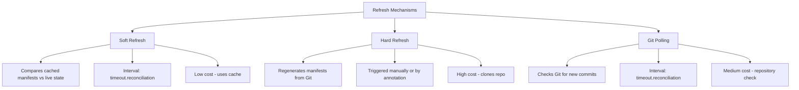

# How to Configure Optimal Refresh Intervals in ArgoCD

Author: [nawazdhandala](https://github.com/nawazdhandala)

Tags: ArgoCD, GitOps, Kubernetes, Performance Tuning, Configuration

Description: Learn how to configure ArgoCD refresh intervals for the right balance between responsiveness and resource efficiency, covering reconciliation, hard refresh, and polling settings.

---

ArgoCD uses multiple refresh mechanisms to keep applications in sync with their desired state. Configuring them correctly is the difference between a responsive system and one that either wastes resources polling constantly or takes minutes to detect changes. This guide explains the main refresh settings in ArgoCD and how to set them optimally for your workload.

## The Three Types of Refresh

ArgoCD has three distinct refresh mechanisms, and they serve different purposes.


```mermaid
graph TD
    A[Refresh Mechanisms] --> B[Soft Refresh]
    A --> C[Hard Refresh]
    A --> D[Git Polling]

    B --> B1[Compares cached manifests vs live state]
    B --> B2[Interval: timeout.reconciliation]
    B --> B3[Low cost - uses cache]

    C --> C1[Regenerates manifests from Git]
    C --> C2[Triggered manually or by annotation]
    C --> C3[High cost - clones repo]

    D --> D1[Checks Git for new commits]
    D --> D2[Interval: timeout.reconciliation]
    D --> D3[Medium cost - repository check]
```

**Soft refresh** compares the desired state against the live cluster state without invalidating the manifest or cluster caches. This is cheaper than a hard refresh and runs during normal reconciliation.

**Hard refresh** invalidates the manifest and target cluster caches before refreshing the application. This is more expensive but useful when cached data must be rebuilt.

**Git polling** checks whether the tracked Git or Helm source has changed. ArgoCD uses the reconciliation timeout for this polling loop.

## Configuring the Reconciliation Interval

The reconciliation interval controls how often the controller performs a soft refresh for each application. This is the primary mechanism for detecting cluster drift.

```yaml
# argocd-cm ConfigMap

apiVersion: v1
kind: ConfigMap
metadata:
  name: argocd-cm
  namespace: argocd
data:
  # Default: 120s plus up to 60s of jitter
  # How often each app is reconciled (soft refresh)
  timeout.reconciliation: "180s"
```

### Choosing the Right Value

The optimal reconciliation interval depends on your requirements.

| Scenario | Recommended Interval | Rationale |
|----------|---------------------|-----------|
| Development cluster | 60s | Fast feedback on manual changes |
| Production with few apps (<50) | 120s | Good responsiveness without much load |
| Production with many apps (50-500) | 180s | Balanced for most teams |
| Large-scale (500+ apps) | 300s | Reduces controller load |
| Compliance-critical | 60s | Faster drift detection |

Setting it to 0 disables automatic polling. Applications will only detect source changes through webhook events or manual refreshes. This is not recommended for most environments.

## Configuring the Repository Polling Period

ArgoCD uses the reconciliation timeout to control how often it polls Git and Helm repositories for changes.

```yaml
# argocd-cm ConfigMap
apiVersion: v1
kind: ConfigMap
metadata:
  name: argocd-cm
  namespace: argocd
data:
  # Default: 120s plus up to 60s of jitter
  # How often to check Git for new commits
  timeout.reconciliation: "180s"
```

In ArgoCD, the `timeout.reconciliation` setting controls repository polling. It is a global setting, and the optional `timeout.reconciliation.jitter` setting spreads refreshes out so many applications do not refresh at exactly the same time.

### Per-Application Refresh Triggers

You can request a one-time refresh for an individual application using annotations.

```yaml
apiVersion: argoproj.io/v1alpha1
kind: Application
metadata:
  name: critical-app
  annotations:
    # Request a normal refresh. The controller removes this after refreshing.
    argocd.argoproj.io/refresh: "normal"
  namespace: argocd
spec:
  # ... app spec
```

For a hard refresh, set the same annotation to `hard`. This invalidates the manifest and target cluster state caches before the refresh.

```yaml
apiVersion: argoproj.io/v1alpha1
kind: Application
metadata:
  name: critical-payment-service
  annotations:
    # Request a hard refresh for this app
    argocd.argoproj.io/refresh: "hard"
  namespace: argocd
spec:
  source:
    repoURL: https://github.com/org/payments.git
    path: k8s/production
    targetRevision: main
```

This allows you to trigger immediate refreshes for individual applications while keeping the global polling interval conservative.

## Webhook-Driven Refresh

The most efficient approach is to rely on webhooks for change detection and use reconciliation only as a safety net.

```yaml
# argocd-cm ConfigMap
apiVersion: v1
kind: ConfigMap
metadata:
  name: argocd-cm
  namespace: argocd
data:
  # Set a longer reconciliation interval since webhooks handle changes
  timeout.reconciliation: "300s"

  # Configure webhook secrets
  webhook.github.secret: "your-webhook-secret"
```

With webhooks, changes are detected within seconds. The reconciliation interval only matters for detecting drift caused by manual cluster changes or webhook delivery failures.

### Setting Up GitHub Webhooks

```bash
# GitHub webhook configuration
# URL: https://argocd.example.com/api/webhook
# Content type: application/json
# Secret: your-webhook-secret
# Events: Push events, Pull request events

# Verify webhook delivery
curl -X POST https://argocd.example.com/api/webhook \
  -H "Content-Type: application/json" \
  -H "X-GitHub-Event: push" \
  -H "X-Hub-Signature-256: sha256=..." \
  -d '{"ref":"refs/heads/main","repository":{"url":"https://github.com/org/repo"}}'
```

## Hard Refresh Intervals

Hard refreshes regenerate manifests from scratch. They happen in these situations.

1. A user or automation adds the `argocd.argoproj.io/refresh: "hard"` annotation
2. A user clicks "Hard Refresh" in the UI
3. A user runs `argocd app get --hard-refresh`
4. Cached repo-server data is invalidated or expires and must be regenerated

The repo-server cache expiration controls how long cached application details, generated manifests, and revision metadata are retained.

```yaml
# argocd-cmd-params-cm ConfigMap
apiVersion: v1
kind: ConfigMap
metadata:
  name: argocd-cmd-params-cm
  namespace: argocd
data:
  # How long repo-server cache entries live (default: 24h0m0s)
  reposerver.repo.cache.expiration: "24h0m0s"
```

For most environments, 24 hours is fine because webhooks trigger refreshes on actual changes. Reduce this if you need to pick up changes that do not trigger webhooks (for example, external Helm chart updates).

## Self-Heal Interval

If you enable self-healing, ArgoCD automatically syncs applications when drift is detected. The self-heal timeout controls the minimum interval between automatic syncs.

```yaml
apiVersion: argoproj.io/v1alpha1
kind: Application
metadata:
  name: my-app
spec:
  syncPolicy:
    automated:
      selfHeal: true
```

The self-heal check runs during reconciliation. The `controller.self.heal.timeout.seconds` command parameter controls the minimum time between consecutive self-heal syncs for the same application.

```yaml
# argocd-cmd-params-cm ConfigMap
apiVersion: v1
kind: ConfigMap
metadata:
  name: argocd-cmd-params-cm
  namespace: argocd
data:
  controller.self.heal.timeout.seconds: "5"
```

Setting this too low can cause rapid re-syncs if something is continuously modifying the resource in the cluster (for example, a mutating webhook or another controller).

## Balancing Responsiveness and Resource Usage

Here is a practical configuration for a medium-sized production environment with webhooks enabled.

```yaml
# argocd-cm ConfigMap
apiVersion: v1
kind: ConfigMap
metadata:
  name: argocd-cm
  namespace: argocd
data:
  # Webhooks handle immediate change detection
  webhook.github.secret: "your-secret"

  # Reconciliation is a safety net - 5 minutes is fine
  timeout.reconciliation: "300s"
  timeout.reconciliation.jitter: "60s"
```

```yaml
# argocd-cmd-params-cm ConfigMap
apiVersion: v1
kind: ConfigMap
metadata:
  name: argocd-cmd-params-cm
  namespace: argocd
data:
  # Manifest cache - 24h is fine with webhooks
  reposerver.repo.cache.expiration: "24h0m0s"
```

```yaml
# Critical apps can request an immediate refresh via annotation
apiVersion: argoproj.io/v1alpha1
kind: Application
metadata:
  name: payment-service
  annotations:
    argocd.argoproj.io/refresh: "hard"
```

This setup gives you near-instant detection of Git changes via webhooks and 5-minute polling as a fallback, all while keeping controller load manageable.

## Monitoring Refresh Performance

Track these metrics to verify your intervals are working correctly.

```promql
# Application state, including sync_status and health_status labels
argocd_app_info

# Reconciliation latency
histogram_quantile(0.95, sum(rate(argocd_app_reconcile_bucket[5m])) by (le))

# Controller queue depth (should be low)
workqueue_depth{name="app_reconciliation_queue"}
```

If the queue depth is consistently above zero, the controller cannot keep up with the reconciliation rate. Either increase the interval or add controller shards.

## Summary

Configure webhooks as the primary change detection mechanism, set the global reconciliation interval to 3-5 minutes as a safety net, and use refresh annotations or manual hard refreshes when a specific application needs immediate attention. This approach gives you both responsiveness and efficiency.
