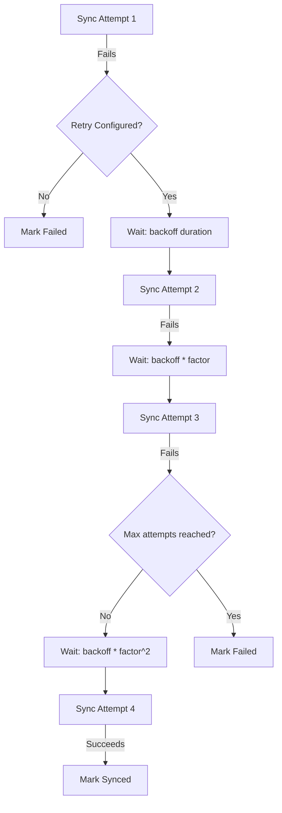

# How to Configure Optimal Retry Backoff Settings in ArgoCD

Author: [nawazdhandala](https://github.com/nawazdhandala)

Tags: ArgoCD, GitOps, Kubernetes, Performance Tuning, Reliability

Description: Learn how to configure retry backoff settings in ArgoCD to handle transient failures gracefully, including sync retries, exponential backoff, and factor tuning for production deployments.

---

Kubernetes deployments fail for many transient reasons: a node is temporarily unavailable, the API server is under load, a dependency is not ready yet, or a webhook times out. ArgoCD provides retry mechanisms to handle these failures automatically, but the default settings are either too aggressive or not configured at all. This guide explains how to set up retry backoff properly so your deployments recover from transient failures without overwhelming the cluster.

## Understanding ArgoCD Retry Behavior

ArgoCD supports retries at the sync operation level. When a sync fails, ArgoCD can automatically retry with configurable backoff parameters.



The retry behavior is configured per-application in the sync policy. There is no global retry setting.

## Basic Retry Configuration

Here is the simplest retry configuration that covers most use cases.

```yaml
apiVersion: argoproj.io/v1alpha1
kind: Application
metadata:
  name: my-app
  namespace: argocd
spec:
  source:
    repoURL: https://github.com/org/repo.git
    path: k8s/production
    targetRevision: main
  destination:
    server: https://kubernetes.default.svc
    namespace: production
  syncPolicy:
    automated:
      prune: true
      selfHeal: true
    retry:
      limit: 5           # Maximum number of retry attempts
      backoff:
        duration: 5s      # Initial backoff duration
        factor: 2          # Multiply duration by this factor each retry
        maxDuration: 3m    # Never wait longer than this
```

With these settings, the retry intervals are:
- Attempt 1 fails, wait 5 seconds
- Attempt 2 fails, wait 10 seconds
- Attempt 3 fails, wait 20 seconds
- Attempt 4 fails, wait 40 seconds
- Attempt 5 fails, mark as failed (total wait: 75 seconds)

## Choosing the Right Duration

The initial backoff duration should be long enough for the transient issue to resolve but short enough that deployments do not stall unnecessarily.

```yaml
# For transient API server errors (503, timeouts)
# Short initial duration - these resolve quickly
retry:
  limit: 5
  backoff:
    duration: 5s
    factor: 2
    maxDuration: 2m

# For dependency ordering issues
# (waiting for a CRD, namespace, or other resource to be created)
# Longer initial duration - dependencies take time
retry:
  limit: 10
  backoff:
    duration: 10s
    factor: 2
    maxDuration: 5m

# For external dependency readiness
# (database migrations, secret provisioning)
# Even longer - external systems are slow
retry:
  limit: 15
  backoff:
    duration: 15s
    factor: 2
    maxDuration: 10m
```

## Understanding the Factor Parameter

The factor determines how quickly the backoff grows. A factor of 2 (doubling) is the standard exponential backoff. Other values change the curve significantly.

```yaml
# Factor 2 (standard exponential): 5s, 10s, 20s, 40s, 80s
backoff:
  duration: 5s
  factor: 2

# Factor 1.5 (gentler growth): 5s, 7.5s, 11.25s, 16.8s, 25.3s
backoff:
  duration: 5s
  factor: 1.5

# Factor 3 (aggressive growth): 5s, 15s, 45s, 135s (capped by maxDuration)
backoff:
  duration: 5s
  factor: 3
```

Use factor 2 for most cases. Use factor 1.5 if you want more retry attempts within a shorter time window. Use factor 3 if you want to back off quickly to reduce load on a struggling system.

## Setting the Retry Limit

The retry limit determines how many times ArgoCD will attempt the sync before giving up. Setting this too high means broken deployments take a long time to report failure. Setting it too low means transient issues cause unnecessary failures.

```yaml
# Conservative: fail fast, alert humans
retry:
  limit: 3
  backoff:
    duration: 10s
    factor: 2
    maxDuration: 2m

# Standard: handle most transient issues
retry:
  limit: 5
  backoff:
    duration: 5s
    factor: 2
    maxDuration: 3m

# Resilient: handle slow dependencies
retry:
  limit: 10
  backoff:
    duration: 10s
    factor: 2
    maxDuration: 10m
```

A good rule of thumb is to set the limit high enough to cover the longest reasonable transient failure. If your container images take 60 seconds to pull and the kubelet retries pulls internally, a 3-minute maxDuration with 5 retries is usually sufficient.

## Setting the Max Duration

The maxDuration caps the backoff interval. Without it, exponential backoff can grow to unreasonable values.

```yaml
# Without maxDuration, factor 2 grows quickly:
# 5s, 10s, 20s, 40s, 80s, 160s, 320s, 640s...
# By attempt 8, you're waiting over 10 minutes between retries

# With maxDuration: 3m, the sequence becomes:
# 5s, 10s, 20s, 40s, 80s, 160s, 180s, 180s...
# Retries continue at 3-minute intervals
backoff:
  duration: 5s
  factor: 2
  maxDuration: 3m
```

Set maxDuration to the longest reasonable wait between individual retry attempts. For most applications, 3-5 minutes is appropriate. For applications with known slow dependencies, 10 minutes may be needed.

## Retry Patterns for Common Scenarios

### Application with CRD Dependencies

When an application creates CRDs that other resources depend on, the first sync often fails because the CRDs are not yet registered.

```yaml
# App that installs CRDs + resources that use them
apiVersion: argoproj.io/v1alpha1
kind: Application
metadata:
  name: cert-manager
spec:
  syncPolicy:
    automated:
      prune: true
      selfHeal: true
    syncOptions:
    - CreateNamespace=true
    retry:
      limit: 10
      backoff:
        duration: 10s
        factor: 2
        maxDuration: 5m
```

### Multi-Cluster Deployments

Remote clusters may have intermittent connectivity. Use longer durations and more retries.

```yaml
apiVersion: argoproj.io/v1alpha1
kind: Application
metadata:
  name: remote-cluster-app
spec:
  destination:
    server: https://remote-cluster.example.com
    namespace: production
  syncPolicy:
    automated:
      selfHeal: true
    retry:
      limit: 15
      backoff:
        duration: 15s
        factor: 2
        maxDuration: 10m
```

### Helm Charts with External Dependencies

Helm hooks that run database migrations or other initialization tasks may take time.

```yaml
apiVersion: argoproj.io/v1alpha1
kind: Application
metadata:
  name: app-with-migrations
spec:
  source:
    helm:
      # Helm hooks run during sync
      parameters: []
  syncPolicy:
    retry:
      limit: 5
      backoff:
        duration: 30s    # Give migrations time to complete
        factor: 2
        maxDuration: 10m
```

## Using ApplicationSets with Retry

When using ApplicationSets to generate multiple applications, define retry settings in the template.

```yaml
apiVersion: argoproj.io/v1alpha1
kind: ApplicationSet
metadata:
  name: cluster-apps
  namespace: argocd
spec:
  generators:
  - clusters: {}
  template:
    metadata:
      name: '{{name}}-app'
    spec:
      source:
        repoURL: https://github.com/org/repo.git
        path: 'clusters/{{name}}'
        targetRevision: main
      destination:
        server: '{{server}}'
        namespace: production
      syncPolicy:
        automated:
          selfHeal: true
        retry:
          limit: 5
          backoff:
            duration: 10s
            factor: 2
            maxDuration: 5m
```

This ensures every generated application has consistent retry behavior.

## Monitoring Retry Behavior

Track retries to identify applications that frequently fail and need attention.

```promql
# Total sync failures (retried or not)
rate(argocd_app_sync_total{phase="Failed"}[1h])

# Applications currently retrying
argocd_app_info{sync_status="OutOfSync", health_status!="Healthy"}

# Sync operation duration (long durations indicate retries)
histogram_quantile(0.95,
  rate(argocd_app_sync_duration_seconds_bucket[5m])
)
```

If an application consistently hits the retry limit, the issue is likely not transient. Investigate the root cause rather than increasing the retry limit.

## Summary

Start with a baseline of 5 retries, 5-second initial duration, factor 2, and 3-minute max duration. Adjust based on the specific failure modes you encounter. Use longer durations for applications with known slow dependencies, and shorter durations for applications where failures should be reported quickly. Monitor retry rates to identify persistent issues that need human intervention rather than more retries.
