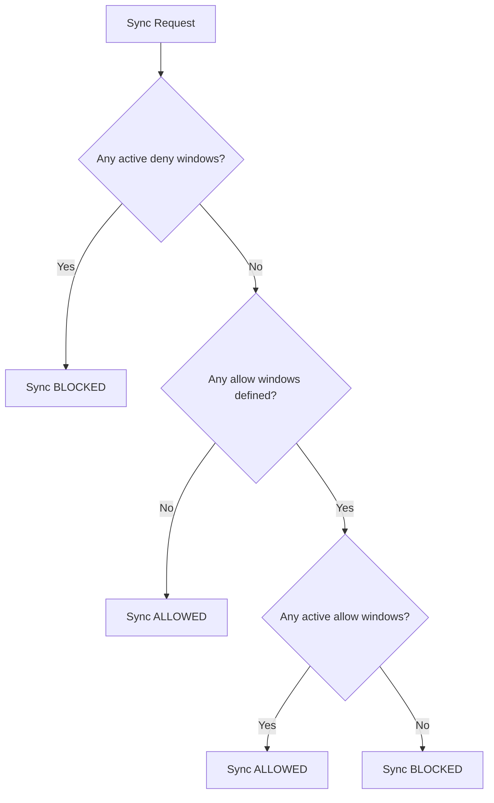

# How to Configure Sync Windows in ArgoCD

Author: [nawazdhandala](https://github.com/nawazdhandala)

Tags: ArgoCD, GitOps, Kubernetes, Sync Windows, Change Management

Description: A complete reference for configuring ArgoCD sync windows in AppProject resources, covering syntax, precedence rules, matching logic, and configuration management.

---

Sync windows in ArgoCD control when applications can be synced. They are defined within AppProject resources and use cron-based schedules to create time-based rules for deployments. This guide provides a thorough reference for the sync window configuration syntax, how ArgoCD evaluates multiple windows, and how to manage sync window configurations at scale.

## Sync Window Configuration Structure

Every sync window has five fields.

```yaml
apiVersion: argoproj.io/v1alpha1
kind: AppProject
metadata:
  name: my-project
  namespace: argocd
spec:
  syncWindows:
    - kind: allow       # "allow" or "deny"
      schedule: '0 2 * * *'  # Cron expression
      duration: 4h            # Duration string
      applications:            # Application name patterns
        - '*'
      namespaces:              # Target namespace patterns
        - '*'
      clusters:                # Target cluster patterns
        - '*'
      manualSync: true         # Whether manual sync is allowed outside the window
      timeZone: 'America/New_York'  # IANA timezone (ArgoCD 2.7+)
```

Let us break down each field.

### kind

Two values: `allow` or `deny`.

An `allow` window means syncs are permitted only during the window. Outside an allow window, syncs are blocked.

A `deny` window means syncs are blocked during the window. Outside a deny window, syncs are permitted.

### schedule

A standard cron expression defining when the window starts. The five fields are: minute, hour, day-of-month, month, day-of-week.

```text
# Cron format
# ┌───────── minute (0-59)
# │ ┌─────── hour (0-23)
# │ │ ┌───── day of month (1-31)
# │ │ │ ┌─── month (1-12)
# │ │ │ │ ┌─ day of week (0-6, 0=Sunday)
# │ │ │ │ │
# * * * * *
```

### duration

How long the window stays open after the scheduled start time. Supports `h` (hours), `m` (minutes), and `s` (seconds). Examples: `4h`, `30m`, `2h30m`.

### applications

A list of application name patterns. Supports glob wildcards. Use `*` to match all applications in the project.

### namespaces

A list of namespace patterns. Matches the destination namespace of the application. Use `*` for all namespaces.

### clusters

A list of cluster name or URL patterns. Matches the destination cluster of the application. Use `*` for all clusters.

### manualSync

Boolean. When `true`, manual syncs are allowed even when the window would otherwise block them. When `false` or omitted, the window rules apply to both automated and manual syncs.

### timeZone

IANA timezone string (e.g., `America/New_York`, `Europe/London`, `Asia/Tokyo`). Available in ArgoCD 2.7 and later. If omitted, ArgoCD uses UTC.

## How ArgoCD Evaluates Multiple Windows

When multiple sync windows are defined, ArgoCD follows specific precedence rules.



The rules in order:

1. If any active deny window matches the application, the sync is blocked, regardless of allow windows.
2. If no deny windows are active and no allow windows are defined, the sync is allowed.
3. If allow windows are defined but none are currently active, the sync is blocked.
4. If an allow window is currently active and no deny window is active, the sync is allowed.

Deny always wins over allow. This is important when combining windows.

## Application Matching Logic

Sync windows match applications using three criteria: application name, destination namespace, and destination cluster. A window applies to an application if any of these match.

```yaml
syncWindows:
  # Matches by application name
  - kind: deny
    schedule: '0 9 * * 1-5'
    duration: 8h
    applications:
      - 'production-*'
    namespaces:
      - '*'
    clusters:
      - '*'

  # Matches by namespace
  - kind: deny
    schedule: '0 9 * * 1-5'
    duration: 8h
    applications:
      - '*'
    namespaces:
      - 'production'
    clusters:
      - '*'

  # Matches by cluster
  - kind: deny
    schedule: '0 9 * * 1-5'
    duration: 8h
    applications:
      - '*'
    namespaces:
      - '*'
    clusters:
      - 'https://prod-cluster.example.com'
```

All three windows achieve a similar effect but through different matching dimensions. An application is affected if it matches any of the criteria in any window.

## Managing Sync Windows with the CLI

ArgoCD CLI provides commands for managing sync windows.

```bash
# List all sync windows for a project
argocd proj windows list my-project

# Add an allow window
argocd proj windows add my-project \
  --kind allow \
  --schedule "0 22 * * *" \
  --duration 4h \
  --applications "*"

# Add a deny window
argocd proj windows add my-project \
  --kind deny \
  --schedule "0 9 * * 1-5" \
  --duration 8h \
  --applications "*"

# Delete a sync window by position (0-indexed)
argocd proj windows delete my-project 0

# Update a sync window
argocd proj windows update my-project 0 \
  --schedule "0 23 * * *" \
  --duration 3h
```

## Checking Current Window Status

To check if sync is currently allowed or denied for an application:

```bash
# Check application sync status including window information
argocd app get my-app --output json | \
  jq '{
    syncAllowed: .status.operationState.syncResult,
    conditions: [.status.conditions[] | select(.type == "SyncWindow")]
  }'

# Check project windows and their current state
argocd proj windows list my-project
```

The UI also shows sync window status. If a sync window is currently blocking an application, the UI displays a message explaining which window is active and when the next allowed sync window opens.

## Configuration Management Best Practices

Store your AppProject definitions in Git alongside your application manifests. This keeps sync window configuration under version control.

```text
infra-repo/
  argocd/
    projects/
      production.yaml     # Production project with strict windows
      staging.yaml         # Staging project with relaxed windows
      development.yaml     # Development project with no windows
    applications/
      my-app-prod.yaml
      my-app-staging.yaml
```

```yaml
# production.yaml
apiVersion: argoproj.io/v1alpha1
kind: AppProject
metadata:
  name: production
  namespace: argocd
spec:
  description: Production applications - restricted sync windows
  sourceRepos:
    - 'https://github.com/myorg/*'
  destinations:
    - namespace: 'production'
      server: https://kubernetes.default.svc
  syncWindows:
    # Allow deployments only during maintenance window (2-6 AM UTC)
    - kind: allow
      schedule: '0 2 * * *'
      duration: 4h
      applications:
        - '*'
      manualSync: true
    # Block all deployments on weekends
    - kind: deny
      schedule: '0 0 * * 0,6'
      duration: 24h
      applications:
        - '*'
      manualSync: false
```

Use a separate ArgoCD Application to manage the ArgoCD projects themselves.

```yaml
apiVersion: argoproj.io/v1alpha1
kind: Application
metadata:
  name: argocd-projects
  namespace: argocd
spec:
  project: default
  source:
    repoURL: https://github.com/myorg/infra.git
    targetRevision: main
    path: argocd/projects/
  destination:
    server: https://kubernetes.default.svc
    namespace: argocd
  syncPolicy:
    automated:
      prune: false  # Never auto-delete projects
      selfHeal: true
```

## Validating Sync Window Configuration

Before applying sync window changes, validate them.

```bash
# Apply the project definition with dry-run
kubectl apply -f production-project.yaml --dry-run=server

# Check the project after applying
argocd proj get production

# Verify sync windows are listed correctly
argocd proj windows list production
```

Common validation issues:

- Invalid cron expression (will be rejected by ArgoCD)
- Duration format errors (must use `h`, `m`, or `s` suffixes)
- Missing applications/namespaces/clusters fields (defaults to no matching)
- Invalid timezone string (will be rejected in ArgoCD 2.7+)

For more specific sync window patterns like allow and deny windows, see the [allow sync windows guide](https://oneuptime.com/blog/post/2026-02-26-argocd-allow-sync-windows-maintenance/view) and the [deny sync windows guide](https://oneuptime.com/blog/post/2026-02-26-argocd-deny-sync-windows/view).
