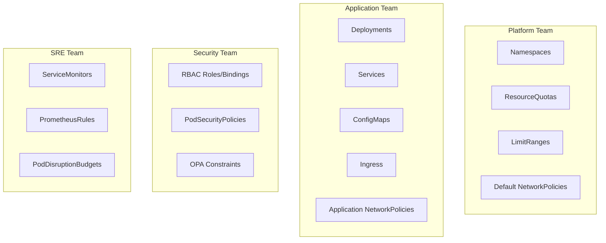

# How to Handle Conflicts Between Multiple Sources in ArgoCD

Author: [nawazdhandala](https://github.com/nawazdhandala)

Tags: ArgoCD, GitOps, Kubernetes, Multi-Source, Troubleshooting

Description: Learn how to identify, prevent, and resolve resource conflicts when using multiple sources in ArgoCD applications, including ownership strategies and deduplication techniques.

---

When an ArgoCD application pulls manifests from multiple sources, resource conflicts can occur. A conflict happens when two or more sources define the same Kubernetes resource - same API version, kind, name, and namespace. ArgoCD does not merge these definitions; it applies one and the other gets silently overridden. This can lead to unexpected behavior where changes from one team get overwritten by another source during sync.

## How Conflicts Happen

The most common scenario is when two teams independently add the same resource to their respective repositories:

```yaml
# Source 1 (platform-infra repo): networkpolicy.yaml
apiVersion: networking.k8s.io/v1
kind: NetworkPolicy
metadata:
  name: default-deny
  namespace: payments
spec:
  podSelector: {}
  policyTypes:
    - Ingress
    - Egress
```

```yaml
# Source 2 (payment-service repo): networkpolicy.yaml
apiVersion: networking.k8s.io/v1
kind: NetworkPolicy
metadata:
  name: default-deny  # Same name, same namespace - CONFLICT
  namespace: payments
spec:
  podSelector: {}
  policyTypes:
    - Ingress  # Missing Egress - different from Source 1
```

ArgoCD applies the version from whichever source appears last in the `sources` array. The "losing" source's definition is silently discarded.

## Detecting Conflicts

ArgoCD does not warn you about conflicts between sources proactively. You need to detect them yourself:

```bash
# Render all manifests and check for duplicates
argocd app manifests my-app | \
  grep -E "^(kind|  name:|  namespace:)" | \
  paste - - - | \
  sort | uniq -d

# More precise: extract resource identifiers
argocd app manifests my-app -o json | \
  jq -r '.[] | "\(.kind)/\(.metadata.namespace)/\(.metadata.name)"' | \
  sort | uniq -c | sort -rn | head -20
```

Any resource appearing more than once has a conflict.

## Prevention Strategy: Clear Ownership Boundaries

The best way to handle conflicts is to prevent them through clear resource ownership. Define which team and repository owns which resource types:



Document these boundaries and enforce them through:

### 1. Naming Conventions

Use prefixes that identify the owning team:

```yaml
# Platform team resources use "platform-" prefix
metadata:
  name: platform-default-deny-networkpolicy

# App team resources use the app name prefix
metadata:
  name: payment-api-networkpolicy
```

### 2. ArgoCD Project Restrictions

Use ArgoCD Projects to restrict which resource kinds each team can create:

```yaml
# Platform project - can create cluster-wide resources
apiVersion: argoproj.io/v1alpha1
kind: AppProject
metadata:
  name: platform
spec:
  clusterResourceWhitelist:
    - group: ""
      kind: Namespace
    - group: networking.k8s.io
      kind: NetworkPolicy
  namespaceResourceWhitelist:
    - group: ""
      kind: ResourceQuota
    - group: ""
      kind: LimitRange
```

```yaml
# Application project - can only create app-specific resources
apiVersion: argoproj.io/v1alpha1
kind: AppProject
metadata:
  name: payments-app
spec:
  clusterResourceWhitelist: []  # No cluster resources
  namespaceResourceWhitelist:
    - group: apps
      kind: Deployment
    - group: ""
      kind: Service
    - group: ""
      kind: ConfigMap
    - group: networking.k8s.io
      kind: Ingress
```

### 3. Label-Based Ownership

Add owner labels to every resource and use automation to detect conflicts:

```yaml
metadata:
  labels:
    owner-team: platform
    config-source: platform-infra
```

## Resolution: When Conflicts Already Exist

If you discover conflicts in an existing multi-source application, here are your options:

### Option A: Remove the Duplicate from One Source

The cleanest fix - decide which source should own the resource and remove it from the other:

```bash
# Identify which source each definition comes from
# Remove the duplicate from the non-owning source's repo
git rm payment-service/deploy/networkpolicy.yaml
git commit -m "Remove NetworkPolicy - owned by platform-infra repo"
```

### Option B: Rename One of the Resources

If both resources are needed but happen to share a name:

```yaml
# Source 1: Keep as-is
metadata:
  name: default-deny-ingress

# Source 2: Rename to be unique
metadata:
  name: payment-api-deny-egress
```

### Option C: Split into Separate Applications

If two sources are frequently conflicting, they might be better as separate ArgoCD Applications:

```yaml
# App 1: Platform resources only
spec:
  sources:
    - repoURL: https://github.com/your-org/platform-infra.git
      path: namespaces/payments

---
# App 2: Application resources only
spec:
  sources:
    - repoURL: https://github.com/your-org/payment-service.git
      path: deploy/kubernetes
```

## Source Ordering and Last-Wins Behavior

In a multi-source Application, when conflicts exist, the last source in the `sources` array wins. This behavior is deterministic but fragile - it depends on array ordering in YAML:

```yaml
sources:
  # Source 1 defines ConfigMap "app-config" with key1=a
  - repoURL: https://github.com/your-org/repo-a.git
    path: configs

  # Source 2 also defines ConfigMap "app-config" with key1=b
  # This version wins because it is listed last
  - repoURL: https://github.com/your-org/repo-b.git
    path: configs
```

Do not rely on this ordering as a merge strategy. It is undocumented behavior that could change, and it makes the system harder to understand.

## Automated Conflict Detection in CI

Add a CI check that detects conflicts before they reach the cluster:

```bash
#!/bin/bash
# conflict-check.sh - Run in CI against all multi-source apps

# For each multi-source application, render manifests and check for duplicates
for app in $(argocd app list -o name); do
  duplicates=$(argocd app manifests "$app" -o json | \
    jq -r '.[] | "\(.apiVersion)/\(.kind)/\(.metadata.namespace // "cluster")/\(.metadata.name)"' | \
    sort | uniq -d)

  if [ -n "$duplicates" ]; then
    echo "CONFLICT in $app:"
    echo "$duplicates"
    exit 1
  fi
done

echo "No conflicts detected"
```

## Handling Partial Overlap

Sometimes resources partially overlap - same name but different content. This is the most dangerous case because ArgoCD picks one version silently:

```yaml
# Source 1: ConfigMap with database config
apiVersion: v1
kind: ConfigMap
metadata:
  name: app-config
  namespace: payments
data:
  DATABASE_HOST: "db.internal"
  DATABASE_PORT: "5432"

# Source 2: ConfigMap with cache config (same name!)
apiVersion: v1
kind: ConfigMap
metadata:
  name: app-config
  namespace: payments
data:
  REDIS_HOST: "redis.internal"
  REDIS_PORT: "6379"
```

The winning version has only its own keys. The losing version's keys disappear entirely. There is no merge - it is a complete replacement.

The fix is to use different ConfigMap names:

```yaml
# Source 1
metadata:
  name: app-database-config

# Source 2
metadata:
  name: app-cache-config
```

## Best Practices

**Treat resource names as globally unique within a namespace** - No two sources should define resources with the same kind+name+namespace.

**Use naming conventions religiously** - Prefix resource names with the owning team or source identifier.

**Run conflict detection in CI** - Catch conflicts before they reach the cluster.

**Prefer separate applications over risky multi-source** - If conflict management becomes a burden, split into separate applications with clear boundaries.

**Document resource ownership** - Maintain a simple table mapping resource types to owning repositories.

For more on multi-source applications, see [using multiple sources in ArgoCD](https://oneuptime.com/blog/post/2026-02-26-argocd-multiple-sources-single-application/view) and [debugging multi-source issues](https://oneuptime.com/blog/post/2026-02-26-argocd-debug-multi-source-issues/view).
