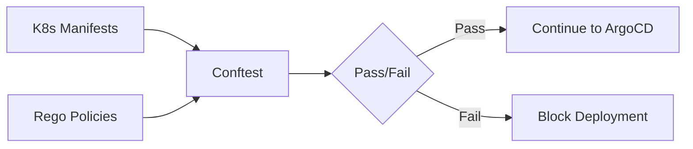

# How to Use Conftest to Test ArgoCD Policies

Author: [nawazdhandala](https://github.com/nawazdhandala)

Tags: ArgoCD, GitOps, Kubernetes, Conftest, OPA

Description: Learn how to use Conftest and Open Policy Agent to enforce policies on ArgoCD application manifests, preventing misconfigurations before deployment.

---

Schema validation catches structural errors, but it does not enforce your organization's policies. Conftest uses Open Policy Agent (OPA) to let you write custom rules that go beyond schema correctness - things like "all deployments must have resource limits" or "no images from untrusted registries." This guide shows how to integrate Conftest into your ArgoCD workflow for policy-driven manifest testing.

## What is Conftest?

Conftest is a testing tool for structured configuration data. It uses the Rego language (from Open Policy Agent) to define policies, then evaluates your Kubernetes manifests against those policies. Think of it as unit tests for your YAML.



## Installing Conftest

```bash
# macOS
brew install conftest

# Linux
curl -L https://github.com/open-policy-agent/conftest/releases/latest/download/conftest_Linux_x86_64.tar.gz | \
  tar xz -C /usr/local/bin/

# Verify installation
conftest --version
```

## Writing Your First Policy

Policies live in a `policy/` directory and are written in Rego. Let us start with essential Kubernetes security policies.

Create `policy/deployment.rego`:

```rego
package main

# Deny deployments without resource limits
deny[msg] {
    input.kind == "Deployment"
    container := input.spec.template.spec.containers[_]
    not container.resources.limits
    msg := sprintf("Container '%s' in Deployment '%s' must have resource limits", [container.name, input.metadata.name])
}

# Deny deployments without resource requests
deny[msg] {
    input.kind == "Deployment"
    container := input.spec.template.spec.containers[_]
    not container.resources.requests
    msg := sprintf("Container '%s' in Deployment '%s' must have resource requests", [container.name, input.metadata.name])
}

# Deny deployments running as root
deny[msg] {
    input.kind == "Deployment"
    container := input.spec.template.spec.containers[_]
    not container.securityContext.runAsNonRoot
    msg := sprintf("Container '%s' in Deployment '%s' must set runAsNonRoot: true", [container.name, input.metadata.name])
}

# Deny containers with privilege escalation
deny[msg] {
    input.kind == "Deployment"
    container := input.spec.template.spec.containers[_]
    container.securityContext.privileged == true
    msg := sprintf("Container '%s' in Deployment '%s' must not run as privileged", [container.name, input.metadata.name])
}
```

Test it against a deployment:

```bash
# Run conftest against a manifest
conftest test apps/my-app/deployment.yaml

# Output:
# FAIL - apps/my-app/deployment.yaml - main -
#   Container 'my-app' in Deployment 'my-app' must have resource limits
# FAIL - apps/my-app/deployment.yaml - main -
#   Container 'my-app' in Deployment 'my-app' must set runAsNonRoot: true
# 2 tests, 0 passed, 0 warnings, 2 failures
```

## ArgoCD-Specific Policies

Write policies that enforce ArgoCD best practices:

Create `policy/argocd.rego`:

```rego
package main

# ArgoCD Application must specify a project (not "default")
deny[msg] {
    input.kind == "Application"
    input.apiVersion == "argoproj.io/v1alpha1"
    input.spec.project == "default"
    msg := sprintf("Application '%s' should not use the 'default' project", [input.metadata.name])
}

# ArgoCD Application must have automated sync policy
warn[msg] {
    input.kind == "Application"
    input.apiVersion == "argoproj.io/v1alpha1"
    not input.spec.syncPolicy.automated
    msg := sprintf("Application '%s' does not have automated sync enabled", [input.metadata.name])
}

# ArgoCD Application must target a specific revision (not HEAD)
deny[msg] {
    input.kind == "Application"
    input.apiVersion == "argoproj.io/v1alpha1"
    input.spec.source.targetRevision == "HEAD"
    msg := sprintf("Application '%s' should target a specific branch, not HEAD", [input.metadata.name])
}

# ArgoCD Application must have retry configured
warn[msg] {
    input.kind == "Application"
    input.apiVersion == "argoproj.io/v1alpha1"
    input.spec.syncPolicy.automated
    not input.spec.syncPolicy.retry
    msg := sprintf("Application '%s' has auto-sync but no retry policy", [input.metadata.name])
}

# ArgoCD AppProject must restrict source repos
deny[msg] {
    input.kind == "AppProject"
    input.apiVersion == "argoproj.io/v1alpha1"
    source := input.spec.sourceRepos[_]
    source == "*"
    msg := sprintf("AppProject '%s' allows all source repos - restrict to specific repos", [input.metadata.name])
}

# ArgoCD AppProject must restrict destination clusters
deny[msg] {
    input.kind == "AppProject"
    input.apiVersion == "argoproj.io/v1alpha1"
    dest := input.spec.destinations[_]
    dest.server == "*"
    msg := sprintf("AppProject '%s' allows all destination clusters - restrict to specific clusters", [input.metadata.name])
}
```

## Image Registry Policies

Enforce trusted image registries:

Create `policy/images.rego`:

```rego
package main

# List of allowed registries
allowed_registries := [
    "myorg.azurecr.io",
    "gcr.io/myorg-project",
    "docker.io/library"
]

# Deny images from untrusted registries
deny[msg] {
    input.kind == "Deployment"
    container := input.spec.template.spec.containers[_]
    image := container.image
    not image_from_allowed_registry(image)
    msg := sprintf("Container '%s' uses image '%s' from untrusted registry", [container.name, image])
}

image_from_allowed_registry(image) {
    registry := allowed_registries[_]
    startswith(image, registry)
}

# Deny images using 'latest' tag
deny[msg] {
    input.kind == "Deployment"
    container := input.spec.template.spec.containers[_]
    image := container.image
    endswith(image, ":latest")
    msg := sprintf("Container '%s' uses 'latest' tag - pin to a specific version", [container.name])
}

# Deny images without a tag (defaults to latest)
deny[msg] {
    input.kind == "Deployment"
    container := input.spec.template.spec.containers[_]
    image := container.image
    not contains(image, ":")
    msg := sprintf("Container '%s' image '%s' has no tag - pin to a specific version", [container.name, image])
}
```

## Namespace and Label Policies

Enforce organizational standards:

Create `policy/labels.rego`:

```rego
package main

# Required labels for all resources
required_labels := ["app.kubernetes.io/name", "app.kubernetes.io/version", "team"]

# Deny resources without required labels
deny[msg] {
    input.kind == "Deployment"
    label := required_labels[_]
    not input.metadata.labels[label]
    msg := sprintf("Deployment '%s' is missing required label '%s'", [input.metadata.name, label])
}

# Deny deployments in the default namespace
deny[msg] {
    input.kind == "Deployment"
    not input.metadata.namespace
    msg := sprintf("Deployment '%s' must specify a namespace (not default)", [input.metadata.name])
}

deny[msg] {
    input.kind == "Deployment"
    input.metadata.namespace == "default"
    msg := sprintf("Deployment '%s' must not be in the default namespace", [input.metadata.name])
}
```

## Running Conftest with Helm and Kustomize

Since ArgoCD renders Helm and Kustomize before applying, test the rendered output:

```bash
# Test Helm-rendered manifests
helm template my-app ./charts/my-app \
  --values values/production.yaml | \
  conftest test -

# Test Kustomize-built manifests
kustomize build apps/my-app/overlays/production | \
  conftest test -

# Test multiple policy directories
conftest test \
  --policy policy/security \
  --policy policy/argocd \
  --policy policy/images \
  apps/my-app/deployment.yaml
```

## CI Pipeline Integration

### GitHub Actions

```yaml
name: Policy Check
on:
  pull_request:
    paths:
      - 'apps/**'

jobs:
  conftest:
    runs-on: ubuntu-latest
    steps:
      - uses: actions/checkout@v4

      - name: Install Conftest
        run: |
          curl -L https://github.com/open-policy-agent/conftest/releases/latest/download/conftest_Linux_x86_64.tar.gz | \
            tar xz -C /usr/local/bin/

      - name: Run policy tests
        run: |
          # Find all YAML files and test them
          find apps/ -name "*.yaml" -not -path "*/kustomization.yaml" | \
            xargs conftest test --policy policy/ --output json

      - name: Test Kustomize overlays
        run: |
          for overlay in apps/*/overlays/*/; do
            echo "Testing overlay: $overlay"
            kustomize build "$overlay" | conftest test --policy policy/ -
          done
```

## Organizing Policies

As your policy library grows, organize it by concern:

```
policy/
  security/
    containers.rego      # Container security policies
    network.rego         # NetworkPolicy requirements
    rbac.rego           # RBAC restrictions
  compliance/
    labels.rego         # Required labels
    namespaces.rego     # Namespace restrictions
    images.rego         # Registry and tag policies
  argocd/
    applications.rego   # ArgoCD Application policies
    projects.rego       # AppProject policies
    sync.rego          # Sync policy requirements
  data/
    allowed_registries.yaml  # External data
    team_namespaces.yaml     # Team to namespace mapping
```

Load external data in your policies:

```rego
package main

import data.allowed_registries

deny[msg] {
    input.kind == "Deployment"
    container := input.spec.template.spec.containers[_]
    not image_allowed(container.image)
    msg := sprintf("Image '%s' not from allowed registry", [container.image])
}

image_allowed(image) {
    registry := allowed_registries[_]
    startswith(image, registry)
}
```

```bash
# Run with external data
conftest test \
  --policy policy/ \
  --data policy/data/ \
  apps/my-app/deployment.yaml
```

## Warning vs Deny

Use `warn` for policies you want to flag but not block on, and `deny` for hard requirements:

```rego
package main

# Hard requirement - blocks deployment
deny[msg] {
    input.kind == "Deployment"
    container := input.spec.template.spec.containers[_]
    not container.resources.limits
    msg := sprintf("Container '%s' must have resource limits", [container.name])
}

# Soft recommendation - shows warning
warn[msg] {
    input.kind == "Deployment"
    container := input.spec.template.spec.containers[_]
    not container.readinessProbe
    msg := sprintf("Container '%s' should have a readiness probe", [container.name])
}
```

## Monitoring Policy Compliance

Track policy violations over time using [OneUptime](https://oneuptime.com). Export conftest results to your monitoring stack to identify which policies are most commonly violated and which teams need more guidance.

## Conclusion

Conftest gives you programmable policy enforcement for your ArgoCD manifests. By writing Rego policies that encode your organization's security requirements, compliance standards, and best practices, you prevent misconfigurations from ever reaching your cluster. Start with a few essential policies (resource limits, image registries, required labels), integrate them into CI, and expand your policy library as your team matures.
