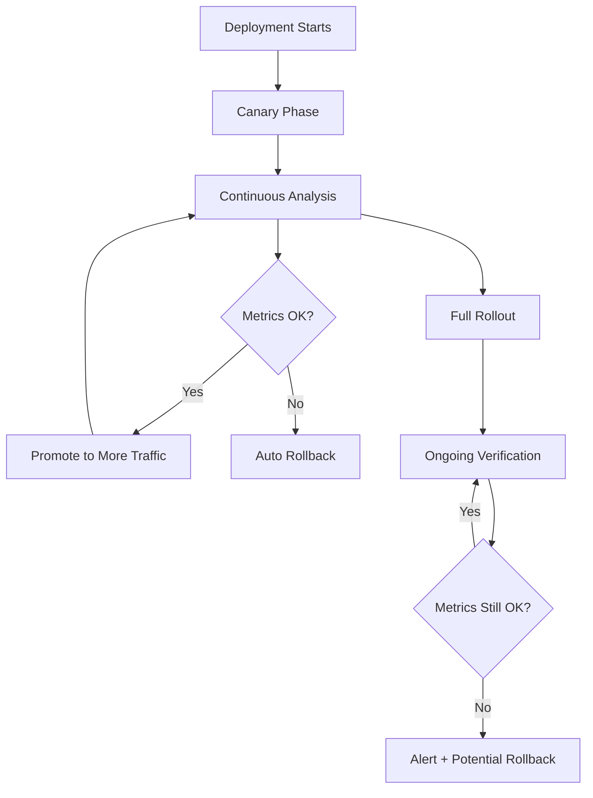
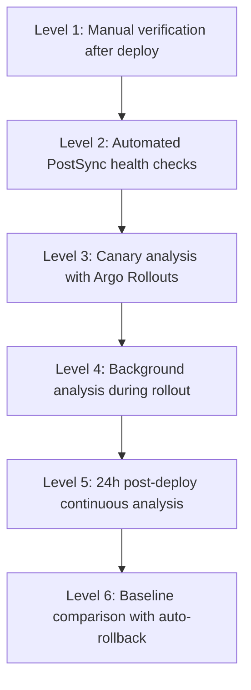

# How to Implement Continuous Verification with ArgoCD

Author: [nawazdhandala](https://github.com/nawazdhandala)

Tags: ArgoCD, GitOps, Kubernetes, Continuous Verification, Observability

Description: Learn how to implement continuous verification with ArgoCD to validate deployments over time using Argo Rollouts analysis, Prometheus metrics, custom health checks, and automated quality gates.

---

Continuous verification goes beyond one-time post-deployment checks. It continuously validates that your application meets quality, performance, and reliability targets throughout the deployment process and beyond. While post-deployment verification answers "did the deployment break anything right now?", continuous verification answers "is the deployment continuing to work correctly over the next hours and days?"

This guide covers implementing continuous verification with ArgoCD using Argo Rollouts, Prometheus-based analysis, and custom verification pipelines.

## What Is Continuous Verification



Continuous verification has two phases:
1. **During deployment**: Analyze metrics at each step of progressive delivery
2. **After deployment**: Ongoing monitoring that can trigger rollback if quality degrades

## Phase 1: Verification During Deployment with Argo Rollouts

### Background Analysis

Background analysis runs continuously throughout the entire rollout, not just at specific steps:

```yaml
apiVersion: argoproj.io/v1alpha1
kind: Rollout
metadata:
  name: myapp
  namespace: production
spec:
  replicas: 10
  selector:
    matchLabels:
      app: myapp
  template:
    metadata:
      labels:
        app: myapp
    spec:
      containers:
      - name: myapp
        image: registry.example.com/myapp:v3.0.0
        ports:
        - containerPort: 8080
  strategy:
    canary:
      steps:
      - setWeight: 10
      - pause: {duration: 5m}
      - setWeight: 25
      - pause: {duration: 10m}
      - setWeight: 50
      - pause: {duration: 15m}
      - setWeight: 75
      - pause: {duration: 10m}
      - setWeight: 100

      # Background analysis runs continuously during all steps
      analysis:
        templates:
        - templateName: continuous-verification
        startingStep: 1  # Start after initial canary
        args:
        - name: service-name
          value: myapp
        - name: canary-hash
          valueFromPodTemplateHash: true
```

### Comprehensive Analysis Template

```yaml
apiVersion: argoproj.io/v1alpha1
kind: AnalysisTemplate
metadata:
  name: continuous-verification
  namespace: production
spec:
  args:
  - name: service-name
  - name: canary-hash

  metrics:
  # Metric 1: Error rate comparison (canary vs stable)
  - name: error-rate-comparison
    interval: 60s
    # Run at least 10 measurements before making a decision
    count: 0  # Run indefinitely (until rollout completes)
    failureLimit: 5
    successCondition: result[0] <= 1.1  # Canary error rate within 10% of stable
    provider:
      prometheus:
        address: http://prometheus.monitoring:9090
        query: |
          (
            sum(rate(http_requests_total{service="{{args.service-name}}",rollouts_pod_template_hash="{{args.canary-hash}}",status=~"5.."}[5m]))
            /
            sum(rate(http_requests_total{service="{{args.service-name}}",rollouts_pod_template_hash="{{args.canary-hash}}"}[5m]))
          )
          /
          (
            sum(rate(http_requests_total{service="{{args.service-name}}",rollouts_pod_template_hash!="{{args.canary-hash}}",status=~"5.."}[5m]))
            /
            sum(rate(http_requests_total{service="{{args.service-name}}",rollouts_pod_template_hash!="{{args.canary-hash}}"}[5m]))
          )

  # Metric 2: Latency P99 comparison
  - name: latency-comparison
    interval: 60s
    count: 0
    failureLimit: 5
    successCondition: result[0] <= 1.2  # P99 within 20% of stable
    provider:
      prometheus:
        address: http://prometheus.monitoring:9090
        query: |
          (
            histogram_quantile(0.99,
              sum(rate(http_request_duration_seconds_bucket{
                service="{{args.service-name}}",
                rollouts_pod_template_hash="{{args.canary-hash}}"
              }[5m])) by (le)
            )
          )
          /
          (
            histogram_quantile(0.99,
              sum(rate(http_request_duration_seconds_bucket{
                service="{{args.service-name}}",
                rollouts_pod_template_hash!="{{args.canary-hash}}"
              }[5m])) by (le)
            )
          )

  # Metric 3: Memory usage stability
  - name: memory-stability
    interval: 120s
    count: 0
    failureLimit: 3
    successCondition: result[0] < 0.85  # Memory usage below 85%
    provider:
      prometheus:
        address: http://prometheus.monitoring:9090
        query: |
          max(
            container_memory_working_set_bytes{
              namespace="production",
              pod=~"myapp-.*",
              container="myapp"
            }
            /
            kube_pod_container_resource_limits{
              namespace="production",
              pod=~"myapp-.*",
              container="myapp",
              resource="memory"
            }
          )

  # Metric 4: Pod restart detection
  - name: no-restarts
    interval: 60s
    count: 0
    failureLimit: 1  # Immediate failure on restarts
    successCondition: result[0] == 0
    provider:
      prometheus:
        address: http://prometheus.monitoring:9090
        query: |
          sum(increase(kube_pod_container_status_restarts_total{
            namespace="production",
            pod=~"myapp-.*{{args.canary-hash}}.*"
          }[5m]))

  # Metric 5: Custom business metric
  - name: order-success-rate
    interval: 120s
    count: 0
    failureLimit: 3
    successCondition: result[0] > 0.95  # 95%+ order success rate
    provider:
      prometheus:
        address: http://prometheus.monitoring:9090
        query: |
          sum(rate(orders_completed_total{service="{{args.service-name}}"}[5m]))
          /
          sum(rate(orders_total{service="{{args.service-name}}"}[5m]))
```

## Phase 2: Post-Deployment Continuous Verification

After the rollout completes, continue monitoring with a dedicated analysis:

```yaml
apiVersion: argoproj.io/v1alpha1
kind: AnalysisRun
metadata:
  name: post-deploy-continuous-verification
  namespace: production
spec:
  analysisRef:
    name: ongoing-health-analysis
  args:
  - name: service-name
    value: myapp
---
apiVersion: argoproj.io/v1alpha1
kind: AnalysisTemplate
metadata:
  name: ongoing-health-analysis
  namespace: production
spec:
  args:
  - name: service-name

  metrics:
  # Run every 5 minutes for 24 hours after deployment
  - name: error-rate-baseline
    interval: 5m
    count: 288  # 24 hours of 5-minute intervals
    failureLimit: 10
    successCondition: result[0] < 0.02  # Less than 2% error rate
    provider:
      prometheus:
        address: http://prometheus.monitoring:9090
        query: |
          sum(rate(http_requests_total{service="{{args.service-name}}",status=~"5.."}[5m]))
          /
          sum(rate(http_requests_total{service="{{args.service-name}}"}[5m]))

  - name: latency-baseline
    interval: 5m
    count: 288
    failureLimit: 10
    successCondition: result[0] < 0.5  # P99 under 500ms
    provider:
      prometheus:
        address: http://prometheus.monitoring:9090
        query: |
          histogram_quantile(0.99,
            sum(rate(http_request_duration_seconds_bucket{service="{{args.service-name}}"}[5m]))
            by (le)
          )
```

## Webhook-Based Custom Verification

For metrics not in Prometheus, use webhook analysis providers:

```yaml
apiVersion: argoproj.io/v1alpha1
kind: AnalysisTemplate
metadata:
  name: custom-verification
spec:
  metrics:
  # Call external verification service
  - name: external-quality-check
    interval: 2m
    count: 30
    failureLimit: 5
    provider:
      web:
        url: https://quality-service.internal/api/v1/verify
        method: POST
        headers:
        - key: Authorization
          value: "Bearer {{args.api-token}}"
        body: |
          {
            "service": "{{args.service-name}}",
            "environment": "production",
            "check_types": ["functional", "performance", "security"]
          }
        jsonPath: "{$.overall_score}"
    successCondition: result >= 0.95  # 95% quality score

  # Verify with synthetic monitoring
  - name: synthetic-check
    interval: 5m
    count: 12  # 1 hour of checks
    failureLimit: 3
    provider:
      web:
        url: https://synthetic-monitor.internal/api/v1/check/myapp
        method: GET
        headers:
        - key: Authorization
          value: "Bearer {{args.api-token}}"
        jsonPath: "{$.status}"
    successCondition: result == "passing"
```

## Automated Baseline Comparison

Compare current deployment metrics against historical baselines:

```yaml
apiVersion: argoproj.io/v1alpha1
kind: AnalysisTemplate
metadata:
  name: baseline-comparison
spec:
  args:
  - name: service-name

  metrics:
  # Compare current error rate against 7-day average
  - name: error-rate-vs-baseline
    interval: 5m
    count: 60  # 5 hours
    failureLimit: 5
    successCondition: result[0] < 2.0  # Current error rate less than 2x baseline
    provider:
      prometheus:
        address: http://prometheus.monitoring:9090
        query: |
          (
            sum(rate(http_requests_total{service="{{args.service-name}}",status=~"5.."}[5m]))
            /
            sum(rate(http_requests_total{service="{{args.service-name}}"}[5m]))
          )
          /
          (
            avg_over_time(
              (
                sum(rate(http_requests_total{service="{{args.service-name}}",status=~"5.."}[5m]))
                /
                sum(rate(http_requests_total{service="{{args.service-name}}"}[5m]))
              )[7d:1h]
            )
          )

  # Compare current P99 against 7-day average
  - name: latency-vs-baseline
    interval: 5m
    count: 60
    failureLimit: 5
    successCondition: result[0] < 1.5  # P99 less than 1.5x baseline
    provider:
      prometheus:
        address: http://prometheus.monitoring:9090
        query: |
          histogram_quantile(0.99,
            sum(rate(http_request_duration_seconds_bucket{service="{{args.service-name}}"}[5m]))
            by (le)
          )
          /
          avg_over_time(
            histogram_quantile(0.99,
              sum(rate(http_request_duration_seconds_bucket{service="{{args.service-name}}"}[5m]))
              by (le)
            )[7d:1h]
          )
```

## Verification Dashboard

Track verification status across all deployments:

```yaml
# Grafana dashboard query for verification status
# Panel: Verification Pass Rate
# Query:
argocd_app_info{health_status="Healthy"} / argocd_app_info

# Panel: Active Analysis Runs
analysis_run_info{phase="Running"}

# Panel: Analysis Failure Rate
increase(analysis_run_metric_phase{phase="Failed"}[24h])
/
increase(analysis_run_metric_phase[24h])
```

## Triggering Post-Deploy Verification Automatically

Use ArgoCD notifications to kick off continuous verification when a deployment succeeds:

```yaml
apiVersion: v1
kind: ConfigMap
metadata:
  name: argocd-notifications-cm
  namespace: argocd
data:
  trigger.on-deployed: |
    - when: app.status.operationState.phase in ['Succeeded'] and app.status.health.status == 'Healthy'
      oncePer: app.status.operationState.syncResult.revision
      send: [start-continuous-verification]

  template.start-continuous-verification: |
    webhook:
      verification-service:
        method: POST
        body: |
          {
            "application": "{{.app.metadata.name}}",
            "revision": "{{.app.status.sync.revision}}",
            "namespace": "{{.app.spec.destination.namespace}}",
            "duration_hours": 24,
            "checks": ["error_rate", "latency", "memory", "business_metrics"]
          }

  service.webhook.verification-service: |
    url: http://verification-controller.monitoring.svc.cluster.local:8080
    headers:
    - name: Content-Type
      value: application/json
```

## Integration with OneUptime

For production-grade continuous verification, integrate with [OneUptime](https://oneuptime.com/blog/post/2026-02-09-argocd-monitoring-prometheus/view) to:

- Monitor application health 24/7 after deployment
- Set up synthetic monitors that run continuously
- Get alerts when SLOs are breached post-deployment
- Track deployment-correlated performance metrics
- Create automated incident reports when verification fails

## Continuous Verification Maturity Model



Start at Level 1 and progressively move up. Most organizations get significant value at Level 3 or 4.

## Conclusion

Continuous verification transforms deployment from a point-in-time event into an ongoing quality assurance process. By combining Argo Rollouts' analysis capabilities during progressive delivery with post-deployment monitoring, you create a system that validates deployments at every stage - from the first canary pod to 24 hours after full rollout. The key insight is that deployment quality is not binary (worked/failed) but continuous (how well is it working?). Metrics like error rate comparison against baselines, latency regression detection, and business metric monitoring provide a nuanced view of deployment health that catches subtle regressions that point-in-time checks miss. Start with basic health analysis during canary deployments and progressively add more metrics as you understand your application's quality signals.
