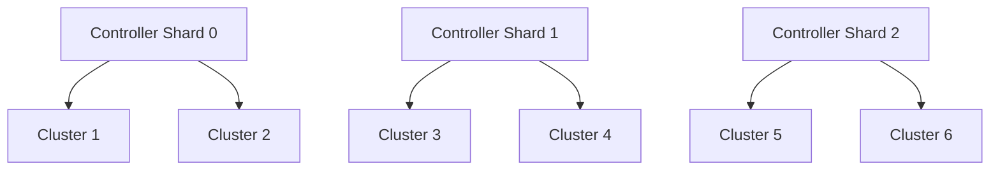

# How to Configure ArgoCD Controller Environment Variables

Author: [nawazdhandala](https://github.com/nawazdhandala)

Tags: ArgoCD, GitOps, Kubernetes, Application Controller, Performance Tuning

Description: Learn how to configure ArgoCD application controller environment variables to tune reconciliation performance, manage resource usage, and optimize controller behavior for production.

---

The ArgoCD application controller is the component responsible for continuously monitoring applications, comparing live state with desired state, and executing sync operations. It is the busiest component in an ArgoCD installation, and its performance directly affects how quickly your deployments happen and how reliably drift is detected.

This guide covers the environment variables that control the controller's behavior, with a focus on performance tuning for production environments.

## How the Controller Uses Environment Variables

The controller reads configuration from the `argocd-cmd-params-cm` ConfigMap and from environment variables set on its deployment. The ConfigMap approach is preferred for GitOps:

```yaml
apiVersion: v1
kind: ConfigMap
metadata:
  name: argocd-cmd-params-cm
  namespace: argocd
data:
  controller.log.level: "info"
  controller.status.processors: "50"
  controller.operation.processors: "25"
```

Or set directly as environment variables on the StatefulSet:

```yaml
apiVersion: apps/v1
kind: StatefulSet
metadata:
  name: argocd-application-controller
  namespace: argocd
spec:
  template:
    spec:
      containers:
        - name: argocd-application-controller
          env:
            - name: ARGOCD_CONTROLLER_STATUS_PROCESSORS
              value: "50"
            - name: ARGOCD_CONTROLLER_OPERATION_PROCESSORS
              value: "25"
```

## Reconciliation Settings

### Reconciliation Timeout

How often the controller re-checks applications even if no Git changes are detected:

```yaml
data:
  # Default reconciliation timeout (180 seconds = 3 minutes)
  controller.repo.server.timeout.seconds: "180"

  # Self-heal timeout (seconds between self-heal checks, default 5)
  controller.self.heal.timeout.seconds: "5"
```

For large installations, increasing the reconciliation timeout reduces load:

```yaml
data:
  timeout.reconciliation: "300"    # Check every 5 minutes instead of 3
```

### Processor Counts

The controller uses goroutine pools for different tasks. The two main pools are:

```yaml
data:
  # Status processors - reconcile application health/sync status
  # Default: 20, increase for many applications
  controller.status.processors: "50"

  # Operation processors - execute sync operations
  # Default: 10, increase if syncs queue up
  controller.operation.processors: "25"
```

These are the most impactful performance settings. If you manage hundreds of applications:

```yaml
# For 500+ applications
data:
  controller.status.processors: "100"
  controller.operation.processors: "50"
```

For 1000+ applications:

```yaml
data:
  controller.status.processors: "200"
  controller.operation.processors: "100"
```

Monitor the controller's queue depth metrics to determine if you need more processors:

```promql
# Check if status queue is backing up
argocd_app_reconcile_bucket{le="+Inf"} - argocd_app_reconcile_bucket{le="30"}
```

## Sharding Configuration

For large-scale deployments, shard the controller across multiple replicas:

```yaml
data:
  # Number of controller shards
  controller.sharding.algorithm: "round-robin"
```

Or use environment variables:

```yaml
env:
  # Enable sharding with this many replicas
  - name: ARGOCD_CONTROLLER_REPLICAS
    value: "3"
```

With sharding, each controller replica manages a subset of clusters. This distributes the load across multiple pods.



## Logging Configuration

```yaml
data:
  # Log level: debug, info, warn, error
  controller.log.level: "info"

  # Log format: text or json
  controller.log.format: "json"
```

Use `debug` level sparingly - it generates significant log volume and can itself impact performance:

```bash
# Temporarily enable debug logging for troubleshooting
kubectl set env statefulset/argocd-application-controller \
  ARGOCD_LOG_LEVEL=debug -n argocd

# Remember to revert
kubectl set env statefulset/argocd-application-controller \
  ARGOCD_LOG_LEVEL=info -n argocd
```

## Resource Management Variables

### Memory and Cache Limits

```yaml
data:
  # Controller memory cache limit for manifests
  controller.resource.health.persist: "true"

  # Kubectl parallelism limit
  controller.kubectl.parallelism.limit: "20"
```

### Repo Server Connection

```yaml
data:
  # Repo server address
  controller.repo.server.address: "argocd-repo-server:8081"

  # Timeout for repo server calls
  controller.repo.server.timeout.seconds: "120"

  # Number of parallel manifest generation requests
  controller.repo.server.parallelism.limit: "0"    # 0 means unlimited
```

If manifest generation is slow, limiting parallelism prevents the repo server from being overwhelmed:

```yaml
data:
  controller.repo.server.parallelism.limit: "10"
```

## Application-Level Settings

### Default Sync Options

Set default sync behavior for all applications:

```yaml
data:
  # Resource tracking method: label, annotation, or annotation+label
  application.resourceTrackingMethod: "annotation"
```

### Diff Customization

```yaml
data:
  # Use server-side diff by default
  controller.diff.server.side: "true"
```

Server-side diff is more accurate but slightly slower. It is recommended for production to avoid false positives in diff results.

## Kubernetes Client Configuration

Control how the controller communicates with Kubernetes clusters:

```yaml
env:
  # QPS limit for Kubernetes API requests
  - name: ARGOCD_K8S_CLIENT_QPS
    value: "50"

  # Burst limit for Kubernetes API requests
  - name: ARGOCD_K8S_CLIENT_BURST
    value: "100"
```

Increase these if the controller manages many resources and you see throttling in the logs:

```text
Throttling request took X seconds
```

## Production Configuration Example

Here is a complete production configuration for an ArgoCD installation managing 500+ applications across 10 clusters:

```yaml
apiVersion: v1
kind: ConfigMap
metadata:
  name: argocd-cmd-params-cm
  namespace: argocd
data:
  # Logging
  controller.log.level: "info"
  controller.log.format: "json"

  # Reconciliation
  timeout.reconciliation: "300"
  controller.self.heal.timeout.seconds: "5"

  # Processing parallelism
  controller.status.processors: "100"
  controller.operation.processors: "50"

  # Repo server
  controller.repo.server.timeout.seconds: "180"
  controller.repo.server.parallelism.limit: "20"

  # Diff
  controller.diff.server.side: "true"

  # Resource tracking
  application.resourceTrackingMethod: "annotation"
```

Combined with resource limits on the StatefulSet:

```yaml
apiVersion: apps/v1
kind: StatefulSet
metadata:
  name: argocd-application-controller
  namespace: argocd
spec:
  template:
    spec:
      containers:
        - name: argocd-application-controller
          resources:
            requests:
              cpu: "2"
              memory: 4Gi
            limits:
              cpu: "4"
              memory: 8Gi
          env:
            - name: ARGOCD_K8S_CLIENT_QPS
              value: "100"
            - name: ARGOCD_K8S_CLIENT_BURST
              value: "200"
```

## Monitoring Controller Performance

After setting environment variables, monitor their impact:

```bash
# Check controller queue depth
kubectl exec -n argocd statefulset/argocd-application-controller -- \
  curl -s localhost:8082/metrics | grep argocd_app_reconcile

# Check controller memory usage
kubectl top pods -n argocd -l app.kubernetes.io/name=argocd-application-controller

# Check for throttling
kubectl logs -n argocd statefulset/argocd-application-controller | grep -i throttl
```

Key Prometheus metrics to watch:

```promql
# Reconciliation queue depth
argocd_app_reconcile_count

# Time spent in reconciliation
argocd_app_reconcile_bucket

# Controller memory
process_resident_memory_bytes{job="argocd-application-controller"}
```

## Applying Changes

Controller environment variable changes require a restart:

```bash
# Restart the controller
kubectl rollout restart statefulset/argocd-application-controller -n argocd

# Watch the rollout
kubectl rollout status statefulset/argocd-application-controller -n argocd

# Verify the new configuration
kubectl exec -n argocd statefulset/argocd-application-controller -- env | sort
```

## Summary

The ArgoCD application controller is the workhorse of your GitOps infrastructure, and its environment variables are the primary levers for performance tuning. Start with the processor counts and reconciliation timeout, then adjust Kubernetes client QPS limits and repo server parallelism based on your observed workload. Monitor metrics continuously and adjust as your application count grows. A well-tuned controller keeps your deployments fast and your drift detection reliable.
