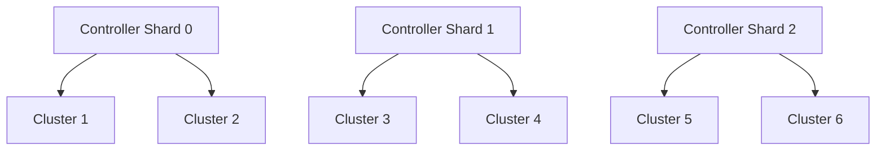

# How to Configure ArgoCD Controller Environment Variables

Author: [nawazdhandala](https://github.com/nawazdhandala)

Tags: ArgoCD, GitOps, Kubernetes, Application Controller, Performance Tuning

Description: Learn how to configure ArgoCD application controller environment variables to tune reconciliation performance, manage resource usage, and optimize controller behavior for production.

---

The ArgoCD application controller is the component responsible for continuously monitoring applications, comparing live state with desired state, and executing sync operations. It is the busiest component in an ArgoCD installation, and its performance directly affects how quickly your deployments happen and how reliably drift is detected.

This guide covers the environment variables that control the controller's behavior, with a focus on performance tuning for production environments.

## How the Controller Uses Environment Variables

The controller reads command parameters from the `argocd-cmd-params-cm` ConfigMap and from environment variables set on its deployment. Some global Argo CD settings, such as reconciliation polling and resource tracking, live in `argocd-cm`. The ConfigMap approach is preferred for GitOps:

```yaml
apiVersion: v1
kind: ConfigMap
metadata:
  name: argocd-cmd-params-cm
  namespace: argocd
data:
  controller.log.level: "info"
  controller.status.processors: "50"
  controller.operation.processors: "25"
```

Or set directly as environment variables on the StatefulSet:

```yaml
apiVersion: apps/v1
kind: StatefulSet
metadata:
  name: argocd-application-controller
  namespace: argocd
spec:
  template:
    spec:
      containers:
        - name: argocd-application-controller
          env:
            - name: ARGOCD_APPLICATION_CONTROLLER_STATUS_PROCESSORS
              value: "50"
            - name: ARGOCD_APPLICATION_CONTROLLER_OPERATION_PROCESSORS
              value: "25"
```

## Reconciliation Settings

### Reconciliation Timeout

How often the controller re-checks applications even if no Git changes are detected:

```yaml
data:
  # Default reconciliation polling interval plus jitter is 120s + up to 60s
  timeout.reconciliation: "120s"
  timeout.reconciliation.jitter: "60s"
```

Self-heal timing is a controller command parameter:

```yaml
data:
  # Self-heal timeout in seconds between self-heal attempts
  controller.self.heal.timeout.seconds: "5"
```

For large installations, increasing the reconciliation timeout reduces load:

```yaml
data:
  timeout.reconciliation: "300s"    # Check every 5 minutes instead of 3
```

### Processor Counts

The controller uses goroutine pools for different tasks. The two main pools are:

```yaml
data:
  # Status processors - reconcile application health/sync status
  # Default: 20, increase for many applications
  controller.status.processors: "50"

  # Operation processors - execute sync operations
  # Default: 10, increase if syncs queue up
  controller.operation.processors: "25"
```

These are the most impactful performance settings. If you manage hundreds of applications:

```yaml
# For larger installations

data:
  controller.status.processors: "50"
  controller.operation.processors: "25"
```

For 1000+ applications, start around that range and increase carefully if reconciliation or sync processing still backs up:

```yaml
data:
  controller.status.processors: "75"
  controller.operation.processors: "35"
```

Monitor reconciliation latency and controller work metrics to determine if you need more processors:

```promql
# 95th percentile application reconciliation duration
histogram_quantile(0.95, sum(rate(argocd_app_reconcile_bucket[5m])) by (le))
```

## Sharding Configuration

For large-scale deployments, shard the controller across multiple replicas:

```yaml
apiVersion: apps/v1
kind: StatefulSet
metadata:
  name: argocd-application-controller
  namespace: argocd
spec:
  replicas: 3
  template:
    spec:
      containers:
        - name: argocd-application-controller
          env:
            - name: ARGOCD_CONTROLLER_REPLICAS
              value: "3"
```

Choose the shard distribution algorithm in `argocd-cmd-params-cm`:

```yaml
data:
  # Sharding algorithm: legacy, round-robin, or consistent-hashing
  controller.sharding.algorithm: "round-robin"
```

Or use the equivalent environment variable:

```yaml
env:
  - name: ARGOCD_CONTROLLER_SHARDING_ALGORITHM
    value: "round-robin"
```

With sharding, each controller replica manages a subset of clusters. This distributes the load across multiple pods.


```mermaid
graph TD
    A[Controller Shard 0] --> D[Cluster 1]
    A --> E[Cluster 2]
    B[Controller Shard 1] --> F[Cluster 3]
    B --> G[Cluster 4]
    C[Controller Shard 2] --> H[Cluster 5]
    C --> I[Cluster 6]
```

## Logging Configuration

```yaml
data:
  # Log level: debug, info, warn, error
  controller.log.level: "info"

  # Log format: text or json
  controller.log.format: "json"
```

Use `debug` level sparingly - it generates significant log volume and can itself impact performance:

```bash
# Temporarily enable debug logging for troubleshooting
kubectl set env statefulset/argocd-application-controller \
  ARGOCD_APPLICATION_CONTROLLER_LOGLEVEL=debug -n argocd

# Remember to revert
kubectl set env statefulset/argocd-application-controller \
  ARGOCD_APPLICATION_CONTROLLER_LOGLEVEL=info -n argocd
```

## Resource Management Variables

### Health Persistence and Kubectl Parallelism

```yaml
data:
  # Persist per-resource health in the Application CR.
  # In Argo CD 3.x, false reduces Application CR updates and controller load.
  controller.resource.health.persist: "false"

  # Kubectl parallelism limit
  controller.kubectl.parallelism.limit: "20"
```

### Repo Server Connection

```yaml
data:
  # Repo server address
  repo.server: "argocd-repo-server:8081"

  # Timeout for repo server calls
  controller.repo.server.timeout.seconds: "120"

  # Number of parallel manifest generation requests
  reposerver.parallelism.limit: "0"    # 0 means unlimited
```

If manifest generation is slow, limiting parallelism prevents the repo server from being overwhelmed:

```yaml
data:
  reposerver.parallelism.limit: "10"
```

## Application-Level Settings

### Resource Tracking

Set the resource tracking method for all applications:

```yaml
apiVersion: v1
kind: ConfigMap
metadata:
  name: argocd-cm
  namespace: argocd
data:
  # Resource tracking method: label, annotation, or annotation+label
  application.resourceTrackingMethod: "annotation"
```

### Diff Customization

```yaml
data:
  # Use server-side diff by default
  controller.diff.server.side: "true"
```

Server-side diff runs a server-side apply dry run to predict the live state and can catch admission-controller validation issues during diff. It is a beta feature, so test it with your workloads before enabling it globally.

## Kubernetes Client Configuration

Control how the controller communicates with Kubernetes clusters:

```yaml
env:
  # QPS limit for Kubernetes API requests
  - name: ARGOCD_K8S_CLIENT_QPS
    value: "50"

  # Burst limit for Kubernetes API requests
  - name: ARGOCD_K8S_CLIENT_BURST
    value: "100"
```

Increase these if the controller manages many resources and you see throttling in the logs:

```text
Throttling request took X seconds
```

## Production Configuration Example

Here is a complete production configuration for an ArgoCD installation managing 500+ applications across 10 clusters:

```yaml
apiVersion: v1
kind: ConfigMap
metadata:
  name: argocd-cmd-params-cm
  namespace: argocd
data:
  # Logging
  controller.log.level: "info"
  controller.log.format: "json"

  # Self-heal timing
  controller.self.heal.timeout.seconds: "5"

  # Processing parallelism
  controller.status.processors: "50"
  controller.operation.processors: "25"

  # Repo server
  controller.repo.server.timeout.seconds: "180"
  reposerver.parallelism.limit: "20"

  # Diff
  controller.diff.server.side: "true"
```

And the global Argo CD settings in `argocd-cm`:

```yaml
apiVersion: v1
kind: ConfigMap
metadata:
  name: argocd-cm
  namespace: argocd
data:
  # Reconciliation polling
  timeout.reconciliation: "300s"
  timeout.reconciliation.jitter: "60s"

  # Resource tracking
  application.resourceTrackingMethod: "annotation"
```

Combined with resource limits on the StatefulSet:

```yaml
apiVersion: apps/v1
kind: StatefulSet
metadata:
  name: argocd-application-controller
  namespace: argocd
spec:
  template:
    spec:
      containers:
        - name: argocd-application-controller
          resources:
            requests:
              cpu: "2"
              memory: 4Gi
            limits:
              cpu: "4"
              memory: 8Gi
          env:
            - name: ARGOCD_K8S_CLIENT_QPS
              value: "100"
            - name: ARGOCD_K8S_CLIENT_BURST
              value: "200"
```

## Monitoring Controller Performance

After setting environment variables, monitor their impact:

```bash
# Check controller reconciliation metrics
kubectl exec -n argocd statefulset/argocd-application-controller -- \
  curl -s localhost:8082/metrics | grep argocd_app_reconcile

# Check controller memory usage
kubectl top pods -n argocd -l app.kubernetes.io/name=argocd-application-controller

# Check for throttling
kubectl logs -n argocd statefulset/argocd-application-controller | grep -i throttl
```

Key Prometheus metrics to watch:

```promql
# Reconciliation rate
rate(argocd_app_reconcile_count[5m])

# Time spent in reconciliation
histogram_quantile(0.95, sum(rate(argocd_app_reconcile_bucket[5m])) by (le))

# Pending kubectl executions
argocd_kubectl_exec_pending

# Controller memory
process_resident_memory_bytes{job="argocd-application-controller"}
```

## Applying Changes

Controller environment variable changes require a restart:

```bash
# Restart the controller
kubectl rollout restart statefulset/argocd-application-controller -n argocd

# Watch the rollout
kubectl rollout status statefulset/argocd-application-controller -n argocd

# Verify the new configuration
kubectl exec -n argocd statefulset/argocd-application-controller -- env | sort
```

## Summary

The ArgoCD application controller is the workhorse of your GitOps infrastructure, and its environment variables are the primary levers for performance tuning. Start with the processor counts and reconciliation timeout, then adjust Kubernetes client QPS limits and repo server parallelism based on your observed workload. Monitor metrics continuously and adjust as your application count grows. A well-tuned controller keeps your deployments fast and your drift detection reliable.
