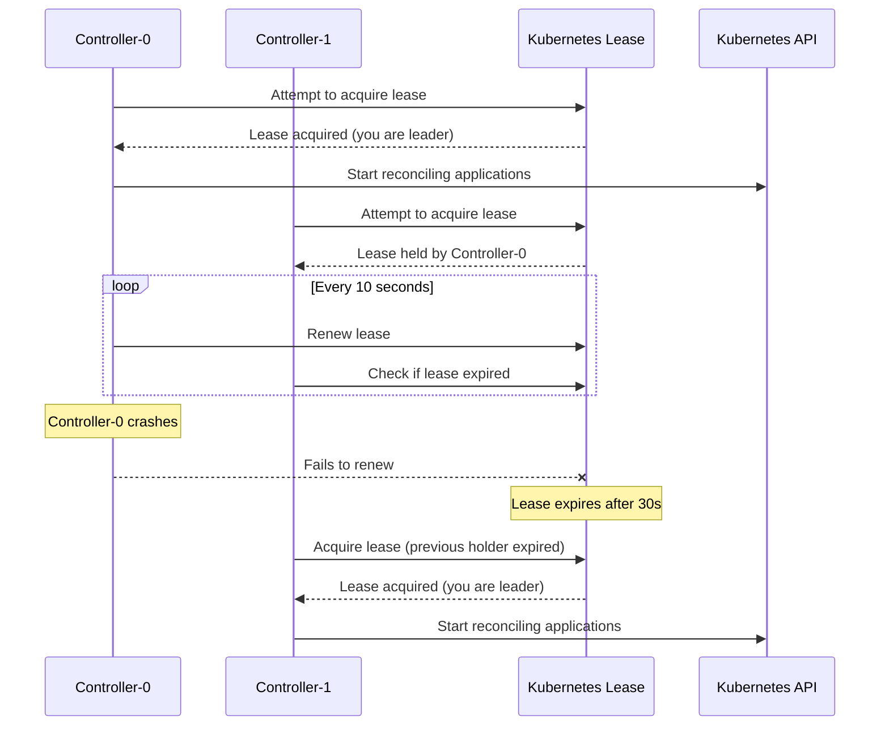
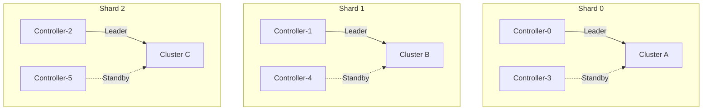

# How to Handle ArgoCD Controller Leader Election

Author: [nawazdhandala](https://github.com/nawazdhandala)

Tags: ArgoCD, GitOps, Kubernetes, High Availability, Leader Election

Description: Learn how ArgoCD application controller leader election works, how to configure it properly, and how to troubleshoot common leader election issues in HA deployments.

---

When you run multiple ArgoCD application controller replicas for high availability, only one controller should actively reconcile applications at a time. If multiple controllers reconcile the same application simultaneously, you get conflicting updates, race conditions, and unpredictable behavior. Leader election solves this by ensuring exactly one controller is the active leader while others stand by as warm replicas ready to take over if the leader fails.

## How Leader Election Works

ArgoCD uses Kubernetes Lease objects for leader election. The controller that successfully acquires the lease becomes the leader. Other controllers continuously attempt to acquire the lease and take over if the leader fails to renew it.



## Viewing the Current Leader

Check which controller instance is the current leader:

```bash
# View the leader election lease
kubectl get lease -n argocd

# Get details of the controller lease
kubectl get lease argocd-application-controller -n argocd -o yaml
```

The output looks like:

```yaml
apiVersion: coordination.k8s.io/v1
kind: Lease
metadata:
  name: argocd-application-controller
  namespace: argocd
spec:
  holderIdentity: argocd-application-controller-0
  leaseDurationSeconds: 30
  acquireTime: "2026-02-26T10:00:00Z"
  renewTime: "2026-02-26T14:35:20Z"
  leaseTransitions: 3
```

Key fields:
- **holderIdentity**: The name of the pod that currently holds the lease (the leader)
- **leaseDurationSeconds**: How long the lease is valid before it must be renewed
- **renewTime**: When the lease was last renewed
- **leaseTransitions**: How many times the leader has changed

## Configuring Leader Election Parameters

Tune leader election through the argocd-cmd-params-cm ConfigMap:

```yaml
apiVersion: v1
kind: ConfigMap
metadata:
  name: argocd-cmd-params-cm
  namespace: argocd
data:
  # How long the lease is valid (default: 30s)
  controller.leader.election.lease.duration: "30s"

  # How often the leader must renew the lease (default: 15s)
  # Must be less than lease duration
  controller.leader.election.renew.deadline: "15s"

  # How often non-leaders check for lease availability (default: 5s)
  controller.leader.election.retry.period: "5s"
```

After changing these values, restart the controllers:

```bash
kubectl rollout restart statefulset/argocd-application-controller -n argocd
```

### Parameter Tuning Guidelines

**Faster failover** (lower availability gap but more API server load):

```yaml
data:
  controller.leader.election.lease.duration: "15s"
  controller.leader.election.renew.deadline: "10s"
  controller.leader.election.retry.period: "2s"
```

With these settings, failover happens within 15 seconds of the leader failing.

**More stable** (less risk of false failovers but longer gap during real failures):

```yaml
data:
  controller.leader.election.lease.duration: "60s"
  controller.leader.election.renew.deadline: "40s"
  controller.leader.election.retry.period: "10s"
```

This configuration is better for environments with unstable networks where brief API server unreachability might cause unnecessary failovers.

## Leader Election with Controller Sharding

When using horizontal scaling with sharding, leader election works differently. Each shard has its own leader election, so multiple controllers can be active simultaneously, each managing a different subset of clusters:



With sharding, each controller shard has its own lease:

```bash
# View all controller leases
kubectl get lease -n argocd | grep application-controller

# Example output:
# argocd-application-controller     argocd-application-controller-0   30s   2h
```

Configure sharding with multiple replicas:

```yaml
controller:
  replicas: 3
  env:
    - name: ARGOCD_CONTROLLER_REPLICAS
      value: "3"
```

## Troubleshooting Leader Election Issues

### Problem: No Controller Becomes Leader

```bash
# Check if the lease exists
kubectl get lease argocd-application-controller -n argocd

# If the lease does not exist, controllers may not have permission
# Check RBAC
kubectl auth can-i create leases \
  --as=system:serviceaccount:argocd:argocd-application-controller \
  --namespace=argocd
```

If RBAC is missing, create it:

```yaml
apiVersion: rbac.authorization.k8s.io/v1
kind: Role
metadata:
  name: argocd-controller-leader-election
  namespace: argocd
rules:
  - apiGroups: ["coordination.k8s.io"]
    resources: ["leases"]
    verbs: ["get", "create", "update"]
---
apiVersion: rbac.authorization.k8s.io/v1
kind: RoleBinding
metadata:
  name: argocd-controller-leader-election
  namespace: argocd
subjects:
  - kind: ServiceAccount
    name: argocd-application-controller
    namespace: argocd
roleRef:
  kind: Role
  name: argocd-controller-leader-election
  apiGroup: rbac.authorization.k8s.io
```

### Problem: Frequent Leader Changes (Flapping)

If you see many lease transitions in a short period:

```bash
# Check lease transition count
kubectl get lease argocd-application-controller -n argocd \
  -o jsonpath='{.spec.leaseTransitions}'

# Check controller logs for leader election events
kubectl logs statefulset/argocd-application-controller -n argocd | \
  grep -i "leader\|election\|lease"
```

Common causes:
- **Insufficient CPU**: The leader cannot renew the lease in time because it is CPU-starved
- **Network instability**: The controller cannot reach the Kubernetes API to renew
- **High API server load**: Lease renewal requests time out

Fix:

```bash
# Increase controller resources
kubectl patch statefulset argocd-application-controller -n argocd \
  --type merge -p '{
    "spec": {
      "template": {
        "spec": {
          "containers": [{
            "name": "argocd-application-controller",
            "resources": {
              "requests": {"cpu": "1"},
              "limits": {"cpu": "2"}
            }
          }]
        }
      }
    }
  }'

# Increase lease duration to tolerate brief interruptions
kubectl patch configmap argocd-cmd-params-cm -n argocd \
  --type merge -p '{
    "data": {
      "controller.leader.election.lease.duration": "45s",
      "controller.leader.election.renew.deadline": "25s"
    }
  }'
```

### Problem: Leader Pod Deleted But Lease Not Released

If a controller pod is deleted (e.g., during a node drain), the lease remains until it expires:

```bash
# Check if the holder pod exists
HOLDER=$(kubectl get lease argocd-application-controller -n argocd \
  -o jsonpath='{.spec.holderIdentity}')
kubectl get pod "$HOLDER" -n argocd

# If the pod does not exist, wait for the lease to expire
# Or delete the lease to force immediate re-election
kubectl delete lease argocd-application-controller -n argocd
```

Deleting the lease forces an immediate leader election. The remaining healthy controller will acquire it within the retry period.

## Monitoring Leader Election

Set up alerts for leader election health:

```yaml
groups:
  - name: argocd-leader-election
    rules:
      - alert: ArgocdControllerNoLeader
        expr: |
          absent(kube_lease_owner{lease="argocd-application-controller",namespace="argocd"})
        for: 2m
        labels:
          severity: critical
        annotations:
          summary: "No ArgoCD controller has acquired the leader lease"

      - alert: ArgocdControllerFrequentLeaderChanges
        expr: |
          changes(kube_lease_renew_time{lease="argocd-application-controller",namespace="argocd"}[1h]) > 10
        labels:
          severity: warning
        annotations:
          summary: "ArgoCD controller leader is changing frequently"
```

Leader election is a fundamental part of ArgoCD high availability. The default settings work well for most deployments, but tuning the lease duration and renew deadline helps in environments with specific latency or stability characteristics. For comprehensive ArgoCD monitoring including leader election health, see our guide on [monitoring ArgoCD component health](https://oneuptime.com/blog/post/2026-02-26-argocd-monitor-component-health/view).
