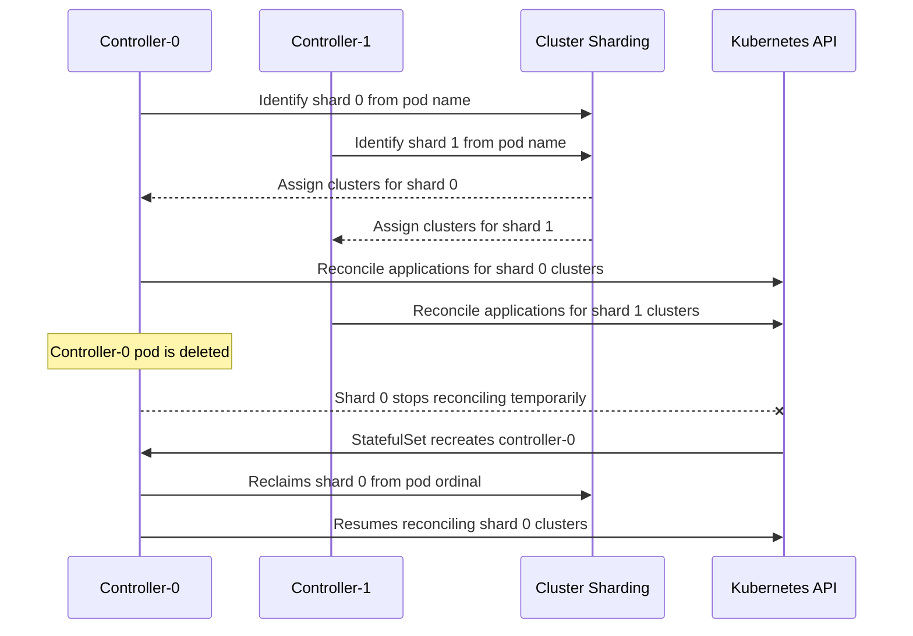
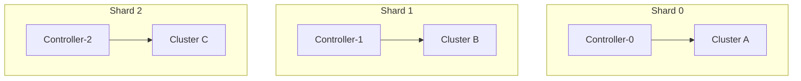

# How to Handle ArgoCD Controller Leader Election

Author: [nawazdhandala](https://github.com/nawazdhandala)

Tags: ArgoCD, GitOps, Kubernetes, High Availability, Leader Election

Description: Learn how ArgoCD application controller leader election works, how to configure it properly, and how to troubleshoot common leader election issues in HA deployments.

---

When you run multiple ArgoCD application controller replicas, they do not run as an active-passive leader election group. The application controller scales horizontally by sharding clusters across controller replicas. Multiple controllers can be active at the same time, but each controller is responsible for a different shard of managed clusters. If you need active-passive leader election in Argo CD, that pattern applies to components such as the ApplicationSet controller when leader election is enabled, not to application-controller cluster sharding.

## How Controller Sharding Works

ArgoCD application controller replicas use shard numbers to decide which clusters they manage. In the standard StatefulSet-based deployment, each pod gets its shard number from its StatefulSet ordinal: `argocd-application-controller-0` handles shard 0, `argocd-application-controller-1` handles shard 1, and so on. The total shard count comes from the `ARGOCD_CONTROLLER_REPLICAS` environment variable.


```mermaid
sequenceDiagram
    participant C0 as Controller-0
    participant C1 as Controller-1
    participant S as Cluster Sharding
    participant K8s as Kubernetes API

    C0->>S: Identify shard 0 from pod name
    C1->>S: Identify shard 1 from pod name

    S-->>C0: Assign clusters for shard 0
    S-->>C1: Assign clusters for shard 1

    C0->>K8s: Reconcile applications for shard 0 clusters
    C1->>K8s: Reconcile applications for shard 1 clusters

    Note over C0: Controller-0 pod is deleted
    C0--xK8s: Shard 0 stops reconciling temporarily
    K8s->>C0: StatefulSet recreates controller-0
    C0->>S: Reclaims shard 0 from pod ordinal
    C0->>K8s: Resumes reconciling shard 0 clusters
```

## Viewing the Current Shards

Check which controller instances are running and how many shards are configured:

```bash
# View application controller pods
kubectl get pods -n argocd -l app.kubernetes.io/name=argocd-application-controller

# Check the configured shard count
kubectl get statefulset argocd-application-controller -n argocd \
  -o jsonpath='{.spec.template.spec.containers[?(@.name=="argocd-application-controller")].env[?(@.name=="ARGOCD_CONTROLLER_REPLICAS")].value}'
```

The output looks like:

```text
3
```

Key fields:
- **Pod ordinal**: The number at the end of the controller pod name determines the shard handled by that pod
- **ARGOCD_CONTROLLER_REPLICAS**: The total number of shards the controller uses for cluster distribution
- **StatefulSet replicas**: The number of controller pods Kubernetes should run
- **Cluster shard**: The optional `shard` value on a cluster secret can pin a cluster to a specific shard

## Configuring Controller Sharding Parameters

Tune application controller sharding through the StatefulSet and the `argocd-cmd-params-cm` ConfigMap:

```yaml
apiVersion: apps/v1
kind: StatefulSet
metadata:
  name: argocd-application-controller
  namespace: argocd
spec:
  replicas: 3
  template:
    spec:
      containers:
        - name: argocd-application-controller
          env:
            - name: ARGOCD_CONTROLLER_REPLICAS
              value: "3"
---
apiVersion: v1
kind: ConfigMap
metadata:
  name: argocd-cmd-params-cm
  namespace: argocd
data:
  # Supported values include legacy, round-robin, and consistent-hashing
  controller.sharding.algorithm: "legacy"
```

After changing these values, restart the controllers:

```bash
kubectl rollout restart statefulset/argocd-application-controller -n argocd
```

### Parameter Tuning Guidelines

**More shards** (lower per-controller memory and cache load, but more controller pods):

```yaml
spec:
  replicas: 5
  template:
    spec:
      containers:
        - name: argocd-application-controller
          env:
            - name: ARGOCD_CONTROLLER_REPLICAS
              value: "5"
```

With these settings, managed clusters are distributed across five controller shards.

**More stable distribution** (less reshuffling when shards or clusters change):

```yaml
data:
  controller.sharding.algorithm: "consistent-hashing"
```

This configuration can reduce cluster reshuffling when adding or removing shards, but the Argo CD documentation still marks non-default sharding algorithms as alpha features.

## Leader Election with Controller Sharding

With application controller sharding, there is no separate leader Lease per shard in the standard StatefulSet deployment. Multiple controllers can be active simultaneously, each managing a different subset of clusters:


```mermaid
flowchart TD
    subgraph "Shard 0"
        C0A[Controller-0] --> ClusterA[Cluster A]
    end

    subgraph "Shard 1"
        C1A[Controller-1] --> ClusterB[Cluster B]
    end

    subgraph "Shard 2"
        C2A[Controller-2] --> ClusterC[Cluster C]
    end
```

With sharding, check controller pods and shard-related configuration instead of looking for application-controller Lease objects:

```bash
# View all application controller pods
kubectl get pods -n argocd -l app.kubernetes.io/name=argocd-application-controller

# Check the sharding algorithm
kubectl get configmap argocd-cmd-params-cm -n argocd \
  -o jsonpath='{.data.controller\.sharding\.algorithm}'
```

Configure sharding with multiple replicas:

```yaml
controller:
  replicas: 3

configs:
  params:
    controller.sharding.algorithm: "consistent-hashing"
```

## Troubleshooting Controller Sharding Issues

### Problem: A Cluster Is Not Reconciled by Any Controller

```bash
# Check controller pods
kubectl get pods -n argocd -l app.kubernetes.io/name=argocd-application-controller

# Check configured shard count
kubectl get statefulset argocd-application-controller -n argocd \
  -o jsonpath='{.spec.replicas}{"\n"}{.spec.template.spec.containers[?(@.name=="argocd-application-controller")].env[?(@.name=="ARGOCD_CONTROLLER_REPLICAS")].value}{"\n"}'

# Check controller logs for shard assignment errors
kubectl logs statefulset/argocd-application-controller -n argocd | \
  grep -i "shard\|assigned"
```

If the StatefulSet replica count and `ARGOCD_CONTROLLER_REPLICAS` do not match, update them together:

```yaml
apiVersion: apps/v1
kind: StatefulSet
metadata:
  name: argocd-application-controller
  namespace: argocd
spec:
  replicas: 3
  template:
    spec:
      containers:
        - name: argocd-application-controller
          env:
            - name: ARGOCD_CONTROLLER_REPLICAS
              value: "3"
```

### Problem: Frequent Controller Restarts

If a controller pod restarts frequently, its shard stops reconciling until the pod is healthy again:

```bash
# Check restart counts
kubectl get pods -n argocd -l app.kubernetes.io/name=argocd-application-controller

# Check controller logs
kubectl logs statefulset/argocd-application-controller -n argocd | \
  grep -i "error\|panic\|oom\|shard"
```

Common causes:
- **Insufficient CPU or memory**: The controller is overloaded by too many applications or clusters
- **Network instability**: The controller cannot reliably reach the Kubernetes API or managed clusters
- **High API server load**: Kubernetes API requests time out during reconciliation

Fix:

```bash
# Increase controller resources
kubectl patch statefulset argocd-application-controller -n argocd \
  --type merge -p '{
    "spec": {
      "template": {
        "spec": {
          "containers": [{
            "name": "argocd-application-controller",
            "resources": {
              "requests": {"cpu": "1", "memory": "2Gi"},
              "limits": {"cpu": "2", "memory": "4Gi"}
            }
          }]
        }
      }
    }
  }'

# Use a more even sharding algorithm for large multi-cluster deployments
kubectl patch configmap argocd-cmd-params-cm -n argocd \
  --type merge -p '{
    "data": {
      "controller.sharding.algorithm": "consistent-hashing"
    }
  }'
```

### Problem: Controller Pod Deleted During Maintenance

If a controller pod is deleted (e.g., during a node drain), the StatefulSet recreates the pod with the same ordinal:

```bash
# Check the missing or recreating pod
kubectl get pods -n argocd -l app.kubernetes.io/name=argocd-application-controller

# Watch the StatefulSet until all controller replicas are ready
kubectl rollout status statefulset/argocd-application-controller -n argocd
```

The shard handled by that ordinal resumes when the replacement pod is ready. Do not delete Kubernetes Lease objects to force application-controller failover; the standard application controller sharding model does not use a controller Lease for shard ownership.

## Monitoring Controller Sharding

Set up alerts for controller health:

```yaml
groups:
  - name: argocd-controller-sharding
    rules:
      - alert: ArgocdApplicationControllerReplicasUnavailable
        expr: |
          kube_statefulset_status_replicas_ready{statefulset="argocd-application-controller",namespace="argocd"} < kube_statefulset_replicas{statefulset="argocd-application-controller",namespace="argocd"}
        for: 5m
        labels:
          severity: critical
        annotations:
          summary: "One or more ArgoCD application controller shards are unavailable"

      - alert: ArgocdApplicationControllerRestarting
        expr: |
          increase(kube_pod_container_status_restarts_total{namespace="argocd",container="argocd-application-controller"}[15m]) > 0
        labels:
          severity: warning
        annotations:
          summary: "ArgoCD application controller is restarting"
```

Controller sharding is a fundamental part of scaling ArgoCD application controllers. The default settings work well for many deployments, but matching `ARGOCD_CONTROLLER_REPLICAS` to the StatefulSet replica count and choosing the right sharding algorithm helps in environments with many managed clusters. For comprehensive ArgoCD monitoring including controller health, see our guide on [monitoring ArgoCD component health](https://oneuptime.com/blog/post/2026-02-26-argocd-monitor-component-health/view).
