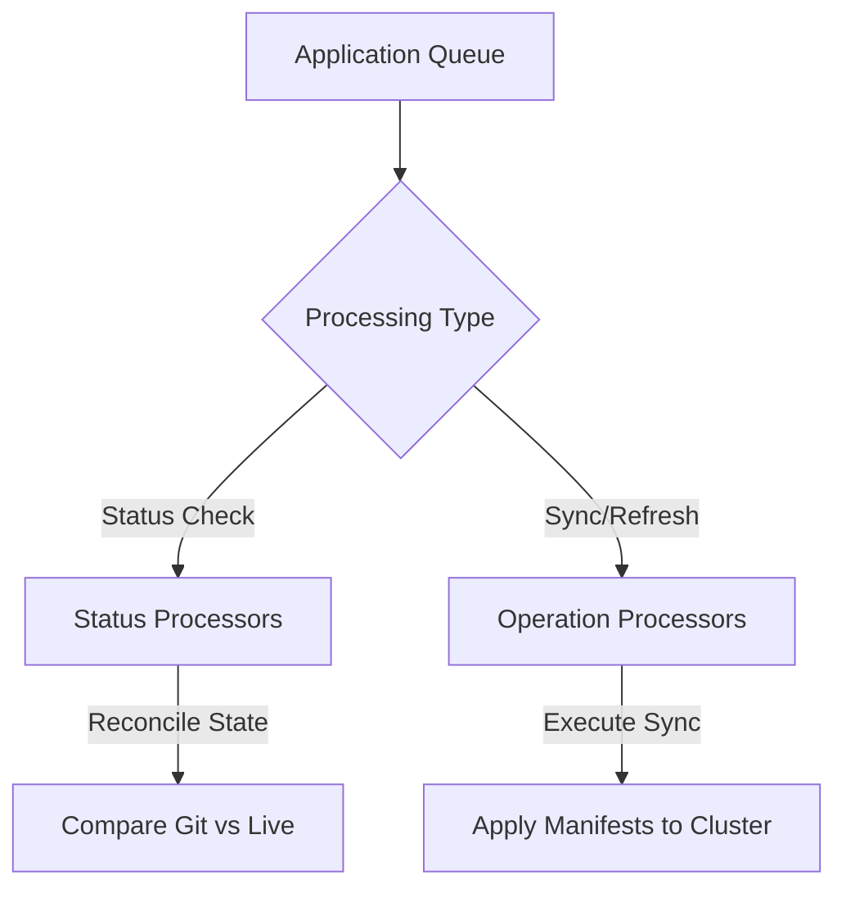
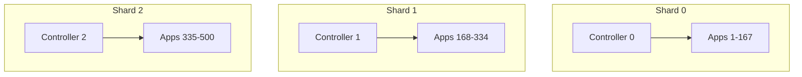

# How to Configure Controller Parallelism in ArgoCD

Author: [nawazdhandala](https://github.com/nawazdhandala)

Tags: ArgoCD, GitOps, Kubernetes, Performance, Scaling

Description: Learn how to configure ArgoCD application controller parallelism settings including status processors, operation processors, and sharding to handle large-scale deployments.

---

The ArgoCD application controller is responsible for reconciling application state, running sync operations, and managing resource health checks. Its parallelism settings determine how many applications can be processed simultaneously. Under-configured parallelism means slow reconciliation and delayed syncs. Over-configured parallelism wastes resources and can overwhelm downstream components. This guide covers the controller parallelism settings, how they interact, and how to tune them for your environment.

## Understanding Controller Processing Pipelines

The controller has two distinct processing pipelines, each with its own parallelism setting:



1. **Status processors** - Handle reconciliation (comparing desired vs live state). This is the bread-and-butter work of the controller.
2. **Operation processors** - Handle sync operations (applying changes to the cluster). These are triggered by auto-sync or manual sync requests.

## Configuring Status Processors

Status processors control how many applications the controller reconciles concurrently:

```yaml
# argocd-cmd-params-cm ConfigMap
apiVersion: v1
kind: ConfigMap
metadata:
  name: argocd-cmd-params-cm
  namespace: argocd
data:
  # Number of concurrent status reconciliation workers
  # Default: 20
  controller.status.processors: "30"
```

Each status processor handles one application at a time. With 20 processors (the default), the controller can reconcile up to 20 applications simultaneously.

### Choosing the Right Status Processor Count

```
Recommended status processors = Total applications / 10
```

Capped at a reasonable maximum based on controller resources:

| Applications | Status Processors | Notes |
|-------------|------------------|-------|
| < 100       | 20 (default)     | Default is fine |
| 100 - 300   | 25-30            | Slight increase |
| 300 - 500   | 30-40            | Monitor CPU |
| 500 - 1000  | 40-50            | Consider sharding |
| 1000+       | 20-30 per shard  | Must use sharding |

## Configuring Operation Processors

Operation processors control how many sync operations run concurrently:

```yaml
# argocd-cmd-params-cm ConfigMap
apiVersion: v1
kind: ConfigMap
metadata:
  name: argocd-cmd-params-cm
  namespace: argocd
data:
  # Number of concurrent operation (sync) workers
  # Default: 10
  controller.operation.processors: "15"
```

Operation processors are typically set lower than status processors because sync operations are more resource-intensive and put more load on the Kubernetes API server.

### Choosing the Right Operation Processor Count

```
Recommended operation processors = Status processors / 2
```

| Status Processors | Operation Processors |
|------------------|---------------------|
| 20               | 10 (default)        |
| 30               | 15                  |
| 40               | 20                  |
| 50               | 25                  |

## Configuring Both Settings Together

Here is a typical configuration for different cluster sizes:

### Small Cluster (under 100 apps)

```yaml
apiVersion: v1
kind: ConfigMap
metadata:
  name: argocd-cmd-params-cm
  namespace: argocd
data:
  controller.status.processors: "20"
  controller.operation.processors: "10"
```

### Medium Cluster (100 to 500 apps)

```yaml
apiVersion: v1
kind: ConfigMap
metadata:
  name: argocd-cmd-params-cm
  namespace: argocd
data:
  controller.status.processors: "30"
  controller.operation.processors: "15"
```

With increased resources:

```yaml
apiVersion: apps/v1
kind: Deployment
metadata:
  name: argocd-application-controller
  namespace: argocd
spec:
  template:
    spec:
      containers:
        - name: argocd-application-controller
          resources:
            requests:
              cpu: "2"
              memory: "2Gi"
            limits:
              cpu: "4"
              memory: "4Gi"
```

### Large Cluster (500+ apps) with Sharding

```yaml
apiVersion: apps/v1
kind: StatefulSet
metadata:
  name: argocd-application-controller
  namespace: argocd
spec:
  replicas: 3  # Three shards
  template:
    spec:
      containers:
        - name: argocd-application-controller
          env:
            - name: ARGOCD_CONTROLLER_REPLICAS
              value: "3"
          resources:
            requests:
              cpu: "2"
              memory: "2Gi"
            limits:
              cpu: "4"
              memory: "4Gi"
```

```yaml
# Per-shard parallelism (applies to each shard independently)
apiVersion: v1
kind: ConfigMap
metadata:
  name: argocd-cmd-params-cm
  namespace: argocd
data:
  controller.status.processors: "25"
  controller.operation.processors: "12"
```

Total cluster-wide: 3 shards * 25 = 75 status processors, 3 * 12 = 36 operation processors.

## How Sharding Distributes Applications

When sharding is enabled, each controller replica manages a subset of applications:



The sharding algorithm assigns applications to shards based on a hash of the application name. Each shard's processors only work on its assigned applications.

### Configuring Sharding Algorithm

```yaml
# argocd-cmd-params-cm ConfigMap
data:
  # Options: legacy, round-robin
  controller.sharding.algorithm: "round-robin"
```

`round-robin` provides more even distribution than `legacy` (hash-based).

## Interaction Between Controller and Repo Server

Controller parallelism directly affects repo server load. Each status processor may trigger a manifest generation request to the repo server:

```
Maximum repo server requests = Status processors * (1 / Cache hit rate)
```

If you increase status processors, ensure the repo server can handle the additional load:

```yaml
# Controller: 40 status processors
controller.status.processors: "40"

# Repo server must handle up to 40 concurrent requests
# Set parallelism accordingly
reposerver.parallelism.limit: "15"
```

If the repo server's parallelism limit is much lower than the controller's status processors, the controller will wait for manifest generation, effectively reducing its actual parallelism.

## Monitoring Controller Parallelism

Track whether your parallelism settings are optimal:

```bash
# Port-forward controller metrics
kubectl port-forward svc/argocd-application-controller-metrics -n argocd 8082:8082 &

# Check work queue metrics
curl -s http://localhost:8082/metrics | grep workqueue

# Key metrics:
# workqueue_depth{name="app_reconciliation_queue"} - Status queue depth
# workqueue_depth{name="app_operation_processing_queue"} - Operation queue depth
# workqueue_longest_running_processor_seconds - Longest-running worker
```

Set up alerts:

```yaml
groups:
  - name: argocd-controller-parallelism
    rules:
      - alert: ArgocdReconciliationQueueBacklog
        expr: |
          workqueue_depth{
            namespace="argocd",
            name="app_reconciliation_queue"
          } > 50
        for: 10m
        labels:
          severity: warning
        annotations:
          summary: "ArgoCD reconciliation queue has {{ $value }} pending items"
          description: "Consider increasing controller.status.processors"

      - alert: ArgocdOperationQueueBacklog
        expr: |
          workqueue_depth{
            namespace="argocd",
            name="app_operation_processing_queue"
          } > 20
        for: 5m
        labels:
          severity: warning
        annotations:
          summary: "ArgoCD operation queue has {{ $value }} pending items"
          description: "Consider increasing controller.operation.processors"
```

## Tuning Process

Follow this iterative process to find optimal settings:

1. **Start with defaults** (20 status, 10 operation)
2. **Monitor queue depths** for one week
3. **If queues grow** - Increase processors by 25%
4. **If CPU is saturated** - Either increase resources or add shards
5. **Repeat** until queues stay near zero and CPU is under 70%

```bash
# Quick health check
echo "Queue depths:"
curl -s http://localhost:8082/metrics | grep "workqueue_depth"

echo "CPU usage:"
kubectl top pod -n argocd -l app.kubernetes.io/name=argocd-application-controller

echo "Application count:"
argocd app list -o json | jq 'length'
```

## Common Mistakes

### Too Many Processors, Not Enough CPU

```yaml
# BAD: 50 processors on a 2-CPU controller
controller.status.processors: "50"
# Results: CPU contention, everything becomes slower
```

### Mismatched Operation and Status Processors

```yaml
# BAD: Operation processors higher than status
controller.status.processors: "10"
controller.operation.processors: "20"
# Results: Syncs queue up waiting for reconciliation to detect changes
```

### Not Adjusting After Sharding

```yaml
# Before sharding: 1 replica, 40 status processors
# After sharding: 3 replicas, 40 status processors each = 120 total
# This is likely excessive - reduce per-shard to 15-20
```

For comprehensive monitoring of ArgoCD controller performance and automated parallelism recommendations, [OneUptime](https://oneuptime.com) provides observability that helps you tune your GitOps platform for optimal throughput.

## Key Takeaways

- Status processors handle reconciliation, operation processors handle syncs
- Default is 20 status and 10 operation processors, suitable for under 100 applications
- Scale processors with application count but cap based on available CPU
- Use controller sharding for 500+ applications to distribute load
- Monitor work queue depths as the primary indicator of parallelism adequacy
- Ensure repo server parallelism can support controller demand
- Increase resources before increasing parallelism to avoid CPU contention
- Follow an iterative tuning process based on metrics, not guesswork
