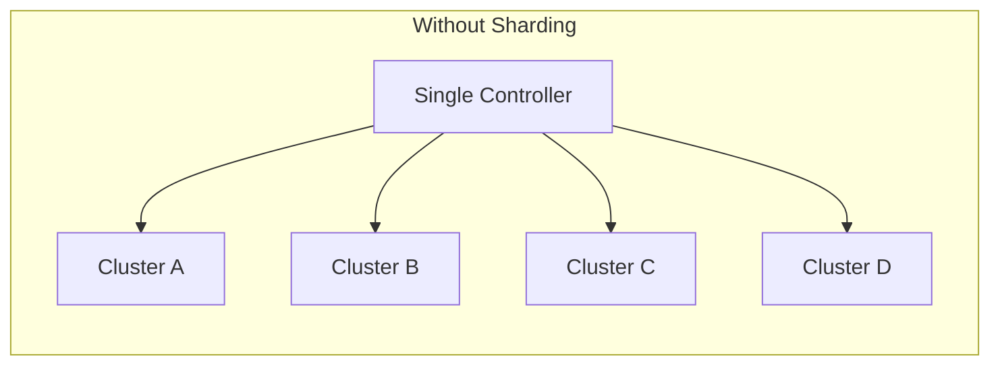
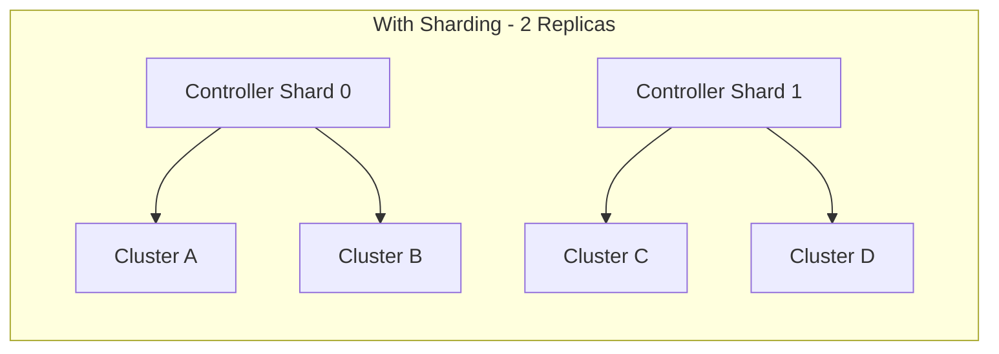

# How to Configure Controller Sharding for Scale in ArgoCD

Author: [nawazdhandala](https://github.com/nawazdhandala)

Tags: ArgoCD, GitOps, Kubernetes, Scaling, Performance

Description: Learn how to configure ArgoCD application controller sharding to distribute reconciliation workload across multiple replicas for better performance at scale.

---

The ArgoCD application controller is the workhorse of your GitOps setup. It continuously compares the desired state in Git with the live state in your clusters, detects drift, and triggers syncs. When you are managing a handful of applications, a single controller handles this easily. But as your deployment grows to hundreds of applications across multiple clusters, the controller becomes a bottleneck.

Controller sharding is the answer. It splits the reconciliation workload across multiple controller replicas, with each replica responsible for a subset of clusters. This guide walks through the complete configuration process.

## How Sharding Works

Without sharding, the single application controller watches all clusters and reconciles all applications. With sharding enabled, ArgoCD runs multiple controller replicas, and each replica is assigned a set of clusters using a sharding algorithm.





Each shard gets a unique ID (starting from 0). The sharding algorithm maps each cluster to exactly one shard. This means no two controller replicas ever reconcile the same cluster, eliminating duplicate work.

## Choosing a Sharding Algorithm

ArgoCD supports three sharding algorithms:

**Legacy (default)**: Uses a simple modulo operation. Cluster assignment is based on the cluster's index in the sorted cluster list. Adding or removing clusters can cause significant reassignment.

**Round-robin**: Distributes clusters across shards in order. More predictable than legacy but still sensitive to cluster list changes.

**Consistent hashing**: Uses a hash ring to assign clusters. When you add a new shard, only a fraction of clusters get reassigned. This is the best choice for dynamic environments.

```yaml
apiVersion: v1
kind: ConfigMap
metadata:
  name: argocd-cmd-params-cm
  namespace: argocd
data:
  # Options: "legacy", "round-robin", "consistent-hashing"
  controller.sharding.algorithm: "consistent-hashing"
```

For most production environments, I recommend consistent hashing. It minimizes disruption when scaling shards up or down.

## Step-by-Step Configuration

### Step 1: Set the Replica Count

The controller runs as a StatefulSet. Scale it to your desired shard count:

```yaml
apiVersion: apps/v1
kind: StatefulSet
metadata:
  name: argocd-application-controller
  namespace: argocd
spec:
  replicas: 3
  selector:
    matchLabels:
      app.kubernetes.io/name: argocd-application-controller
  template:
    spec:
      containers:
      - name: argocd-application-controller
        env:
        # This must match the replicas count
        - name: ARGOCD_CONTROLLER_REPLICAS
          value: "3"
```

The `ARGOCD_CONTROLLER_REPLICAS` environment variable must match the StatefulSet replica count. Each pod derives its shard ID from its ordinal index in the StatefulSet (pod-0 is shard 0, pod-1 is shard 1, and so on).

### Step 2: Configure Resource Limits Per Shard

Each shard handles roughly `total_clusters / shard_count` clusters. Size resources accordingly:

```yaml
containers:
- name: argocd-application-controller
  resources:
    requests:
      cpu: "2"
      memory: "4Gi"
    limits:
      cpu: "4"
      memory: "8Gi"
```

A good starting formula is:

- **Memory**: Base 1GB + (50MB per application managed by this shard)
- **CPU**: Base 0.5 cores + (0.01 cores per application)

For a shard handling 20 clusters with 200 total applications, you would need roughly 11GB memory and 2.5 CPU cores.

### Step 3: Configure Processor Counts

The controller uses status processors and operation processors. These should be tuned based on the per-shard workload:

```yaml
apiVersion: v1
kind: ConfigMap
metadata:
  name: argocd-cm
  namespace: argocd
data:
  # Status processors handle reconciliation
  controller.status.processors: "30"
  # Operation processors handle sync operations
  controller.operation.processors: "15"
```

These values are per controller instance, not total. So with 3 shards and 30 status processors each, you get 90 total status processors across the cluster.

### Step 4: Verify Shard Assignment

After deploying, verify that clusters are properly distributed across shards:

```bash
# Check which shard each cluster is assigned to
for i in 0 1 2; do
  echo "=== Shard $i ==="
  kubectl logs argocd-application-controller-$i -n argocd | \
    grep "assigned" | head -5
done
```

You can also check the controller's metrics endpoint:

```bash
# Port-forward to a specific shard
kubectl port-forward argocd-application-controller-0 -n argocd 8082:8082

# Check the cluster count for this shard
curl -s localhost:8082/metrics | grep argocd_cluster_info
```

## Handling Uneven Cluster Sizes

Not all clusters are equal. A production cluster with 500 resources generates far more work than a development cluster with 50 resources. Consistent hashing distributes clusters evenly by count, but not by workload.

To handle this, you can use explicit shard assignment by labeling cluster secrets:

```yaml
apiVersion: v1
kind: Secret
metadata:
  name: cluster-large-production
  namespace: argocd
  labels:
    argocd.argoproj.io/secret-type: cluster
  annotations:
    # Force this cluster to shard 0
    argocd.argoproj.io/shard: "0"
type: Opaque
stringData:
  name: large-production
  server: https://large-prod.example.com
  config: |
    {
      "bearerToken": "<token>"
    }
```

Using the `argocd.argoproj.io/shard` annotation overrides the automatic sharding algorithm for specific clusters. This lets you manually balance workload when automatic distribution is insufficient.

## Scaling Shards Up and Down

When you need to add more shards:

```bash
# Update the environment variable in the StatefulSet
kubectl set env statefulset/argocd-application-controller \
  ARGOCD_CONTROLLER_REPLICAS=5 -n argocd

# Scale the StatefulSet
kubectl scale statefulset argocd-application-controller \
  --replicas=5 -n argocd
```

With consistent hashing, only about `1/new_shard_count` of clusters get reassigned. With 5 shards, roughly 20% of clusters move to the new shards.

When scaling down, the process is similar but requires extra caution. Clusters assigned to removed shards will be redistributed, causing a temporary spike in reconciliation activity on the remaining shards.

## Monitoring Sharded Controllers

Set up per-shard monitoring to detect imbalances:

```yaml
# PrometheusRule for shard imbalance detection
apiVersion: monitoring.coreos.com/v1
kind: PrometheusRule
metadata:
  name: argocd-sharding-alerts
spec:
  groups:
  - name: argocd-sharding
    rules:
    - alert: ArgocdShardImbalance
      expr: |
        max(argocd_cluster_info) by (shard) /
        min(argocd_cluster_info) by (shard) > 2
      for: 10m
      labels:
        severity: warning
      annotations:
        summary: "ArgoCD controller shards are imbalanced"
    - alert: ArgocdShardHighMemory
      expr: |
        container_memory_working_set_bytes{
          pod=~"argocd-application-controller-.*"
        } > 6e9
      for: 5m
      labels:
        severity: critical
      annotations:
        summary: "ArgoCD controller shard using excessive memory"
```

## Common Pitfalls

**Forgetting to update ARGOCD_CONTROLLER_REPLICAS**: If the environment variable does not match the actual replica count, some clusters will not be assigned to any shard and will not be reconciled.

**Setting too many shards**: Each shard maintains its own connection to Redis and the repo server. Too many shards create contention on these shared resources. Start with 3 to 5 shards and increase only when needed.

**Not monitoring individual shards**: Aggregate metrics hide per-shard issues. Always monitor each shard independently.

## Summary

Controller sharding is the most effective way to scale ArgoCD's reconciliation capacity. Use consistent hashing for dynamic environments, size resources based on per-shard workload, and use explicit shard annotations for oversized clusters. Start with a modest shard count and scale up based on monitoring data rather than guesswork. The goal is balanced workload distribution across shards with headroom for cluster growth.
