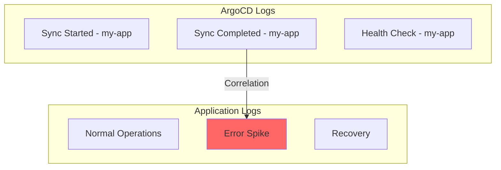

# How to Correlate ArgoCD Logs with Application Logs

Author: [nawazdhandala](https://github.com/nawazdhandala)

Tags: ArgoCD, GitOps, Kubernetes, Observability, Logging

Description: Learn how to correlate ArgoCD deployment logs with application runtime logs to quickly identify deployment-related issues and reduce incident resolution time.

---

When something goes wrong in production, one of the first questions is "did we deploy something recently?" Answering this requires correlating ArgoCD deployment logs with your application runtime logs. When these two data streams are connected, you can instantly see whether a sync operation coincided with an error spike, latency increase, or service degradation. This guide covers practical approaches to making that correlation work.

## The Correlation Problem

ArgoCD logs and application logs typically live in different namespaces, use different formats, and flow through different pipelines. The correlation challenge has several dimensions:

- **Time correlation**: Matching deployment timestamps with application error timestamps
- **Identity correlation**: Linking an ArgoCD Application resource to the actual running pods
- **Causation correlation**: Determining if a deployment caused an issue



## Strategy 1: Shared Labels and Annotations

The simplest correlation method is using consistent labels across ArgoCD applications and the workloads they deploy.

Add standard labels to your ArgoCD Application resources:

```yaml
# ArgoCD Application with correlation labels
apiVersion: argoproj.io/v1alpha1
kind: Application
metadata:
  name: payment-service
  namespace: argocd
  labels:
    team: payments
    service: payment-service
    environment: production
spec:
  source:
    repoURL: https://github.com/myorg/payment-service
    targetRevision: main
    path: k8s
  destination:
    server: https://kubernetes.default.svc
    namespace: payments
  # Ensure labels propagate to managed resources
  syncPolicy:
    syncOptions:
      - CreateNamespace=true
```

In your application's deployment, use matching labels:

```yaml
# Application deployment with matching labels
apiVersion: apps/v1
kind: Deployment
metadata:
  name: payment-service
  namespace: payments
  labels:
    app: payment-service
    team: payments
    environment: production
    # ArgoCD adds these automatically
    app.kubernetes.io/instance: payment-service
spec:
  template:
    metadata:
      labels:
        app: payment-service
        team: payments
```

These shared labels let you query both ArgoCD and application logs with the same filters.

## Strategy 2: Deployment Event Annotations

Use ArgoCD sync hooks to annotate deployments with sync metadata:

```yaml
# PostSync hook that annotates the deployment with sync info
apiVersion: batch/v1
kind: Job
metadata:
  name: annotate-deployment
  annotations:
    argocd.argoproj.io/hook: PostSync
    argocd.argoproj.io/hook-delete-policy: HookSucceeded
spec:
  template:
    spec:
      serviceAccountName: deployment-annotator
      containers:
        - name: annotate
          image: bitnami/kubectl:latest
          command:
            - /bin/sh
            - -c
            - |
              # Annotate the deployment with the sync timestamp and revision
              kubectl annotate deployment payment-service \
                -n payments \
                --overwrite \
                argocd.sync.timestamp="$(date -u +%Y-%m-%dT%H:%M:%SZ)" \
                argocd.sync.revision="${ARGOCD_APP_REVISION}" \
                argocd.sync.source="${ARGOCD_APP_SOURCE_REPO_URL}"
      restartPolicy: Never
```

This embeds deployment context directly into the application's Kubernetes resources.

## Strategy 3: Centralized Log Pipeline with Correlation IDs

Build a log pipeline that adds correlation metadata to both ArgoCD and application logs:

```yaml
# OpenTelemetry Collector config for log correlation
apiVersion: v1
kind: ConfigMap
metadata:
  name: otel-collector-config
  namespace: logging
data:
  collector.yaml: |
    receivers:
      filelog/argocd:
        include:
          - /var/log/pods/argocd_*/*/*.log
        operators:
          - type: regex_parser
            regex: '^(?P<time>[^ ]+) (?P<stream>\S+) \S+ (?P<log>.*)$'
          - type: json_parser
            parse_from: attributes.log
        attributes:
          log.source: argocd

      filelog/apps:
        include:
          - /var/log/pods/*/*/*.log
        exclude:
          - /var/log/pods/argocd_*/*/*.log
          - /var/log/pods/kube-system_*/*/*.log
        operators:
          - type: regex_parser
            regex: '^(?P<time>[^ ]+) (?P<stream>\S+) \S+ (?P<log>.*)$'
        attributes:
          log.source: application

    processors:
      k8sattributes:
        extract:
          metadata:
            - k8s.pod.name
            - k8s.namespace.name
            - k8s.deployment.name
          labels:
            - tag_name: app
              key: app
            - tag_name: team
              key: team
            - tag_name: argocd_app
              key: app.kubernetes.io/instance

      # Add a correlation key based on the ArgoCD application name
      transform:
        log_statements:
          - context: log
            statements:
              - set(attributes["correlation.app"], attributes["argocd_app"])
                where attributes["argocd_app"] != nil

      batch:
        send_batch_size: 1000
        timeout: 10s

    exporters:
      otlphttp:
        endpoint: "https://your-log-backend:4318"

    service:
      pipelines:
        logs/argocd:
          receivers: [filelog/argocd]
          processors: [k8sattributes, transform, batch]
          exporters: [otlphttp]
        logs/apps:
          receivers: [filelog/apps]
          processors: [k8sattributes, transform, batch]
          exporters: [otlphttp]
```

## Strategy 4: ArgoCD Notifications for Log Enrichment

Use ArgoCD Notifications to send deployment events to your logging system:

```yaml
# ArgoCD Notifications ConfigMap
apiVersion: v1
kind: ConfigMap
metadata:
  name: argocd-notifications-cm
  namespace: argocd
data:
  # Template that includes all relevant sync data
  template.sync-event: |
    webhook:
      log-enrichment:
        method: POST
        body: |
          {
            "event": "sync",
            "application": "{{.app.metadata.name}}",
            "namespace": "{{.app.spec.destination.namespace}}",
            "revision": "{{.app.status.sync.revision}}",
            "status": "{{.app.status.sync.status}}",
            "health": "{{.app.status.health.status}}",
            "timestamp": "{{.app.status.operationState.finishedAt}}",
            "message": "{{.app.status.operationState.message}}"
          }

  # Trigger on sync completion
  trigger.on-sync-succeeded: |
    - when: app.status.operationState.phase in ['Succeeded']
      send: [sync-event]

  trigger.on-sync-failed: |
    - when: app.status.operationState.phase in ['Error', 'Failed']
      send: [sync-event]

  # Webhook service pointing to your log enrichment endpoint
  service.webhook.log-enrichment: |
    url: http://log-enrichment-service.logging.svc.cluster.local:8080/events
    headers:
      - name: Content-Type
        value: application/json
```

## Strategy 5: Grafana Annotations for Visual Correlation

If you use Grafana, create annotations from ArgoCD sync events to overlay on your application dashboards:

```yaml
# ArgoCD Notification template for Grafana annotations
template.grafana-annotation: |
  webhook:
    grafana:
      method: POST
      body: |
        {
          "dashboardUID": "app-dashboard",
          "time": {{now | toUnixMilli}},
          "timeEnd": {{now | toUnixMilli}},
          "tags": ["deployment", "argocd", "{{.app.metadata.name}}"],
          "text": "ArgoCD sync: {{.app.metadata.name}} - Rev: {{.app.status.sync.revision | truncate 8 \"\"}}"
        }

service.webhook.grafana: |
  url: http://grafana.monitoring.svc.cluster.local:3000/api/annotations
  headers:
    - name: Content-Type
      value: application/json
    - name: Authorization
      value: Bearer <grafana-api-key>
```

This creates visual markers on your Grafana dashboards showing exactly when deployments happened.

## Building a Correlation Query

With labels and metadata in place, here are example queries for different log backends:

### Loki LogQL

```logql
# Show ArgoCD sync events and application errors side by side
# First panel: ArgoCD sync events for payment-service
{namespace="argocd"} | json | argocd_app="payment-service" | msg=~".*sync.*"

# Second panel: Application errors during the same timeframe
{namespace="payments", app="payment-service"} | json | level="error"
```

### Elasticsearch Query

```json
{
  "query": {
    "bool": {
      "should": [
        {
          "bool": {
            "must": [
              { "term": { "namespace": "argocd" } },
              { "match": { "argocd_app": "payment-service" } },
              { "match_phrase": { "msg": "sync" } }
            ]
          }
        },
        {
          "bool": {
            "must": [
              { "term": { "namespace": "payments" } },
              { "term": { "app": "payment-service" } },
              { "term": { "level": "error" } }
            ]
          }
        }
      ]
    }
  },
  "sort": [{ "@timestamp": "desc" }]
}
```

## Automated Correlation with Scripts

Create a script that automatically correlates deployment times with error spikes:

```bash
#!/bin/bash
# correlate-deploy-errors.sh
# Finds error spikes that occurred within 15 minutes of an ArgoCD sync

APP_NAME=${1:-"my-app"}
TIMEFRAME=${2:-"24h"}

echo "Checking deployment correlation for $APP_NAME over last $TIMEFRAME"

# Get recent sync timestamps from ArgoCD
SYNC_TIMES=$(kubectl logs -n argocd deploy/argocd-application-controller \
  --since="$TIMEFRAME" | \
  grep "$APP_NAME" | grep "sync completed" | \
  jq -r '.time' 2>/dev/null)

echo "Recent syncs:"
echo "$SYNC_TIMES"

# For each sync time, check application error count in a 15-minute window
for sync_time in $SYNC_TIMES; do
  echo "---"
  echo "Sync at: $sync_time"
  # Query your log backend for errors around this time
  # (Replace with your actual log backend query)
  kubectl logs -n payments deploy/$APP_NAME \
    --since-time="$sync_time" | \
    head -50 | grep -c "ERROR" || echo "0 errors found"
done
```

## Summary

Correlating ArgoCD logs with application logs requires intentional design - shared labels, consistent metadata, and a unified log pipeline. Start with shared Kubernetes labels for basic correlation, add ArgoCD sync hooks for deployment annotations, and build a centralized pipeline with the OpenTelemetry Collector for advanced correlation. The goal is to answer "did a deployment cause this?" in seconds rather than minutes. For more on the logging pipeline side, see our guides on [shipping ArgoCD logs to Loki](https://oneuptime.com/blog/post/2026-02-26-argocd-logs-loki/view) and [shipping ArgoCD logs to OneUptime](https://oneuptime.com/blog/post/2026-02-26-argocd-logs-oneuptime/view).
