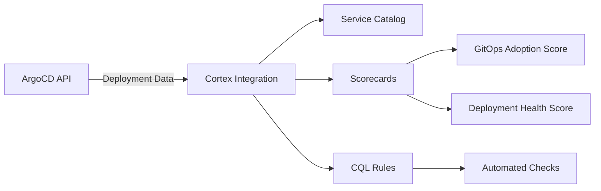

# How to Integrate ArgoCD with Cortex Developer Portal

Author: [nawazdhandala](https://github.com/nawazdhandala)

Tags: ArgoCD, GitOps, Kubernetes, Cortex, Developer Portal

Description: Learn how to integrate ArgoCD with Cortex developer portal to track deployment health, enforce standards, and build deployment scorecards.

---

Cortex is a developer portal focused on service quality and engineering standards. It provides a service catalog, scorecards for tracking standards adoption, and integrations with the tools your teams use daily. Integrating ArgoCD with Cortex lets you include deployment health and GitOps practices in your engineering standards, giving visibility into how well teams follow deployment best practices.

## Why Cortex with ArgoCD

Cortex excels at measuring and improving engineering standards. With an ArgoCD integration, you can:

- Include deployment health in service scorecards
- Track GitOps adoption across the organization
- Measure deployment frequency as a DORA metric
- Enforce ArgoCD configuration best practices
- Display deployment status in the service catalog



## Setting Up the Cortex Integration

Cortex integrates with ArgoCD through its custom integration framework. You will need to push ArgoCD data to Cortex via its API.

### Create a Custom Integration in Cortex

First, define a custom integration in Cortex for ArgoCD data:

```bash
# Create a custom integration for ArgoCD in Cortex
curl -X POST "https://api.getcortexapp.com/catalog/custom-integrations" \
  -H "Authorization: Bearer ${CORTEX_API_KEY}" \
  -H "Content-Type: application/json" \
  -d '{
  "key": "argocd",
  "title": "ArgoCD",
  "description": "ArgoCD deployment status and configuration"
}'
```

### Push ArgoCD Data to Cortex

Create a service that periodically syncs ArgoCD application data to Cortex:

```python
# argocd_cortex_sync.py
# Syncs ArgoCD application data to Cortex custom integration
import requests
import os
from datetime import datetime

ARGOCD_URL = os.environ["ARGOCD_URL"]
ARGOCD_TOKEN = os.environ["ARGOCD_TOKEN"]
CORTEX_API_KEY = os.environ["CORTEX_API_KEY"]
CORTEX_API_URL = "https://api.getcortexapp.com"

def get_argocd_applications():
    """Fetch all ArgoCD applications."""
    resp = requests.get(
        f"{ARGOCD_URL}/api/v1/applications",
        headers={"Authorization": f"Bearer {ARGOCD_TOKEN}"}
    )
    return resp.json().get("items", [])

def sync_to_cortex(app):
    """Push ArgoCD app data to Cortex custom integration."""
    app_name = app["metadata"]["name"]
    sync_status = app["status"]["sync"]["status"]
    health_status = app["status"]["health"]["status"]

    spec = app.get("spec", {})
    sync_policy = spec.get("syncPolicy", {})
    automated = sync_policy.get("automated", {})

    custom_data = {
        "key": "argocd",
        "values": {
            "sync_status": sync_status,
            "health_status": health_status,
            "repo_url": spec.get("source", {}).get("repoURL", ""),
            "revision": app["status"]["sync"].get("revision", ""),
            "target_revision": spec.get("source", {}).get("targetRevision", ""),
            "destination_namespace": spec.get("destination", {}).get("namespace", ""),
            "auto_sync_enabled": automated is not None and len(automated) > 0,
            "self_heal_enabled": automated.get("selfHeal", False),
            "auto_prune_enabled": automated.get("prune", False),
            "project": spec.get("project", "default"),
            "last_sync_time": app.get("status", {}).get("operationState", {}).get("finishedAt", ""),
            "sync_phase": app.get("status", {}).get("operationState", {}).get("phase", ""),
            "last_updated": datetime.utcnow().isoformat()
        }
    }

    # Push to Cortex
    resp = requests.put(
        f"{CORTEX_API_URL}/catalog/{app_name}/custom-data",
        headers={
            "Authorization": f"Bearer {CORTEX_API_KEY}",
            "Content-Type": "application/json"
        },
        json=custom_data
    )

    print(f"Synced {app_name}: {resp.status_code}")
    return resp.status_code == 200

def main():
    apps = get_argocd_applications()
    print(f"Found {len(apps)} ArgoCD applications")

    success = 0
    for app in apps:
        if sync_to_cortex(app):
            success += 1

    print(f"Successfully synced {success}/{len(apps)} applications")

if __name__ == "__main__":
    main()
```

Deploy this as a CronJob in Kubernetes:

```yaml
# CronJob to sync ArgoCD data to Cortex every 5 minutes
apiVersion: batch/v1
kind: CronJob
metadata:
  name: argocd-cortex-sync
  namespace: argocd
spec:
  schedule: "*/5 * * * *"
  jobTemplate:
    spec:
      template:
        spec:
          containers:
            - name: sync
              image: python:3.11-slim
              command:
                - python
                - /scripts/argocd_cortex_sync.py
              envFrom:
                - secretRef:
                    name: argocd-cortex-credentials
              volumeMounts:
                - name: scripts
                  mountPath: /scripts
          volumes:
            - name: scripts
              configMap:
                name: argocd-cortex-sync-scripts
          restartPolicy: OnFailure
```

## Defining Service Descriptors

Cortex uses YAML descriptors (cortex.yaml) to define service metadata. Add ArgoCD information to your service descriptors:

```yaml
# cortex.yaml in your service repository
openapi: 3.0.1
info:
  title: Payment Service
  description: Handles payment processing
  x-cortex-tag: payment-service
  x-cortex-type: service
  x-cortex-owners:
    - type: group
      name: payments-team
  x-cortex-custom-metadata:
    deployment-method: argocd
    argocd-project: production
    argocd-app-name: payment-service-prod
  x-cortex-git:
    github:
      repository: myorg/payment-service
  x-cortex-k8s:
    deployment:
      - identifier: payment-service
        namespace: payments
        cluster: production
```

## Building Scorecards for GitOps Standards

Create Cortex scorecards that measure ArgoCD adoption and deployment health:

```yaml
# Cortex scorecard definition
# Created via the Cortex UI or API
name: GitOps Maturity
description: Measures GitOps adoption and deployment health
tag: payment-service
levels:
  - name: Beginner
    rank: 1
    color: "#FF6B6B"
  - name: Intermediate
    rank: 2
    color: "#FFA726"
  - name: Advanced
    rank: 3
    color: "#66BB6A"
  - name: Expert
    rank: 4
    color: "#42A5F5"

rules:
  # Level 1 - Beginner: Basic ArgoCD adoption
  - title: Managed by ArgoCD
    description: Service is deployed via ArgoCD
    expression: custom("argocd", "sync_status") != null
    level: Beginner
    weight: 1

  # Level 2 - Intermediate: Proper configuration
  - title: Auto-sync enabled
    description: ArgoCD auto-sync is configured
    expression: custom("argocd", "auto_sync_enabled") == true
    level: Intermediate
    weight: 1

  - title: Application is synced
    description: No drift from Git
    expression: custom("argocd", "sync_status") == "Synced"
    level: Intermediate
    weight: 1

  # Level 3 - Advanced: Self-healing and pruning
  - title: Self-heal enabled
    description: ArgoCD automatically corrects drift
    expression: custom("argocd", "self_heal_enabled") == true
    level: Advanced
    weight: 1

  - title: Auto-prune enabled
    description: Removed resources are automatically cleaned up
    expression: custom("argocd", "auto_prune_enabled") == true
    level: Advanced
    weight: 1

  # Level 4 - Expert: Full health and project isolation
  - title: Application is healthy
    description: All resources report healthy status
    expression: custom("argocd", "health_status") == "Healthy"
    level: Expert
    weight: 1

  - title: Uses non-default project
    description: Application uses a dedicated ArgoCD project
    expression: custom("argocd", "project") != "default"
    level: Expert
    weight: 1
```

## Using CQL for Custom Rules

Cortex Query Language (CQL) lets you write custom rules for scorecards. Here are ArgoCD-specific CQL expressions:

```text
# Check if service is managed by ArgoCD
custom("argocd", "sync_status") != null

# Check if application is synced and healthy
custom("argocd", "sync_status") == "Synced" AND custom("argocd", "health_status") == "Healthy"

# Check if automated sync with self-heal is configured
custom("argocd", "auto_sync_enabled") == true AND custom("argocd", "self_heal_enabled") == true

# Check if service uses a specific ArgoCD project
custom("argocd", "project") != "default"

# Check if last sync was within 24 hours
custom("argocd", "last_sync_time") > relative_time("-24h")
```

## Sending Deployment Events to Cortex

Track deployments through Cortex's deploy events API using ArgoCD Notifications:

```yaml
# ArgoCD Notification for Cortex deploy events
apiVersion: v1
kind: ConfigMap
metadata:
  name: argocd-notifications-cm
  namespace: argocd
data:
  template.cortex-deploy: |
    webhook:
      cortex:
        method: POST
        body: |
          {
            "title": "ArgoCD Sync: {{.app.metadata.name}}",
            "sha": "{{.app.status.sync.revision}}",
            "type": "DEPLOY",
            "timestamp": "{{.app.status.operationState.finishedAt}}",
            "environment": "production"
          }

  trigger.on-sync-succeeded: |
    - when: app.status.operationState.phase in ['Succeeded']
      send: [cortex-deploy]

  service.webhook.cortex: |
    url: https://api.getcortexapp.com/catalog/{{.app.metadata.name}}/deploys
    headers:
      - name: Content-Type
        value: application/json
      - name: Authorization
        value: Bearer ${CORTEX_API_KEY}
```

## Reporting and Dashboards

Cortex provides built-in reporting for scorecards. With the ArgoCD integration, you can track:

- **GitOps adoption rate**: Percentage of services managed by ArgoCD
- **Deployment health**: Percentage of services that are synced and healthy
- **Configuration maturity**: How many services have auto-sync, self-heal, and pruning enabled
- **Drift detection**: How many services are out of sync
- **Deployment frequency**: Using Cortex's DORA metrics support

These metrics are available in Cortex's dashboard and can be exported for executive reporting.

## Summary

Integrating ArgoCD with Cortex brings deployment health into your engineering standards framework. Push ArgoCD data via the custom integration API, define scorecards that measure GitOps maturity, and use CQL rules for custom checks. The combination of ArgoCD's GitOps automation with Cortex's standards tracking creates a feedback loop that drives continuous improvement in deployment practices. For other developer portal options, see our guides on [integrating ArgoCD with Backstage](https://oneuptime.com/blog/post/2026-02-26-argocd-backstage-service-catalog/view) and [building a self-service deployment catalog](https://oneuptime.com/blog/post/2026-02-26-argocd-self-service-deployment-catalog/view).
