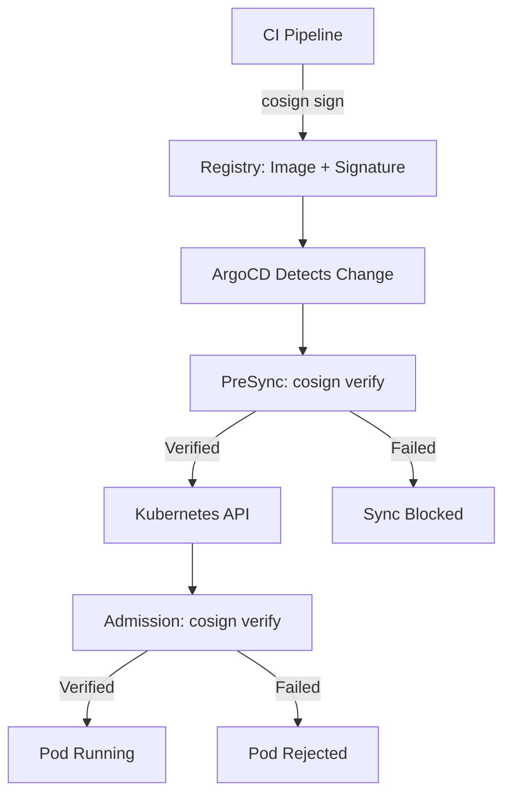

# How to Use Cosign with ArgoCD for Image Verification

Author: [nawazdhandala](https://github.com/nawazdhandala)

Tags: ArgoCD, GitOps, Kubernetes, Cosign, Supply Chain Security

Description: Learn how to set up Cosign container image verification in ArgoCD workflows, including key management, signing workflows, verification policies, and attestation checking.

---

Cosign is the industry-standard tool for signing and verifying container images. When integrated with ArgoCD, it ensures that every image deployed to your cluster has been signed by a trusted builder. This guide focuses specifically on the practical steps of using Cosign with ArgoCD, from key setup to deployment verification.

## Cosign and ArgoCD: How They Work Together

Cosign signs container images by attaching a signature to the image manifest in the registry. ArgoCD does not natively verify signatures, but you can integrate verification at two points:

1. PreSync hooks that run `cosign verify` before deployment
2. Admission controllers (Kyverno or Connaisseur) that verify signatures at the API server level



## Key Management Strategies

### File-Based Keys (Development)

For development and testing:

```bash
# Generate a key pair
cosign generate-key-pair

# The private key goes to your CI secrets
# The public key gets stored in Kubernetes
kubectl create secret generic cosign-pub \
  --from-file=cosign.pub=cosign.pub \
  -n default
```

### KMS-Based Keys (Production)

For production, use a cloud KMS:

```bash
# AWS KMS
cosign generate-key-pair \
  --kms awskms:///arn:aws:kms:us-east-1:123456789012:key/my-signing-key

# Google Cloud KMS
cosign generate-key-pair \
  --kms gcpkms://projects/myproject/locations/us/keyRings/myring/cryptoKeys/mykey

# Azure Key Vault
cosign generate-key-pair \
  --kms azurekms://mykeyvault.vault.azure.net/keys/mykey
```

Store the KMS reference in a ConfigMap managed by ArgoCD:

```yaml
# config/cosign-config.yaml
apiVersion: v1
kind: ConfigMap
metadata:
  name: cosign-config
  namespace: security
data:
  KMS_KEY_REF: "awskms:///arn:aws:kms:us-east-1:123456789012:key/my-signing-key"
  REKOR_URL: "https://rekor.sigstore.dev"
```

## Signing Images in Your CI Pipeline

Here is a complete CI pipeline that builds, tests, scans, and signs images:

```yaml
# Tekton Task for building and signing
apiVersion: tekton.dev/v1beta1
kind: Task
metadata:
  name: build-sign-image
spec:
  params:
    - name: image
      type: string
    - name: context
      type: string
      default: "."
  steps:
    - name: build
      image: gcr.io/kaniko-project/executor:latest
      args:
        - --dockerfile=Dockerfile
        - --context=$(params.context)
        - --destination=$(params.image)
        - --digest-file=/workspace/digest

    - name: sign
      image: bitnami/cosign:latest
      env:
        - name: COSIGN_KEY
          value: "awskms:///arn:aws:kms:us-east-1:123456789012:key/my-signing-key"
      script: |
        #!/bin/sh
        DIGEST=$(cat /workspace/digest)
        IMAGE="$(params.image)@${DIGEST}"

        # Sign the image
        cosign sign --key "$COSIGN_KEY" "$IMAGE"

        # Attach build metadata as attestation
        cat > /tmp/build-provenance.json <<EOF
        {
          "builder": "tekton",
          "buildTimestamp": "$(date -u +%Y-%m-%dT%H:%M:%SZ)",
          "sourceRepo": "$(params.context)",
          "commitSha": "${GIT_COMMIT}"
        }
        EOF

        cosign attest --key "$COSIGN_KEY" \
          --predicate /tmp/build-provenance.json \
          --type custom \
          "$IMAGE"

        echo "Image signed and attested: $IMAGE"
```

## ArgoCD PreSync Verification

Create a PreSync hook that verifies image signatures before ArgoCD deploys:

```yaml
# hooks/cosign-verify.yaml
apiVersion: batch/v1
kind: Job
metadata:
  name: cosign-verify-presync
  annotations:
    argocd.argoproj.io/hook: PreSync
    argocd.argoproj.io/hook-delete-policy: BeforeHookCreation
spec:
  template:
    spec:
      containers:
        - name: verify
          image: bitnami/cosign:latest
          command:
            - /bin/sh
            - -c
            - |
              set -e

              # List of images to verify
              IMAGES="
              registry.example.com/api-server:v4.1.0
              registry.example.com/web-frontend:v3.5.2
              registry.example.com/worker:v2.0.1
              "

              echo "Starting image signature verification..."
              FAILURES=""

              for IMAGE in $IMAGES; do
                echo ""
                echo "Verifying: $IMAGE"

                # Verify the signature
                if cosign verify \
                  --key /keys/cosign.pub \
                  --output text \
                  "$IMAGE" 2>/dev/null; then
                  echo "  Signature: VALID"
                else
                  echo "  Signature: INVALID or MISSING"
                  FAILURES="$FAILURES\n  - $IMAGE"
                fi

                # Verify build attestation exists
                if cosign verify-attestation \
                  --key /keys/cosign.pub \
                  --type custom \
                  "$IMAGE" 2>/dev/null; then
                  echo "  Attestation: VALID"
                else
                  echo "  Attestation: MISSING (warning)"
                fi
              done

              if [ -n "$FAILURES" ]; then
                echo ""
                echo "DEPLOYMENT BLOCKED - Failed signature verification:"
                echo -e "$FAILURES"
                exit 1
              fi

              echo ""
              echo "All images verified successfully"
          volumeMounts:
            - name: cosign-key
              mountPath: /keys
              readOnly: true
      volumes:
        - name: cosign-key
          secret:
            secretName: cosign-pub
      restartPolicy: Never
  backoffLimit: 1
```

## Verification with KMS (No Local Keys)

When using KMS, you do not need to distribute public keys:

```yaml
command:
  - /bin/sh
  - -c
  - |
    # Verify using KMS - no local key file needed
    cosign verify \
      --key awskms:///arn:aws:kms:us-east-1:123456789012:key/my-signing-key \
      "$IMAGE"
```

This requires the pod to have AWS IAM permissions to use the KMS key for verification. Set up IRSA (IAM Roles for Service Accounts):

```yaml
# rbac/cosign-verify-sa.yaml
apiVersion: v1
kind: ServiceAccount
metadata:
  name: cosign-verifier
  namespace: default
  annotations:
    eks.amazonaws.com/role-arn: arn:aws:iam::123456789012:role/cosign-verify-role
```

## Deploying Connaisseur for Continuous Verification

Connaisseur is an admission controller specifically designed for image signature verification. Deploy it through ArgoCD:

```yaml
# applications/connaisseur.yaml
apiVersion: argoproj.io/v1alpha1
kind: Application
metadata:
  name: connaisseur
  namespace: argocd
spec:
  project: security
  source:
    repoURL: https://sse-secure-systems.github.io/connaisseur/charts
    chart: connaisseur
    targetRevision: 3.3.0
    helm:
      values: |
        validators:
          - name: cosign-default
            type: cosign
            trustRoots:
              - name: default
                key: |
                  -----BEGIN PUBLIC KEY-----
                  MFkwEwYHKoZIzj0CAQYIKoZIzj0DAQcDQgAE
                  your-public-key
                  -----END PUBLIC KEY-----
        policy:
          - pattern: "registry.example.com/*"
            validator: cosign-default
            with:
              trustRoot: default
          - pattern: "*"
            validator: deny  # Block all unsigned images
        namespacedValidation:
          enabled: true
          mode: validate  # Only validate in labeled namespaces
  destination:
    server: https://kubernetes.default.svc
    namespace: connaisseur
  syncPolicy:
    automated:
      selfHeal: true
    syncOptions:
      - CreateNamespace=true
```

Label namespaces where verification should be enforced:

```yaml
apiVersion: v1
kind: Namespace
metadata:
  name: production
  labels:
    securityProfile: restricted
    connaisseur.io/webhook: validate
```

## Handling Signature Rotation

When you need to rotate signing keys, deploy a transition period where both old and new signatures are accepted:

```yaml
# Kyverno policy accepting multiple keys during rotation
apiVersion: kyverno.io/v1
kind: ClusterPolicy
metadata:
  name: verify-image-multi-key
spec:
  validationFailureAction: Enforce
  rules:
    - name: verify-with-any-key
      match:
        any:
          - resources:
              kinds:
                - Pod
      verifyImages:
        - imageReferences:
            - "registry.example.com/*"
          attestors:
            - count: 1  # At least one must match
              entries:
                - keys:
                    publicKeys: |
                      -----BEGIN PUBLIC KEY-----
                      OLD-KEY-HERE
                      -----END PUBLIC KEY-----
                - keys:
                    publicKeys: |
                      -----BEGIN PUBLIC KEY-----
                      NEW-KEY-HERE
                      -----END PUBLIC KEY-----
```

After all images have been re-signed with the new key, remove the old key from the policy.

## Monitoring Verification Events

Track signature verification outcomes for security auditing and integrate with [OneUptime](https://oneuptime.com) for real-time alerting on verification failures.

## Summary

Using Cosign with ArgoCD creates a strong supply chain security posture. Sign images in CI using KMS-backed keys or keyless Sigstore signing. Verify signatures through ArgoCD PreSync hooks for a fast feedback loop, and use admission controllers like Connaisseur or Kyverno for cluster-wide enforcement. The combination ensures that only cryptographically verified images can be deployed, and all verification policies are managed as code through your GitOps pipeline.
