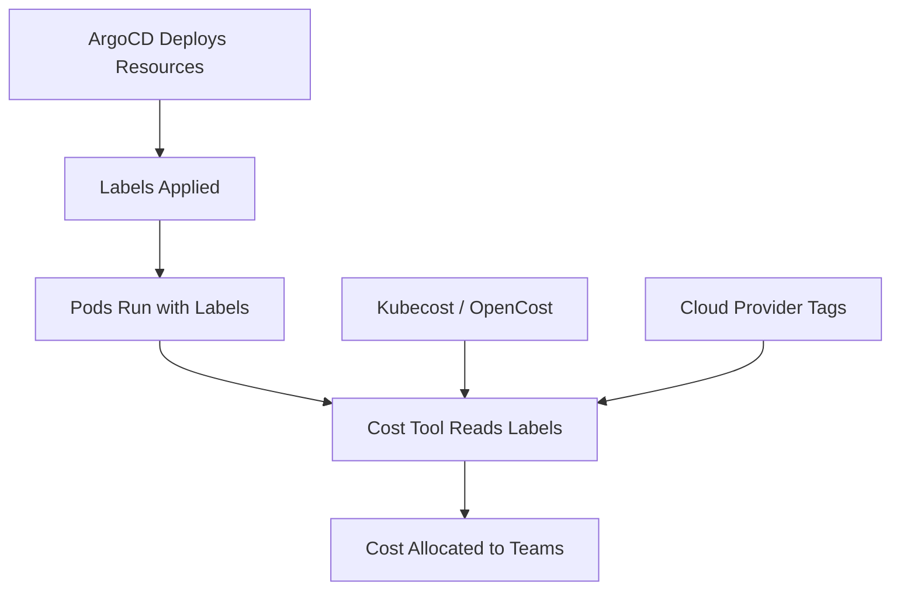

# How to Implement Cost Allocation with ArgoCD Labels

Author: [nawazdhandala](https://github.com/nawazdhandala)

Tags: ArgoCD, GitOps, Kubernetes, Cost Management, FinOps

Description: Learn how to implement cost allocation and chargeback in Kubernetes using ArgoCD-managed labels to track resource ownership and spending across teams and projects.

---

Kubernetes makes it easy to consume cloud resources. Too easy. Without cost visibility, teams spin up resources without knowing what they cost. The monthly cloud bill arrives, nobody knows which team caused the spike, and finance starts asking uncomfortable questions.

Cost allocation through labels solves this. By consistently labeling every resource with team, project, and environment information - and enforcing those labels through ArgoCD - you create a clear mapping from cloud spending to the teams responsible. This guide shows how to implement this with ArgoCD as the enforcement mechanism.

## The Cost Allocation Strategy

Cost allocation in Kubernetes relies on labels attached to pods, since pods are what consume compute resources. But labels need to be on every resource for complete tracking. ArgoCD ensures these labels are consistently applied and prevents anyone from removing them.



## Defining a Label Standard

Before implementing anything, define your labeling standard. Every organization is different, but these labels cover most needs:

```yaml
# Standard cost allocation labels
metadata:
  labels:
    # Who owns this resource
    app.kubernetes.io/managed-by: argocd
    team: alpha
    department: engineering
    cost-center: eng-alpha-001

    # What is this resource
    app.kubernetes.io/name: payment-service
    app.kubernetes.io/component: api
    app.kubernetes.io/part-of: payment-platform

    # Where does it run
    environment: production
    region: us-east-1

    # Business context
    project: checkout-redesign
    business-unit: commerce
```

Document this standard and make it available to all teams. The labels that matter most for cost allocation are `team`, `cost-center`, and `environment`.

## Enforcing Labels with Kustomize

The most reliable way to enforce labels is through Kustomize common labels. When ArgoCD renders manifests through Kustomize, common labels are automatically applied to every resource.

```yaml
# kustomization.yaml for team-alpha production
apiVersion: kustomize.config.k8s.io/v1beta1
kind: Kustomization

commonLabels:
  team: alpha
  cost-center: eng-alpha-001
  environment: production
  managed-by: argocd

resources:
  - deployment.yaml
  - service.yaml
  - ingress.yaml
```

These labels propagate to all resources, including the pod template spec inside deployments. Since Kustomize injects them at render time, developers cannot forget or remove them.

## Enforcing Labels with Helm

For Helm-based deployments, use ArgoCD's parameter overrides to inject cost allocation labels.

```yaml
apiVersion: argoproj.io/v1alpha1
kind: Application
metadata:
  name: payment-service-prod
  namespace: argocd
  labels:
    team: alpha
    cost-center: eng-alpha-001
spec:
  project: team-alpha
  source:
    repoURL: https://github.com/myorg/payment-service.git
    path: charts/payment-service
    targetRevision: main
    helm:
      values: |
        # Cost allocation labels injected by platform
        global:
          labels:
            team: alpha
            cost-center: eng-alpha-001
            environment: production
            project: checkout-redesign
        # Pod-level labels for accurate cost tracking
        podLabels:
          team: alpha
          cost-center: eng-alpha-001
          environment: production
  destination:
    server: https://kubernetes.default.svc
    namespace: team-alpha-prod
```

Your Helm chart templates should reference these labels:

```yaml
# In your Helm chart's deployment.yaml
apiVersion: apps/v1
kind: Deployment
metadata:
  labels:
    {{- include "common.labels" . | nindent 4 }}
    {{- with .Values.global.labels }}
    {{- toYaml . | nindent 4 }}
    {{- end }}
spec:
  template:
    metadata:
      labels:
        {{- include "common.selectorLabels" . | nindent 8 }}
        {{- with .Values.podLabels }}
        {{- toYaml . | nindent 8 }}
        {{- end }}
```

## Using ApplicationSets for Consistent Labels

When managing many applications across teams, ApplicationSets ensure cost allocation labels are consistently applied.

```yaml
apiVersion: argoproj.io/v1alpha1
kind: ApplicationSet
metadata:
  name: team-apps
  namespace: argocd
spec:
  generators:
    - git:
        repoURL: https://github.com/myorg/app-registry.git
        revision: main
        files:
          - path: "apps/*/config.yaml"
  template:
    metadata:
      name: "{{app.name}}-{{app.environment}}"
      labels:
        team: "{{app.team}}"
        cost-center: "{{app.costCenter}}"
        environment: "{{app.environment}}"
        department: "{{app.department}}"
    spec:
      project: "{{app.team}}"
      source:
        repoURL: "{{app.repoURL}}"
        path: "{{app.path}}"
        targetRevision: "{{app.targetRevision}}"
        kustomize:
          commonLabels:
            team: "{{app.team}}"
            cost-center: "{{app.costCenter}}"
            environment: "{{app.environment}}"
      destination:
        server: https://kubernetes.default.svc
        namespace: "{{app.team}}-{{app.environment}}"
```

Each app config file includes cost allocation data:

```yaml
# apps/payment-service/config.yaml
app:
  name: payment-service
  team: alpha
  costCenter: eng-alpha-001
  department: engineering
  environment: prod
  repoURL: https://github.com/myorg/payment-service.git
  path: k8s/overlays/prod
  targetRevision: main
```

## Policy Enforcement with Kyverno

Labels applied through ArgoCD can be removed by manual kubectl commands. Use Kyverno to enforce that cost allocation labels always exist.

```yaml
apiVersion: kyverno.io/v1
kind: ClusterPolicy
metadata:
  name: require-cost-labels
spec:
  validationFailureAction: Enforce
  rules:
    - name: require-team-label
      match:
        resources:
          kinds:
            - Deployment
            - StatefulSet
            - DaemonSet
            - Job
            - CronJob
      validate:
        message: "Resources must have team, cost-center, and environment labels"
        pattern:
          metadata:
            labels:
              team: "?*"
              cost-center: "?*"
              environment: "?*"
    - name: require-pod-labels
      match:
        resources:
          kinds:
            - Deployment
            - StatefulSet
            - DaemonSet
      validate:
        message: "Pod templates must include cost allocation labels"
        pattern:
          spec:
            template:
              metadata:
                labels:
                  team: "?*"
                  cost-center: "?*"
```

## Integrating with Cost Tools

### Kubecost

Kubecost reads pod labels to allocate costs. Configure it to use your custom labels:

```yaml
# kubecost values.yaml
kubecostModel:
  allocation:
    labels:
      - team
      - cost-center
      - environment
      - department
      - project
```

### OpenCost

OpenCost provides the same functionality as an open-source alternative:

```yaml
# opencost configuration
LABEL_MAPPING:
  team: team
  department: department
  environment: environment
  product: project
```

### Cloud Provider Tag Mapping

For complete cost attribution, map Kubernetes labels to cloud provider tags. On AWS with EKS, enable tag propagation:

```yaml
# AWS EKS node group tags
Tags:
  kubernetes.io/cluster/my-cluster: owned
  # These propagate to EC2 instances
  team: platform
  cost-center: platform-001
```

For per-pod cost allocation on AWS, use split-cost allocation with pod-level resource tracking.

## Namespace-Level Cost Tracking

Not all costs come from labeled pods. Namespace-level resources like PVCs and Services also consume cloud resources. Apply labels at the namespace level too.

```yaml
apiVersion: v1
kind: Namespace
metadata:
  name: team-alpha-prod
  labels:
    team: alpha
    cost-center: eng-alpha-001
    environment: production
    department: engineering
```

Configure your cost tool to use namespace labels as a fallback when pod labels are missing.

## Building Cost Dashboards

Use ArgoCD application labels combined with cost data to build dashboards:

```bash
# Query ArgoCD for applications by team
argocd app list -l team=alpha -o json | \
  jq '[.[] | {name: .metadata.name, namespace: .spec.destination.namespace}]'
```

Build Grafana dashboards that combine:
- ArgoCD application count per team
- Kubecost allocation per cost-center label
- Resource quota usage per namespace
- Cloud spending per environment

## Reporting and Chargeback

Generate monthly cost reports per team:

```bash
# Example: Query Kubecost API for team costs
curl -s "http://kubecost.monitoring:9090/model/allocation?window=lastmonth&aggregate=label:team" | \
  jq '.data[] | to_entries[] | {team: .key, cost: .value.totalCost}'
```

This produces output like:

```json
{"team": "alpha", "cost": 4523.67}
{"team": "beta", "cost": 2891.34}
{"team": "platform", "cost": 8234.12}
```

Share these reports with engineering managers so they understand the cost impact of their resource consumption.

## Self-Healing Against Label Removal

ArgoCD's self-heal feature ensures labels stay applied. If someone uses kubectl to remove a cost-center label, ArgoCD detects the drift and reapplies the correct labels from the Git-defined state.

```yaml
syncPolicy:
  automated:
    selfHeal: true  # Reapplies labels if removed
```

This is a key advantage of managing cost allocation through ArgoCD rather than through admission webhooks alone. Webhooks prevent creation without labels, but they cannot restore labels that are removed from existing resources.

Cost allocation with ArgoCD labels turns your cloud bill from a black box into a transparent, team-attributable expense report. The platform team defines the standard, ArgoCD enforces it on every deployment, and cost tools provide the visibility that finance and engineering leadership need to make informed decisions.
