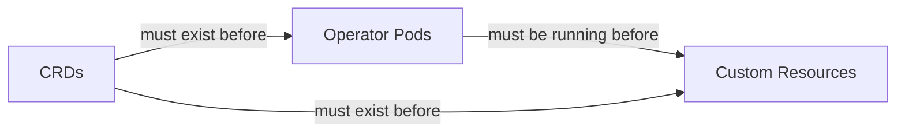

# How to Handle CRDs That Must Be Installed Before Operators

Author: [nawazdhandala](https://github.com/nawazdhandala)

Tags: ArgoCD, GitOps, Kubernetes, CRDs, Operators

Description: Learn how to manage the chicken-and-egg problem of deploying CRDs before operators and custom resources in ArgoCD using sync waves, phases, and app-of-apps patterns.

---

Almost every Kubernetes operator requires its Custom Resource Definitions (CRDs) to be installed before the operator itself starts, and definitely before any custom resources are created. This creates a classic ordering problem in ArgoCD: how do you ensure CRDs are installed first when ArgoCD wants to deploy everything at once?

Get this wrong and you will see errors like "the server could not find the requested resource" or "no matches for kind X in group Y." Let me walk through the reliable patterns for handling CRD ordering.

## The Ordering Problem

When you deploy an operator like cert-manager, three things need to happen in order:

1. **CRDs are installed**: Certificate, ClusterIssuer, etc.
2. **Operator is running**: The cert-manager controller, webhook, and cainjector
3. **Custom resources are created**: Your Certificate and ClusterIssuer resources

If step 3 happens before step 1, Kubernetes does not know what a "Certificate" is and rejects the resource. If step 3 happens before step 2, the resources might be created but nothing processes them (though this is usually less catastrophic).



## Pattern 1: Sync Waves Within a Single Application

Sync waves are the simplest approach when CRDs, the operator, and custom resources are all in the same Application.

```yaml
# crds/certificate-crd.yaml
apiVersion: apiextensions.k8s.io/v1
kind: CustomResourceDefinition
metadata:
  name: certificates.cert-manager.io
  annotations:
    argocd.argoproj.io/sync-wave: "-5"
spec:
  # ... CRD spec
---
# operator/deployment.yaml
apiVersion: apps/v1
kind: Deployment
metadata:
  name: cert-manager
  annotations:
    argocd.argoproj.io/sync-wave: "0"
spec:
  # ... deployment spec
---
# resources/cluster-issuer.yaml
apiVersion: cert-manager.io/v1
kind: ClusterIssuer
metadata:
  name: letsencrypt-prod
  annotations:
    argocd.argoproj.io/sync-wave: "5"
spec:
  # ... issuer spec
```

ArgoCD processes sync waves in order: wave -5 first, then wave 0, then wave 5. Resources in the same wave are applied together.

**Important**: For sync waves to work, you need either auto-sync enabled or you need to initiate a manual sync. ArgoCD does not automatically retry failed waves - if the CRD wave succeeds but the operator wave fails, it stops there.

### Adding Health Checks Between Waves

Sync waves wait for resources in the current wave to be "healthy" before moving to the next wave. For a Deployment, "healthy" means the rollout is complete. For a CRD, ArgoCD considers it healthy as soon as it is created.

To ensure the operator is actually running before custom resources are created, the Deployment health check handles this naturally. ArgoCD waits until the operator pods are ready before proceeding to the next wave.

## Pattern 2: Separate Applications with App of Apps

When the CRDs, operator, and custom resources come from different sources (like a Helm chart for the operator and your own manifests for the custom resources), separate Applications with ordering give better control.

```yaml
# App of apps that deploys in order
# argocd-apps/cert-manager-crds.yaml
apiVersion: argoproj.io/v1alpha1
kind: Application
metadata:
  name: cert-manager-crds
  namespace: argocd
  annotations:
    argocd.argoproj.io/sync-wave: "-10"
  finalizers:
    - resources-finalizer.argocd.argoproj.io
spec:
  project: infrastructure
  source:
    repoURL: https://github.com/cert-manager/cert-manager.git
    targetRevision: v1.14.0
    path: deploy/crds
  destination:
    server: https://kubernetes.default.svc
  syncPolicy:
    automated:
      selfHeal: true
    syncOptions:
      - CreateNamespace=true
      - ServerSideApply=true  # Important for large CRDs
---
# argocd-apps/cert-manager.yaml
apiVersion: argoproj.io/v1alpha1
kind: Application
metadata:
  name: cert-manager
  namespace: argocd
  annotations:
    argocd.argoproj.io/sync-wave: "0"
spec:
  project: infrastructure
  source:
    repoURL: https://charts.jetstack.io
    chart: cert-manager
    targetRevision: v1.14.0
    helm:
      values: |
        installCRDs: false  # CRDs managed separately above
  destination:
    server: https://kubernetes.default.svc
    namespace: cert-manager
  syncPolicy:
    automated:
      selfHeal: true
---
# argocd-apps/cert-manager-resources.yaml
apiVersion: argoproj.io/v1alpha1
kind: Application
metadata:
  name: cert-manager-resources
  namespace: argocd
  annotations:
    argocd.argoproj.io/sync-wave: "10"
spec:
  project: infrastructure
  source:
    repoURL: https://github.com/my-org/config.git
    targetRevision: main
    path: cert-manager/resources
  destination:
    server: https://kubernetes.default.svc
  syncPolicy:
    automated:
      selfHeal: true
```

**Note on `installCRDs: false`**: Many Helm charts include CRDs, but managing CRDs through Helm has a known issue - Helm does not update CRDs on `helm upgrade`. By managing CRDs in a separate Application with `ServerSideApply`, you get proper CRD lifecycle management.

## Pattern 3: Using ServerSideApply for CRDs

CRDs can be large (cert-manager CRDs are over 1MB). ArgoCD may fail to apply them with the default client-side apply because of the `kubectl.kubernetes.io/last-applied-configuration` annotation size limit.

```yaml
apiVersion: argoproj.io/v1alpha1
kind: Application
metadata:
  name: operator-crds
  namespace: argocd
spec:
  source:
    repoURL: https://github.com/my-org/crds.git
    targetRevision: main
    path: crds/
  syncPolicy:
    syncOptions:
      # Use server-side apply for CRDs to avoid size limits
      - ServerSideApply=true
```

## Pattern 4: PreSync Hooks for CRD Installation

Use a PreSync hook to install CRDs before the main sync runs.

```yaml
apiVersion: batch/v1
kind: Job
metadata:
  name: install-crds
  annotations:
    argocd.argoproj.io/hook: PreSync
    argocd.argoproj.io/hook-delete-policy: HookSucceeded
spec:
  template:
    spec:
      restartPolicy: Never
      serviceAccountName: crd-installer
      containers:
        - name: install-crds
          image: bitnami/kubectl:latest
          command:
            - /bin/sh
            - -c
            - |
              # Install CRDs from a URL
              kubectl apply --server-side -f \
                https://github.com/cert-manager/cert-manager/releases/download/v1.14.0/cert-manager.crds.yaml
              # Wait for CRDs to be established
              kubectl wait --for=condition=Established \
                crd/certificates.cert-manager.io \
                crd/clusterissuers.cert-manager.io \
                --timeout=60s
```

This is useful when you do not want to manage CRDs as separate manifests. The Job downloads and applies them before the main sync.

## Pattern 5: Replace Missing Resource Errors

Sometimes the issue is that ArgoCD encounters the CRD and the custom resource in the same sync, and the CRD has not been registered by the time ArgoCD tries to apply the custom resource. The `SkipDryRunOnMissingResource=true` sync option helps.

```yaml
spec:
  syncPolicy:
    syncOptions:
      # Skip dry-run for resources whose CRD does not exist yet
      - SkipDryRunOnMissingResource=true
```

ArgoCD normally does a dry-run before applying resources. If the CRD does not exist yet, the dry-run fails. This option skips the dry-run for unknown resource types, relying on sync waves to ensure CRDs are applied first.

## Managing CRD Updates

CRD updates need special care because they can affect running workloads.

**Non-breaking changes** (adding new fields, adding new versions): Usually safe to apply directly.

**Breaking changes** (removing fields, changing validation): Require a migration plan.

```yaml
# CRD Application with careful sync policy
apiVersion: argoproj.io/v1alpha1
kind: Application
metadata:
  name: my-operator-crds
spec:
  source:
    repoURL: https://github.com/my-org/operator.git
    path: config/crd/bases
    targetRevision: v2.0.0
  syncPolicy:
    # Manual sync for CRD updates - review before applying
    automated: null
    syncOptions:
      - ServerSideApply=true
      - Replace=false  # Never use Replace for CRDs
```

I recommend manual sync for CRD updates in production. Review the CRD changes and their impact on existing custom resources before applying.

## Complete Example: Deploying Prometheus Operator

Here is a complete, real-world example of deploying the Prometheus Operator with proper CRD ordering.

```yaml
# Wave -5: CRDs
apiVersion: argoproj.io/v1alpha1
kind: Application
metadata:
  name: prometheus-crds
  namespace: argocd
  annotations:
    argocd.argoproj.io/sync-wave: "-5"
spec:
  source:
    repoURL: https://github.com/prometheus-community/helm-charts.git
    path: charts/kube-prometheus-stack/charts/crds/crds
    targetRevision: kube-prometheus-stack-57.0.0
  destination:
    server: https://kubernetes.default.svc
  syncPolicy:
    automated:
      selfHeal: true
    syncOptions:
      - ServerSideApply=true
      - CreateNamespace=true
---
# Wave 0: Operator
apiVersion: argoproj.io/v1alpha1
kind: Application
metadata:
  name: kube-prometheus-stack
  namespace: argocd
  annotations:
    argocd.argoproj.io/sync-wave: "0"
spec:
  source:
    repoURL: https://prometheus-community.github.io/helm-charts
    chart: kube-prometheus-stack
    targetRevision: 57.0.0
    helm:
      skipCrds: true  # CRDs managed above
      values: |
        prometheus:
          prometheusSpec:
            retention: 30d
  destination:
    server: https://kubernetes.default.svc
    namespace: monitoring
  syncPolicy:
    automated:
      selfHeal: true
---
# Wave 5: Custom monitoring resources
apiVersion: argoproj.io/v1alpha1
kind: Application
metadata:
  name: monitoring-config
  namespace: argocd
  annotations:
    argocd.argoproj.io/sync-wave: "5"
spec:
  source:
    repoURL: https://github.com/my-org/config.git
    path: monitoring/resources
    targetRevision: main
  destination:
    server: https://kubernetes.default.svc
    namespace: monitoring
  syncPolicy:
    automated:
      selfHeal: true
```

## Monitoring CRD Health

CRD issues can be subtle - a CRD might exist but have an incorrect schema that causes validation failures for new custom resources. Monitor your ArgoCD application health to catch these issues.

[OneUptime](https://oneuptime.com) can monitor ArgoCD sync status and alert you when applications fail to sync due to CRD-related errors, helping you catch problems before they affect production workloads.

The key takeaway is that CRD ordering is a solved problem in ArgoCD. Use sync waves for simple cases, separate Applications for complex cases, and always use `ServerSideApply` for large CRDs. Get the ordering right once and it works reliably from then on.
