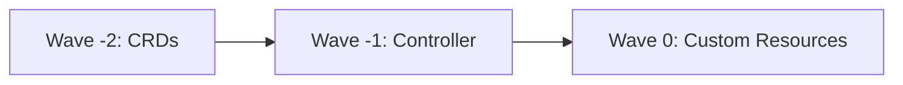

# How to Handle CRDs with GitOps in ArgoCD

Author: [nawazdhandala](https://github.com/nawazdhandala)

Tags: ArgoCD, GitOps, Kubernetes, CRDs, Custom Resources

Description: Learn how to manage Custom Resource Definitions and their instances in ArgoCD GitOps workflows, including ordering, sync waves, and common pitfalls to avoid.

---

Custom Resource Definitions (CRDs) extend the Kubernetes API with new resource types. They are the foundation of the operator pattern and are used by nearly every major Kubernetes tool - from cert-manager to Istio to Prometheus. Managing CRDs with ArgoCD requires understanding a key ordering problem: the CRD must exist before you can create instances of it.

This guide covers the practical patterns for handling CRDs in your GitOps workflow with ArgoCD.

## The Ordering Problem

Consider deploying cert-manager with ArgoCD. You need to:

1. Install the cert-manager CRDs (Certificate, Issuer, ClusterIssuer, etc.)
2. Deploy the cert-manager controller
3. Create Certificate and Issuer custom resources

If ArgoCD tries to apply a Certificate resource before the CRD exists, the API server rejects it with an error like:

```
error: unable to recognize "certificate.yaml": no matches for kind "Certificate" in version "cert-manager.io/v1"
```

## Pattern 1: Sync Waves

Sync waves let you control the order in which ArgoCD applies resources. Lower wave numbers are applied first:

```yaml
# CRD - applied first (wave -2)
apiVersion: apiextensions.k8s.io/v1
kind: CustomResourceDefinition
metadata:
  name: certificates.cert-manager.io
  annotations:
    argocd.argoproj.io/sync-wave: "-2"
spec:
  group: cert-manager.io
  names:
    kind: Certificate
    listKind: CertificateList
    plural: certificates
    singular: certificate
  scope: Namespaced
  versions:
    - name: v1
      served: true
      storage: true
      # ... schema definition

---
# Controller deployment - applied second (wave -1)
apiVersion: apps/v1
kind: Deployment
metadata:
  name: cert-manager
  annotations:
    argocd.argoproj.io/sync-wave: "-1"
spec:
  # ... cert-manager deployment

---
# Custom resource - applied last (wave 0, default)
apiVersion: cert-manager.io/v1
kind: Certificate
metadata:
  name: my-app-cert
  annotations:
    argocd.argoproj.io/sync-wave: "0"
spec:
  secretName: my-app-tls
  issuerRef:
    name: letsencrypt-prod
    kind: ClusterIssuer
  dnsNames:
    - myapp.example.com
```

The sync order with waves:



## Pattern 2: Separate Applications

A more robust approach is to split CRDs and their consumers into separate ArgoCD Applications:

```yaml
# Application for CRDs and operator
apiVersion: argoproj.io/v1alpha1
kind: Application
metadata:
  name: cert-manager
  namespace: argocd
  annotations:
    argocd.argoproj.io/sync-wave: "-1"
spec:
  project: default
  source:
    repoURL: https://charts.jetstack.io
    chart: cert-manager
    targetRevision: v1.14.4
    helm:
      parameters:
        - name: installCRDs
          value: "true"
  destination:
    server: https://kubernetes.default.svc
    namespace: cert-manager
  syncPolicy:
    automated:
      prune: true
      selfHeal: true
    syncOptions:
      - CreateNamespace=true

---
# Application for custom resources (depends on cert-manager)
apiVersion: argoproj.io/v1alpha1
kind: Application
metadata:
  name: cluster-certificates
  namespace: argocd
  annotations:
    argocd.argoproj.io/sync-wave: "0"
spec:
  project: default
  source:
    repoURL: https://github.com/myorg/config-repo.git
    targetRevision: main
    path: infrastructure/certificates
  destination:
    server: https://kubernetes.default.svc
    namespace: cert-manager
  syncPolicy:
    automated:
      prune: true
      selfHeal: true
```

When both Applications are managed by an app-of-apps parent, the sync waves ensure cert-manager is installed before any Certificate resources are created.

## Pattern 3: ServerSideApply for CRDs

Large CRDs (like those from Istio or AWS Controllers for Kubernetes) can exceed the annotation size limit when using client-side apply. Use ServerSideApply to avoid this:

```yaml
apiVersion: argoproj.io/v1alpha1
kind: Application
metadata:
  name: istio-crds
  namespace: argocd
spec:
  project: default
  source:
    repoURL: https://github.com/myorg/config-repo.git
    targetRevision: main
    path: infrastructure/istio-crds
  destination:
    server: https://kubernetes.default.svc
    namespace: istio-system
  syncPolicy:
    syncOptions:
      - ServerSideApply=true    # Required for large CRDs
      - CreateNamespace=true
```

Without ServerSideApply, you may see errors like:

```
metadata.annotations: Too long: must have at most 262144 bytes
```

## Pattern 4: Skip Schema Validation

When a CRD is not yet installed, ArgoCD's schema validation fails because the API server does not recognize the resource type. Use the `SkipDryRunOnMissingResource` sync option:

```yaml
apiVersion: argoproj.io/v1alpha1
kind: Application
metadata:
  name: my-app
spec:
  syncPolicy:
    syncOptions:
      - SkipDryRunOnMissingResource=true
```

Or set it per resource with an annotation:

```yaml
apiVersion: cert-manager.io/v1
kind: Certificate
metadata:
  name: my-cert
  annotations:
    argocd.argoproj.io/sync-options: SkipDryRunOnMissingResource=true
```

## Handling CRD Updates

CRD updates require special care because they change the API schema that all custom resources depend on.

### Non-Breaking Changes

Adding new optional fields or new versions to a CRD is generally safe. ArgoCD applies the updated CRD, and existing custom resources continue to work.

### Breaking Changes

Breaking changes - removing fields, changing required fields, removing API versions - require a phased approach:

1. **Phase 1:** Update the CRD to support both old and new versions
2. **Phase 2:** Update all custom resources to use the new format
3. **Phase 3:** Remove the old version from the CRD

Use sync waves to ensure the correct ordering:

```yaml
# Phase 1: Updated CRD with both versions
apiVersion: apiextensions.k8s.io/v1
kind: CustomResourceDefinition
metadata:
  name: myresources.example.com
  annotations:
    argocd.argoproj.io/sync-wave: "-1"
spec:
  group: example.com
  versions:
    - name: v1
      served: true
      storage: false    # Old version still served but not stored
    - name: v2
      served: true
      storage: true     # New version is the storage version
```

## Ignoring CRD Diff Noise

CRDs often have fields that are modified by the API server after creation (like status fields and conversion webhook configurations). Configure ArgoCD to ignore these:

```yaml
apiVersion: argoproj.io/v1alpha1
kind: Application
metadata:
  name: my-crds
spec:
  ignoreDifferences:
    - group: apiextensions.k8s.io
      kind: CustomResourceDefinition
      jsonPointers:
        - /status
        - /spec/conversion/webhook/clientConfig/caBundle
```

Or configure this globally in the argocd-cm ConfigMap:

```yaml
apiVersion: v1
kind: ConfigMap
metadata:
  name: argocd-cm
  namespace: argocd
data:
  resource.customizations.ignoreDifferences.apiextensions.k8s.io_CustomResourceDefinition: |
    jsonPointers:
      - /status
      - /spec/conversion/webhook/clientConfig/caBundle
```

## CRDs from Helm Charts

Many Helm charts include CRDs. ArgoCD handles these differently depending on how the chart packages them:

### CRDs in the crds/ Directory

Helm's `crds/` directory installs CRDs on first install but never updates them. This is by Helm design, not an ArgoCD limitation. To work around this with ArgoCD:

```yaml
apiVersion: argoproj.io/v1alpha1
kind: Application
metadata:
  name: my-operator
spec:
  source:
    repoURL: https://charts.example.com
    chart: my-operator
    targetRevision: 1.5.0
    helm:
      skipCrds: true    # Skip Helm's CRD handling
  syncPolicy:
    syncOptions:
      - ServerSideApply=true
```

Then manage CRDs separately or use the `--include-crds` flag in your Kustomize setup.

### CRDs as Templates

Some charts include CRDs as regular templates (not in the `crds/` directory). These are managed like any other Helm template and ArgoCD handles updates normally.

## Health Checks for Custom Resources

After installing CRDs and creating custom resources, configure custom health checks so ArgoCD can report their status:

```yaml
apiVersion: v1
kind: ConfigMap
metadata:
  name: argocd-cm
  namespace: argocd
data:
  resource.customizations.health.cert-manager.io_Certificate: |
    hs = {}
    if obj.status ~= nil then
      if obj.status.conditions ~= nil then
        for i, condition in ipairs(obj.status.conditions) do
          if condition.type == "Ready" and condition.status == "True" then
            hs.status = "Healthy"
            hs.message = condition.message
            return hs
          end
          if condition.type == "Ready" and condition.status == "False" then
            hs.status = "Degraded"
            hs.message = condition.message
            return hs
          end
        end
      end
    end
    hs.status = "Progressing"
    hs.message = "Waiting for certificate"
    return hs
```

## Common Pitfalls

**Circular dependencies.** An operator's CRD is installed by the operator itself, but the operator needs CRDs to start. Break this by installing CRDs separately before the operator.

**CRD deletion cascading.** Deleting a CRD deletes all instances of that custom resource. Never let ArgoCD auto-prune CRDs without understanding the consequences.

**Version skew.** The CRD version and the operator version must be compatible. Pin both to known-good versions in your Git manifests.

## Summary

Managing CRDs with ArgoCD is straightforward once you understand the ordering requirements. Use sync waves or separate Applications to ensure CRDs are installed before their instances. Use ServerSideApply for large CRDs, configure ignore-diff rules for noisy fields, and never auto-prune CRDs without careful consideration. These patterns let you manage the full lifecycle of Kubernetes operators and their custom resources through GitOps.
