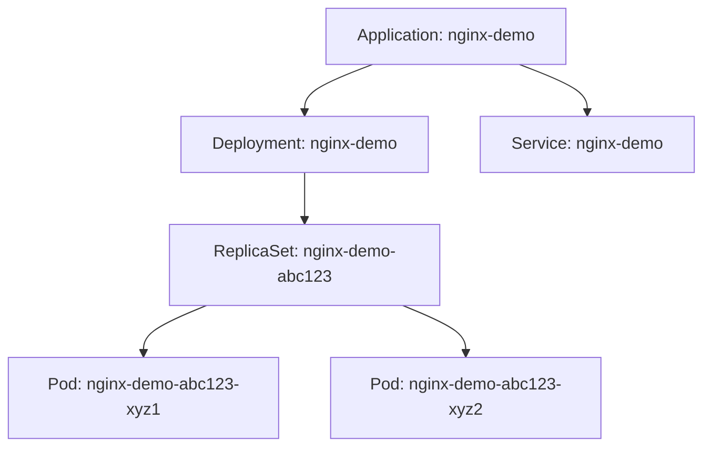

# How to Create Your First ArgoCD Application

Author: [nawazdhandala](https://github.com/nawazdhandala)

Tags: ArgoCD, GitOps, Kubernetes, Deployments, Beginner

Description: A beginner-friendly guide to creating your first ArgoCD application, from connecting a Git repository to deploying and syncing a Kubernetes workload.

---

Creating your first ArgoCD application is the moment where GitOps goes from concept to reality. An ArgoCD Application is a custom resource that tells ArgoCD to watch a Git repository and deploy its contents to a Kubernetes cluster. This guide takes you through the entire process step by step, assuming you have ArgoCD installed but have not deployed anything with it yet.

## What Is an ArgoCD Application

An ArgoCD Application defines:

- **Where to get the manifests** (a Git repository URL and path)
- **Where to deploy them** (a Kubernetes cluster and namespace)
- **How to sync them** (manual or automatic, with options for pruning and self-healing)

When you create an application, ArgoCD:

1. Clones the Git repository
2. Reads the Kubernetes manifests from the specified path
3. Compares them against what is currently in the cluster
4. Shows you the difference (if any)
5. Syncs the manifests to the cluster (when you trigger it)

## Prerequisites

Before creating your first application, make sure:

- ArgoCD is installed and accessible (via port-forward or ingress)
- You have the ArgoCD CLI installed
- You are logged in to ArgoCD
- You have a Git repository with Kubernetes manifests

```bash
# Verify ArgoCD is running
kubectl get pods -n argocd

# Access ArgoCD (if using port-forward)
kubectl port-forward svc/argocd-server -n argocd 8080:443 &

# Login
argocd login localhost:8080 --insecure
```

## Step 1: Prepare a Git Repository

You need a Git repository with Kubernetes manifests. For this tutorial, let us use a simple example. Create a repository with a deployment and service:

```yaml
# manifests/deployment.yaml
apiVersion: apps/v1
kind: Deployment
metadata:
  name: nginx-demo
  labels:
    app: nginx-demo
spec:
  replicas: 2
  selector:
    matchLabels:
      app: nginx-demo
  template:
    metadata:
      labels:
        app: nginx-demo
    spec:
      containers:
        - name: nginx
          image: nginx:1.25
          ports:
            - containerPort: 80
          resources:
            requests:
              cpu: 50m
              memory: 64Mi
            limits:
              cpu: 100m
              memory: 128Mi
---
# manifests/service.yaml
apiVersion: v1
kind: Service
metadata:
  name: nginx-demo
spec:
  selector:
    app: nginx-demo
  ports:
    - port: 80
      targetPort: 80
  type: ClusterIP
```

Push these files to a Git repository (GitHub, GitLab, Bitbucket, or any Git server).

## Step 2: Create the Application with the CLI

The fastest way to create your first application:

```bash
argocd app create nginx-demo \
  --repo https://github.com/youruser/your-repo.git \
  --path manifests \
  --dest-server https://kubernetes.default.svc \
  --dest-namespace default
```

Breaking down each flag:

- `--repo`: URL of your Git repository
- `--path`: Directory in the repo containing your manifests
- `--dest-server`: Target Kubernetes cluster (the local cluster is `https://kubernetes.default.svc`)
- `--dest-namespace`: Namespace to deploy into

## Step 3: Check the Application Status

```bash
# View the application
argocd app get nginx-demo

# You should see:
# Name:               nginx-demo
# Server:             https://kubernetes.default.svc
# Namespace:          default
# URL:                https://argocd.example.com/applications/nginx-demo
# Repo:               https://github.com/youruser/your-repo.git
# Path:               manifests
# SyncWindow:         Sync Allowed
# Sync Policy:        <none> (Manual)
# Sync Status:        OutOfSync
# Health Status:      Missing
```

The status shows **OutOfSync** because ArgoCD has detected the manifests in Git but has not deployed them yet. The health is **Missing** because the resources do not exist in the cluster.

## Step 4: Sync the Application

Sync deploys the manifests from Git to the cluster:

```bash
# Sync the application
argocd app sync nginx-demo

# Watch the sync progress
argocd app get nginx-demo --refresh
```

You can also sync from the UI. Open the ArgoCD web interface, find your application, and click the **Sync** button.

After syncing, the status should change to:

```text
Sync Status:  Synced
Health Status: Healthy
```

## Step 5: Verify the Deployment

Check that the resources were created in the cluster:

```bash
# Check the deployment
kubectl get deployment nginx-demo -n default

# Check the pods
kubectl get pods -n default -l app=nginx-demo

# Check the service
kubectl get service nginx-demo -n default
```

## Understanding the Application Resource Tree

The ArgoCD UI shows a visual tree of all resources managed by your application. For our nginx-demo application, the tree looks like:



The tree shows:

- **Green**: Resource is synced and healthy
- **Yellow**: Resource is syncing or progressing
- **Red**: Resource is unhealthy or degraded
- **Gray**: Resource is missing or unknown

## Making Changes Through Git

Now try the GitOps workflow. Update the replica count in your Git repository:

```yaml
# Change replicas from 2 to 3
spec:
  replicas: 3
```

Commit and push the change. After a few minutes (or after a manual refresh), ArgoCD will detect that the application is **OutOfSync**:

```bash
# Force refresh to detect changes immediately
argocd app get nginx-demo --refresh

# Sync to apply the change
argocd app sync nginx-demo
```

## Enabling Auto-Sync

For a fully automated GitOps workflow, enable auto-sync:

```bash
# Enable auto-sync with self-heal and prune
argocd app set nginx-demo --sync-policy automated
argocd app set nginx-demo --auto-prune
argocd app set nginx-demo --self-heal
```

Now any change you push to Git will automatically be deployed to the cluster. If someone manually changes a resource in the cluster, ArgoCD will revert it to match Git (self-heal). If you delete a manifest from Git, the resource will be removed from the cluster (prune).

## Deleting the Application

When you are done, delete the application:

```bash
# Delete the application AND its resources from the cluster
argocd app delete nginx-demo

# Or delete the application but keep resources in the cluster
argocd app delete nginx-demo --cascade=false
```

## Common First-Time Issues

**"repository not accessible"**: ArgoCD cannot clone your Git repo. If it is private, you need to add repository credentials:

```bash
argocd repo add https://github.com/youruser/your-repo.git \
  --username your-username \
  --password your-token
```

**"namespace not found"**: The target namespace does not exist. Create it first:

```bash
kubectl create namespace my-namespace
```

Or enable namespace creation in the sync policy:

```bash
argocd app set nginx-demo --sync-option CreateNamespace=true
```

**"permission denied"**: The ArgoCD project does not allow deploying to the target namespace or cluster. Check the project settings:

```bash
argocd proj get default
```

**Application stays "Progressing"**: The deployment is not becoming ready. Check pod events:

```bash
kubectl describe pods -n default -l app=nginx-demo
```

## Next Steps

Now that you have created your first application, explore:

- [Creating applications with YAML](https://oneuptime.com/blog/post/2026-02-26-argocd-application-declarative-yaml/view) for a GitOps-managed approach
- [Configuring auto-sync policies](https://oneuptime.com/blog/post/2026-01-30-argocd-automated-sync-policy/view) for automated deployments
- [ArgoCD projects](https://oneuptime.com/blog/post/2026-02-02-argocd-projects/view) for multi-team environments
- [App of Apps pattern](https://oneuptime.com/blog/post/2026-01-30-argocd-app-of-apps-pattern/view) for managing multiple applications
