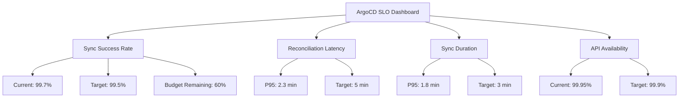

# How to Create SLOs for ArgoCD Operations

Author: [nawazdhandala](https://github.com/nawazdhandala)

Tags: ArgoCD, GitOps, Kubernetes, SRE, Monitoring

Description: Learn how to define and implement Service Level Objectives for ArgoCD operations including sync success rate, reconciliation latency, and deployment availability.

---

Service Level Objectives (SLOs) give you a measurable target for how well your ArgoCD installation should be performing. Without SLOs, you are flying blind - you know when something is broken, but you do not know if your deployment pipeline is meeting the reliability standards your team needs. This guide walks through defining and implementing practical SLOs for ArgoCD.

## Why SLOs for ArgoCD

ArgoCD is a critical piece of your infrastructure. When it is down or degraded, nobody can deploy. When syncs are slow, developer productivity drops. When reconciliation is unreliable, your cluster state drifts from what is in Git.

SLOs help you answer questions like:

- What percentage of syncs should succeed on the first attempt?
- How quickly should ArgoCD detect and reconcile drift?
- How available should the ArgoCD API server be?
- What is an acceptable sync duration for your team?

Without explicit targets, you end up in endless debates about whether ArgoCD is "good enough" or if it needs more resources.

## Defining Your SLOs

Here are practical SLOs for a production ArgoCD installation. Adjust the targets based on your team's needs:

### SLO 1: Sync Success Rate

**Definition**: The percentage of sync operations that complete successfully without manual intervention.

**Target**: 99.5% over a 30-day rolling window

**Why this matters**: Failed syncs mean broken deployments. A 99.5% target allows for roughly 3-4 failed syncs per day in a busy installation with 100+ syncs daily.

### SLO 2: Reconciliation Latency

**Definition**: The time between a Git commit and ArgoCD detecting the change and starting reconciliation.

**Target**: 95th percentile under 5 minutes over a 30-day rolling window

**Why this matters**: Developers expect their changes to be picked up quickly. A 5-minute P95 means most changes are detected within 3 minutes, which is acceptable for most teams.

### SLO 3: Sync Duration

**Definition**: The time from sync start to sync completion for a successful sync operation.

**Target**: 95th percentile under 3 minutes over a 30-day rolling window

**Why this matters**: Long sync times slow down your deployment pipeline and frustrate developers waiting for their changes to roll out.

### SLO 4: API Server Availability

**Definition**: The percentage of successful API requests (non-5xx responses) to the ArgoCD API server.

**Target**: 99.9% over a 30-day rolling window

**Why this matters**: The API server serves the UI, CLI, and any CI/CD integrations. When it is down, your whole team is blocked.

## Implementing SLOs with Prometheus

### SLI: Sync Success Rate

The Service Level Indicator (SLI) for sync success rate uses ArgoCD's built-in metrics:

```promql
# Sync success rate over the last 30 days
sum(rate(argocd_app_sync_total{phase="Succeeded"}[30d])) /
sum(rate(argocd_app_sync_total[30d]))
```

To calculate the remaining error budget:

```promql
# Error budget remaining (percentage of allowed failures not yet consumed)
1 - (
  (1 - (
    sum(rate(argocd_app_sync_total{phase="Succeeded"}[30d])) /
    sum(rate(argocd_app_sync_total[30d]))
  )) / (1 - 0.995)
)
```

### SLI: Reconciliation Latency

ArgoCD exposes reconciliation duration as a histogram:

```promql
# P95 reconciliation duration
histogram_quantile(0.95,
  sum(rate(argocd_app_reconcile_bucket[30d])) by (le)
)
```

### SLI: Sync Duration

```promql
# P95 sync duration
histogram_quantile(0.95,
  sum(rate(argocd_app_sync_total_duration_seconds_bucket{phase="Succeeded"}[30d])) by (le)
)
```

### SLI: API Server Availability

```promql
# API server success rate
sum(rate(grpc_server_handled_total{
  grpc_service=~".*ArgoCD.*",
  grpc_code!~"Internal|Unavailable|Unknown"
}[30d])) /
sum(rate(grpc_server_handled_total{
  grpc_service=~".*ArgoCD.*"
}[30d]))
```

## Creating PrometheusRule for SLO Alerts

Alert when your error budget is being consumed faster than expected:

```yaml
apiVersion: monitoring.coreos.com/v1
kind: PrometheusRule
metadata:
  name: argocd-slo-alerts
  namespace: argocd
spec:
  groups:
    - name: argocd-slo-sync-success
      rules:
        # Recording rule for sync success rate
        - record: argocd:sync_success_rate:ratio_rate1h
          expr: |
            sum(rate(argocd_app_sync_total{phase="Succeeded"}[1h])) /
            sum(rate(argocd_app_sync_total[1h]))

        - record: argocd:sync_success_rate:ratio_rate6h
          expr: |
            sum(rate(argocd_app_sync_total{phase="Succeeded"}[6h])) /
            sum(rate(argocd_app_sync_total[6h]))

        - record: argocd:sync_success_rate:ratio_rate30d
          expr: |
            sum(rate(argocd_app_sync_total{phase="Succeeded"}[30d])) /
            sum(rate(argocd_app_sync_total[30d]))

        # Fast burn alert - consuming error budget quickly
        - alert: ArgoCDSyncSuccessRateFastBurn
          expr: |
            argocd:sync_success_rate:ratio_rate1h < 0.98
          for: 5m
          labels:
            severity: critical
            slo: sync-success-rate
          annotations:
            summary: "ArgoCD sync success rate burning error budget fast"
            description: "1-hour sync success rate is {{ $value | humanizePercentage }}"

        # Slow burn alert - gradual degradation
        - alert: ArgoCDSyncSuccessRateSlowBurn
          expr: |
            argocd:sync_success_rate:ratio_rate6h < 0.995
          for: 30m
          labels:
            severity: warning
            slo: sync-success-rate
          annotations:
            summary: "ArgoCD sync success rate degrading slowly"
            description: "6-hour sync success rate is {{ $value | humanizePercentage }}"

    - name: argocd-slo-reconciliation
      rules:
        # Recording rule for reconciliation P95
        - record: argocd:reconcile_duration:p95_1h
          expr: |
            histogram_quantile(0.95,
              sum(rate(argocd_app_reconcile_bucket[1h])) by (le)
            )

        # Alert when reconciliation is too slow
        - alert: ArgoCDReconciliationTooSlow
          expr: |
            argocd:reconcile_duration:p95_1h > 300
          for: 15m
          labels:
            severity: warning
            slo: reconciliation-latency
          annotations:
            summary: "ArgoCD reconciliation P95 exceeds 5 minutes"
            description: "P95 reconciliation duration is {{ $value | humanizeDuration }}"

    - name: argocd-slo-api-availability
      rules:
        # Recording rule for API availability
        - record: argocd:api_success_rate:ratio_rate5m
          expr: |
            sum(rate(grpc_server_handled_total{
              grpc_service=~".*ArgoCD.*",
              grpc_code!~"Internal|Unavailable|Unknown"
            }[5m])) /
            sum(rate(grpc_server_handled_total{
              grpc_service=~".*ArgoCD.*"
            }[5m]))

        # Alert on API availability drop
        - alert: ArgoCDAPIAvailabilityLow
          expr: |
            argocd:api_success_rate:ratio_rate5m < 0.999
          for: 5m
          labels:
            severity: critical
            slo: api-availability
          annotations:
            summary: "ArgoCD API availability below 99.9%"
```

## Grafana SLO Dashboard

Build a dashboard that shows SLO compliance at a glance:



Key Grafana panels to include:

```json
{
  "panels": [
    {
      "title": "Error Budget Remaining - Sync Success",
      "type": "gauge",
      "targets": [
        {
          "expr": "1 - ((1 - argocd:sync_success_rate:ratio_rate30d) / (1 - 0.995))"
        }
      ],
      "thresholds": {
        "steps": [
          {"value": 0, "color": "red"},
          {"value": 0.25, "color": "yellow"},
          {"value": 0.5, "color": "green"}
        ]
      }
    },
    {
      "title": "SLO Compliance - 30 Day View",
      "type": "table",
      "targets": [
        {"expr": "argocd:sync_success_rate:ratio_rate30d", "legendFormat": "Sync Success"},
        {"expr": "argocd:reconcile_duration:p95_1h", "legendFormat": "Reconcile P95"},
        {"expr": "argocd:api_success_rate:ratio_rate5m", "legendFormat": "API Availability"}
      ]
    }
  ]
}
```

## Using SLOs in Practice

### Error Budget Policy

Define what happens when error budget is consumed:

- **Budget above 50%**: Normal operations. Deploy as usual.
- **Budget between 25% and 50%**: Slow down. Review recent changes. Prioritize reliability fixes.
- **Budget below 25%**: Freeze non-critical changes to ArgoCD. Focus entirely on fixing reliability issues.
- **Budget exhausted**: All ArgoCD changes require review from the on-call SRE team.

### Weekly SLO Review

Run a weekly review of your SLOs. Use this PromQL query to generate a report:

```promql
# Weekly sync success rate per application
sum by (name) (increase(argocd_app_sync_total{phase="Succeeded"}[7d])) /
sum by (name) (increase(argocd_app_sync_total[7d]))
```

This helps you identify specific applications that are dragging down your overall sync success rate.

### Connecting SLOs to OneUptime

OneUptime supports SLO tracking natively. Push your ArgoCD SLI metrics to OneUptime and define SLO targets in the UI. This gives you automated error budget tracking, SLO compliance reports, and integration with your incident management workflow. Learn more about monitoring ArgoCD with OneUptime.

## Common Pitfalls

**Setting targets too high**: A 99.99% sync success rate target sounds great but leaves almost no room for legitimate failures like transient network issues or Git rate limiting.

**Not excluding known failures**: If you intentionally fail syncs during testing, exclude those from your SLI calculations.

**Measuring the wrong thing**: Sync duration should only count successful syncs. Including failed sync attempts that time out will skew your numbers.

**Not adjusting over time**: Review and adjust your SLO targets quarterly. As your team and infrastructure mature, you can tighten targets.

SLOs transform ArgoCD monitoring from reactive firefighting to proactive reliability engineering. Start with the four SLOs outlined here, measure for a month, and then adjust based on what you learn about your system's actual behavior.
