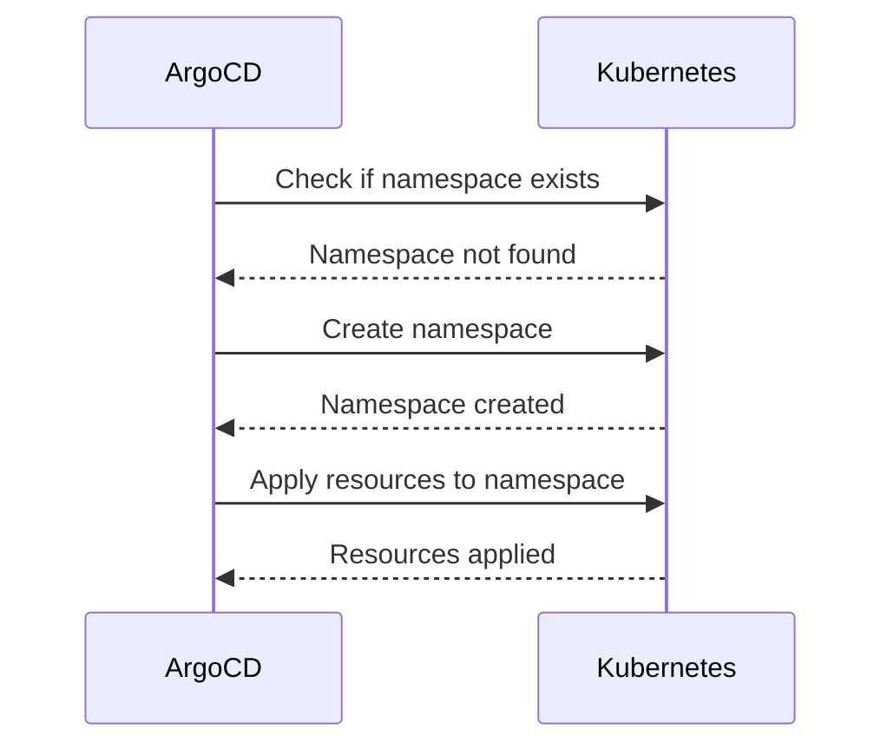

# How to Use the 'CreateNamespace' Sync Option in ArgoCD

Author: [nawazdhandala](https://github.com/nawazdhandala)

Tags: ArgoCD, GitOps, Kubernetes, Namespace

Description: Learn how to use the ArgoCD CreateNamespace sync option to automatically create Kubernetes namespaces during sync, with configuration examples and best practices.

---

By default, ArgoCD expects the target namespace to already exist in the cluster before syncing an application. If the namespace does not exist, the sync fails with a "namespace not found" error. The CreateNamespace sync option tells ArgoCD to automatically create the namespace if it is missing. This small option solves one of the most common "first deployment" headaches.

## The Problem Without CreateNamespace

When you create an ArgoCD Application that targets a namespace that does not exist:

```yaml
spec:
  destination:
    server: https://kubernetes.default.svc
    namespace: my-new-app  # This namespace does not exist yet
```

The sync fails with:

```
failed to sync: namespace "my-new-app" not found
```

This is frustrating for new applications. You either need to:
1. Manually create the namespace before syncing
2. Include a Namespace resource in your manifests
3. Use the CreateNamespace sync option

Option 3 is the cleanest approach.

## Enabling CreateNamespace

### In the Application Spec

```yaml
apiVersion: argoproj.io/v1alpha1
kind: Application
metadata:
  name: my-app
  namespace: argocd
spec:
  project: default
  source:
    repoURL: https://github.com/myorg/manifests.git
    targetRevision: main
    path: apps/my-app
  destination:
    server: https://kubernetes.default.svc
    namespace: my-new-app
  syncPolicy:
    syncOptions:
      - CreateNamespace=true  # Auto-create namespace if missing
```

### Via CLI

```bash
# Set the sync option on an existing application
argocd app set my-app --sync-option CreateNamespace=true

# Or when creating the application
argocd app create my-app \
  --repo https://github.com/myorg/manifests.git \
  --path apps/my-app \
  --dest-server https://kubernetes.default.svc \
  --dest-namespace my-new-app \
  --sync-option CreateNamespace=true
```

### Via the UI

1. Open the application in the ArgoCD UI
2. Click **App Details**
3. Under Sync Options, enable **CreateNamespace**
4. Save

## How It Works

When CreateNamespace is enabled and ArgoCD detects that the target namespace does not exist:



The namespace is created before any other resources are applied. This ensures all resources in the application have a valid target namespace.

## Adding Labels and Annotations to Auto-Created Namespaces

By default, the auto-created namespace is bare - just a name and nothing else. You can customize it using `managedNamespaceMetadata`:

```yaml
apiVersion: argoproj.io/v1alpha1
kind: Application
metadata:
  name: my-app
  namespace: argocd
spec:
  project: default
  source:
    repoURL: https://github.com/myorg/manifests.git
    targetRevision: main
    path: apps/my-app
  destination:
    server: https://kubernetes.default.svc
    namespace: my-new-app
  syncPolicy:
    syncOptions:
      - CreateNamespace=true
    managedNamespaceMetadata:
      labels:
        team: platform
        env: production
        istio-injection: enabled
      annotations:
        scheduler.alpha.kubernetes.io/node-selector: "zone=us-east-1a"
```

This is particularly useful for:
- **Istio sidecar injection** - Adding the `istio-injection: enabled` label
- **Network policies** - Labeling namespaces for policy selection
- **Resource quotas** - Annotating namespaces for quota controllers
- **Team ownership** - Adding ownership labels

## CreateNamespace with Namespace Resource in Manifests

A common question is: what happens if you have CreateNamespace enabled AND a Namespace resource in your Git manifests?

```yaml
# manifests/namespace.yaml
apiVersion: v1
kind: Namespace
metadata:
  name: my-new-app
  labels:
    team: platform
    env: production
```

In this case:
1. ArgoCD creates the namespace (from CreateNamespace option) if it does not exist
2. ArgoCD then applies the Namespace manifest from Git, updating it with any labels/annotations defined there
3. The Namespace resource in Git takes precedence for metadata

This means you can use both approaches together. CreateNamespace ensures the namespace exists for the initial sync, and the Namespace manifest in Git provides the full namespace configuration.

However, there is a simpler approach - just include the Namespace in your manifests and use CreateNamespace as a fallback:

```yaml
syncPolicy:
  syncOptions:
    - CreateNamespace=true  # Safety net
```

## CreateNamespace with Projects

ArgoCD Projects control which namespaces an application can deploy to:

```yaml
apiVersion: argoproj.io/v1alpha1
kind: AppProject
metadata:
  name: my-project
  namespace: argocd
spec:
  destinations:
    - server: https://kubernetes.default.svc
      namespace: my-new-app  # Must be explicitly allowed
    # OR use wildcards
    - server: https://kubernetes.default.svc
      namespace: "my-team-*"  # Allow any namespace matching pattern
```

CreateNamespace respects project restrictions. If the project does not allow the target namespace, the namespace creation and sync will fail even with CreateNamespace enabled.

## Deletion Behavior

When you delete an ArgoCD Application that used CreateNamespace, what happens to the namespace depends on the finalizer and how the namespace is tracked.

### Namespace Created by CreateNamespace Only

If the namespace was only created by the CreateNamespace option (not defined as a resource in Git), it is managed by ArgoCD. When you delete the Application with cascade:
- The namespace may or may not be deleted depending on ArgoCD version and configuration
- In most versions, the namespace created by CreateNamespace is NOT deleted on cascade delete

### Namespace Defined in Git Manifests

If you have a Namespace resource in your Git manifests and the Application has the resources finalizer:
- The namespace and all resources in it will be deleted during cascade delete
- This includes resources NOT managed by ArgoCD if they are in that namespace

Be careful with this. Deleting a namespace in Kubernetes deletes everything inside it.

## Common Patterns

### Multi-Environment Setup

```yaml
# staging application
spec:
  destination:
    namespace: my-app-staging
  syncPolicy:
    syncOptions:
      - CreateNamespace=true
    managedNamespaceMetadata:
      labels:
        env: staging

# production application
spec:
  destination:
    namespace: my-app-production
  syncPolicy:
    syncOptions:
      - CreateNamespace=true
    managedNamespaceMetadata:
      labels:
        env: production
```

### ApplicationSet with CreateNamespace

```yaml
apiVersion: argoproj.io/v1alpha1
kind: ApplicationSet
metadata:
  name: my-services
  namespace: argocd
spec:
  generators:
    - list:
        elements:
          - service: user-api
            namespace: user-api
          - service: order-api
            namespace: order-api
  template:
    metadata:
      name: '{{service}}'
    spec:
      source:
        repoURL: https://github.com/myorg/services.git
        path: 'services/{{service}}'
        targetRevision: main
      destination:
        server: https://kubernetes.default.svc
        namespace: '{{namespace}}'
      syncPolicy:
        automated:
          prune: true
          selfHeal: true
        syncOptions:
          - CreateNamespace=true
```

## Best Practices

1. **Always enable CreateNamespace for new applications** - It eliminates the bootstrapping problem where the namespace must exist before ArgoCD can deploy to it.

2. **Use managedNamespaceMetadata for namespace configuration** - If you need labels or annotations on the namespace, define them in the sync policy rather than maintaining a separate Namespace manifest.

3. **Include Namespace resources in Git for complex namespace configs** - If you need ResourceQuotas, LimitRanges, or NetworkPolicies tied to the namespace, define a full Namespace resource in your manifests.

4. **Be aware of deletion behavior** - Understand whether the namespace will be deleted when you remove the ArgoCD Application to avoid surprises.

5. **Restrict namespace creation in Projects** - Use ArgoCD Projects to control which namespaces can be created to prevent applications from deploying to unauthorized namespaces.

The CreateNamespace sync option is one of those small quality-of-life features that should probably be the default. It removes a common source of friction in the initial application setup and makes your ArgoCD Applications truly self-contained - everything needed for deployment, including the namespace, is handled automatically.
