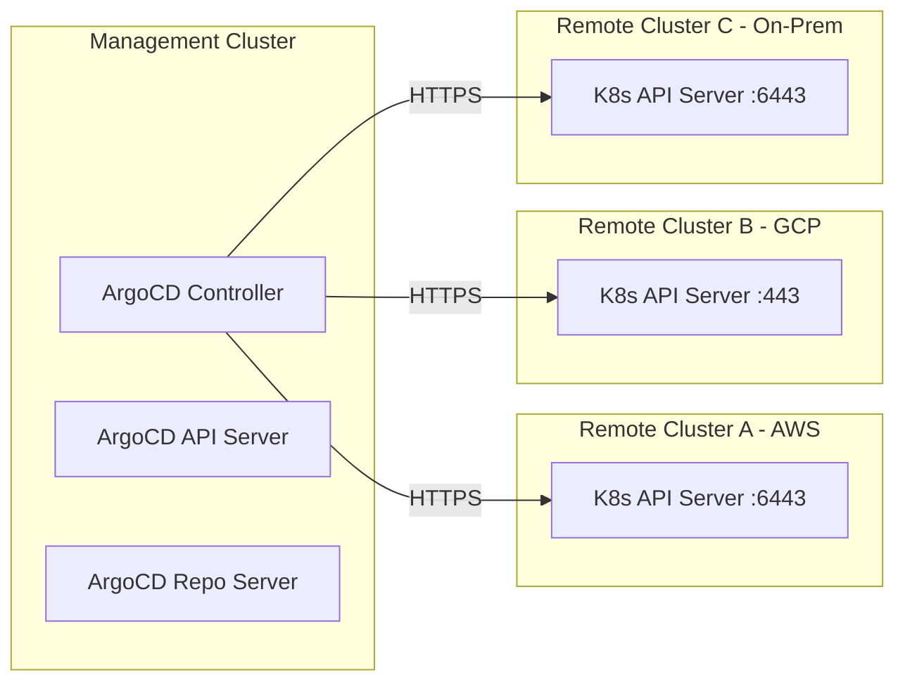

# How to Handle Cross-Cluster Networking for ArgoCD

Author: [nawazdhandala](https://github.com/nawazdhandala)

Tags: ArgoCD, GitOps, Kubernetes, Networking, Multi-Cluster

Description: Learn how to configure cross-cluster networking for ArgoCD to manage remote Kubernetes clusters across different networks, VPCs, and cloud providers.

---

When ArgoCD manages multiple Kubernetes clusters, the networking between the ArgoCD control plane and the managed clusters becomes critical. If ArgoCD cannot reliably reach the Kubernetes API server of a remote cluster, your entire GitOps pipeline breaks. This guide covers the networking patterns, configurations, and troubleshooting techniques you need to make cross-cluster ArgoCD work reliably.

## Understanding ArgoCD Cross-Cluster Communication

ArgoCD communicates with remote clusters exclusively through the Kubernetes API server. It does not need direct network access to worker nodes, pods, or services in managed clusters. The only requirement is that the ArgoCD application controller and repo server can reach the remote cluster's API server endpoint.



## Network Requirements

The ArgoCD pods need outbound HTTPS access to each managed cluster's API server. Here is what that means in practice:

- **Port**: Usually 443 or 6443, depending on the cluster setup
- **Protocol**: HTTPS (TLS)
- **Direction**: ArgoCD initiates the connection (outbound from management cluster)
- **DNS**: ArgoCD needs to resolve the API server hostname
- **Latency**: Should be under 500ms for responsive sync operations

## Cross-VPC Networking on AWS

If your ArgoCD management cluster and target EKS clusters are in different VPCs, you need to establish connectivity between them.

### VPC Peering

The simplest approach for a small number of clusters:

```bash
# Create VPC peering connection
aws ec2 create-vpc-peering-connection \
  --vpc-id vpc-management \
  --peer-vpc-id vpc-target-cluster \
  --peer-region us-east-1

# Accept the peering connection
aws ec2 accept-vpc-peering-connection \
  --vpc-peering-connection-id pcx-123456

# Add route to management cluster VPC route table
aws ec2 create-route \
  --route-table-id rtb-management \
  --destination-cidr-block 10.1.0.0/16 \
  --vpc-peering-connection-id pcx-123456

# Add return route in target cluster VPC
aws ec2 create-route \
  --route-table-id rtb-target \
  --destination-cidr-block 10.0.0.0/16 \
  --vpc-peering-connection-id pcx-123456
```

### AWS Transit Gateway

For managing many clusters, use Transit Gateway as a hub:

```bash
# Create Transit Gateway
aws ec2 create-transit-gateway \
  --description "ArgoCD cross-cluster connectivity"

# Attach management VPC
aws ec2 create-transit-gateway-vpc-attachment \
  --transit-gateway-id tgw-123456 \
  --vpc-id vpc-management \
  --subnet-ids subnet-mgmt-1a subnet-mgmt-1b

# Attach each target cluster VPC
aws ec2 create-transit-gateway-vpc-attachment \
  --transit-gateway-id tgw-123456 \
  --vpc-id vpc-target-1 \
  --subnet-ids subnet-target1-1a subnet-target1-1b
```

Make sure EKS API server endpoints are accessible from the Transit Gateway. For private EKS clusters, enable the private API endpoint:

```bash
aws eks update-cluster-config \
  --name target-cluster \
  --resources-vpc-config endpointPrivateAccess=true,endpointPublicAccess=false
```

## Cross-Project Networking on GCP

For GKE clusters in different GCP projects, use Shared VPC or VPC peering:

```bash
# Create VPC peering between management and target projects
gcloud compute networks peerings create argocd-to-target \
  --network=management-vpc \
  --peer-project=target-project \
  --peer-network=target-vpc

# Create the reverse peering
gcloud compute networks peerings create target-to-argocd \
  --project=target-project \
  --network=target-vpc \
  --peer-project=management-project \
  --peer-network=management-vpc
```

For private GKE clusters, ensure the master authorized networks include the ArgoCD cluster's pod CIDR:

```bash
gcloud container clusters update target-cluster \
  --enable-master-authorized-networks \
  --master-authorized-networks=10.0.0.0/16 \
  --project=target-project
```

## Cross-VNET Networking on Azure

For AKS clusters across different VNETs:

```bash
# Get VNET IDs
MGMT_VNET=$(az network vnet show \
  --resource-group mgmt-rg \
  --name mgmt-vnet \
  --query id -o tsv)

TARGET_VNET=$(az network vnet show \
  --resource-group target-rg \
  --name target-vnet \
  --query id -o tsv)

# Create peering from management to target
az network vnet peering create \
  --name argocd-to-target \
  --resource-group mgmt-rg \
  --vnet-name mgmt-vnet \
  --remote-vnet $TARGET_VNET \
  --allow-vnet-access

# Create peering from target to management
az network vnet peering create \
  --name target-to-argocd \
  --resource-group target-rg \
  --vnet-name target-vnet \
  --remote-vnet $MGMT_VNET \
  --allow-vnet-access
```

## DNS Resolution for Private Clusters

When target clusters use private API endpoints, ArgoCD needs to resolve private DNS names. Configure CoreDNS or use conditional forwarding:

```yaml
# coredns-custom ConfigMap in the ArgoCD cluster
apiVersion: v1
kind: ConfigMap
metadata:
  name: coredns-custom
  namespace: kube-system
data:
  private-clusters.server: |
    # Forward queries for private EKS endpoints
    eks.amazonaws.com:53 {
        forward . 10.1.0.2  # DNS server in the target VPC
    }
    # Forward queries for private GKE endpoints
    gke.internal:53 {
        forward . 10.2.0.2  # DNS server in the target VPC
    }
```

Alternatively, add the API server IP directly to the ArgoCD cluster secret:

```yaml
apiVersion: v1
kind: Secret
metadata:
  name: target-cluster
  namespace: argocd
  labels:
    argocd.argoproj.io/secret-type: cluster
stringData:
  # Use IP address instead of hostname to bypass DNS issues
  server: "https://10.1.5.23:6443"
  name: "target-production"
  config: |
    {
      "tlsClientConfig": {
        "insecure": false,
        "caData": "base64-encoded-ca-cert"
      },
      "bearerToken": "service-account-token"
    }
```

## Firewall and Security Group Configuration

Ensure network security rules allow the ArgoCD traffic:

```bash
# AWS - Allow ArgoCD pods to reach target cluster API server
aws ec2 authorize-security-group-ingress \
  --group-id sg-target-api-server \
  --protocol tcp \
  --port 443 \
  --source-group sg-argocd-pods

# GCP - Create firewall rule
gcloud compute firewall-rules create allow-argocd-to-gke \
  --network=target-vpc \
  --allow=tcp:443 \
  --source-ranges=10.0.0.0/16 \
  --target-tags=gke-target-cluster
```

## Network Policies for ArgoCD Egress

If your management cluster uses NetworkPolicies, make sure ArgoCD pods can reach external API servers:

```yaml
apiVersion: networking.k8s.io/v1
kind: NetworkPolicy
metadata:
  name: argocd-controller-egress
  namespace: argocd
spec:
  podSelector:
    matchLabels:
      app.kubernetes.io/name: argocd-application-controller
  policyTypes:
    - Egress
  egress:
    # Allow access to Kubernetes API servers
    - to:
        - ipBlock:
            cidr: 10.0.0.0/8  # Private network range
      ports:
        - protocol: TCP
          port: 443
        - protocol: TCP
          port: 6443
    # Allow DNS resolution
    - to:
        - namespaceSelector: {}
          podSelector:
            matchLabels:
              k8s-app: kube-dns
      ports:
        - protocol: UDP
          port: 53
        - protocol: TCP
          port: 53
    # Allow access to Git repositories
    - to:
        - ipBlock:
            cidr: 0.0.0.0/0
      ports:
        - protocol: TCP
          port: 443
        - protocol: TCP
          port: 22
```

## Testing Cross-Cluster Connectivity

Before adding a cluster to ArgoCD, verify network connectivity:

```bash
# Run a debug pod in the ArgoCD namespace
kubectl run network-test --rm -it \
  --namespace=argocd \
  --image=nicolaka/netshoot \
  --restart=Never -- bash

# Inside the pod, test connectivity to the target API server
curl -k https://target-api-server:443/healthz
# Expected: ok

# Test DNS resolution
nslookup target-api-server.example.com

# Check latency
ping -c 5 target-api-server.example.com
```

After confirming connectivity, add the cluster:

```bash
argocd cluster add target-cluster-context \
  --name target-production \
  --server https://target-api-server:443
```

## Handling High Latency Connections

For clusters in distant regions, adjust ArgoCD timeouts:

```yaml
apiVersion: v1
kind: ConfigMap
metadata:
  name: argocd-cmd-params-cm
  namespace: argocd
data:
  # Increase timeout for slow connections
  controller.k8s.client.config.qps: "50"
  controller.k8s.client.config.burst: "100"
  # Increase status cache timeout
  controller.status.processors: "20"
  controller.operation.processors: "10"
```

Cross-cluster networking is the foundation of multi-cluster ArgoCD. Get the networking right first, then layer on authentication and authorization. For monitoring the health of these cross-cluster connections, consider setting up [ArgoCD component monitoring](https://oneuptime.com/blog/post/2026-02-26-argocd-monitor-component-health/view) to detect connectivity issues before they impact deployments.
