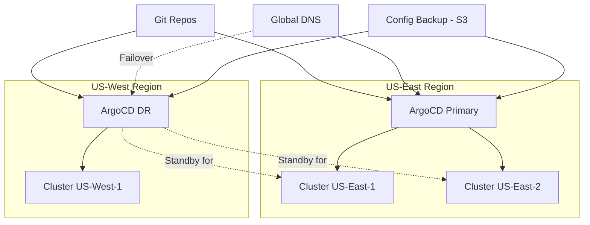

# How to Set Up Cross-Region ArgoCD for DR

Author: [nawazdhandala](https://github.com/nawazdhandala)

Tags: ArgoCD, GitOps, Kubernetes, Disaster Recovery, Multi-Region

Description: Learn how to deploy ArgoCD across multiple regions for disaster recovery with cross-region configuration sync and automated failover strategies.

---

Cross-region disaster recovery takes ArgoCD resilience to the next level. While an active-passive setup in the same region protects against cluster failures, cross-region DR protects against entire region outages - whether caused by cloud provider issues, natural disasters, or network partitions. This guide covers the architecture, implementation, and operational procedures for cross-region ArgoCD DR.

## Architecture



The cross-region setup has two additional challenges compared to single-region DR:

1. **Network latency** - The DR instance may have higher latency to managed clusters
2. **State synchronization** - Keeping configuration in sync across regions requires reliable cross-region communication

## Prerequisites

Before setting up cross-region DR:

- Two Kubernetes clusters in different regions
- Cross-region networking (VPC peering, Transit Gateway, etc.) if managing clusters across regions
- A global DNS service (Route53, Cloud DNS, Cloudflare)
- Shared storage for backups (S3, GCS with cross-region replication)
- Git repositories accessible from both regions

## Step 1: Deploy ArgoCD in the DR Region

```bash
# Switch to DR region cluster
kubectl config use-context us-west-cluster

# Install ArgoCD matching primary version
kubectl create namespace argocd
kubectl apply -n argocd \
  -f https://raw.githubusercontent.com/argoproj/argo-cd/v2.13.0/manifests/ha/install.yaml

# Scale down the controller (passive mode)
kubectl scale statefulset argocd-application-controller \
  --replicas=0 -n argocd
```

## Step 2: Configure Cross-Region State Sync

Use cloud storage as an intermediary for state synchronization:

```bash
#!/bin/bash
# cross-region-sync.sh - Sync ArgoCD state via S3

PRIMARY_CONTEXT="us-east-cluster"
DR_CONTEXT="us-west-cluster"
S3_BUCKET="s3://argocd-dr-sync"
NAMESPACE="argocd"
TIMESTAMP=$(date +%Y%m%d-%H%M%S)

# Export from primary
echo "=== Exporting from Primary (US-East) ==="
kubectl config use-context "$PRIMARY_CONTEXT"

# Export applications
kubectl get applications.argoproj.io -n "$NAMESPACE" -o yaml > /tmp/dr-apps.yaml

# Export projects
kubectl get appprojects.argoproj.io -n "$NAMESPACE" -o yaml > /tmp/dr-projects.yaml

# Export ConfigMaps
for cm in argocd-cm argocd-rbac-cm argocd-cmd-params-cm argocd-notifications-cm; do
  kubectl get configmap "$cm" -n "$NAMESPACE" -o yaml > "/tmp/dr-cm-${cm}.yaml" 2>/dev/null
done

# Export Secrets
kubectl get secrets -n "$NAMESPACE" \
  -l 'argocd.argoproj.io/secret-type' -o yaml > /tmp/dr-secrets.yaml

# Upload to S3
echo "=== Uploading to S3 ==="
aws s3 sync /tmp/dr-*.yaml "$S3_BUCKET/$TIMESTAMP/" --exclude '*' --include 'dr-*'
aws s3 cp /tmp/dr-apps.yaml "$S3_BUCKET/latest/apps.yaml"
aws s3 cp /tmp/dr-projects.yaml "$S3_BUCKET/latest/projects.yaml"
aws s3 cp /tmp/dr-secrets.yaml "$S3_BUCKET/latest/secrets.yaml"
for cm in argocd-cm argocd-rbac-cm argocd-cmd-params-cm argocd-notifications-cm; do
  aws s3 cp "/tmp/dr-cm-${cm}.yaml" "$S3_BUCKET/latest/cm-${cm}.yaml" 2>/dev/null
done

# Import to DR
echo "=== Importing to DR (US-West) ==="
kubectl config use-context "$DR_CONTEXT"

# Download from S3
aws s3 sync "$S3_BUCKET/latest/" /tmp/dr-import/

# Apply ConfigMaps
for f in /tmp/dr-import/cm-*.yaml; do
  [ -f "$f" ] && python3 -c "
import yaml, sys
doc = yaml.safe_load(open('$f'))
if doc:
    meta = doc.get('metadata', {})
    for field in ['resourceVersion', 'uid', 'creationTimestamp', 'managedFields']:
        meta.pop(field, None)
    print(yaml.dump(doc))
" | kubectl apply -n "$NAMESPACE" -f -
done

# Apply Secrets
python3 -c "
import yaml, sys
for doc in yaml.safe_load_all(open('/tmp/dr-import/secrets.yaml')):
    if doc is None:
        continue
    if doc.get('kind') == 'List':
        items = doc.get('items', [])
    else:
        items = [doc]
    for item in items:
        meta = item.get('metadata', {})
        for f in ['resourceVersion', 'uid', 'creationTimestamp', 'managedFields']:
            meta.pop(f, None)
        print('---')
        print(yaml.dump(item))
" | kubectl apply -n "$NAMESPACE" -f -

# Apply Projects
python3 -c "
import yaml, sys
for doc in yaml.safe_load_all(open('/tmp/dr-import/projects.yaml')):
    if doc is None:
        continue
    if doc.get('kind') == 'List':
        items = doc.get('items', [])
    else:
        items = [doc]
    for item in items:
        meta = item.get('metadata', {})
        for f in ['resourceVersion', 'uid', 'creationTimestamp', 'managedFields']:
            meta.pop(f, None)
        item.pop('status', None)
        print('---')
        print(yaml.dump(item))
" | kubectl apply -n "$NAMESPACE" -f -

# Apply Applications
python3 -c "
import yaml, sys
for doc in yaml.safe_load_all(open('/tmp/dr-import/apps.yaml')):
    if doc is None:
        continue
    if doc.get('kind') == 'List':
        items = doc.get('items', [])
    else:
        items = [doc]
    for item in items:
        meta = item.get('metadata', {})
        for f in ['resourceVersion', 'uid', 'creationTimestamp', 'managedFields']:
            meta.pop(f, None)
        item.pop('status', None)
        item.pop('operation', None)
        print('---')
        print(yaml.dump(item))
" | kubectl apply -n "$NAMESPACE" -f -

# Cleanup
rm -rf /tmp/dr-*.yaml /tmp/dr-import/

echo "=== Sync Complete ==="
echo "DR Applications: $(kubectl get applications.argoproj.io -n $NAMESPACE --no-headers | wc -l | tr -d ' ')"
```

## Step 3: Configure Global DNS

Set up DNS-based failover:

### AWS Route53 Health Check and Failover

```bash
# Create health check for primary
aws route53 create-health-check --caller-reference "argocd-primary-$(date +%s)" \
  --health-check-config '{
    "Type": "HTTPS",
    "ResourcePath": "/healthz",
    "FullyQualifiedDomainName": "argocd-primary.us-east.example.com",
    "Port": 443,
    "RequestInterval": 10,
    "FailureThreshold": 3
  }'

# Create failover DNS records
# Primary record
aws route53 change-resource-record-sets \
  --hosted-zone-id $ZONE_ID \
  --change-batch '{
    "Changes": [{
      "Action": "UPSERT",
      "ResourceRecordSet": {
        "Name": "argocd.example.com",
        "Type": "CNAME",
        "SetIdentifier": "primary",
        "Failover": "PRIMARY",
        "TTL": 60,
        "ResourceRecords": [{"Value": "argocd-primary.us-east.example.com"}],
        "HealthCheckId": "PRIMARY_HEALTH_CHECK_ID"
      }
    }]
  }'

# Secondary (DR) record
aws route53 change-resource-record-sets \
  --hosted-zone-id $ZONE_ID \
  --change-batch '{
    "Changes": [{
      "Action": "UPSERT",
      "ResourceRecordSet": {
        "Name": "argocd.example.com",
        "Type": "CNAME",
        "SetIdentifier": "dr",
        "Failover": "SECONDARY",
        "TTL": 60,
        "ResourceRecords": [{"Value": "argocd-dr.us-west.example.com"}]
      }
    }]
  }'
```

## Step 4: Automated Failover

Create an automated failover script that activates the DR instance when the primary is detected as down:

```bash
#!/bin/bash
# auto-failover.sh - Automated DR failover with health checking

PRIMARY_URL="https://argocd-primary.us-east.example.com"
DR_CONTEXT="us-west-cluster"
NAMESPACE="argocd"
CHECK_INTERVAL=30
FAILURE_THRESHOLD=3
failures=0

echo "Monitoring primary ArgoCD at $PRIMARY_URL"
echo "Failure threshold: $FAILURE_THRESHOLD consecutive failures"

while true; do
  # Health check the primary
  HTTP_STATUS=$(curl -s -k -o /dev/null -w "%{http_code}" \
    --max-time 10 "$PRIMARY_URL/healthz")

  if [ "$HTTP_STATUS" = "200" ]; then
    if [ $failures -gt 0 ]; then
      echo "[$(date)] Primary recovered. Resetting failure count."
    fi
    failures=0
  else
    failures=$((failures + 1))
    echo "[$(date)] Primary check failed (HTTP $HTTP_STATUS). Failures: $failures/$FAILURE_THRESHOLD"

    if [ $failures -ge $FAILURE_THRESHOLD ]; then
      echo ""
      echo "!!! FAILOVER TRIGGERED !!!"
      echo "Activating DR instance..."

      # Scale up DR controller
      kubectl scale statefulset argocd-application-controller \
        --replicas=1 -n "$NAMESPACE" --context="$DR_CONTEXT"

      # Wait for it to be ready
      kubectl rollout status statefulset argocd-application-controller \
        -n "$NAMESPACE" --context="$DR_CONTEXT" --timeout=120s

      echo "DR instance activated. Manual DNS update may be needed."
      echo "Run: kubectl scale statefulset argocd-application-controller --replicas=0 -n $NAMESPACE --context=$DR_CONTEXT"
      echo "to deactivate DR when primary is restored."

      # Send alert
      # curl -s -X POST "$SLACK_WEBHOOK" -d '{"text":"ArgoCD failover activated to DR region!"}'

      exit 0
    fi
  fi

  sleep $CHECK_INTERVAL
done
```

## Network Considerations

When the DR ArgoCD needs to manage clusters in the primary region, cross-region networking is required:

```yaml
# Ensure cluster credentials in the DR instance point to
# accessible endpoints. Use private endpoints with VPC peering
# or public endpoints.

# Example: Update cluster endpoint for cross-region access
apiVersion: v1
kind: Secret
metadata:
  name: cluster-us-east-1
  namespace: argocd
  labels:
    argocd.argoproj.io/secret-type: cluster
type: Opaque
stringData:
  name: us-east-production
  # Use the public or VPC-peered endpoint
  server: https://EKS-CLUSTER-ENDPOINT.us-east-1.eks.amazonaws.com
  config: |
    {
      "bearerToken": "...",
      "tlsClientConfig": {
        "insecure": false,
        "caData": "..."
      }
    }
```

## Testing the DR Setup

Regular testing is critical:

```bash
#!/bin/bash
# test-dr-failover.sh - Test DR failover without affecting production

DR_CONTEXT="us-west-cluster"
NAMESPACE="argocd"
TEST_APP="dr-test-app"

echo "=== DR Failover Test ==="

# 1. Scale up DR controller temporarily
echo "1. Activating DR controller..."
kubectl scale statefulset argocd-application-controller \
  --replicas=1 -n "$NAMESPACE" --context="$DR_CONTEXT"
kubectl rollout status statefulset argocd-application-controller \
  -n "$NAMESPACE" --context="$DR_CONTEXT" --timeout=120s

# 2. Create a test application
echo "2. Creating test application..."
kubectl apply --context="$DR_CONTEXT" -n "$NAMESPACE" -f - << 'EOF'
apiVersion: argoproj.io/v1alpha1
kind: Application
metadata:
  name: dr-test-app
spec:
  project: default
  source:
    repoURL: https://github.com/argoproj/argocd-example-apps.git
    path: guestbook
    targetRevision: HEAD
  destination:
    server: https://kubernetes.default.svc
    namespace: dr-test
  syncPolicy:
    automated:
      selfHeal: true
    syncOptions:
      - CreateNamespace=true
EOF

# 3. Wait for sync
echo "3. Waiting for test app to sync..."
sleep 30
STATUS=$(kubectl get application "$TEST_APP" -n "$NAMESPACE" \
  --context="$DR_CONTEXT" -o jsonpath='{.status.sync.status}')
HEALTH=$(kubectl get application "$TEST_APP" -n "$NAMESPACE" \
  --context="$DR_CONTEXT" -o jsonpath='{.status.health.status}')

echo "   Sync: $STATUS, Health: $HEALTH"

# 4. Cleanup
echo "4. Cleaning up..."
kubectl delete application "$TEST_APP" -n "$NAMESPACE" --context="$DR_CONTEXT"
kubectl delete namespace dr-test --context="$DR_CONTEXT" --ignore-not-found

# 5. Scale down controller again
echo "5. Deactivating DR controller..."
kubectl scale statefulset argocd-application-controller \
  --replicas=0 -n "$NAMESPACE" --context="$DR_CONTEXT"

echo ""
if [ "$STATUS" = "Synced" ] && [ "$HEALTH" = "Healthy" ]; then
  echo "DR TEST PASSED - Failover is operational"
else
  echo "DR TEST FAILED - Check DR configuration"
  exit 1
fi
```

## RPO and RTO Targets

| Metric | Target | How to Achieve |
|--------|--------|----------------|
| RPO (Recovery Point Objective) | 15 minutes | Sync config every 15 minutes |
| RTO (Recovery Time Objective) | 5 to 10 minutes | Automated failover with health checks |
| DNS TTL | 60 seconds | Low TTL for fast DNS failover |
| Config sync frequency | Every 15 minutes | CronJob-based sync |

Cross-region ArgoCD DR provides the highest level of resilience for your GitOps platform. While it adds operational complexity, the protection against regional outages is worth it for organizations where deployment continuity is critical. Automate the sync, test the failover regularly, and keep your runbooks up to date.
