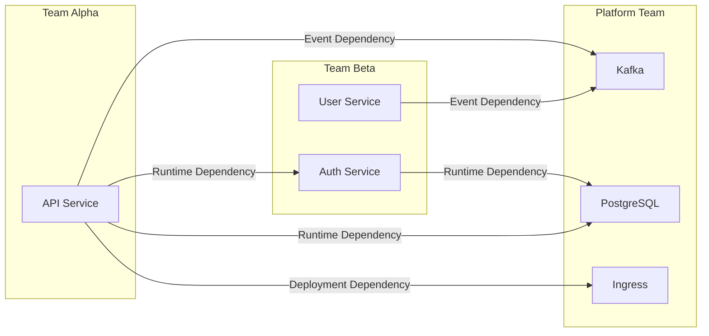
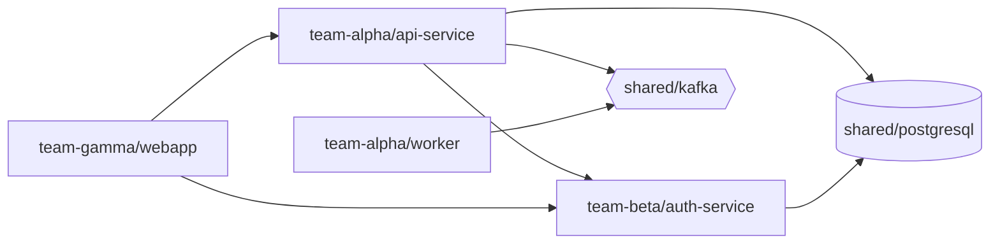

# How to Handle Cross-Tenant Dependencies in ArgoCD

Author: [nawazdhandala](https://github.com/nawazdhandala)

Tags: ArgoCD, GitOps, Kubernetes, Multi-Tenancy, Dependencies

Description: Learn how to manage cross-tenant dependencies in ArgoCD when applications from different teams need to interact, including shared services, API contracts, and deployment ordering.

---

In a multi-tenant ArgoCD setup, teams are isolated by design. But applications rarely exist in isolation. Team Alpha's API depends on Team Beta's authentication service. Team Beta's worker relies on the platform team's Kafka cluster. Team Gamma's frontend calls APIs from three different teams.

Cross-tenant dependencies are inevitable. The challenge is handling them without breaking the isolation boundaries that keep your cluster safe. This guide covers patterns for managing these dependencies in ArgoCD.

## Types of Cross-Tenant Dependencies



Dependencies fall into three categories:

1. **Deployment dependencies** - one component must exist before another can deploy (CRDs, namespaces, infrastructure)
2. **Runtime dependencies** - one service calls another at runtime (API calls, database connections)
3. **Event dependencies** - services communicate through shared message queues or event streams

## Pattern 1: Sync Waves Across Applications

For deployment dependencies within the same ArgoCD instance, use sync waves on the parent Application resources. This works when you use an app-of-apps pattern.

```yaml
# Infrastructure deploys first (wave -3)
apiVersion: argoproj.io/v1alpha1
kind: Application
metadata:
  name: shared-postgresql
  annotations:
    argocd.argoproj.io/sync-wave: "-3"
spec:
  project: platform
  source:
    repoURL: https://github.com/myorg/platform-infra.git
    path: postgresql
  destination:
    namespace: shared-databases

---
# Auth service deploys second (wave -1)
apiVersion: argoproj.io/v1alpha1
kind: Application
metadata:
  name: auth-service
  annotations:
    argocd.argoproj.io/sync-wave: "-1"
spec:
  project: team-beta
  source:
    repoURL: https://github.com/myorg/team-beta-auth.git
    path: k8s/prod
  destination:
    namespace: team-beta-prod

---
# API service deploys last (wave 0)
apiVersion: argoproj.io/v1alpha1
kind: Application
metadata:
  name: api-service
  annotations:
    argocd.argoproj.io/sync-wave: "0"
spec:
  project: team-alpha
  source:
    repoURL: https://github.com/myorg/team-alpha-api.git
    path: k8s/prod
  destination:
    namespace: team-alpha-prod
```

This guarantees PostgreSQL exists before auth-service tries to connect, and auth-service exists before api-service starts calling it.

## Pattern 2: Health Check Based Dependencies

ArgoCD sync waves wait for resources to be healthy before proceeding. Combine this with custom health checks to ensure dependent services are actually ready, not just deployed.

```lua
-- Custom health check for a dependent service
-- Add to argocd-cm ConfigMap
-- Type: apps/Deployment
hs = {}
if obj.status ~= nil then
  if obj.status.availableReplicas ~= nil and obj.status.availableReplicas > 0 then
    hs.status = "Healthy"
    hs.message = "Deployment has available replicas"
    return hs
  end
end
hs.status = "Progressing"
hs.message = "Waiting for available replicas"
return hs
```

The sync wave for the dependent application will not proceed until the dependency's health check passes.

## Pattern 3: Init Containers for Runtime Dependencies

When services depend on other services being available at runtime, use init containers that wait for the dependency.

```yaml
apiVersion: apps/v1
kind: Deployment
metadata:
  name: api-service
  namespace: team-alpha-prod
spec:
  template:
    spec:
      initContainers:
        # Wait for auth service to be available
        - name: wait-for-auth
          image: busybox:1.36
          command:
            - /bin/sh
            - -c
            - |
              echo "Waiting for auth service..."
              until nc -z auth-service.team-beta-prod.svc 8080; do
                echo "Auth service not ready, retrying in 5s..."
                sleep 5
              done
              echo "Auth service is available"
        # Wait for database to be available
        - name: wait-for-db
          image: busybox:1.36
          command:
            - /bin/sh
            - -c
            - |
              echo "Waiting for PostgreSQL..."
              until nc -z shared-postgresql.shared-databases.svc 5432; do
                echo "Database not ready, retrying in 5s..."
                sleep 5
              done
              echo "Database is available"
      containers:
        - name: api
          image: myorg/api-service:latest
```

This handles the runtime startup ordering without coupling ArgoCD applications together.

## Pattern 4: Service Mesh for Runtime Dependencies

A service mesh like Istio or Linkerd handles cross-tenant communication more gracefully. It provides:

- **Automatic retries** when a dependency is temporarily unavailable
- **Circuit breaking** to prevent cascading failures
- **Mutual TLS** for secure cross-namespace communication
- **Traffic policies** that control which tenants can communicate

```yaml
# Istio AuthorizationPolicy - only team-alpha can call team-beta's auth service
apiVersion: security.istio.io/v1
kind: AuthorizationPolicy
metadata:
  name: auth-service-access
  namespace: team-beta-prod
spec:
  selector:
    matchLabels:
      app: auth-service
  rules:
    - from:
        - source:
            namespaces: ["team-alpha-prod", "team-gamma-prod"]
      to:
        - operation:
            methods: ["GET", "POST"]
            paths: ["/api/v1/auth/*", "/api/v1/validate/*"]
```

## Pattern 5: ExternalName Services

Create ExternalName services in each tenant's namespace that point to services in other namespaces. This creates a local DNS alias and decouples the consumer from the provider's namespace.

```yaml
# In team-alpha-prod namespace
apiVersion: v1
kind: Service
metadata:
  name: auth-service
  namespace: team-alpha-prod
  labels:
    dependency-type: cross-tenant
    provider: team-beta
spec:
  type: ExternalName
  externalName: auth-service.team-beta-prod.svc.cluster.local
```

Applications in team-alpha-prod connect to `auth-service` (local namespace) instead of `auth-service.team-beta-prod.svc.cluster.local`. If the provider moves to a different namespace or cluster, only the ExternalName service needs updating.

Manage these ExternalName services through ArgoCD as part of the tenant's application:

```yaml
apiVersion: argoproj.io/v1alpha1
kind: Application
metadata:
  name: team-alpha-dependencies
spec:
  project: team-alpha
  source:
    repoURL: https://github.com/myorg/team-alpha-config.git
    path: dependencies
  destination:
    namespace: team-alpha-prod
```

## Pattern 6: Dependency Declaration with Annotations

Use annotations on ArgoCD Applications to document dependencies. While ArgoCD does not enforce these, they provide visibility and can be used by external tooling.

```yaml
apiVersion: argoproj.io/v1alpha1
kind: Application
metadata:
  name: api-service
  annotations:
    dependencies.myorg.io/runtime: "auth-service.team-beta-prod,postgresql.shared-databases"
    dependencies.myorg.io/events: "kafka.shared-kafka"
    dependencies.myorg.io/owner: "team-alpha"
spec:
  project: team-alpha
  # ...
```

Build a simple tool that reads these annotations and generates a dependency graph:

```bash
# List all cross-tenant dependencies
argocd app list -o json | \
  jq '.[] | select(.metadata.annotations["dependencies.myorg.io/runtime"] != null) |
  {app: .metadata.name, deps: .metadata.annotations["dependencies.myorg.io/runtime"]}'
```

## Pattern 7: Contract Testing with PreSync Hooks

Before deploying an application that depends on another service, verify the dependency's API contract is still valid.

```yaml
apiVersion: batch/v1
kind: Job
metadata:
  name: verify-auth-api-contract
  annotations:
    argocd.argoproj.io/hook: PreSync
    argocd.argoproj.io/hook-delete-policy: HookSucceeded
spec:
  template:
    spec:
      containers:
        - name: contract-test
          image: myorg/contract-tester:latest
          command:
            - /bin/sh
            - -c
            - |
              # Verify auth service API is compatible
              CONTRACT_CHECK=$(curl -s http://auth-service.team-beta-prod:8080/api/health)
              API_VERSION=$(echo $CONTRACT_CHECK | jq -r '.apiVersion')

              if [ "$API_VERSION" != "v1" ]; then
                echo "ERROR: Auth service API version changed. Expected v1, got $API_VERSION"
                exit 1
              fi

              echo "Auth service API contract verified"
      restartPolicy: Never
  backoffLimit: 1
```

## Handling Dependency Failures

When a cross-tenant dependency is unavailable, applications should degrade gracefully rather than crash. Design your applications with:

- **Circuit breakers** that stop calling unavailable services
- **Fallback responses** for non-critical dependencies
- **Retry logic** with exponential backoff
- **Health endpoints** that distinguish between "healthy" and "degraded"

Configure ArgoCD health checks to reflect the degraded state:

```lua
-- Custom health check that considers dependency status
hs = {}
if obj.status ~= nil and obj.status.conditions ~= nil then
  for _, condition in ipairs(obj.status.conditions) do
    if condition.type == "Available" and condition.status == "True" then
      -- Check if the service reports degraded mode
      if obj.metadata.annotations ~= nil and
         obj.metadata.annotations["status.myorg.io/degraded"] == "true" then
        hs.status = "Degraded"
        hs.message = "Running in degraded mode - dependency unavailable"
        return hs
      end
      hs.status = "Healthy"
      hs.message = condition.message
      return hs
    end
  end
end
hs.status = "Progressing"
hs.message = "Waiting for deployment"
return hs
```

## Documenting the Dependency Graph

Maintain a living dependency graph in your documentation. Automate its generation from ArgoCD annotations:



Cross-tenant dependencies are the hardest part of multi-tenancy. The key is acknowledging they exist, making them visible, and handling failures gracefully. ArgoCD provides the ordering and health checking mechanisms. Your architecture provides the resilience patterns. Together, they keep a multi-tenant cluster running smoothly even when dependencies are temporarily unavailable.
