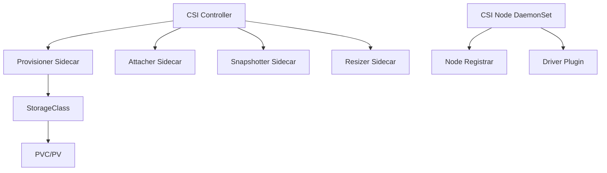

# How to Manage CSI Drivers with ArgoCD

Author: [nawazdhandala](https://github.com/nawazdhandala)

Tags: ArgoCD, GitOps, Kubernetes, CSI, Storage

Description: Learn how to deploy and manage Container Storage Interface (CSI) drivers with ArgoCD, covering installation, configuration, upgrades, and monitoring through GitOps workflows.

---

Container Storage Interface (CSI) drivers are essential components that connect your Kubernetes cluster to storage backends. Managing them through ArgoCD ensures consistent deployment, controlled upgrades, and full visibility into your storage infrastructure. This post covers deploying, configuring, and maintaining CSI drivers using ArgoCD.

## Understanding CSI Drivers in Kubernetes

CSI drivers consist of several components that work together:



The controller handles provisioning and attaching volumes, while the node DaemonSet handles mounting volumes on individual nodes. Both need to be managed carefully through ArgoCD.

## Deploying the AWS EBS CSI Driver

Here is a complete ArgoCD Application for the AWS EBS CSI driver:

```yaml
# applications/ebs-csi-driver.yaml
apiVersion: argoproj.io/v1alpha1
kind: Application
metadata:
  name: ebs-csi-driver
  namespace: argocd
  annotations:
    argocd.argoproj.io/sync-wave: "-5"  # Deploy before apps that need storage
spec:
  project: infrastructure
  source:
    repoURL: https://kubernetes-sigs.github.io/aws-ebs-csi-driver
    chart: aws-ebs-csi-driver
    targetRevision: 2.28.1
    helm:
      values: |
        controller:
          replicaCount: 2
          resources:
            requests:
              cpu: 100m
              memory: 128Mi
            limits:
              cpu: 500m
              memory: 256Mi
          # Topology aware scheduling
          topologySpreadConstraints:
            - maxSkew: 1
              topologyKey: topology.kubernetes.io/zone
              whenUnsatisfiable: DoNotSchedule
              labelSelector:
                matchLabels:
                  app: ebs-csi-controller
          serviceAccount:
            annotations:
              eks.amazonaws.com/role-arn: arn:aws:iam::123456789012:role/ebs-csi-role
        node:
          resources:
            requests:
              cpu: 50m
              memory: 64Mi
            limits:
              cpu: 200m
              memory: 128Mi
          tolerations:
            - operator: Exists  # Run on all nodes
        storageClasses:
          - name: gp3
            annotations:
              storageclass.kubernetes.io/is-default-class: "true"
            parameters:
              type: gp3
              encrypted: "true"
              fsType: ext4
            reclaimPolicy: Delete
            volumeBindingMode: WaitForFirstConsumer
            allowVolumeExpansion: true
          - name: io2
            parameters:
              type: io2
              iopsPerGB: "50"
              encrypted: "true"
            reclaimPolicy: Retain
            volumeBindingMode: WaitForFirstConsumer
            allowVolumeExpansion: true
        volumeSnapshotClasses:
          - name: ebs-snapshot
            annotations:
              snapshot.storage.kubernetes.io/is-default-class: "true"
            deletionPolicy: Retain
  destination:
    server: https://kubernetes.default.svc
    namespace: kube-system
  syncPolicy:
    automated:
      selfHeal: true
      prune: true
    syncOptions:
      - ServerSideApply=true
```

## Deploying the GCE PD CSI Driver

For Google Cloud:

```yaml
# applications/gce-pd-csi-driver.yaml
apiVersion: argoproj.io/v1alpha1
kind: Application
metadata:
  name: gce-pd-csi-driver
  namespace: argocd
spec:
  project: infrastructure
  source:
    repoURL: https://github.com/your-org/k8s-configs.git
    targetRevision: main
    path: csi-drivers/gce-pd
  destination:
    server: https://kubernetes.default.svc
    namespace: kube-system
  syncPolicy:
    automated:
      selfHeal: true
```

With the corresponding StorageClass definition in Git:

```yaml
# csi-drivers/gce-pd/storageclass.yaml
apiVersion: storage.k8s.io/v1
kind: StorageClass
metadata:
  name: pd-ssd
  annotations:
    storageclass.kubernetes.io/is-default-class: "true"
provisioner: pd.csi.storage.gke.io
parameters:
  type: pd-ssd
  replication-type: regional-pd  # For HA
reclaimPolicy: Delete
volumeBindingMode: WaitForFirstConsumer
allowVolumeExpansion: true
```

## Managing Multiple CSI Drivers

In real environments, you often need multiple CSI drivers for different storage types. Use an ApplicationSet to manage them:

```yaml
apiVersion: argoproj.io/v1alpha1
kind: ApplicationSet
metadata:
  name: csi-drivers
  namespace: argocd
spec:
  generators:
    - list:
        elements:
          - name: ebs-csi
            chart: aws-ebs-csi-driver
            repoURL: https://kubernetes-sigs.github.io/aws-ebs-csi-driver
            version: 2.28.1
            namespace: kube-system
          - name: efs-csi
            chart: aws-efs-csi-driver
            repoURL: https://kubernetes-sigs.github.io/aws-efs-csi-driver
            version: 2.5.7
            namespace: kube-system
          - name: secrets-store-csi
            chart: secrets-store-csi-driver
            repoURL: https://kubernetes-sigs.github.io/secrets-store-csi-driver/charts
            version: 1.4.1
            namespace: kube-system
  template:
    metadata:
      name: "csi-{{name}}"
    spec:
      project: infrastructure
      source:
        repoURL: "{{repoURL}}"
        chart: "{{chart}}"
        targetRevision: "{{version}}"
        helm:
          valueFiles:
            - values/{{name}}.yaml
      destination:
        server: https://kubernetes.default.svc
        namespace: "{{namespace}}"
      syncPolicy:
        automated:
          selfHeal: true
```

## Handling CSI Driver CRDs

CSI drivers often install CRDs. ArgoCD needs specific configuration to handle these properly:

```yaml
# In the Application spec
spec:
  syncPolicy:
    syncOptions:
      - ServerSideApply=true      # Required for large CRDs
      - CreateNamespace=true
      - Replace=true               # For CRD updates
  ignoreDifferences:
    - group: apiextensions.k8s.io
      kind: CustomResourceDefinition
      jsonPointers:
        - /status
        - /metadata/annotations
```

ServerSideApply is especially important for CSI driver CRDs because they can exceed the annotation size limit that client-side apply uses for tracking last-applied configuration.

## CSI Driver Upgrade Strategy

Upgrading CSI drivers requires care because they affect running workloads. Use a controlled approach:

```yaml
# Step 1: Update the chart version in your values file
# applications/ebs-csi-driver.yaml
spec:
  source:
    targetRevision: 2.29.0  # Updated from 2.28.1
    helm:
      values: |
        controller:
          # Add rolling update strategy
          strategy:
            type: RollingUpdate
            rollingUpdate:
              maxUnavailable: 0
              maxSurge: 1
        node:
          updateStrategy:
            type: RollingUpdate
            rollingUpdate:
              maxUnavailable: "10%"  # Update nodes gradually
```

For the node DaemonSet, setting `maxUnavailable` to a percentage ensures that nodes are updated gradually, preventing storage disruptions across the cluster.

## Health Checks for CSI Drivers

Define custom health checks in ArgoCD to monitor CSI driver health:

```yaml
# argocd-cm configmap addition
apiVersion: v1
kind: ConfigMap
metadata:
  name: argocd-cm
  namespace: argocd
data:
  resource.customizations.health.storage.k8s.io_CSIDriver: |
    hs = {}
    hs.status = "Healthy"
    hs.message = "CSI Driver registered"
    return hs
  resource.customizations.health.storage.k8s.io_CSINode: |
    hs = {}
    if obj.spec ~= nil and obj.spec.drivers ~= nil then
      for i, driver in ipairs(obj.spec.drivers) do
        if driver.nodeID ~= nil then
          hs.status = "Healthy"
          hs.message = "Node has " .. #obj.spec.drivers .. " CSI driver(s)"
          return hs
        end
      end
    end
    hs.status = "Degraded"
    hs.message = "No CSI drivers registered on node"
    return hs
```

## StorageClass Management

Store all StorageClasses in Git and manage them through a dedicated ArgoCD Application:

```yaml
# storage-classes/high-performance.yaml
apiVersion: storage.k8s.io/v1
kind: StorageClass
metadata:
  name: high-performance
  labels:
    tier: performance
provisioner: ebs.csi.aws.com
parameters:
  type: io2
  iopsPerGB: "50"
  encrypted: "true"
  kmsKeyId: arn:aws:kms:us-east-1:123456789012:key/abc-123
reclaimPolicy: Retain
volumeBindingMode: WaitForFirstConsumer
allowVolumeExpansion: true
mountOptions:
  - noatime
  - nodiratime
```

```yaml
# storage-classes/shared-filesystem.yaml
apiVersion: storage.k8s.io/v1
kind: StorageClass
metadata:
  name: shared-efs
provisioner: efs.csi.aws.com
parameters:
  provisioningMode: efs-ap
  fileSystemId: fs-abc123
  directoryPerms: "700"
  gidRangeStart: "1000"
  gidRangeEnd: "2000"
  basePath: "/dynamic_provisioning"
reclaimPolicy: Delete
volumeBindingMode: Immediate
```

## Monitoring CSI Driver Metrics

Deploy monitoring alongside your CSI drivers:

```yaml
# monitoring/csi-servicemonitor.yaml
apiVersion: monitoring.coreos.com/v1
kind: ServiceMonitor
metadata:
  name: ebs-csi-controller
  namespace: kube-system
  labels:
    release: prometheus
spec:
  selector:
    matchLabels:
      app: ebs-csi-controller
  endpoints:
    - port: metrics
      interval: 30s
      path: /metrics
```

You can use [OneUptime](https://oneuptime.com) to set up alerts on CSI driver health metrics, such as failed provision operations or slow attach times.

## Troubleshooting CSI Drivers with ArgoCD

Common issues when managing CSI drivers with ArgoCD:

1. **CRD conflicts**: Use `ServerSideApply=true` to avoid annotation size limits.
2. **DaemonSet stuck during sync**: Increase sync timeout for node DaemonSet updates.
3. **StorageClass immutability**: StorageClasses cannot be updated after creation. Delete and recreate if parameters need to change.
4. **RBAC issues**: CSI drivers need specific ClusterRoles. Ensure ArgoCD has permission to create them.

```yaml
# For StorageClass updates, use the Replace sync option
spec:
  syncPolicy:
    syncOptions:
      - Replace=true
```

## Summary

Managing CSI drivers through ArgoCD brings the benefits of GitOps to your storage infrastructure. Deploy drivers using Helm charts with pinned versions, manage StorageClasses declaratively, handle upgrades through controlled rolling updates, and monitor everything with custom health checks. The key is to treat CSI drivers as critical infrastructure with their own dedicated ArgoCD Applications, separate from the workloads that consume them. This separation ensures that storage infrastructure changes go through proper review and deployment pipelines.
