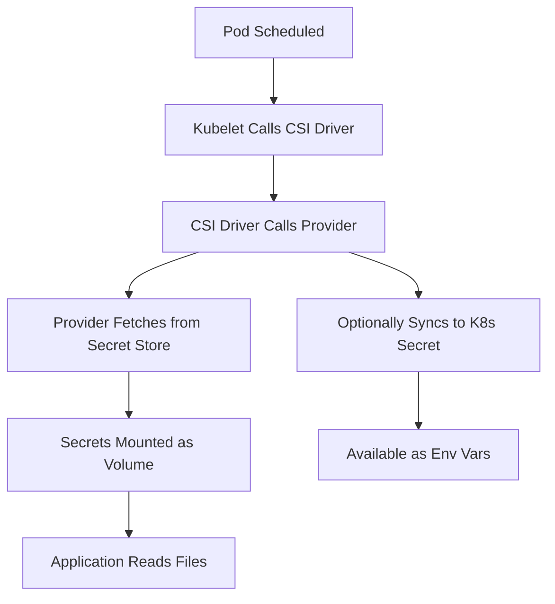

# How to Use CSI Secrets Store Driver with ArgoCD

Author: [nawazdhandala](https://github.com/nawazdhandala)

Tags: ArgoCD, GitOps, Kubernetes, CSI, Secrets Store

Description: Learn how to use the Kubernetes Secrets Store CSI Driver with ArgoCD to mount secrets from Vault, AWS, Azure, and GCP directly into pods as volumes.

---

The Secrets Store CSI Driver is a Kubernetes-native way to mount external secrets directly into pods as volumes. Unlike the Vault Agent Injector which adds a sidecar, the CSI driver uses the Container Storage Interface to mount secrets as a volume - no sidecars, no init containers. This guide covers how to use it with ArgoCD for a clean GitOps secret management workflow.

## How the CSI Secrets Store Driver Works



The CSI driver uses a provider model. Each secret store (Vault, AWS, Azure, GCP) has its own provider that knows how to fetch secrets from that specific backend.

## Installing the Secrets Store CSI Driver

Deploy the driver with ArgoCD:

```yaml
apiVersion: argoproj.io/v1alpha1
kind: Application
metadata:
  name: secrets-store-csi-driver
  namespace: argocd
spec:
  project: default
  source:
    repoURL: https://kubernetes-sigs.github.io/secrets-store-csi-driver/charts
    chart: secrets-store-csi-driver
    targetRevision: 1.4.0
    helm:
      values: |
        syncSecret:
          enabled: true  # Enable syncing to K8s Secrets
        enableSecretRotation: true
        rotationPollInterval: 2m
  destination:
    server: https://kubernetes.default.svc
    namespace: kube-system
  syncPolicy:
    automated:
      prune: true
      selfHeal: true
```

## Installing Providers

Each secret store needs its own provider. Install the ones you need.

### HashiCorp Vault Provider

```yaml
apiVersion: argoproj.io/v1alpha1
kind: Application
metadata:
  name: vault-csi-provider
  namespace: argocd
spec:
  project: default
  source:
    repoURL: https://helm.releases.hashicorp.com
    chart: vault
    targetRevision: 0.28.0
    helm:
      values: |
        server:
          enabled: false
        injector:
          enabled: false
        csi:
          enabled: true
  destination:
    server: https://kubernetes.default.svc
    namespace: vault
  syncPolicy:
    automated:
      prune: true
      selfHeal: true
    syncOptions:
      - CreateNamespace=true
```

### AWS Secrets Manager Provider

```yaml
apiVersion: argoproj.io/v1alpha1
kind: Application
metadata:
  name: aws-secrets-csi-provider
  namespace: argocd
spec:
  project: default
  source:
    repoURL: https://aws.github.io/secrets-store-csi-driver-provider-aws
    chart: secrets-store-csi-driver-provider-aws
    targetRevision: 0.3.0
  destination:
    server: https://kubernetes.default.svc
    namespace: kube-system
  syncPolicy:
    automated:
      prune: true
      selfHeal: true
```

### Azure Key Vault Provider

```yaml
apiVersion: argoproj.io/v1alpha1
kind: Application
metadata:
  name: azure-csi-provider
  namespace: argocd
spec:
  project: default
  source:
    repoURL: https://azure.github.io/secrets-store-csi-driver-provider-azure/charts
    chart: csi-secrets-store-provider-azure
    targetRevision: 1.5.0
  destination:
    server: https://kubernetes.default.svc
    namespace: kube-system
  syncPolicy:
    automated:
      prune: true
      selfHeal: true
```

### GCP Secret Manager Provider

```yaml
apiVersion: argoproj.io/v1alpha1
kind: Application
metadata:
  name: gcp-csi-provider
  namespace: argocd
spec:
  project: default
  source:
    repoURL: https://github.com/GoogleCloudPlatform/secrets-store-csi-driver-provider-gcp
    path: deploy
    targetRevision: main
  destination:
    server: https://kubernetes.default.svc
    namespace: kube-system
  syncPolicy:
    automated:
      prune: true
      selfHeal: true
```

## Creating SecretProviderClass Resources

The SecretProviderClass defines how to fetch secrets from the external store.

### For HashiCorp Vault

```yaml
apiVersion: secrets-store.csi.x-k8s.io/v1
kind: SecretProviderClass
metadata:
  name: vault-my-app
  namespace: app
spec:
  provider: vault
  parameters:
    vaultAddress: "https://vault.example.com"
    roleName: "my-app"
    objects: |
      - objectName: "db-password"
        secretPath: "secret/data/my-app/database"
        secretKey: "password"
      - objectName: "api-key"
        secretPath: "secret/data/my-app/api"
        secretKey: "key"
  # Optionally sync to a Kubernetes Secret
  secretObjects:
    - secretName: my-app-secrets
      type: Opaque
      data:
        - objectName: db-password
          key: DB_PASSWORD
        - objectName: api-key
          key: API_KEY
```

### For AWS Secrets Manager

```yaml
apiVersion: secrets-store.csi.x-k8s.io/v1
kind: SecretProviderClass
metadata:
  name: aws-my-app
  namespace: app
spec:
  provider: aws
  parameters:
    objects: |
      - objectName: "production/my-app"
        objectType: "secretsmanager"
        jmesPath:
          - path: DB_PASSWORD
            objectAlias: db-password
          - path: API_KEY
            objectAlias: api-key
  secretObjects:
    - secretName: my-app-secrets
      type: Opaque
      data:
        - objectName: db-password
          key: DB_PASSWORD
        - objectName: api-key
          key: API_KEY
```

### For Azure Key Vault

```yaml
apiVersion: secrets-store.csi.x-k8s.io/v1
kind: SecretProviderClass
metadata:
  name: azure-my-app
  namespace: app
spec:
  provider: azure
  parameters:
    usePodIdentity: "false"
    useVMManagedIdentity: "true"
    userAssignedIdentityID: "<identity-client-id>"
    keyvaultName: "my-keyvault"
    objects: |
      array:
        - |
          objectName: production-db-password
          objectType: secret
        - |
          objectName: production-api-key
          objectType: secret
    tenantId: "<tenant-id>"
  secretObjects:
    - secretName: my-app-secrets
      type: Opaque
      data:
        - objectName: production-db-password
          key: DB_PASSWORD
        - objectName: production-api-key
          key: API_KEY
```

### For GCP Secret Manager

```yaml
apiVersion: secrets-store.csi.x-k8s.io/v1
kind: SecretProviderClass
metadata:
  name: gcp-my-app
  namespace: app
spec:
  provider: gcp
  parameters:
    secrets: |
      - resourceName: "projects/my-project/secrets/production-db-password/versions/latest"
        path: "db-password"
      - resourceName: "projects/my-project/secrets/production-api-key/versions/latest"
        path: "api-key"
  secretObjects:
    - secretName: my-app-secrets
      type: Opaque
      data:
        - objectName: db-password
          key: DB_PASSWORD
        - objectName: api-key
          key: API_KEY
```

## Using CSI Secrets in Pods

### Volume Mount Approach

```yaml
apiVersion: apps/v1
kind: Deployment
metadata:
  name: my-app
  namespace: app
spec:
  replicas: 2
  selector:
    matchLabels:
      app: my-app
  template:
    metadata:
      labels:
        app: my-app
    spec:
      serviceAccountName: my-app
      containers:
        - name: app
          image: my-app:latest
          volumeMounts:
            - name: secrets
              mountPath: /mnt/secrets
              readOnly: true
          # Secrets available at:
          # /mnt/secrets/db-password
          # /mnt/secrets/api-key
      volumes:
        - name: secrets
          csi:
            driver: secrets-store.csi.k8s.io
            readOnly: true
            volumeAttributes:
              secretProviderClass: vault-my-app
```

### Environment Variables via Synced Secret

When you enable `secretObjects` in the SecretProviderClass, the CSI driver creates a Kubernetes Secret. Use it for environment variables:

```yaml
apiVersion: apps/v1
kind: Deployment
metadata:
  name: my-app
  namespace: app
spec:
  template:
    spec:
      serviceAccountName: my-app
      containers:
        - name: app
          image: my-app:latest
          envFrom:
            - secretRef:
                name: my-app-secrets  # Created by CSI driver
          volumeMounts:
            - name: secrets
              mountPath: /mnt/secrets
              readOnly: true
      volumes:
        - name: secrets
          csi:
            driver: secrets-store.csi.k8s.io
            readOnly: true
            volumeAttributes:
              secretProviderClass: vault-my-app
```

**Important**: The volume must be mounted even if you only use environment variables. The Kubernetes Secret is only created when the volume is mounted.

## ArgoCD Integration

### Sync Ordering

Use sync waves to ensure the SecretProviderClass is created before the deployment:

```yaml
apiVersion: secrets-store.csi.x-k8s.io/v1
kind: SecretProviderClass
metadata:
  name: vault-my-app
  namespace: app
  annotations:
    argocd.argoproj.io/sync-wave: "-1"
---
apiVersion: apps/v1
kind: Deployment
metadata:
  name: my-app
  namespace: app
  annotations:
    argocd.argoproj.io/sync-wave: "0"
```

### Ignore Generated Secrets

The CSI driver creates Kubernetes Secrets that are not in Git. Tell ArgoCD to ignore them:

```yaml
apiVersion: argoproj.io/v1alpha1
kind: Application
metadata:
  name: my-app
spec:
  ignoreDifferences:
    - group: ""
      kind: Secret
      name: my-app-secrets
      jsonPointers:
        - /data
        - /metadata/labels
```

### Custom Health Check

Add a custom health check for SecretProviderClass:

```yaml
apiVersion: v1
kind: ConfigMap
metadata:
  name: argocd-cm
  namespace: argocd
data:
  resource.customizations.health.secrets-store.csi.x-k8s.io_SecretProviderClass: |
    hs = {}
    hs.status = "Healthy"
    hs.message = "SecretProviderClass is configured"
    return hs
```

## Secret Rotation

Enable automatic rotation in the CSI driver:

```yaml
# In the CSI driver Helm values
enableSecretRotation: true
rotationPollInterval: 2m  # Check every 2 minutes
```

The driver periodically checks the secret store for updates and remounts the volume with new values. If `syncSecret` is enabled, the Kubernetes Secret is also updated.

**Note**: Applications need to watch for file changes or be restarted to pick up rotated secrets. Most applications read secrets at startup, so you may need a rolling restart.

## Troubleshooting

```bash
# Check CSI driver pods
kubectl get pods -n kube-system -l app=secrets-store-csi-driver

# Check provider pods
kubectl get pods -n vault -l app.kubernetes.io/name=vault-csi-provider

# Check SecretProviderClass status
kubectl get secretproviderclass -n app

# Check secret sync status
kubectl get secretproviderclasspodstatus -n app

# Check driver logs
kubectl logs -n kube-system -l app=secrets-store-csi-driver -c secrets-store

# Check provider logs
kubectl logs -n vault -l app.kubernetes.io/name=vault-csi-provider
```

## Conclusion

The Secrets Store CSI Driver provides a Kubernetes-native approach to mounting external secrets without sidecars or init containers. It works with every major cloud provider's secret store plus HashiCorp Vault. When combined with ArgoCD, the SecretProviderClass resources live in Git (they contain only configuration, no secret values), and the CSI driver handles fetching and mounting secrets at pod startup. The main trade-off compared to the External Secrets Operator is that CSI driver secrets are only available when a pod mounts the volume, while ESO creates standalone Kubernetes Secrets.

For alternative approaches, see our guides on [using Vault Agent Injector with ArgoCD](https://oneuptime.com/blog/post/2026-02-26-argocd-vault-agent-injector/view) and [using External Secrets Operator with ArgoCD](https://oneuptime.com/blog/post/2026-02-26-argocd-external-secrets-operator/view).
