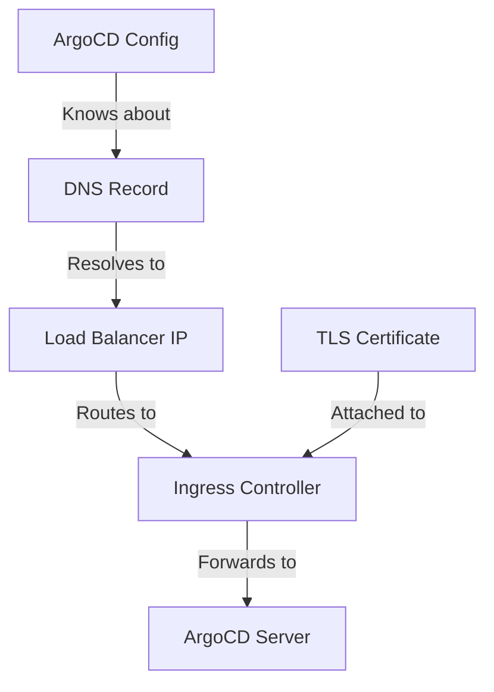

# How to Configure ArgoCD with Custom Domain Name

Author: [nawazdhandala](https://github.com/nawazdhandala)

Tags: ArgoCD, GitOps, Kubernetes, DNS, Networking

Description: Complete guide to configuring ArgoCD with a custom domain name including DNS setup, TLS certificates, ingress configuration, and SSO callback URLs.

---

Running ArgoCD on a custom domain like `argocd.yourcompany.com` makes it accessible through a memorable URL instead of an IP address or port-forward. This guide covers the full process from DNS configuration to ArgoCD server settings, including the parts that most guides miss like updating SSO callback URLs and CLI configuration.

## Overview

Configuring a custom domain for ArgoCD involves several components working together:



Each piece needs to be configured correctly. Missing any one of them leads to redirect loops, certificate errors, or broken SSO.

## Step 1: Reserve an External IP

For production, reserve a static IP so your DNS does not break when the load balancer is recreated:

```bash
# AWS - Elastic IP
aws ec2 allocate-address --domain vpc

# GCP - Static IP
gcloud compute addresses create argocd-ip --global

# Azure - Static IP
az network public-ip create --name argocd-ip --resource-group myRG --sku Standard --allocation-method Static
```

If you are using an ingress controller with a LoadBalancer service, the IP is assigned automatically. Get it with:

```bash
# Get the external IP of your ingress controller
kubectl get svc -n ingress-nginx ingress-nginx-controller -o jsonpath='{.status.loadBalancer.ingress[0].ip}'

# For AWS (uses hostname instead of IP)
kubectl get svc -n ingress-nginx ingress-nginx-controller -o jsonpath='{.status.loadBalancer.ingress[0].hostname}'
```

## Step 2: Configure DNS

Create a DNS record pointing your domain to the external IP:

### A Record (for IP address)

```text
Type: A
Name: argocd.yourcompany.com
Value: 203.0.113.10
TTL: 300
```

### CNAME Record (for AWS load balancer hostname)

```text
Type: CNAME
Name: argocd.yourcompany.com
Value: abc123-1234567890.us-east-1.elb.amazonaws.com
TTL: 300
```

### Using ExternalDNS for Automatic DNS Management

If you are using ExternalDNS, add annotations to your ingress:

```yaml
annotations:
  external-dns.alpha.kubernetes.io/hostname: argocd.yourcompany.com
  external-dns.alpha.kubernetes.io/ttl: "300"
```

Verify DNS resolution:

```bash
# Check DNS resolution
dig argocd.yourcompany.com

# Or with nslookup
nslookup argocd.yourcompany.com
```

## Step 3: Configure ArgoCD Server

Tell ArgoCD about its domain name. This is critical for generating correct URLs in the UI and for SSO redirects:

```yaml
apiVersion: v1
kind: ConfigMap
metadata:
  name: argocd-cm
  namespace: argocd
data:
  # Set the external URL
  url: https://argocd.yourcompany.com
```

If you are using TLS termination at the ingress, also set insecure mode:

```yaml
apiVersion: v1
kind: ConfigMap
metadata:
  name: argocd-cmd-params-cm
  namespace: argocd
data:
  server.insecure: "true"
```

Apply and restart:

```bash
kubectl apply -f argocd-cm.yaml
kubectl apply -f argocd-cmd-params-cm.yaml
kubectl rollout restart deployment argocd-server -n argocd
```

## Step 4: Create the Ingress

```yaml
apiVersion: networking.k8s.io/v1
kind: Ingress
metadata:
  name: argocd-server-ingress
  namespace: argocd
  annotations:
    cert-manager.io/cluster-issuer: letsencrypt-prod
    nginx.ingress.kubernetes.io/backend-protocol: "HTTP"
    nginx.ingress.kubernetes.io/force-ssl-redirect: "true"
    nginx.ingress.kubernetes.io/proxy-buffer-size: "64k"
spec:
  ingressClassName: nginx
  rules:
    - host: argocd.yourcompany.com
      http:
        paths:
          - path: /
            pathType: Prefix
            backend:
              service:
                name: argocd-server
                port:
                  number: 80
  tls:
    - hosts:
        - argocd.yourcompany.com
      secretName: argocd-server-tls
```

## Step 5: Update SSO Configuration

If you use SSO (OIDC, SAML, or Dex), update the callback URLs to use the new domain:

### OIDC Configuration

```yaml
apiVersion: v1
kind: ConfigMap
metadata:
  name: argocd-cm
  namespace: argocd
data:
  url: https://argocd.yourcompany.com
  oidc.config: |
    name: Okta
    issuer: https://yourcompany.okta.com/oauth2/default
    clientID: your-client-id
    clientSecret: $oidc.okta.clientSecret
    requestedScopes: ["openid", "profile", "email", "groups"]
    # The callback URL must use your custom domain
    # Okta/your IDP must have this URL registered
```

Update your identity provider (Okta, Azure AD, Google, etc.) with the new callback URL:

```text
https://argocd.yourcompany.com/auth/callback
```

### Dex Configuration

```yaml
apiVersion: v1
kind: ConfigMap
metadata:
  name: argocd-cm
  namespace: argocd
data:
  url: https://argocd.yourcompany.com
  dex.config: |
    connectors:
      - type: github
        id: github
        name: GitHub
        config:
          clientID: your-client-id
          clientSecret: $dex.github.clientSecret
          orgs:
            - name: your-org
    # Dex automatically uses the ArgoCD URL for callbacks
```

## Step 6: Configure CLI

Update the ArgoCD CLI to use the custom domain:

```bash
# Login with the new domain
argocd login argocd.yourcompany.com --grpc-web

# Or with SSO
argocd login argocd.yourcompany.com --sso --grpc-web
```

The CLI stores the server context in `~/.config/argocd/config`:

```yaml
contexts:
  - name: argocd.yourcompany.com
    server: argocd.yourcompany.com
    user: argocd.yourcompany.com
    config:
      grpc-web: true
current-context: argocd.yourcompany.com
```

## Step 7: Update Webhook URLs

If you have webhooks configured for automatic sync triggers, update them to use the new domain:

```text
# GitHub webhook URL
https://argocd.yourcompany.com/api/webhook

# GitLab webhook URL
https://argocd.yourcompany.com/api/webhook
```

## Handling Multiple Domains

If you need both a UI domain and a gRPC domain:

```yaml
apiVersion: networking.k8s.io/v1
kind: Ingress
metadata:
  name: argocd-server-ingress
  namespace: argocd
  annotations:
    cert-manager.io/cluster-issuer: letsencrypt-prod
    nginx.ingress.kubernetes.io/backend-protocol: "HTTP"
spec:
  ingressClassName: nginx
  rules:
    - host: argocd.yourcompany.com
      http:
        paths:
          - path: /
            pathType: Prefix
            backend:
              service:
                name: argocd-server
                port:
                  number: 80
  tls:
    - hosts:
        - argocd.yourcompany.com
        - grpc.argocd.yourcompany.com
      secretName: argocd-server-tls
```

## Verifying the Setup

```bash
# Check DNS resolution
dig argocd.yourcompany.com +short

# Check TLS certificate
curl -vI https://argocd.yourcompany.com 2>&1 | grep -E "subject|issuer|SSL"

# Check ArgoCD URL configuration
kubectl get configmap argocd-cm -n argocd -o jsonpath='{.data.url}'

# Test the UI
curl -I https://argocd.yourcompany.com

# Test CLI
argocd login argocd.yourcompany.com --grpc-web

# Test SSO (if configured)
argocd login argocd.yourcompany.com --sso --grpc-web
```

## Troubleshooting

**Redirect Loop**: The `url` in argocd-cm does not match the actual URL, or `server.insecure` is not set when using TLS termination.

**SSO Callback Fails**: The callback URL in your identity provider does not match the custom domain. Update it to `https://argocd.yourcompany.com/auth/callback`.

**DNS Not Resolving**: DNS propagation takes time (up to 48 hours for new domains, usually minutes for updates). Use `dig` to check propagation.

**Certificate Not Valid**: The certificate does not include the custom domain. Check that the TLS secret has the correct domain in the certificate.

For more networking guides, see [ArgoCD with cert-manager](https://oneuptime.com/blog/post/2026-02-26-argocd-cert-manager-ssl/view) and [configuring ArgoCD server as insecure](https://oneuptime.com/blog/post/2026-02-26-argocd-server-insecure-mode/view).
