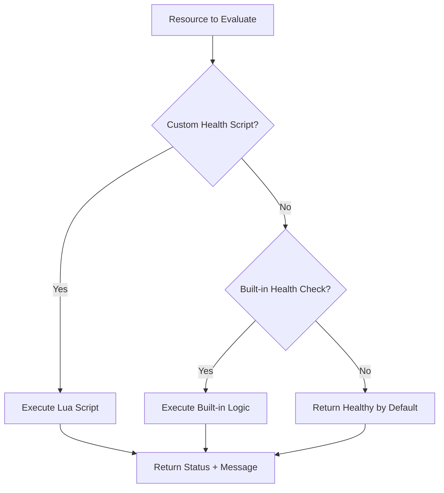

# How to Write Custom Health Check Scripts in Lua for ArgoCD

Author: [nawazdhandala](https://github.com/nawazdhandala)

Tags: ArgoCD, GitOps, Kubernetes, Lua, Health Check

Description: Learn how to write custom Lua health check scripts for ArgoCD to assess the health of custom resources and override default health behavior.

---

ArgoCD includes built-in health checks for standard Kubernetes resources like Deployments and Services. But when you deploy custom resources from operators, third-party CRDs, or resources with complex health conditions, ArgoCD defaults to reporting them as "Healthy" simply because they exist. That is not useful. You need to teach ArgoCD how to actually evaluate the health of these resources.

ArgoCD uses Lua scripts for custom health assessment. Lua is a lightweight scripting language that ArgoCD embeds in its controller. This guide teaches you the Lua scripting patterns you need to write effective health checks.

## How Custom Health Checks Work

When ArgoCD evaluates a resource's health:

1. It checks if there is a custom health check defined for that resource's group/kind
2. If yes, it runs the Lua script, passing the resource object as input
3. The script returns a health status and optional message
4. ArgoCD uses this status for the resource and aggregates it into the application health



## Where to Configure Custom Health Checks

Custom health checks are configured in the `argocd-cm` ConfigMap:

```yaml
apiVersion: v1
kind: ConfigMap
metadata:
  name: argocd-cm
  namespace: argocd
data:
  resource.customizations.health.<group>_<kind>: |
    -- Lua script goes here
```

The key format is `resource.customizations.health.<group>_<kind>` where:
- `<group>` is the API group (use empty string for core resources)
- `<kind>` is the resource kind

## Lua Script Basics

### The Script Contract

Your Lua script receives one variable: `obj` - the full Kubernetes resource as a Lua table. You must return a table with:

- `status` (required): One of `"Healthy"`, `"Progressing"`, `"Degraded"`, `"Suspended"`, `"Missing"`
- `message` (optional): A human-readable message explaining the status

```lua
-- Minimal health check
hs = {}
hs.status = "Healthy"
hs.message = "Resource exists and is operational"
return hs
```

### Accessing Resource Fields

The `obj` variable mirrors the JSON structure of the Kubernetes resource:

```lua
-- Access metadata
obj.metadata.name
obj.metadata.namespace
obj.metadata.labels["app"]
obj.metadata.annotations["some-annotation"]

-- Access spec
obj.spec.replicas
obj.spec.selector.matchLabels["app"]

-- Access status
obj.status.phase
obj.status.conditions
obj.status.readyReplicas
```

### Handling Nil Values

Always check for nil before accessing nested fields. Lua does not throw errors on nil access for simple fields, but chaining nil access causes errors:

```lua
-- Unsafe - crashes if status is nil
local phase = obj.status.phase

-- Safe - check each level
if obj.status ~= nil then
  if obj.status.phase ~= nil then
    local phase = obj.status.phase
  end
end

-- Shorter safe access pattern
if obj.status == nil or obj.status.phase == nil then
  hs.status = "Progressing"
  hs.message = "Status not yet available"
  return hs
end
```

## Writing Your First Health Check

Let's write a health check for a simple CRD that has a `status.phase` field:

```yaml
apiVersion: v1
kind: ConfigMap
metadata:
  name: argocd-cm
  namespace: argocd
data:
  resource.customizations.health.example.com_MyResource: |
    hs = {}
    if obj.status == nil or obj.status.phase == nil then
      hs.status = "Progressing"
      hs.message = "Waiting for resource to initialize"
      return hs
    end
    if obj.status.phase == "Ready" then
      hs.status = "Healthy"
      hs.message = "Resource is ready"
    elseif obj.status.phase == "Failed" then
      hs.status = "Degraded"
      hs.message = obj.status.message or "Resource has failed"
    elseif obj.status.phase == "Pending" then
      hs.status = "Progressing"
      hs.message = "Resource is being provisioned"
    else
      hs.status = "Unknown"
      hs.message = "Unknown phase: " .. obj.status.phase
    end
    return hs
```

## Common Lua Patterns for Health Checks

### Pattern: Check Status Conditions

Many Kubernetes resources use the conditions pattern (array of condition objects):

```lua
-- resource.customizations.health.example.com_MyOperator
hs = {}
if obj.status == nil or obj.status.conditions == nil then
  hs.status = "Progressing"
  hs.message = "Waiting for conditions"
  return hs
end

-- Iterate through conditions
for i, condition in ipairs(obj.status.conditions) do
  if condition.type == "Ready" then
    if condition.status == "True" then
      hs.status = "Healthy"
      hs.message = "Resource is ready"
    elseif condition.status == "False" then
      hs.status = "Degraded"
      hs.message = condition.message or "Resource is not ready"
    else
      hs.status = "Progressing"
      hs.message = "Ready condition is unknown"
    end
    return hs
  end
end

-- No Ready condition found
hs.status = "Progressing"
hs.message = "Ready condition not yet reported"
return hs
```

### Pattern: Check Multiple Conditions

Some resources require multiple conditions to all be true:

```lua
hs = {}
if obj.status == nil or obj.status.conditions == nil then
  hs.status = "Progressing"
  hs.message = "No conditions available"
  return hs
end

local ready = false
local synced = false
local degradedMsg = nil

for i, condition in ipairs(obj.status.conditions) do
  if condition.type == "Ready" and condition.status == "True" then
    ready = true
  end
  if condition.type == "Synced" and condition.status == "True" then
    synced = true
  end
  if condition.status == "False" then
    degradedMsg = condition.type .. ": " .. (condition.message or "unknown")
  end
end

if ready and synced then
  hs.status = "Healthy"
  hs.message = "Ready and synced"
elseif degradedMsg ~= nil then
  hs.status = "Degraded"
  hs.message = degradedMsg
else
  hs.status = "Progressing"
  hs.message = "Waiting for Ready and Synced conditions"
end
return hs
```

### Pattern: Check Observed Generation

Ensure the controller has processed the latest spec:

```lua
hs = {}
if obj.status == nil then
  hs.status = "Progressing"
  hs.message = "No status available"
  return hs
end

-- Check if controller has observed the latest generation
if obj.status.observedGeneration ~= nil and obj.metadata.generation ~= nil then
  if obj.status.observedGeneration ~= obj.metadata.generation then
    hs.status = "Progressing"
    hs.message = "Controller has not processed latest changes"
    return hs
  end
end

-- Then check actual health
if obj.status.phase == "Running" then
  hs.status = "Healthy"
  hs.message = "Running"
else
  hs.status = "Progressing"
  hs.message = "Phase: " .. (obj.status.phase or "unknown")
end
return hs
```

### Pattern: Check Replica Counts

For custom controllers that manage replicas:

```lua
hs = {}
if obj.status == nil then
  hs.status = "Progressing"
  hs.message = "No status"
  return hs
end

local desired = obj.spec.replicas or 1
local ready = obj.status.readyReplicas or 0
local updated = obj.status.updatedReplicas or 0

if ready == desired and updated == desired then
  hs.status = "Healthy"
  hs.message = ready .. "/" .. desired .. " replicas ready"
elseif ready < desired then
  hs.status = "Progressing"
  hs.message = ready .. "/" .. desired .. " replicas ready"
else
  hs.status = "Degraded"
  hs.message = "Unexpected replica state"
end
return hs
```

## Testing Lua Scripts

### Using the ArgoCD Admin Tool

ArgoCD provides a tool for testing Lua scripts:

```bash
# Test a health check against a resource
argocd admin settings resource-health /path/to/resource.yaml \
  --argocd-cm-path /path/to/argocd-cm.yaml
```

### Manual Testing

Create a test resource YAML and run your logic mentally or with a Lua interpreter:

```bash
# Install Lua locally
# macOS: brew install lua
# Ubuntu: apt install lua5.3

# Create a test script
cat > test-health.lua << 'EOF'
-- Simulate the resource object
obj = {
  metadata = { name = "test", generation = 2 },
  status = {
    observedGeneration = 2,
    conditions = {
      { type = "Ready", status = "True", message = "All good" }
    }
  }
}

-- Your health check script
hs = {}
if obj.status == nil or obj.status.conditions == nil then
  hs.status = "Progressing"
  return hs
end
for i, condition in ipairs(obj.status.conditions) do
  if condition.type == "Ready" then
    if condition.status == "True" then
      hs.status = "Healthy"
      hs.message = condition.message
    else
      hs.status = "Degraded"
      hs.message = condition.message
    end
    return hs
  end
end
hs.status = "Progressing"
return hs
EOF

lua test-health.lua
```

## Deploying Custom Health Checks

After writing and testing your script:

```bash
# Edit the argocd-cm ConfigMap
kubectl edit cm argocd-cm -n argocd

# Or apply from a file
kubectl apply -f argocd-cm.yaml

# The ArgoCD controller picks up changes automatically
# Force a refresh on affected applications
argocd app get my-app --hard-refresh
```

## Debugging Health Check Issues

```bash
# Check ArgoCD controller logs for Lua errors
kubectl logs -n argocd deployment/argocd-application-controller | \
  grep -i "lua\|health\|error"

# Verify the ConfigMap is correct
kubectl get cm argocd-cm -n argocd -o yaml | \
  grep "resource.customizations.health"

# Check the actual health status of a resource
argocd app get my-app -o json | \
  jq '.status.resources[] | select(.kind == "MyResource") | .health'
```

Common issues:
- **Lua syntax errors**: Missing `end`, wrong string concatenation (use `..` not `+`)
- **Nil access**: Always check for nil before accessing nested fields
- **Wrong return format**: Must return a table with `status` field
- **Wrong key in ConfigMap**: Group and kind must match exactly

## Best Practices

1. **Always handle nil status** - Resources may not have status immediately after creation
2. **Check observed generation** - Ensure the controller has processed the latest changes
3. **Return meaningful messages** - Help operators understand why something is unhealthy
4. **Keep scripts simple** - Complex Lua logic is hard to debug. If the check is complicated, reconsider
5. **Test thoroughly** - Test with nil status, partial status, error states, and happy path

For specific health check examples, see [How to Configure Health Checks for CRDs](https://oneuptime.com/blog/post/2026-02-26-argocd-health-checks-crds/view) and [How to Configure Health Checks for Argo Rollouts](https://oneuptime.com/blog/post/2026-02-26-argocd-health-checks-argo-rollouts/view).
