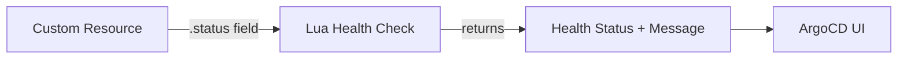

# How to Extend ArgoCD with Custom Health Checks

Author: [nawazdhandala](https://github.com/nawazdhandala)

Tags: ArgoCD, GitOps, Kubernetes, Health Check, Lua

Description: Learn how to write custom health check scripts in ArgoCD using Lua to accurately assess the health of CRDs, operators, and custom resources.

---

ArgoCD ships with built-in health checks for standard Kubernetes resources like Deployments, StatefulSets, Services, and Ingresses. But when you use custom resources from operators - things like PostgreSQL clusters, Kafka topics, Istio VirtualServices, or any CRD - ArgoCD does not know how to determine their health. The resource will show as "Missing" or "Unknown" health status, which makes the overall application health unreliable.

Custom health checks solve this by letting you write Lua scripts that teach ArgoCD how to interpret the health of any resource type.

## Why Custom Health Checks Matter

Without custom health checks, ArgoCD cannot tell you if your custom resources are actually healthy. Consider this scenario: you deploy a PostgreSQL cluster using the Zalando operator. ArgoCD shows the Application as "Healthy" because all the standard Kubernetes resources (pods, services) are fine. But the PostgreSQL operator itself reports that the cluster is in a degraded state. Without a custom health check, ArgoCD has no idea.

Custom health checks close this gap. They tell ArgoCD exactly how to interpret the `.status` field of any custom resource.

## How Custom Health Checks Work

ArgoCD uses Lua scripts for custom health checks. The script receives the resource object and must return a health status object with:

- **status** - One of: `Healthy`, `Degraded`, `Progressing`, `Suspended`, `Missing`, `Unknown`
- **message** - A human-readable description of the health state



## Configuring Custom Health Checks

Health checks are configured in the `argocd-cm` ConfigMap.

### Basic Structure

```yaml
apiVersion: v1
kind: ConfigMap
metadata:
  name: argocd-cm
  namespace: argocd
data:
  # Format: resource.customizations.health.<group_kind>
  resource.customizations.health.argoproj.io_Rollout: |
    hs = {}
    if obj.status ~= nil then
      if obj.status.phase == "Healthy" then
        hs.status = "Healthy"
        hs.message = "Rollout is healthy"
      elseif obj.status.phase == "Paused" then
        hs.status = "Suspended"
        hs.message = "Rollout is paused"
      elseif obj.status.phase == "Progressing" then
        hs.status = "Progressing"
        hs.message = "Rollout is progressing"
      elseif obj.status.phase == "Degraded" then
        hs.status = "Degraded"
        hs.message = obj.status.message or "Rollout is degraded"
      else
        hs.status = "Unknown"
        hs.message = "Unknown phase: " .. tostring(obj.status.phase)
      end
    else
      hs.status = "Progressing"
      hs.message = "Waiting for status"
    end
    return hs
```

## Example 1: Zalando PostgreSQL Operator

The Zalando PostgreSQL operator uses a `postgresql` CRD with a `status.PostgresClusterStatus` field.

```yaml
data:
  resource.customizations.health.acid.zalan.do_postgresql: |
    hs = {}
    if obj.status ~= nil then
      if obj.status.PostgresClusterStatus == "Running" then
        hs.status = "Healthy"
        hs.message = "PostgreSQL cluster is running"
      elseif obj.status.PostgresClusterStatus == "Creating" or
             obj.status.PostgresClusterStatus == "Updating" then
        hs.status = "Progressing"
        hs.message = "PostgreSQL cluster is " .. obj.status.PostgresClusterStatus
      elseif obj.status.PostgresClusterStatus == "CreateFailed" or
             obj.status.PostgresClusterStatus == "UpdateFailed" then
        hs.status = "Degraded"
        hs.message = "PostgreSQL cluster failed: " .. tostring(obj.status.PostgresClusterStatus)
      else
        hs.status = "Unknown"
        hs.message = "Unknown status: " .. tostring(obj.status.PostgresClusterStatus)
      end
    else
      hs.status = "Progressing"
      hs.message = "Waiting for PostgreSQL cluster status"
    end
    return hs
```

## Example 2: Strimzi Kafka Cluster

Strimzi Kafka uses conditions in its status to report health.

```yaml
data:
  resource.customizations.health.kafka.strimzi.io_Kafka: |
    hs = {}
    if obj.status ~= nil and obj.status.conditions ~= nil then
      for i, condition in ipairs(obj.status.conditions) do
        if condition.type == "Ready" then
          if condition.status == "True" then
            hs.status = "Healthy"
            hs.message = "Kafka cluster is ready"
            return hs
          else
            hs.status = "Degraded"
            hs.message = condition.message or "Kafka cluster is not ready"
            return hs
          end
        end
        if condition.type == "NotReady" and condition.status == "True" then
          hs.status = "Progressing"
          hs.message = condition.message or "Kafka cluster is starting"
          return hs
        end
      end
      hs.status = "Progressing"
      hs.message = "Waiting for Ready condition"
    else
      hs.status = "Progressing"
      hs.message = "Waiting for Kafka cluster status"
    end
    return hs
```

## Example 3: Istio VirtualService

VirtualServices do not have a standard status field, but you can check for validation errors.

```yaml
data:
  resource.customizations.health.networking.istio.io_VirtualService: |
    hs = {}
    if obj.status ~= nil and obj.status.validationMessages ~= nil then
      for i, msg in ipairs(obj.status.validationMessages) do
        if msg.type == "ERROR" then
          hs.status = "Degraded"
          hs.message = msg.message or "VirtualService has validation errors"
          return hs
        end
      end
    end
    -- VirtualServices without errors are considered healthy
    hs.status = "Healthy"
    hs.message = "VirtualService is configured"
    return hs
```

## Example 4: cert-manager Certificate

Certificates have a well-defined status with conditions.

```yaml
data:
  resource.customizations.health.cert-manager.io_Certificate: |
    hs = {}
    if obj.status ~= nil then
      if obj.status.conditions ~= nil then
        for i, condition in ipairs(obj.status.conditions) do
          if condition.type == "Ready" then
            if condition.status == "True" then
              hs.status = "Healthy"
              hs.message = "Certificate is ready and valid"
              -- Check if certificate is expiring soon
              if obj.status.notAfter ~= nil then
                hs.message = "Certificate valid until " .. obj.status.notAfter
              end
              return hs
            else
              -- Check if it is being issued
              if condition.reason == "Issuing" then
                hs.status = "Progressing"
                hs.message = "Certificate is being issued"
              else
                hs.status = "Degraded"
                hs.message = condition.message or "Certificate is not ready"
              end
              return hs
            end
          end
        end
      end
      hs.status = "Progressing"
      hs.message = "Waiting for certificate conditions"
    else
      hs.status = "Progressing"
      hs.message = "Waiting for certificate status"
    end
    return hs
```

## Example 5: External Secrets Operator

Check if external secrets have been successfully synced.

```yaml
data:
  resource.customizations.health.external-secrets.io_ExternalSecret: |
    hs = {}
    if obj.status ~= nil then
      if obj.status.conditions ~= nil then
        for i, condition in ipairs(obj.status.conditions) do
          if condition.type == "Ready" then
            if condition.status == "True" then
              hs.status = "Healthy"
              hs.message = "Secret synced successfully"
              if obj.status.refreshTime ~= nil then
                hs.message = "Last synced: " .. obj.status.refreshTime
              end
              return hs
            else
              hs.status = "Degraded"
              hs.message = condition.message or "Failed to sync secret"
              return hs
            end
          end
        end
      end
      -- Check for specific status fields
      if obj.status.syncedResourceVersion ~= nil then
        hs.status = "Healthy"
        hs.message = "Secret synced"
        return hs
      end
    end
    hs.status = "Progressing"
    hs.message = "Waiting for secret sync"
    return hs
```

## Example 6: Prometheus ServiceMonitor

ServiceMonitors do not have a status field, so we check for proper configuration.

```yaml
data:
  resource.customizations.health.monitoring.coreos.com_ServiceMonitor: |
    hs = {}
    -- ServiceMonitors don't have status, so check spec validity
    if obj.spec ~= nil then
      if obj.spec.endpoints ~= nil and #obj.spec.endpoints > 0 then
        if obj.spec.selector ~= nil and obj.spec.selector.matchLabels ~= nil then
          hs.status = "Healthy"
          hs.message = "ServiceMonitor configured with " ..
                       #obj.spec.endpoints .. " endpoint(s)"
          return hs
        end
      end
      hs.status = "Degraded"
      hs.message = "ServiceMonitor missing endpoints or selector"
    else
      hs.status = "Degraded"
      hs.message = "ServiceMonitor has no spec"
    end
    return hs
```

## Using the Alternative ConfigMap Format

For better organization, you can use separate ConfigMap keys per resource type instead of putting everything in `argocd-cm`.

```yaml
apiVersion: v1
kind: ConfigMap
metadata:
  name: argocd-cm
  namespace: argocd
data:
  # Reference an external resource customization
  resource.customizations: |
    - group: acid.zalan.do
      kind: postgresql
      health.lua: |
        -- health check script here
    - group: kafka.strimzi.io
      kind: Kafka
      health.lua: |
        -- health check script here
```

## Testing Health Check Scripts

Test your Lua scripts before deploying them.

```bash
# Install Lua 5.3 or later
# Create a test script
cat > test_health.lua << 'EOF'
-- Simulate the resource object
obj = {
  status = {
    PostgresClusterStatus = "Running"
  }
}

-- Paste your health check script here
hs = {}
if obj.status ~= nil then
  if obj.status.PostgresClusterStatus == "Running" then
    hs.status = "Healthy"
    hs.message = "PostgreSQL cluster is running"
  end
end

print("Status:", hs.status)
print("Message:", hs.message)
EOF

lua test_health.lua
```

## Applying Health Check Changes

After updating the ConfigMap, ArgoCD picks up changes automatically. You do not need to restart the server.

```bash
# Apply the updated ConfigMap
kubectl apply -f argocd-cm.yaml

# Verify the health check is working
# Force a refresh of your application
argocd app get my-app --refresh

# Check the health status
argocd app get my-app | grep -i health
```

## Debugging Health Checks

If a health check is not working as expected, check the ArgoCD controller logs.

```bash
# Check controller logs for health check errors
kubectl logs -n argocd deployment/argocd-application-controller | grep -i "health"

# Check for Lua script errors
kubectl logs -n argocd deployment/argocd-application-controller | grep -i "lua"
```

Common issues include:
- Lua syntax errors (nil comparisons, missing `end` keywords)
- Incorrect group/kind naming (must match exactly)
- Status field not existing yet (always check for nil)

## Conclusion

Custom health checks are essential for any ArgoCD deployment that uses CRDs and operators. Without them, your application health status is incomplete and potentially misleading. The Lua scripts are straightforward to write - just inspect the resource's status field and map it to one of ArgoCD's health states. Start with the CRDs you use most frequently, test the scripts locally, and iterate. Once your health checks are in place, the ArgoCD dashboard becomes a reliable single pane of glass for your entire application stack.
