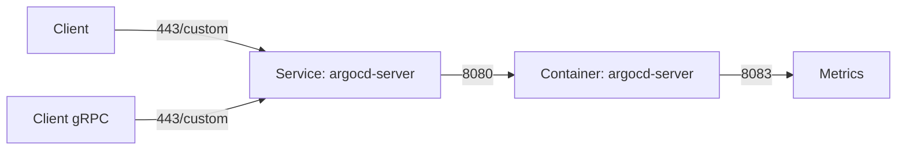

# How to Set ArgoCD Server to Run on a Custom Port

Author: [nawazdhandala](https://github.com/nawazdhandala)

Tags: ArgoCD, GitOps, Kubernetes, Networking

Description: Learn how to configure ArgoCD to listen on custom ports for both HTTPS and gRPC traffic, including service port changes and container port configuration.

---

By default, ArgoCD server listens on port 8080 for HTTP and port 8083 for gRPC metrics. The Kubernetes Service exposes it on ports 80 (HTTP) and 443 (HTTPS). In some environments, you need to change these - maybe port 443 conflicts with another service, your security team requires a non-standard port, or your load balancer is configured to route traffic on a specific port.

This guide covers changing ports at every level: the container port, the Service port, and the external-facing port through LoadBalancer or Ingress.

## Understanding ArgoCD Port Architecture

ArgoCD has multiple ports across its components:



| Port | Component | Purpose | Default |
|---|---|---|---|
| 8080 | argocd-server container | HTTP/HTTPS API and UI | 8080 |
| 8083 | argocd-server container | Metrics endpoint | 8083 |
| 80 | argocd-server Service | HTTP (redirects to HTTPS) | 80 |
| 443 | argocd-server Service | HTTPS for UI and gRPC | 443 |
| 8081 | argocd-repo-server | Repo server API | 8081 |
| 8082 | argocd-metrics Service | Controller metrics | 8082 |

## Change the Service Port

The most common need is to expose ArgoCD on a different Service port. This does not change what port the container listens on, just what port the Kubernetes Service uses.

### Patch the Service

```bash
# Change the HTTPS port from 443 to 8443
kubectl patch svc argocd-server -n argocd --type='json' \
  -p='[
    {"op": "replace", "path": "/spec/ports/0/port", "value": 8443},
    {"op": "replace", "path": "/spec/ports/0/name", "value": "https"},
    {"op": "replace", "path": "/spec/ports/1/port", "value": 8080},
    {"op": "replace", "path": "/spec/ports/1/name", "value": "http"}
  ]'
```

### Or Apply a Complete Service Manifest

```yaml
# argocd-server-svc.yaml
apiVersion: v1
kind: Service
metadata:
  name: argocd-server
  namespace: argocd
  labels:
    app.kubernetes.io/component: server
    app.kubernetes.io/name: argocd-server
    app.kubernetes.io/part-of: argocd
spec:
  type: ClusterIP
  ports:
  - name: https
    port: 8443        # External port
    targetPort: 8080   # Container port (unchanged)
    protocol: TCP
  - name: http
    port: 8080
    targetPort: 8080
    protocol: TCP
  selector:
    app.kubernetes.io/name: argocd-server
```

```bash
kubectl apply -f argocd-server-svc.yaml
```

Now access ArgoCD on port 8443:

```bash
# Port-forward with new port
kubectl port-forward svc/argocd-server -n argocd 8443:8443

# CLI login with custom port
argocd login localhost:8443 --insecure
```

## Change the Container Port

If you need to change what port the ArgoCD server container actually listens on (less common), modify the deployment.

```bash
# Change the container port from 8080 to 9090
kubectl patch deployment argocd-server -n argocd --type='json' \
  -p='[
    {
      "op": "replace",
      "path": "/spec/template/spec/containers/0/command",
      "value": ["argocd-server", "--port", "9090"]
    },
    {
      "op": "replace",
      "path": "/spec/template/spec/containers/0/ports/0/containerPort",
      "value": 9090
    }
  ]'
```

Then update the Service to point to the new container port:

```bash
kubectl patch svc argocd-server -n argocd --type='json' \
  -p='[
    {"op": "replace", "path": "/spec/ports/0/targetPort", "value": 9090},
    {"op": "replace", "path": "/spec/ports/1/targetPort", "value": 9090}
  ]'
```

## Configure via argocd-cmd-params-cm

ArgoCD reads command parameters from a ConfigMap. This is the cleanest way to change the server port.

```yaml
# argocd-cmd-params-cm.yaml
apiVersion: v1
kind: ConfigMap
metadata:
  name: argocd-cmd-params-cm
  namespace: argocd
data:
  # Change the server listen port
  server.port: "9090"
  # Change the metrics port
  server.metrics.port: "9091"
```

```bash
kubectl apply -f argocd-cmd-params-cm.yaml

# Restart the server to pick up the change
kubectl rollout restart deployment argocd-server -n argocd
```

After this, update the Service targetPort to match.

## Change the LoadBalancer Port

If you are using a LoadBalancer service type, change the port on the Service.

```yaml
# argocd-server-lb.yaml
apiVersion: v1
kind: Service
metadata:
  name: argocd-server
  namespace: argocd
spec:
  type: LoadBalancer
  ports:
  - name: https
    port: 9443          # Load balancer listens on 9443
    targetPort: 8080     # Routes to container port 8080
    protocol: TCP
  - name: http
    port: 9080           # Load balancer listens on 9080
    targetPort: 8080
    protocol: TCP
  selector:
    app.kubernetes.io/name: argocd-server
```

```bash
kubectl apply -f argocd-server-lb.yaml
```

Access ArgoCD at `https://<loadbalancer-ip>:9443`.

## Change Ports with Ingress

When using an Ingress, the external port is controlled by the Ingress controller, not the ArgoCD service.

### NGINX Ingress on Custom Port

To serve ArgoCD on a custom port via NGINX Ingress, you configure the Ingress controller itself (not the ArgoCD Ingress resource).

```yaml
# nginx-ingress-custom-ports.yaml
# Add to NGINX Ingress Controller ConfigMap
apiVersion: v1
kind: ConfigMap
metadata:
  name: tcp-services
  namespace: ingress-nginx
data:
  # Forward port 9443 to ArgoCD server
  "9443": "argocd/argocd-server:443"
```

Then update the NGINX Ingress controller Service to expose the new port:

```yaml
# Add to the nginx-ingress-controller Service
spec:
  ports:
  - name: argocd-https
    port: 9443
    targetPort: 9443
    protocol: TCP
```

### Standard Ingress (Port 443)

For standard HTTPS on port 443, the Ingress resource handles it:

```yaml
# argocd-ingress.yaml
apiVersion: networking.k8s.io/v1
kind: Ingress
metadata:
  name: argocd-server-ingress
  namespace: argocd
  annotations:
    nginx.ingress.kubernetes.io/ssl-passthrough: "true"
    nginx.ingress.kubernetes.io/backend-protocol: "HTTPS"
spec:
  rules:
  - host: argocd.yourdomain.com
    http:
      paths:
      - path: /
        pathType: Prefix
        backend:
          service:
            name: argocd-server
            port:
              number: 443
```

## Change Ports with NodePort

For NodePort access, specify the nodePort value.

```yaml
# argocd-server-nodeport.yaml
apiVersion: v1
kind: Service
metadata:
  name: argocd-server
  namespace: argocd
spec:
  type: NodePort
  ports:
  - name: https
    port: 443
    targetPort: 8080
    nodePort: 30443    # Access on any node at port 30443
    protocol: TCP
  - name: http
    port: 80
    targetPort: 8080
    nodePort: 30080
    protocol: TCP
  selector:
    app.kubernetes.io/name: argocd-server
```

```bash
kubectl apply -f argocd-server-nodeport.yaml

# Access ArgoCD at https://<any-node-ip>:30443
```

NodePort values must be in the range 30000 to 32767.

## Run ArgoCD in Insecure Mode on a Custom Port

For development, you might want ArgoCD to serve HTTP (not HTTPS) on a custom port.

```yaml
# argocd-cmd-params-cm.yaml
apiVersion: v1
kind: ConfigMap
metadata:
  name: argocd-cmd-params-cm
  namespace: argocd
data:
  # Disable TLS on the server
  server.insecure: "true"
  # Custom port
  server.port: "9090"
```

```bash
kubectl apply -f argocd-cmd-params-cm.yaml
kubectl rollout restart deployment argocd-server -n argocd
```

Now ArgoCD serves plain HTTP on port 9090 inside the container.

## Update the ArgoCD URL

After changing ports, update the ArgoCD external URL in the configuration so that generated links (like those in notifications) point to the right address.

```yaml
# argocd-cm.yaml
apiVersion: v1
kind: ConfigMap
metadata:
  name: argocd-cm
  namespace: argocd
data:
  # Include the port if it's non-standard
  url: https://argocd.yourdomain.com:9443
```

```bash
kubectl apply -f argocd-cm.yaml
```

## Verify the Port Change

After making port changes, verify everything works.

```bash
# Check the service ports
kubectl get svc argocd-server -n argocd -o wide

# Check the container ports
kubectl get pods -n argocd -l app.kubernetes.io/name=argocd-server \
  -o jsonpath='{.items[0].spec.containers[0].ports[*].containerPort}'

# Test connectivity
kubectl port-forward svc/argocd-server -n argocd <local-port>:<service-port>

# Login with the new port
argocd login localhost:<local-port> --insecure
```

## Troubleshooting

### Connection Refused After Port Change

Make sure the Service targetPort matches the container's listening port.

```bash
# Check what port the container is actually listening on
kubectl exec -n argocd deployment/argocd-server -- netstat -tlnp 2>/dev/null || \
kubectl exec -n argocd deployment/argocd-server -- ss -tlnp
```

### gRPC Connection Fails

ArgoCD uses gRPC (HTTP/2) on the same port as HTTPS. If you change ports, make sure your load balancer or proxy supports HTTP/2 on the new port.

```bash
# Use grpc-web as a fallback
argocd login argocd.yourdomain.com:9443 --grpc-web --insecure
```

### Metrics Scraping Breaks

If you changed the metrics port, update your Prometheus ServiceMonitor or scrape config.

```yaml
# servicemonitor.yaml
apiVersion: monitoring.coreos.com/v1
kind: ServiceMonitor
metadata:
  name: argocd-server
spec:
  endpoints:
  - port: metrics
    # Update the port name/number to match your custom port
```

## Further Reading

- Configure behind a reverse proxy: [ArgoCD behind reverse proxy](https://oneuptime.com/blog/post/2026-02-26-configure-argocd-behind-reverse-proxy/view)
- ArgoCD installation: [Install ArgoCD on Kubernetes](https://oneuptime.com/blog/post/2026-01-25-install-argocd-kubernetes/view)
- Expose with Ingress: [ArgoCD with Nginx Ingress](https://oneuptime.com/blog/post/2026-02-26-configure-argocd-behind-reverse-proxy/view)

Changing ArgoCD ports is straightforward once you understand the three layers: container port, Service port, and external port. Change only the layer you need to and make sure the upstream and downstream ports stay consistent.
