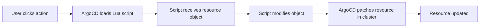

# How to Configure Custom Resource Actions in ArgoCD

Author: [nawazdhandala](https://github.com/nawazdhandala)

Tags: ArgoCD, GitOps, Kubernetes, Resource Management

Description: Learn how to configure custom resource actions in ArgoCD to add one-click operations like restart, scale, and custom workflows directly from the ArgoCD UI and CLI for any Kubernetes resource type.

---

ArgoCD resource actions let you perform operations on Kubernetes resources directly from the ArgoCD UI or CLI without modifying Git or running kubectl commands. Think of them as custom buttons that appear on resources in the ArgoCD dashboard. You can create actions to restart deployments, scale replicas, trigger jobs, promote canary releases, or any other operation that modifies a resource.

This guide covers how to configure custom resource actions from scratch, how the action system works, and practical examples you can use immediately.

## How Resource Actions Work

Resource actions are defined as Lua scripts in the `argocd-cm` ConfigMap. Each action is associated with a specific resource group and kind. When you view a resource in the ArgoCD UI, available actions appear in the "Actions" dropdown menu.

When you trigger an action, ArgoCD:

1. Loads the Lua script for that action
2. Passes the current resource object to the script
3. The script modifies the resource object
4. ArgoCD patches the resource in the cluster with the changes



Important: resource actions modify the live resource directly in the cluster. They do not modify Git. This means the change may cause the application to become OutOfSync (the live state differs from Git). This is by design - actions are intended for operational tasks, not permanent configuration changes.

## Defining Your First Custom Action

Custom actions are defined in the `argocd-cm` ConfigMap using the key pattern:

```
resource.customizations.actions.<group>_<kind>
```

The value is a YAML document containing a list of actions, each with a name and a Lua action script.

Here is a simple example that adds a "restart" action to Deployments:

```yaml
apiVersion: v1
kind: ConfigMap
metadata:
  name: argocd-cm
  namespace: argocd
data:
  resource.customizations.actions.apps_Deployment: |
    discovery.lua: |
      actions = {}
      actions["restart"] = {
        ["disabled"] = false
      }
      return actions
    definitions:
      - name: restart
        action.lua: |
          local os = require("os")
          if obj.spec.template.metadata == nil then
            obj.spec.template.metadata = {}
          end
          if obj.spec.template.metadata.annotations == nil then
            obj.spec.template.metadata.annotations = {}
          end
          obj.spec.template.metadata.annotations["kubectl.kubernetes.io/restartedAt"] = tostring(os.time())
          return obj
```

This action does two things:

1. **discovery.lua** tells ArgoCD what actions are available for this resource type. It returns a table of action names and their properties.

2. **definitions** contains the actual Lua scripts. Each definition has a `name` that matches a key from discovery and an `action.lua` script that receives the resource object and returns the modified object.

## Action Structure in Detail

### Discovery Script

The discovery script determines which actions appear in the UI. You can conditionally enable or disable actions based on the resource's current state:

```lua
-- discovery.lua
actions = {}

-- Always show restart
actions["restart"] = {
  ["disabled"] = false
}

-- Only show scale-up if replicas < 10
if obj.spec.replicas < 10 then
  actions["scale-up"] = {
    ["disabled"] = false
  }
end

-- Only show scale-down if replicas > 1
if obj.spec.replicas > 1 then
  actions["scale-down"] = {
    ["disabled"] = false
  }
end

-- Show pause only for running deployments
if obj.spec.paused == nil or obj.spec.paused == false then
  actions["pause"] = {
    ["disabled"] = false
  }
else
  actions["resume"] = {
    ["disabled"] = false
  }
end

return actions
```

### Action Script

The action script receives the Kubernetes resource object as `obj`, modifies it, and returns the modified object. ArgoCD will then apply the changes to the cluster.

```lua
-- action.lua for "scale-up"
obj.spec.replicas = obj.spec.replicas + 1
return obj
```

The script has access to the full resource object, so you can modify any field - spec, metadata, labels, annotations, etc.

## Multiple Actions for the Same Resource

You can define many actions for a single resource type:

```yaml
  resource.customizations.actions.apps_Deployment: |
    discovery.lua: |
      actions = {}
      actions["restart"] = {["disabled"] = false}
      actions["scale-up"] = {["disabled"] = false}
      actions["scale-down"] = {["disabled"] = obj.spec.replicas <= 1}
      actions["pause"] = {["disabled"] = obj.spec.paused == true}
      actions["resume"] = {["disabled"] = obj.spec.paused ~= true}
      return actions
    definitions:
      - name: restart
        action.lua: |
          local os = require("os")
          if obj.spec.template.metadata == nil then
            obj.spec.template.metadata = {}
          end
          if obj.spec.template.metadata.annotations == nil then
            obj.spec.template.metadata.annotations = {}
          end
          obj.spec.template.metadata.annotations["kubectl.kubernetes.io/restartedAt"] = tostring(os.time())
          return obj
      - name: scale-up
        action.lua: |
          obj.spec.replicas = obj.spec.replicas + 1
          return obj
      - name: scale-down
        action.lua: |
          if obj.spec.replicas > 1 then
            obj.spec.replicas = obj.spec.replicas - 1
          end
          return obj
      - name: pause
        action.lua: |
          obj.spec.paused = true
          return obj
      - name: resume
        action.lua: |
          obj.spec.paused = false
          return obj
```

## Actions for CRDs

Custom resource actions are especially useful for CRDs where kubectl does not have built-in commands. Here is an example for a custom database CRD:

```yaml
  resource.customizations.actions.databases.example.com_PostgreSQL: |
    discovery.lua: |
      actions = {}
      if obj.status ~= nil and obj.status.phase == "Running" then
        actions["create-backup"] = {["disabled"] = false}
        actions["failover"] = {["disabled"] = false}
      end
      if obj.spec.paused == true then
        actions["unpause"] = {["disabled"] = false}
      else
        actions["pause"] = {["disabled"] = false}
      end
      return actions
    definitions:
      - name: create-backup
        action.lua: |
          if obj.spec.backup == nil then
            obj.spec.backup = {}
          end
          if obj.spec.backup.manual == nil then
            obj.spec.backup.manual = {}
          end
          local os = require("os")
          obj.spec.backup.manual.trigger = tostring(os.time())
          return obj
      - name: failover
        action.lua: |
          if obj.spec.patroni == nil then
            obj.spec.patroni = {}
          end
          obj.spec.patroni.failover = true
          return obj
      - name: pause
        action.lua: |
          obj.spec.paused = true
          return obj
      - name: unpause
        action.lua: |
          obj.spec.paused = false
          return obj
```

## Applying with Helm Values

If you install ArgoCD via Helm:

```yaml
# values.yaml for argo-cd chart
server:
  config:
    "resource.customizations.actions.apps_Deployment": |
      discovery.lua: |
        actions = {}
        actions["restart"] = {["disabled"] = false}
        return actions
      definitions:
        - name: restart
          action.lua: |
            local os = require("os")
            if obj.spec.template.metadata == nil then
              obj.spec.template.metadata = {}
            end
            if obj.spec.template.metadata.annotations == nil then
              obj.spec.template.metadata.annotations = {}
            end
            obj.spec.template.metadata.annotations["kubectl.kubernetes.io/restartedAt"] = tostring(os.time())
            return obj
```

## Testing Actions

After applying the configuration, test your actions:

```bash
# Restart the ArgoCD server to pick up ConfigMap changes (if needed)
kubectl rollout restart deployment argocd-server -n argocd

# List available actions for a resource
argocd app actions list my-app --kind Deployment

# Run an action
argocd app actions run my-app restart --kind Deployment --resource-name my-deployment
```

In the UI, navigate to your application, click on a Deployment resource, and look for the "Actions" dropdown in the top bar.

## Security Considerations

Resource actions bypass Git. This is intentional but has security implications:

- Actions cause drift between Git and live state
- Anyone with ArgoCD UI/CLI access can trigger actions
- Use RBAC to control who can execute actions

```csv
# RBAC policy: only admins can run resource actions
p, role:admin, applications, action/*, *, allow
p, role:developer, applications, action/*, *, deny
```

For more on ArgoCD RBAC, see the documentation on [configuring RBAC policies in ArgoCD](https://oneuptime.com/blog/post/2026-02-26-argocd-rbac-policies/view).

Resource actions are a powerful tool for day-to-day operations. They bring common operational tasks into the ArgoCD interface, reducing context switching between ArgoCD and kubectl. For writing the Lua scripts that power these actions, see [how to write Lua scripts for custom resource actions](https://oneuptime.com/blog/post/2026-02-26-argocd-lua-scripts-resource-actions/view).
