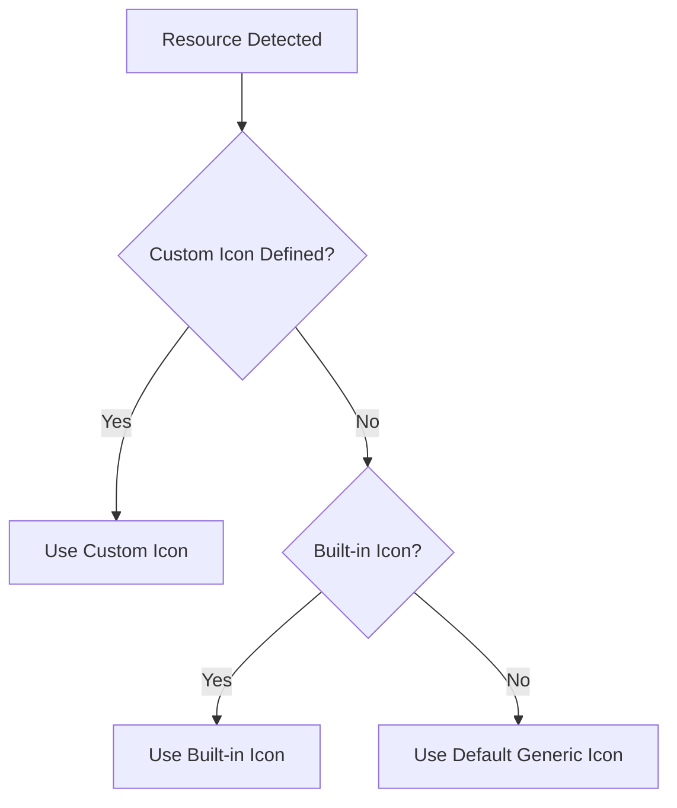

# How to Create ArgoCD Custom Resource Icons

Author: [nawazdhandala](https://github.com/nawazdhandala)

Tags: ArgoCD, GitOps, Kubernetes, UI, Customization

Description: Learn how to create and configure custom resource icons in ArgoCD to improve visual identification of Kubernetes resources in the application tree view.

---

ArgoCD's web UI displays a tree view of all Kubernetes resources managed by each application. By default, each resource type gets a generic icon based on its Kubernetes kind. Custom resource icons let you replace these defaults with meaningful visual identifiers that make it easier for your team to understand application architecture at a glance. This is especially valuable when working with custom resources from operators where the default icons provide no visual distinction.

## How ArgoCD Resource Icons Work

ArgoCD maps Kubernetes resource types to icons using a combination of built-in mappings and user-configurable overrides. The icon system works through the `argocd-cm` ConfigMap, where you can define custom icons for any resource Group/Kind combination.



The UI renders these icons in the application resource tree, the resource details panel, and the application overview.

## Built-in Resource Icons

ArgoCD includes icons for common Kubernetes resource types out of the box.

| Resource Kind | Icon |
|---------------|------|
| Deployment | Gear icon |
| Service | Network icon |
| ConfigMap | Document icon |
| Secret | Lock icon |
| Pod | Box icon |
| Ingress | Globe icon |
| PersistentVolumeClaim | Disk icon |
| StatefulSet | Database icon |
| DaemonSet | Multi-node icon |
| Job/CronJob | Timer icon |

For standard Kubernetes resources, these built-in icons work well. The need for custom icons arises when you use Custom Resource Definitions (CRDs) from operators, service meshes, or your own custom controllers.

## Configuring Custom Icons via ConfigMap

The primary way to add custom resource icons is through the `argocd-cm` ConfigMap. You define icon mappings using the `resource.customizations.icon` key pattern.

```yaml
apiVersion: v1
kind: ConfigMap
metadata:
  name: argocd-cm
  namespace: argocd
data:
  # Custom icon for Istio VirtualService
  resource.customizations.icon.networking.istio.io_VirtualService: |
    icon: fa-route
    color: "#466BB0"

  # Custom icon for Prometheus ServiceMonitor
  resource.customizations.icon.monitoring.coreos.com_ServiceMonitor: |
    icon: fa-heartbeat
    color: "#E6522C"

  # Custom icon for Cert-Manager Certificate
  resource.customizations.icon.cert-manager.io_Certificate: |
    icon: fa-certificate
    color: "#326CE5"

  # Custom icon for Argo Rollout
  resource.customizations.icon.argoproj.io_Rollout: |
    icon: fa-flag-checkered
    color: "#EF7B4D"
```

The format for the key is `resource.customizations.icon.<group>_<Kind>`. For core Kubernetes resources without an API group, use an empty group prefix like `_ConfigMap`.

### Available Icon Libraries

ArgoCD supports Font Awesome icons. You can use any icon from the Font Awesome free set.

```yaml
# Common useful icons for DevOps resources
data:
  # Database-related CRDs
  resource.customizations.icon.postgresql.cnpg.io_Cluster: |
    icon: fa-database
    color: "#336791"

  # Message queue CRDs
  resource.customizations.icon.rabbitmq.com_RabbitmqCluster: |
    icon: fa-envelope
    color: "#FF6600"

  # Backup-related CRDs
  resource.customizations.icon.velero.io_Backup: |
    icon: fa-cloud-upload-alt
    color: "#44B3C2"

  # Network policy CRDs
  resource.customizations.icon.cilium.io_CiliumNetworkPolicy: |
    icon: fa-shield-alt
    color: "#8061BC"

  # External DNS
  resource.customizations.icon.externaldns.k8s.io_DNSEndpoint: |
    icon: fa-globe-americas
    color: "#326CE5"
```

## Using Custom SVG Icons

For more distinctive branding, you can use custom SVG icons instead of Font Awesome icons. This requires modifying the ArgoCD source or using the resource customization extension mechanism.

Create a custom icon set by adding SVGs to the ArgoCD UI.

```yaml
apiVersion: v1
kind: ConfigMap
metadata:
  name: argocd-cm
  namespace: argocd
data:
  # Use a data URI for inline SVG icons
  resource.customizations.icon.mycompany.io_MyResource: |
    icon: data:image/svg+xml;base64,PHN2ZyB4bWxucz0iaHR0cDovL3d3dy53My5...
    color: "#FF5733"
```

To convert an SVG to base64 for use in the configuration:

```bash
# Convert SVG file to base64
base64 -i my-icon.svg | tr -d '\n'

# Or use a one-liner to create the full data URI
echo "data:image/svg+xml;base64,$(base64 -i my-icon.svg | tr -d '\n')"
```

## Resource Customization for Operator CRDs

When deploying operators through ArgoCD, adding icons for their CRDs makes the resource tree much more readable. Here is a comprehensive example for a typical production setup.

```yaml
apiVersion: v1
kind: ConfigMap
metadata:
  name: argocd-cm
  namespace: argocd
data:
  # Istio Service Mesh Resources
  resource.customizations.icon.networking.istio.io_VirtualService: |
    icon: fa-route
    color: "#466BB0"
  resource.customizations.icon.networking.istio.io_DestinationRule: |
    icon: fa-directions
    color: "#466BB0"
  resource.customizations.icon.networking.istio.io_Gateway: |
    icon: fa-door-open
    color: "#466BB0"
  resource.customizations.icon.security.istio.io_AuthorizationPolicy: |
    icon: fa-user-shield
    color: "#466BB0"

  # Prometheus Stack Resources
  resource.customizations.icon.monitoring.coreos.com_ServiceMonitor: |
    icon: fa-heartbeat
    color: "#E6522C"
  resource.customizations.icon.monitoring.coreos.com_PrometheusRule: |
    icon: fa-bell
    color: "#E6522C"
  resource.customizations.icon.monitoring.coreos.com_Prometheus: |
    icon: fa-fire
    color: "#E6522C"
  resource.customizations.icon.monitoring.coreos.com_Alertmanager: |
    icon: fa-exclamation-triangle
    color: "#E6522C"

  # Kafka (Strimzi) Resources
  resource.customizations.icon.kafka.strimzi.io_Kafka: |
    icon: fa-stream
    color: "#191A1C"
  resource.customizations.icon.kafka.strimzi.io_KafkaTopic: |
    icon: fa-layer-group
    color: "#191A1C"
  resource.customizations.icon.kafka.strimzi.io_KafkaConnect: |
    icon: fa-plug
    color: "#191A1C"

  # Crossplane Resources
  resource.customizations.icon.apiextensions.crossplane.io_Composition: |
    icon: fa-puzzle-piece
    color: "#F8A51C"
  resource.customizations.icon.apiextensions.crossplane.io_CompositeResourceDefinition: |
    icon: fa-cubes
    color: "#F8A51C"
```

## Combining Icons with Health Checks

Custom icons work together with custom health checks to give you a complete visual picture of your resources. Define both for your CRDs.

```yaml
apiVersion: v1
kind: ConfigMap
metadata:
  name: argocd-cm
  namespace: argocd
data:
  # Icon for PostgreSQL clusters
  resource.customizations.icon.postgresql.cnpg.io_Cluster: |
    icon: fa-database
    color: "#336791"

  # Health check for PostgreSQL clusters
  resource.customizations.health.postgresql.cnpg.io_Cluster: |
    hs = {}
    if obj.status ~= nil then
      if obj.status.phase == "Cluster in healthy state" then
        hs.status = "Healthy"
        hs.message = obj.status.phase
      elseif obj.status.phase == "Setting up primary" or obj.status.phase == "Creating primary" then
        hs.status = "Progressing"
        hs.message = obj.status.phase
      else
        hs.status = "Degraded"
        hs.message = obj.status.phase
      end
    end
    return hs
```

In the UI, you will see the database icon colored by the health status - green when healthy, yellow when progressing, and red when degraded.

## Applying Icon Changes

After updating the ConfigMap, ArgoCD picks up icon changes without requiring a restart of any components.

```bash
# Apply the updated ConfigMap
kubectl apply -f argocd-cm.yaml

# Verify the configuration was applied
kubectl get configmap argocd-cm -n argocd -o yaml | grep "resource.customizations.icon"

# Refresh the ArgoCD UI in your browser to see the new icons
# If icons do not appear, try a hard refresh (Ctrl+Shift+R or Cmd+Shift+R)
```

## Organizing Icons for Large Deployments

For organizations with many CRDs, managing icons in a single ConfigMap becomes unwieldy. Use Kustomize to organize icon definitions.

```yaml
# base/kustomization.yaml
apiVersion: kustomize.config.k8s.io/v1beta1
kind: Kustomization
resources:
  - argocd-install.yaml

configMapGenerator:
  - name: argocd-cm
    namespace: argocd
    behavior: merge
    files:
      - icons/istio-icons.yaml
      - icons/prometheus-icons.yaml
      - icons/kafka-icons.yaml
      - icons/custom-crds-icons.yaml
```

This keeps your icon definitions modular and easy to maintain as your cluster evolves. Each team can manage icons for their own CRDs.

## Troubleshooting Icon Issues

If custom icons are not displaying correctly, check these common issues:

1. **Key format.** Ensure the ConfigMap key follows the exact format: `resource.customizations.icon.<apiGroup>_<Kind>`
2. **Font Awesome availability.** Verify the icon name exists in the Font Awesome free set
3. **Browser cache.** Clear your browser cache or do a hard refresh
4. **ConfigMap syntax.** YAML indentation matters - ensure the icon configuration is properly formatted

```bash
# Validate your ConfigMap syntax
kubectl apply --dry-run=client -f argocd-cm.yaml

# Check for configuration errors in the server logs
kubectl logs -n argocd deployment/argocd-server | grep -i "icon\|customization"
```

Custom resource icons are a small investment that significantly improves the ArgoCD user experience. When your team can visually distinguish between a Kafka topic, a PostgreSQL cluster, and a Prometheus rule at a glance, troubleshooting and understanding application architecture becomes much faster. For more ArgoCD customization options, explore our guide on [contributing to ArgoCD](https://oneuptime.com/blog/post/2026-02-26-argocd-contribute-open-source/view).
