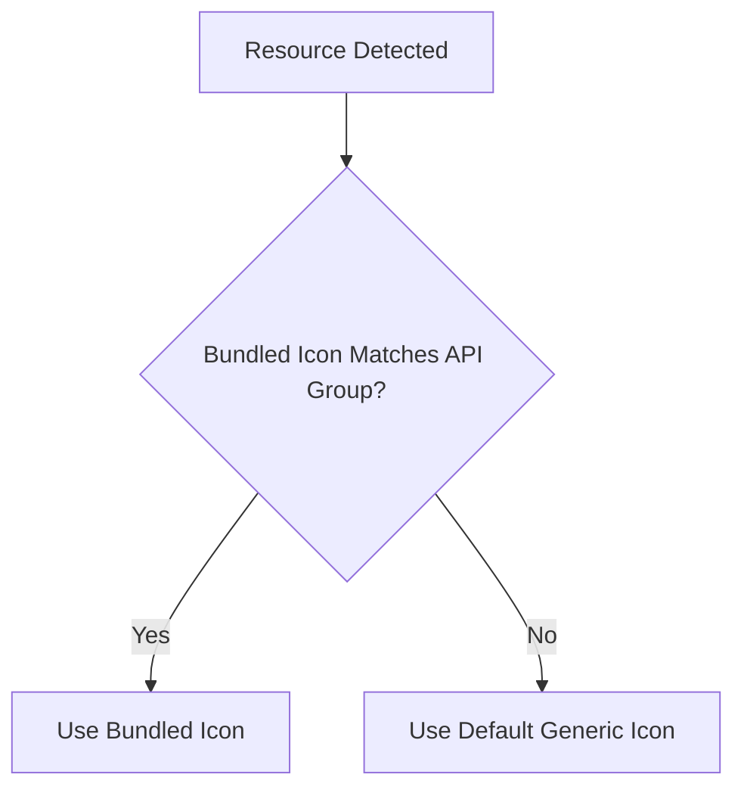

# How to Create ArgoCD Custom Resource Icons

Author: [nawazdhandala](https://github.com/nawazdhandala)

Tags: ArgoCD, GitOps, Kubernetes, UI, Customization

Description: Learn how to create and configure custom resource icons in ArgoCD to improve visual identification of Kubernetes resources in the application tree view.

---

ArgoCD's web UI displays a tree view of Kubernetes resources managed by each application. ArgoCD includes built-in icons for common resource types, and unsupported resource groups fall back to a generic icon. Custom resource icons let you add meaningful visual identifiers that make it easier for your team to understand application architecture at a glance. This is especially valuable when working with custom resources from operators where the default icons provide no visual distinction.

## How ArgoCD Resource Icons Work

ArgoCD resource icons are bundled into the ArgoCD UI. They are not configured through the `argocd-cm` ConfigMap. To add a custom resource icon, you add an SVG file to the ArgoCD source tree, regenerate the resource icon list, and build or contribute that change to ArgoCD.


```mermaid
graph TD
    A[Resource Detected] --> B{Bundled Icon Matches API Group?}
    B -->|Yes| C[Use Bundled Icon]
    B -->|No| D[Use Default Generic Icon]
```

The UI uses these icons when rendering Kubernetes resources in the application tree and related resource views.

## Built-in Resource Icons

ArgoCD includes icons for common Kubernetes resource types out of the box.

| Resource Kind | Icon |
|---------------|------|
| Deployment | Built-in workload icon |
| Service | Built-in service icon |
| ConfigMap | Built-in configuration icon |
| Secret | Built-in secret icon |
| Pod | Built-in pod icon |
| Ingress | Built-in ingress icon |
| PersistentVolumeClaim | Built-in storage icon |
| StatefulSet | Built-in workload icon |
| DaemonSet | Built-in workload icon |
| Job/CronJob | Built-in job icon |

For standard Kubernetes resources, these built-in icons work well. The need for custom icons arises when you use Custom Resource Definitions (CRDs) from operators, service meshes, or your own custom controllers.

## Adding Custom Icons to the ArgoCD UI

The supported way to add custom resource icons is to contribute them to the ArgoCD source repository. Add the icon file under `ui/src/assets/images/resources/<group>/icon.svg`, where `<group>` is the Kubernetes API group for the custom resource.

For example, to add an icon for resources in the `example.com` API group, use this path:

```text
ui/src/assets/images/resources/example.com/icon.svg
```

The icon SVG must use the ArgoCD resource icon color:

```xml
<svg xmlns="http://www.w3.org/2000/svg" viewBox="0 0 24 24">
  <path fill="#8fa4b1" d="M12 2L2 7l10 5 10-5-10-5z"/>
  <path fill="#8fa4b1" d="M2 17l10 5 10-5"/>
  <path fill="#8fa4b1" d="M2 12l10 5 10-5"/>
</svg>
```

After adding the SVG, regenerate the TypeScript file that lists available resource icons:

```bash
make resourceiconsgen
```

Then build and test the ArgoCD UI from your fork, or open a pull request to the ArgoCD repository if the icon should be available upstream.

### Wildcard Icon Groups

ArgoCD also supports wildcard-style icon directories for API groups with a shared suffix. Prefix a directory with an underscore to make that part of the group act as a wildcard.

For example, this path applies to API groups such as `example.com` and `another.example.com`:

```text
ui/src/assets/images/resources/_.example.com/icon.svg
```

This is useful when multiple CRD API groups should share the same icon.

## Using Custom SVG Icons

Custom resource icons in ArgoCD are SVG files bundled with the UI. Font Awesome class names and data URI strings are not supported for resource icons through `argocd-cm`.

When preparing an SVG:

1. Ensure the icon license is compatible with Apache 2.0.
2. Keep the SVG simple and readable at small sizes.
3. Set the icon color to `#8fa4b1`.
4. Add the file as `icon.svg` under the correct API group directory.
5. Run `make resourceiconsgen`.

Resource Customization for Operator CRDs

When deploying operators through ArgoCD, adding icons for their CRD API groups makes the resource tree much more readable. A typical source tree change might look like this:

```text
ui/src/assets/images/resources/
  networking.istio.io/
    icon.svg
  monitoring.coreos.com/
    icon.svg
  kafka.strimzi.io/
    icon.svg
  postgresql.cnpg.io/
    icon.svg
```

Each directory represents the CRD API group. After adding or changing these files, run:

```bash
make resourceiconsgen
```

Then rebuild the ArgoCD UI image from your fork or submit the icons upstream.

## Combining Icons with Health Checks

Custom icons can be paired with custom health checks to give you a more complete visual picture of your resources. Icons are bundled in the UI, while health checks are configured through `argocd-cm`.

```yaml
apiVersion: v1
kind: ConfigMap
metadata:
  name: argocd-cm
  namespace: argocd
data:
  # Health check for PostgreSQL clusters
  resource.customizations.health.postgresql.cnpg.io_Cluster: |
    hs = {}
    if obj.status ~= nil then
      if obj.status.phase == "Cluster in healthy state" then
        hs.status = "Healthy"
        hs.message = obj.status.phase
      elseif obj.status.phase == "Setting up primary" or obj.status.phase == "Creating primary" then
        hs.status = "Progressing"
        hs.message = obj.status.phase
      else
        hs.status = "Degraded"
        hs.message = obj.status.phase
      end
    end
    return hs
```

In the UI, the resource icon identifies the resource type, while the resource health status shows whether the resource is healthy, progressing, degraded, suspended, missing, or unknown.

## Applying Icon Changes

Because resource icons are compiled into the ArgoCD UI, applying an `argocd-cm` update is not enough. You need to build or deploy an ArgoCD version that contains the generated icon list and SVG files.

```bash
# Add or update SVG files under ui/src/assets/images/resources/
make resourceiconsgen

# Build and test ArgoCD from your fork, or submit a pull request upstream
```

After deploying an ArgoCD build that includes the icon changes, refresh the ArgoCD UI in your browser. If the old UI bundle is cached, use a hard refresh.

## Organizing Icons for Large Deployments

For organizations with many CRDs, keep icon ownership clear in your ArgoCD fork or contribution branch. Group icons by API group under `ui/src/assets/images/resources/` and regenerate the icon list whenever files are added, removed, or renamed.

```text
ui/src/assets/images/resources/
  networking.istio.io/icon.svg
  security.istio.io/icon.svg
  monitoring.coreos.com/icon.svg
  kafka.strimzi.io/icon.svg
  apiextensions.crossplane.io/icon.svg
```

This keeps your icon definitions modular and easy to review as your cluster evolves. Each team can prepare icons for the CRDs they own, and the platform team can validate licensing, SVG format, and UI behavior before merging.

## Troubleshooting Icon Issues

If custom icons are not displaying correctly, check these common issues:

1. **Path format.** Ensure the SVG is located at `ui/src/assets/images/resources/<group>/icon.svg`.
2. **Generated icon list.** Run `make resourceiconsgen` after adding or moving icon files.
3. **SVG color.** Use the expected resource icon color, `#8fa4b1`.
4. **Browser cache.** Clear your browser cache or do a hard refresh.
5. **Deployment version.** Confirm the ArgoCD server is serving the UI build that contains your icon changes.

```bash
# Regenerate resource icon metadata after changing SVG files
make resourceiconsgen

# Check the changed files before opening a pull request
git diff -- ui/src/assets/images/resources
```

Custom resource icons are a small investment that significantly improves the ArgoCD user experience. When your team can visually distinguish between a Kafka topic, a PostgreSQL cluster, and a Prometheus rule at a glance, troubleshooting and understanding application architecture becomes much faster. For more ArgoCD customization options, explore our guide on [contributing to ArgoCD](https://oneuptime.com/blog/post/2026-02-26-argocd-contribute-open-source/view).
