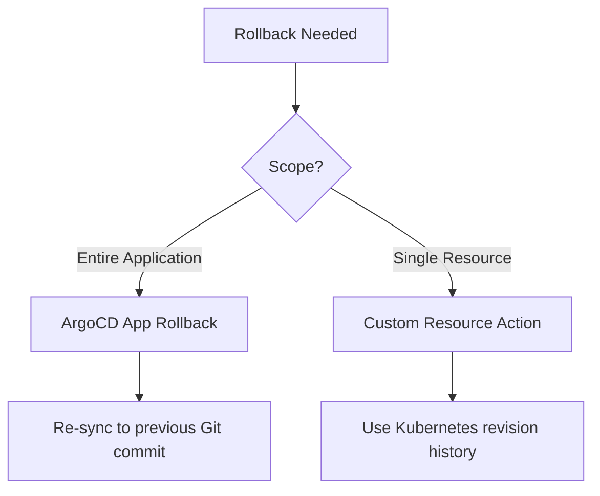

# How to Create Custom Rollback Actions in ArgoCD

Author: [nawazdhandala](https://github.com/nawazdhandala)

Tags: ArgoCD, GitOps, Kubernetes, Rollbacks

Description: Learn how to create custom rollback actions in ArgoCD for Deployments, StatefulSets, and Argo Rollouts that let you revert to previous revisions directly from the ArgoCD UI or CLI.

---

ArgoCD has built-in rollback functionality at the application level, but sometimes you need more granular control. You might want to roll back a single Deployment within a multi-resource application, or you might want to roll back to a specific ReplicaSet revision rather than an ArgoCD sync revision. Custom rollback actions give you this fine-grained control directly from the ArgoCD interface.

This guide covers creating custom rollback resource actions for Deployments, StatefulSets, and Argo Rollouts resources.

## Application-Level vs Resource-Level Rollback

ArgoCD supports two types of rollback:

**Application-level rollback** reverts the entire application to a previous sync revision. This is built into ArgoCD and works by re-syncing to a previous Git commit.

```bash
# Built-in application rollback
argocd app rollback my-app <history-id>
```

**Resource-level rollback** uses Kubernetes' native revision history to roll back a single resource. This is what we are building with custom actions.



## Rollback Action for Deployments

Kubernetes Deployments keep a history of ReplicaSets. Each time you update the pod template, a new ReplicaSet is created and the old one is kept (up to `revisionHistoryLimit`). A rollback action can set the Deployment to use a previous ReplicaSet.

However, Lua scripts in ArgoCD cannot directly interact with the Kubernetes API (they can only modify the object they receive). So the approach is to undo the last change by reverting the pod template spec.

A simpler approach is to use the Deployment's `spec.rollbackTo` field (deprecated in newer Kubernetes versions) or trigger a rollback annotation:

```yaml
apiVersion: v1
kind: ConfigMap
metadata:
  name: argocd-cm
  namespace: argocd
data:
  resource.customizations.actions.apps_Deployment: |
    discovery.lua: |
      actions = {}
      -- Show rollback action only if there is revision history
      if obj.status ~= nil and obj.status.conditions ~= nil then
        actions["rollback-previous"] = {
          ["disabled"] = false
        }
      end
      actions["restart"] = {
        ["disabled"] = false
      }
      return actions
    definitions:
      - name: rollback-previous
        action.lua: |
          -- Trigger a rollback by adding a rollback annotation
          -- This signals external tooling or operators to perform the rollback
          if obj.metadata.annotations == nil then
            obj.metadata.annotations = {}
          end
          local os = require("os")
          obj.metadata.annotations["argocd.argoproj.io/rollback-requested"] = tostring(os.time())
          obj.metadata.annotations["argocd.argoproj.io/rollback-revision"] = "previous"
          return obj
      - name: restart
        action.lua: |
          local os = require("os")
          if obj.spec.template.metadata == nil then
            obj.spec.template.metadata = {}
          end
          if obj.spec.template.metadata.annotations == nil then
            obj.spec.template.metadata.annotations = {}
          end
          obj.spec.template.metadata.annotations["kubectl.kubernetes.io/restartedAt"] = tostring(os.time())
          return obj
```

### Using a Webhook-Based Rollback

Since Lua scripts cannot call the Kubernetes API directly, a more practical approach for true rollback is to combine the action with an external controller that watches for the rollback annotation:

```yaml
# External rollback controller (runs as a Deployment in the cluster)
apiVersion: apps/v1
kind: Deployment
metadata:
  name: rollback-controller
  namespace: argocd
spec:
  replicas: 1
  selector:
    matchLabels:
      app: rollback-controller
  template:
    metadata:
      labels:
        app: rollback-controller
    spec:
      serviceAccountName: rollback-controller
      containers:
        - name: controller
          image: bitnami/kubectl:latest
          command:
            - /bin/sh
            - -c
            - |
              while true; do
                # Watch for deployments with rollback annotation
                DEPLOYMENTS=$(kubectl get deployments --all-namespaces \
                  -o jsonpath='{range .items[?(@.metadata.annotations.argocd\.argoproj\.io/rollback-requested)]}{.metadata.namespace}/{.metadata.name}{"\n"}{end}')

                for dep in $DEPLOYMENTS; do
                  NS=$(echo $dep | cut -d/ -f1)
                  NAME=$(echo $dep | cut -d/ -f2)
                  echo "Rolling back $NS/$NAME"
                  kubectl rollout undo deployment/$NAME -n $NS
                  kubectl annotate deployment/$NAME -n $NS \
                    argocd.argoproj.io/rollback-requested- \
                    argocd.argoproj.io/rollback-revision-
                done
                sleep 10
              done
```

## Rollback Action for Argo Rollouts

Argo Rollouts resources have built-in rollback capabilities that are much cleaner to use with resource actions:

```yaml
  resource.customizations.actions.argoproj.io_Rollout: |
    discovery.lua: |
      actions = {}
      -- Abort action - stop the current rollout and revert
      if obj.status ~= nil and obj.status.phase == "Progressing" then
        actions["abort"] = {["disabled"] = false}
      end
      -- Retry action - retry a failed rollout
      if obj.status ~= nil and (obj.status.phase == "Degraded" or obj.status.phase == "Error") then
        actions["retry"] = {["disabled"] = false}
      end
      -- Undo action - revert to previous revision
      actions["undo"] = {["disabled"] = false}
      -- Promote action - skip analysis and promote
      if obj.status ~= nil and obj.status.phase == "Paused" then
        actions["promote-full"] = {["disabled"] = false}
      end
      return actions
    definitions:
      - name: abort
        action.lua: |
          -- Abort the current rollout
          obj.status.abort = true
          return obj
      - name: retry
        action.lua: |
          -- Reset the abort flag and restart conditions
          if obj.status ~= nil then
            obj.status.abort = false
            obj.status.pauseConditions = nil
          end
          -- Trigger a restart by updating the template annotation
          local os = require("os")
          if obj.spec.template.metadata == nil then
            obj.spec.template.metadata = {}
          end
          if obj.spec.template.metadata.annotations == nil then
            obj.spec.template.metadata.annotations = {}
          end
          obj.spec.template.metadata.annotations["rollout.argoproj.io/retry"] = tostring(os.time())
          return obj
      - name: undo
        action.lua: |
          -- Setting workloadRef to a previous revision spec
          -- For simplicity, this reverts the restartAt annotation
          if obj.metadata.annotations == nil then
            obj.metadata.annotations = {}
          end
          local os = require("os")
          obj.metadata.annotations["rollout.argoproj.io/undo"] = tostring(os.time())
          return obj
      - name: promote-full
        action.lua: |
          -- Clear pause conditions to promote
          if obj.status ~= nil then
            obj.status.pauseConditions = nil
          end
          -- Set full promotion
          if obj.metadata.annotations == nil then
            obj.metadata.annotations = {}
          end
          local os = require("os")
          obj.metadata.annotations["rollout.argoproj.io/promoted"] = tostring(os.time())
          return obj
```

## Using the Rollback Actions

### From the UI

1. Navigate to your application in ArgoCD
2. Click on the Deployment or Rollout resource
3. Click "Actions" in the resource detail view
4. Select "rollback-previous" or "undo"
5. Confirm the action

### From the CLI

```bash
# List available actions for a Deployment
argocd app actions list my-app --kind Deployment

# Execute rollback
argocd app actions run my-app rollback-previous \
  --kind Deployment \
  --resource-name my-deployment \
  --namespace production

# For Argo Rollouts
argocd app actions run my-app abort \
  --kind Rollout \
  --resource-name my-rollout \
  --namespace production

argocd app actions run my-app undo \
  --kind Rollout \
  --resource-name my-rollout \
  --namespace production
```

## Handling the OutOfSync State After Rollback

After a resource-level rollback, the application will be OutOfSync because the live state no longer matches Git. You have two options:

1. **Update Git to match**: Create a PR that updates the manifest to match the rolled-back state. This is the GitOps-correct approach.

2. **Sync from Git again**: If the Git state is correct and the rollback was temporary, sync the application to bring the live state back in line with Git.

```bash
# Option 1: After fixing Git, sync
argocd app sync my-app

# Option 2: If you want to keep the rolled-back state
# Update your Git manifests to match the rolled-back state
# Then sync
```

## RBAC for Rollback Actions

Restrict who can perform rollbacks:

```csv
# Only admins and ops can rollback
p, role:admin, applications, action/apps/Deployment/rollback-previous, *, allow
p, role:ops, applications, action/apps/Deployment/rollback-previous, *, allow
p, role:developer, applications, action/apps/Deployment/rollback-previous, *, deny

# Rollout actions for the ops team
p, role:ops, applications, action/argoproj.io/Rollout/*, *, allow
```

## Best Practices for Rollback Actions

1. **Always have a Git-based rollback plan**: Resource actions modify live state, not Git. For permanent rollbacks, use `git revert`.

2. **Test rollback actions in staging**: Verify that your Lua scripts work correctly before deploying them to production ArgoCD instances.

3. **Log rollback events**: Use ArgoCD notifications to send alerts when rollback actions are triggered so the team knows what happened.

4. **Set revision history limits**: Kubernetes Deployments default to keeping 10 ReplicaSets. Adjust `revisionHistoryLimit` based on how far back you need to roll back.

For more on ArgoCD's built-in rollback, see [how to use resource health for automated rollbacks](https://oneuptime.com/blog/post/2026-02-26-argocd-resource-health-automated-rollbacks/view). For creating other types of actions, check out [how to configure custom resource actions in ArgoCD](https://oneuptime.com/blog/post/2026-02-26-argocd-custom-resource-actions/view).
