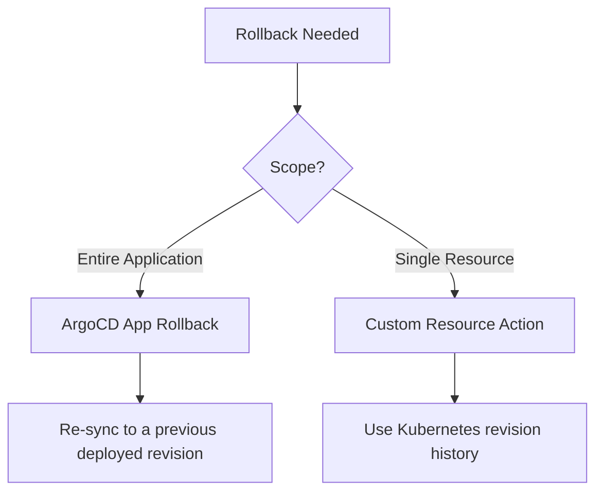

# How to Create Custom Rollback Actions in ArgoCD

Author: [nawazdhandala](https://github.com/nawazdhandala)

Tags: ArgoCD, GitOps, Kubernetes, Rollback

Description: Learn how to create custom rollback actions in ArgoCD for Deployments, StatefulSets, and Argo Rollouts that let you revert to previous revisions directly from the ArgoCD UI or CLI.

---

ArgoCD has built-in rollback functionality at the application level, but sometimes you need more granular control. You might want to roll back a single Deployment within a multi-resource application, or you might want to roll back to a specific ReplicaSet revision rather than an ArgoCD sync revision. Custom rollback actions can give you a fine-grained entry point directly from the ArgoCD interface, usually by recording the request on the resource for a controller to process.

This guide covers creating custom rollback resource actions for Deployments and Argo Rollouts resources.

## Application-Level vs Resource-Level Rollback

ArgoCD supports two types of rollback:

**Application-level rollback** reverts the entire application to a previous deployed revision from ArgoCD's history.

```bash
# Built-in application rollback

argocd app rollback my-app <history-id>
```

**Resource-level rollback** uses Kubernetes' native revision history to roll back a single resource. This is what we are building with custom actions.


```mermaid
flowchart TD
    A[Rollback Needed] --> B{Scope?}
    B -->|Entire Application| C[ArgoCD App Rollback]
    B -->|Single Resource| D[Custom Resource Action]
    C --> E[Re-sync to a previous deployed revision]
    D --> F[Use Kubernetes revision history]
```

## Rollback Action for Deployments

Kubernetes Deployments keep a history of ReplicaSets. Each time you update the pod template, a new ReplicaSet is created and the old one is kept (up to `revisionHistoryLimit`). A rollback action can set the Deployment to use a previous ReplicaSet.

However, Lua scripts in ArgoCD cannot directly interact with the Kubernetes API. A custom action cannot inspect ReplicaSets and copy an old pod template by itself.

The Deployment `spec.rollbackTo` field was removed from the modern `apps/v1` API, so a practical approach is to trigger a rollback annotation and let a small controller run `kubectl rollout undo`:

```yaml
apiVersion: v1
kind: ConfigMap
metadata:
  name: argocd-cm
  namespace: argocd
data:
  resource.customizations.actions.apps_Deployment: |
    mergeBuiltinActions: true
    discovery.lua: |
      actions = {}
      -- Show rollback action when the Deployment status is available.
      if obj.status ~= nil and obj.status.conditions ~= nil then
        actions["rollback-previous"] = {
          ["disabled"] = false
        }
      end
      return actions
    definitions:
      - name: rollback-previous
        action.lua: |
          -- Trigger a rollback by adding a rollback annotation
          -- This signals external tooling or operators to perform the rollback
          if obj.metadata.annotations == nil then
            obj.metadata.annotations = {}
          end
          local os = require("os")
          obj.metadata.annotations["argocd.argoproj.io/rollback-requested-at"] = os.date("!%Y-%m-%dT%XZ")
          obj.metadata.annotations["argocd.argoproj.io/rollback-revision"] = "previous"
          return obj
```

### Using a Webhook-Based Rollback

Since Lua scripts cannot call the Kubernetes API directly, a practical approach for true rollback is to combine the action with an external controller that watches for the rollback annotation:

```yaml
apiVersion: v1
kind: ServiceAccount
metadata:
  name: rollback-controller
  namespace: argocd
---
apiVersion: rbac.authorization.k8s.io/v1
kind: ClusterRole
metadata:
  name: rollback-controller
rules:
  - apiGroups: ["apps"]
    resources: ["deployments"]
    verbs: ["get", "list", "watch", "patch"]
  - apiGroups: ["apps"]
    resources: ["replicasets"]
    verbs: ["get", "list"]
---
apiVersion: rbac.authorization.k8s.io/v1
kind: ClusterRoleBinding
metadata:
  name: rollback-controller
roleRef:
  apiGroup: rbac.authorization.k8s.io
  kind: ClusterRole
  name: rollback-controller
subjects:
  - kind: ServiceAccount
    name: rollback-controller
    namespace: argocd
---
# External rollback controller (runs as a Deployment in the cluster)
apiVersion: apps/v1
kind: Deployment
metadata:
  name: rollback-controller
  namespace: argocd
spec:
  replicas: 1
  selector:
    matchLabels:
      app: rollback-controller
  template:
    metadata:
      labels:
        app: rollback-controller
    spec:
      serviceAccountName: rollback-controller
      containers:
        - name: controller
          image: bitnami/kubectl:latest
          command:
            - /bin/sh
            - -c
            - |
              while true; do
                # Watch for deployments with rollback annotation
                DEPLOYMENTS=$(kubectl get deployments --all-namespaces \
                  -o jsonpath='{range .items[?(@.metadata.annotations.argocd\.argoproj\.io/rollback-requested-at)]}{.metadata.namespace}/{.metadata.name}{"\n"}{end}')

                for dep in $DEPLOYMENTS; do
                  NS=$(echo $dep | cut -d/ -f1)
                  NAME=$(echo $dep | cut -d/ -f2)
                  echo "Rolling back $NS/$NAME"
                  kubectl rollout undo deployment/$NAME -n $NS
                  kubectl annotate deployment/$NAME -n $NS \
                    argocd.argoproj.io/rollback-requested-at- \
                    argocd.argoproj.io/rollback-revision-
                done
                sleep 10
              done
```

## Rollback Action for Argo Rollouts

ArgoCD includes built-in resource actions for Argo Rollouts operations such as abort, retry, restart, and promote-full. A true "undo" to a previous Rollout revision is provided by the Argo Rollouts CLI, so the same annotation-plus-controller pattern is needed if you want to start it from an ArgoCD custom action:

```yaml
resource.customizations.actions.argoproj.io_Rollout: |
  mergeBuiltinActions: true
  discovery.lua: |
    actions = {}
    -- Request an external controller to run "kubectl argo rollouts undo"
    actions["request-undo"] = {["disabled"] = false}
    return actions
  definitions:
    - name: request-undo
      action.lua: |
        if obj.metadata.annotations == nil then
          obj.metadata.annotations = {}
        end
        local os = require("os")
        obj.metadata.annotations["argocd.argoproj.io/rollout-undo-requested-at"] = os.date("!%Y-%m-%dT%XZ")
        obj.metadata.annotations["argocd.argoproj.io/rollout-undo-revision"] = "previous"
        return obj
```

## Using the Rollback Actions

### From the UI

1. Navigate to your application in ArgoCD
2. Click on the Deployment or Rollout resource
3. Click "Actions" in the resource detail view
4. Select "rollback-previous" or "request-undo"
5. Confirm the action

### From the CLI

```bash
# List available actions for a Deployment
argocd app actions list my-app --kind Deployment

# Execute rollback
argocd app actions run my-app rollback-previous \
  --kind Deployment \
  --resource-name my-deployment \
  --namespace production

# For Argo Rollouts
argocd app actions run my-app abort \
  --kind Rollout \
  --group argoproj.io \
  --resource-name my-rollout \
  --namespace production

argocd app actions run my-app request-undo \
  --kind Rollout \
  --group argoproj.io \
  --resource-name my-rollout \
  --namespace production
```

## Handling the OutOfSync State After Rollback

After a resource-level rollback, the application will be OutOfSync because the live state no longer matches Git. You have two options:

1. **Update Git to match**: Create a PR that updates the manifest to match the rolled-back state. This is the GitOps-correct approach.

2. **Sync from Git again**: If the Git state is correct and the rollback was temporary, sync the application to bring the live state back in line with Git.

```bash
# Option 1: After fixing Git, sync
argocd app sync my-app

# Option 2: If you want to keep the rolled-back state
# Update your Git manifests to match the rolled-back state
# Then sync
```

## RBAC for Rollback Actions

Restrict who can perform rollbacks:

```csv
# Only admins and ops can rollback
p, role:admin, applications, action/apps/Deployment/rollback-previous, *, allow
p, role:ops, applications, action/apps/Deployment/rollback-previous, *, allow
p, role:developer, applications, action/apps/Deployment/rollback-previous, *, deny

# Rollout actions for the ops team
p, role:ops, applications, action/argoproj.io/Rollout/*, *, allow
```

## Best Practices for Rollback Actions

1. **Always have a Git-based rollback plan**: Resource actions modify live state, not Git. For permanent rollbacks, use `git revert`.

2. **Test rollback actions in staging**: Verify that your Lua scripts work correctly before deploying them to production ArgoCD instances.

3. **Log rollback events**: Use ArgoCD notifications to send alerts when rollback actions are triggered so the team knows what happened.

4. **Set revision history limits**: Kubernetes Deployments default to keeping 10 ReplicaSets. Adjust `revisionHistoryLimit` based on how far back you need to roll back.

For more on ArgoCD's built-in rollback, see [how to use resource health for automated rollbacks](https://oneuptime.com/blog/post/2026-02-26-argocd-resource-health-automated-rollbacks/view). For creating other types of actions, check out [how to configure custom resource actions in ArgoCD](https://oneuptime.com/blog/post/2026-02-26-argocd-custom-resource-actions/view).
