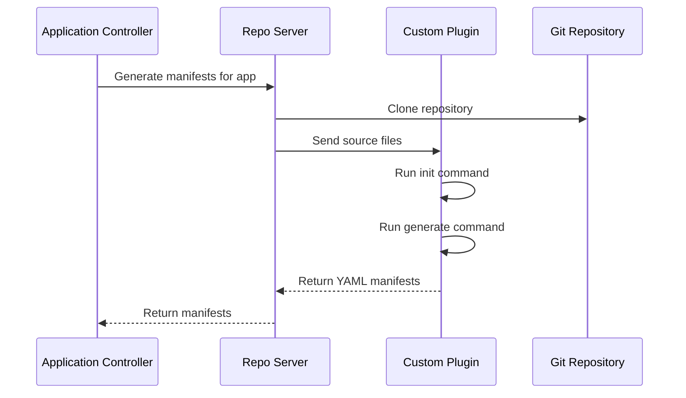

# How to Build a Custom Tool Plugin for ArgoCD

Author: [nawazdhandala](https://github.com/nawazdhandala)

Tags: ArgoCD, GitOps, Kubernetes, Config Management Plugins, Custom Tooling

Description: Step-by-step guide to building a custom tool plugin for ArgoCD that integrates any manifest generation tool into your GitOps pipeline.

---

ArgoCD natively supports Helm, Kustomize, Jsonnet, and plain YAML. But plenty of teams rely on other tools for generating Kubernetes manifests - things like CUE, Dhall, ytt (Carvel), Tanka, or even custom Python scripts. Building a custom tool plugin lets you integrate any of these into your ArgoCD workflow without compromises.

This guide walks through the entire process of building a custom tool plugin from scratch, using a real example with CUE as the manifest generation tool.

## What a Custom Tool Plugin Does

A custom tool plugin sits between your Git repository and the ArgoCD application controller. When ArgoCD needs to generate manifests for an application, it calls your plugin with the repository source files. Your plugin runs whatever commands are needed to transform those files into valid Kubernetes YAML, then returns the result to stdout.

The plugin lifecycle looks like this:



## Example: Building a CUE Plugin

CUE is a configuration language that provides strong typing and validation. Let us build a plugin that renders CUE definitions into Kubernetes manifests.

### The Plugin Configuration

Start by defining what the plugin does:

```yaml
# plugin.yaml
apiVersion: argoproj.io/v1alpha1
kind: ConfigManagementPlugin
metadata:
  # This name is what you reference in Application specs
  name: cue-manifests
spec:
  version: v1.0
  init:
    command: [sh, -c]
    args:
      - |
        # Download CUE module dependencies if a cue.mod exists
        if [ -d "cue.mod" ]; then
          echo "Found cue.mod, resolving dependencies..."
          cue mod tidy
        fi
  generate:
    command: [sh, -c]
    args:
      - |
        # Export all CUE definitions as YAML
        # The -e flag specifies the expression to export
        # Adjust the expression based on your CUE structure
        cue export . \
          --out yaml \
          --expression objects \
          --force
  discover:
    find:
      # Auto-detect repos with CUE files
      glob: "**/*.cue"
  # Preserve file permissions when sending files to the plugin
  preserveFileMode: true
```

### The Dockerfile

Build a container image with CUE and the ArgoCD CMP server:

```dockerfile
FROM golang:1.21-alpine AS builder

# Install CUE from source for the latest version
RUN go install cuelang.org/go/cmd/cue@latest

FROM alpine:3.19

# Install runtime dependencies
RUN apk add --no-cache git bash

# Copy CUE binary
COPY --from=builder /go/bin/cue /usr/local/bin/cue

# Copy the ArgoCD CMP server binary
COPY --from=quay.io/argoproj/argocd:v2.10.0 \
    /usr/local/bin/argocd-cmp-server \
    /usr/local/bin/argocd-cmp-server

# Copy plugin configuration
COPY plugin.yaml /home/argocd/cmp-server/config/plugin.yaml

# Run as non-root
USER 999

ENTRYPOINT ["/usr/local/bin/argocd-cmp-server"]
```

### Sample CUE Repository Structure

Here is what a repository using this plugin might look like:

```text
my-app/
  cue.mod/
    module.cue
  deployment.cue
  service.cue
  objects_tool.cue
```

And the CUE files themselves:

```cue
// deployment.cue
package myapp

import "encoding/yaml"

// Define the deployment
deployment: {
    apiVersion: "apps/v1"
    kind:       "Deployment"
    metadata: {
        name:      "my-app"
        namespace: "default"
        labels: app: "my-app"
    }
    spec: {
        replicas: 3
        selector: matchLabels: app: "my-app"
        template: {
            metadata: labels: app: "my-app"
            spec: containers: [{
                name:  "my-app"
                image: "my-app:latest"
                ports: [{containerPort: 8080}]
                resources: {
                    requests: {
                        memory: "128Mi"
                        cpu:    "100m"
                    }
                    limits: {
                        memory: "256Mi"
                        cpu:    "500m"
                    }
                }
            }]
        }
    }
}

// Collect all objects for export
objects: yaml.MarshalStream([deployment, service])
```

### Deploying the Plugin

Add the sidecar to the repo-server deployment:

```yaml
apiVersion: apps/v1
kind: Deployment
metadata:
  name: argocd-repo-server
  namespace: argocd
spec:
  template:
    spec:
      containers:
        - name: cue-plugin
          image: my-registry/argocd-cmp-cue:v1.0
          securityContext:
            runAsNonRoot: true
            runAsUser: 999
          resources:
            requests:
              memory: "256Mi"
              cpu: "200m"
            limits:
              memory: "512Mi"
              cpu: "1000m"
          volumeMounts:
            - name: var-files
              mountPath: /var/run/argocd
            - name: plugins
              mountPath: /home/argocd/cmp-server/plugins
            - name: cmp-tmp
              mountPath: /tmp
```

## Building Plugins for Other Tools

The pattern is the same for any tool. Here are quick plugin configurations for popular alternatives.

### ytt (Carvel) Plugin

```yaml
apiVersion: argoproj.io/v1alpha1
kind: ConfigManagementPlugin
metadata:
  name: ytt-plugin
spec:
  version: v1.0
  generate:
    command: [sh, -c]
    args:
      - |
        # Render ytt templates
        # Pass any data values files found in the directory
        ytt -f . \
          $(find . -name '*-values.yaml' -exec echo '-f {}' \;)
  discover:
    find:
      glob: "**/#ytt"
```

### Dhall Plugin

```yaml
apiVersion: argoproj.io/v1alpha1
kind: ConfigManagementPlugin
metadata:
  name: dhall-plugin
spec:
  version: v1.0
  generate:
    command: [sh, -c]
    args:
      - |
        # Convert Dhall to YAML
        dhall-to-yaml --file main.dhall
  discover:
    find:
      glob: "**/main.dhall"
```

### Custom Python Plugin

```yaml
apiVersion: argoproj.io/v1alpha1
kind: ConfigManagementPlugin
metadata:
  name: python-manifests
spec:
  version: v1.0
  init:
    command: [sh, -c]
    args:
      - |
        # Install Python dependencies
        if [ -f requirements.txt ]; then
          pip install -r requirements.txt --quiet
        fi
  generate:
    command: [python3, generate.py]
  discover:
    find:
      glob: "**/generate.py"
```

## Handling Parameters

Your plugin can accept parameters from the Application spec through environment variables:

```yaml
# Application spec with plugin parameters
spec:
  source:
    plugin:
      name: cue-manifests
      env:
        - name: ENVIRONMENT
          value: "production"
        - name: REPLICA_COUNT
          value: "5"
```

Then in your plugin's generate command, read those variables:

```yaml
generate:
  command: [sh, -c]
  args:
    - |
      # Use environment variables in generation
      cue export . \
        --out yaml \
        --expression objects \
        --inject env=${ENVIRONMENT:-staging} \
        --inject replicas=${REPLICA_COUNT:-3}
```

## Testing Your Plugin Locally

Before deploying, test the plugin locally to make sure it generates valid manifests:

```bash
# Clone your repo locally
git clone https://github.com/myorg/myrepo.git
cd myrepo/my-app

# Run the same commands your plugin would run
# Init step
if [ -d "cue.mod" ]; then
  cue mod tidy
fi

# Generate step - should output valid YAML
cue export . --out yaml --expression objects --force

# Validate the output is valid Kubernetes YAML
cue export . --out yaml --expression objects --force | kubectl apply --dry-run=client -f -
```

## Error Handling in Plugins

Make your generate command robust by handling errors gracefully. ArgoCD considers any non-zero exit code as a failure:

```yaml
generate:
  command: [sh, -c]
  args:
    - |
      set -euo pipefail

      # Validate inputs before generating
      if [ ! -f "main.cue" ] && [ ! -f "cue.mod/module.cue" ]; then
        echo "Error: No CUE files found in source directory" >&2
        exit 1
      fi

      # Run generation with error capture
      output=$(cue export . --out yaml --expression objects 2>&1) || {
        echo "CUE export failed: $output" >&2
        exit 1
      }

      # Output the manifests to stdout
      echo "$output"
```

Errors written to stderr appear in the ArgoCD UI and logs, while stdout is treated as the generated manifests.

## Performance Tips

Custom plugins can become a bottleneck if they perform slow operations:

- Cache dependencies in the init step and use volume mounts to persist them
- Set appropriate timeouts (the default is 90 seconds)
- Avoid network calls during generation when possible
- Keep the container image small to reduce startup time

## Summary

Building a custom tool plugin for ArgoCD follows a clear pattern: define your plugin configuration, build a container with your tool and the CMP server, and deploy it as a sidecar on the repo-server. This lets you use any manifest generation tool while keeping the security and isolation benefits of the sidecar architecture. The key is getting the generate command right - it must output valid Kubernetes YAML to stdout and signal errors through stderr and non-zero exit codes.
