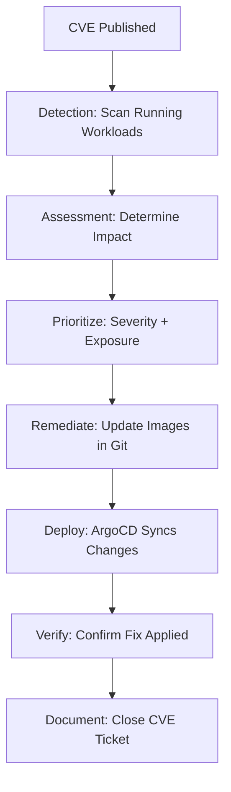

# How to Handle CVE Remediation Workflows with ArgoCD

Author: [nawazdhandala](https://github.com/nawazdhandala)

Tags: ArgoCD, GitOps, Kubernetes, CVE, Vulnerability Management

Description: Learn how to implement CVE remediation workflows with ArgoCD, covering vulnerability detection, automated patching, rollback strategies, and compliance tracking through GitOps.

---

When a new CVE affects your running workloads, the clock starts ticking. You need to identify affected deployments, prioritize remediation, deploy patches, and verify the fix - all while maintaining a complete audit trail. ArgoCD and GitOps provide the perfect framework for managing this process. This post covers practical CVE remediation workflows built on ArgoCD.

## The CVE Remediation Lifecycle



Each step in this lifecycle maps to a Git operation, making the entire process auditable and reproducible.

## Step 1: Detection with Trivy Operator

Deploy the Trivy Operator through ArgoCD to continuously scan running workloads:

```yaml
# applications/trivy-operator.yaml
apiVersion: argoproj.io/v1alpha1
kind: Application
metadata:
  name: trivy-operator
  namespace: argocd
spec:
  project: security
  source:
    repoURL: https://aquasecurity.github.io/helm-charts/
    chart: trivy-operator
    targetRevision: 0.21.0
    helm:
      values: |
        trivy:
          severity: CRITICAL,HIGH
          ignoreUnfixed: false
        operator:
          scanJobTimeout: 10m
          vulnerabilityScannerEnabled: true
  destination:
    server: https://kubernetes.default.svc
    namespace: trivy-system
  syncPolicy:
    automated:
      selfHeal: true
```

## Step 2: Automated CVE Alert Generation

Create a CronJob that checks vulnerability reports and generates alerts:

```yaml
# monitoring/cve-alerter.yaml
apiVersion: batch/v1
kind: CronJob
metadata:
  name: cve-alerter
  namespace: trivy-system
spec:
  schedule: "*/30 * * * *"  # Every 30 minutes
  jobTemplate:
    spec:
      template:
        spec:
          serviceAccountName: vuln-reader
          containers:
            - name: alerter
              image: bitnami/kubectl:latest
              command:
                - /bin/sh
                - -c
                - |
                  # Get all vulnerability reports with critical findings
                  REPORTS=$(kubectl get vulnerabilityreports -A -o json)

                  # Extract critical CVEs
                  echo "$REPORTS" | jq -r '
                    .items[] |
                    select(.report.summary.criticalCount > 0) |
                    {
                      namespace: .metadata.namespace,
                      resource: .metadata.labels["trivy-operator.resource.name"],
                      criticals: .report.summary.criticalCount,
                      cves: [.report.vulnerabilities[] | select(.severity == "CRITICAL") | .vulnerabilityID]
                    }
                  ' > /tmp/critical-cves.json

                  # Check if there are new criticals
                  CRITICAL_COUNT=$(jq -s 'length' /tmp/critical-cves.json)

                  if [ "$CRITICAL_COUNT" -gt "0" ]; then
                    echo "Found $CRITICAL_COUNT resources with critical CVEs"
                    cat /tmp/critical-cves.json

                    # Send alert via webhook
                    curl -X POST "$ALERT_WEBHOOK_URL" \
                      -H "Content-Type: application/json" \
                      -d "{\"text\": \"Critical CVEs detected in $CRITICAL_COUNT workloads\", \"details\": $(cat /tmp/critical-cves.json)}"
                  fi
              env:
                - name: ALERT_WEBHOOK_URL
                  valueFrom:
                    secretKeyRef:
                      name: alert-config
                      key: webhook-url
          restartPolicy: Never
```

## Step 3: Assessment and Prioritization

Create a dashboard job that produces a prioritized remediation list:

```yaml
# monitoring/cve-assessment.yaml
apiVersion: batch/v1
kind: Job
metadata:
  name: cve-assessment
  namespace: trivy-system
spec:
  template:
    spec:
      serviceAccountName: vuln-reader
      containers:
        - name: assessor
          image: bitnami/kubectl:latest
          command:
            - /bin/sh
            - -c
            - |
              echo "=== CVE Remediation Priority Report ==="
              echo "Generated: $(date -u)"
              echo ""

              # Get all vuln reports
              kubectl get vulnerabilityreports -A -o json | jq -r '
                [.items[] | {
                  namespace: .metadata.namespace,
                  resource: .metadata.labels["trivy-operator.resource.name"],
                  kind: .metadata.labels["trivy-operator.resource.kind"],
                  critical: .report.summary.criticalCount,
                  high: .report.summary.highCount,
                  # Calculate priority score
                  priority: (
                    (.report.summary.criticalCount * 10) +
                    (.report.summary.highCount * 3)
                  )
                }] |
                sort_by(-.priority) |
                .[] |
                "\(.priority)\t\(.namespace)/\(.resource) (\(.kind))\tCritical:\(.critical) High:\(.high)"
              '

              echo ""
              echo "=== Top CVEs by Frequency ==="

              kubectl get vulnerabilityreports -A -o json | jq -r '
                [.items[].report.vulnerabilities[]? |
                  select(.severity == "CRITICAL") |
                  .vulnerabilityID
                ] |
                group_by(.) |
                map({cve: .[0], count: length}) |
                sort_by(-.count) |
                .[:10][] |
                "\(.count) affected images\t\(.cve)"
              '
      restartPolicy: Never
```

## Step 4: Automated Image Updates

Use ArgoCD Image Updater to automatically update to patched image versions:

```yaml
# applications/my-app.yaml
apiVersion: argoproj.io/v1alpha1
kind: Application
metadata:
  name: my-app
  namespace: argocd
  annotations:
    # Auto-update to latest patch versions
    argocd-image-updater.argoproj.io/image-list: >
      app=registry.example.com/myapp
    argocd-image-updater.argoproj.io/app.update-strategy: semver
    # Only update patch versions automatically
    argocd-image-updater.argoproj.io/app.allow-tags: regexp:^v1\.5\.\d+$
    argocd-image-updater.argoproj.io/write-back-method: git
spec:
  project: production
  source:
    repoURL: https://github.com/your-org/k8s-configs.git
    targetRevision: main
    path: apps/my-app
  destination:
    server: https://kubernetes.default.svc
    namespace: production
```

For manual remediation, update the image reference in Git:

```bash
# In your k8s-configs repository
# Update the image tag to the patched version

# deployment.yaml
# Before: image: registry.example.com/myapp:v1.5.3
# After:  image: registry.example.com/myapp:v1.5.4

git add deployment.yaml
git commit -m "fix(security): Update myapp to v1.5.4 - patches CVE-2026-1234

Severity: CRITICAL
Affected component: openssl 3.0.7
Fixed in: openssl 3.0.8 (included in myapp v1.5.4)
Reference: https://nvd.nist.gov/vuln/detail/CVE-2026-1234"

git push
```

ArgoCD detects the change and syncs automatically.

## Step 5: Emergency Rollout for Critical CVEs

For critical CVEs that need immediate patching, use ArgoCD's sync with force:

```yaml
# hooks/emergency-patch.yaml
apiVersion: batch/v1
kind: Job
metadata:
  name: emergency-rollout
  annotations:
    argocd.argoproj.io/hook: Sync
    argocd.argoproj.io/hook-delete-policy: HookSucceeded
    argocd.argoproj.io/sync-wave: "5"
spec:
  template:
    spec:
      serviceAccountName: deployment-manager
      containers:
        - name: rollout
          image: bitnami/kubectl:latest
          command:
            - /bin/sh
            - -c
            - |
              # Force a rolling restart to pick up the new image
              kubectl rollout restart deployment/my-app -n production

              # Wait for rollout to complete
              kubectl rollout status deployment/my-app -n production \
                --timeout=300s

              echo "Emergency rollout complete"
      restartPolicy: Never
```

## Step 6: Verification

After deploying the fix, verify the CVE is resolved:

```yaml
# hooks/verify-cve-fix.yaml
apiVersion: batch/v1
kind: Job
metadata:
  name: verify-cve-fix
  annotations:
    argocd.argoproj.io/hook: PostSync
    argocd.argoproj.io/hook-delete-policy: HookSucceeded
spec:
  template:
    spec:
      containers:
        - name: verify
          image: aquasec/trivy:latest
          command:
            - /bin/sh
            - -c
            - |
              IMAGE="registry.example.com/myapp:v1.5.4"
              CVE="CVE-2026-1234"

              echo "Verifying $CVE is fixed in $IMAGE..."

              # Scan the new image
              RESULT=$(trivy image --format json --no-progress "$IMAGE")

              # Check if the specific CVE still exists
              FOUND=$(echo "$RESULT" | jq -r \
                "[.Results[].Vulnerabilities[]? | select(.VulnerabilityID == \"$CVE\")] | length")

              if [ "$FOUND" -gt "0" ]; then
                echo "WARNING: $CVE still present in $IMAGE"
                echo "The fix may not be complete"
                exit 1
              fi

              echo "$CVE is NOT present in $IMAGE - fix verified"
      restartPolicy: Never
```

## Step 7: Rollback If Fix Breaks Things

If the patched image introduces regressions, roll back through Git:

```bash
# Revert the fix commit
git revert HEAD --no-edit
git push

# ArgoCD will automatically sync back to the previous version
```

ArgoCD's automatic sync will deploy the reverted version. You can then investigate the regression while the CVE remediation is reworked.

## Tracking Remediation Progress

Create a ConfigMap that tracks CVE remediation status:

```yaml
# cve-tracking/active-cves.yaml
apiVersion: v1
kind: ConfigMap
metadata:
  name: active-cve-tracking
  namespace: security
  labels:
    purpose: cve-tracking
data:
  CVE-2026-1234: |
    status: remediated
    severity: CRITICAL
    detected: 2026-02-25
    remediated: 2026-02-26
    affected: myapp v1.5.3
    fixed: myapp v1.5.4
  CVE-2026-5678: |
    status: in-progress
    severity: HIGH
    detected: 2026-02-26
    affected: worker v2.0.1
    notes: Waiting for upstream fix
```

This ConfigMap is managed by ArgoCD and provides a Git-tracked record of all CVE remediation activities.

## Monitoring and Alerting

Use [OneUptime](https://oneuptime.com) to monitor CVE remediation timelines and alert when critical CVEs remain unpatched beyond your SLA.

## Summary

CVE remediation with ArgoCD follows a structured workflow: detect vulnerabilities with continuous scanning, assess and prioritize based on severity and exposure, remediate by updating image references in Git, deploy through ArgoCD automatic sync, verify the fix with PostSync scanning, and track the entire process in version control. The GitOps approach ensures every remediation step is auditable, reproducible, and reversible. For critical CVEs, ArgoCD Image Updater can automate patch version updates, while manual Git commits handle more complex remediations.
