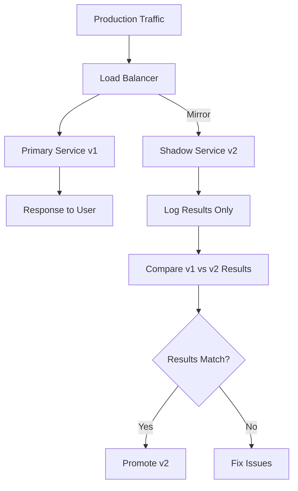
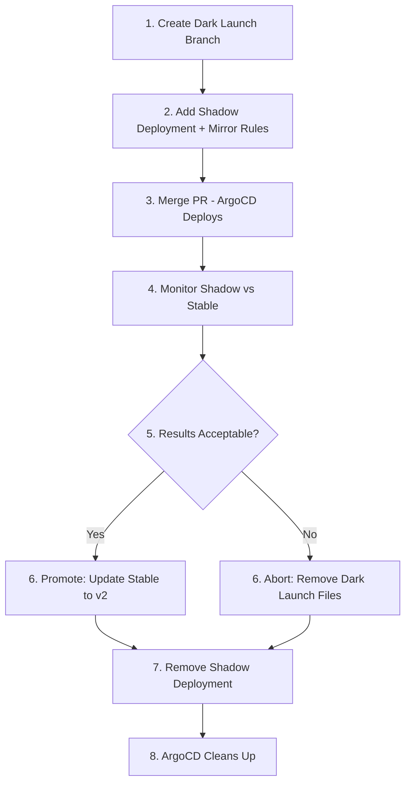

# How to Implement Dark Launches with ArgoCD

Author: [nawazdhandala](https://github.com/nawazdhandala)

Tags: ArgoCD, GitOps, Kubernetes, Dark Launches, Deployment Strategies

Description: Learn how to implement dark launches using ArgoCD to deploy and test new features in production without exposing them to end users through traffic mirroring and feature flags.

---

A dark launch is when you deploy new code to production but keep it invisible to real users. Traffic gets mirrored to the new version, feature flags hide new UI elements, and you validate everything works under real production load before flipping the switch. ArgoCD makes dark launches repeatable and reversible through GitOps.

This guide covers implementing dark launches with ArgoCD using traffic mirroring, shadow deployments, and feature flags.

## What Makes a Dark Launch

A dark launch combines several techniques:



The key principle: users only see responses from the current stable version. The new version runs in parallel, processing the same requests, but its responses are discarded.

## Traffic Mirroring with Istio

Istio's traffic mirroring sends a copy of every request to your shadow deployment. Manage this through ArgoCD:

```yaml
# dark-launch/mirror-vs.yaml
apiVersion: networking.istio.io/v1beta1
kind: VirtualService
metadata:
  name: api-service
  namespace: production
  annotations:
    dark-launch: "true"
    dark-launch-target: api-service-v2
spec:
  hosts:
    - api-service.production.svc.cluster.local
  http:
    - route:
        - destination:
            host: api-service.production.svc.cluster.local
            subset: stable
          weight: 100
      mirror:
        host: api-service.production.svc.cluster.local
        subset: shadow
      mirrorPercentage:
        value: 100.0  # Mirror 100% of traffic
```

The matching DestinationRule:

```yaml
# dark-launch/api-service-dr.yaml
apiVersion: networking.istio.io/v1beta1
kind: DestinationRule
metadata:
  name: api-service
  namespace: production
spec:
  host: api-service.production.svc.cluster.local
  subsets:
    - name: stable
      labels:
        version: v1
    - name: shadow
      labels:
        version: v2
```

## Shadow Deployment

Deploy the new version alongside the current version but with different labels:

```yaml
# dark-launch/shadow-deployment.yaml
apiVersion: apps/v1
kind: Deployment
metadata:
  name: api-service-shadow
  namespace: production
  labels:
    app: api-service
    version: v2
    dark-launch: "true"
  annotations:
    argocd.argoproj.io/sync-wave: "0"
spec:
  replicas: 3
  selector:
    matchLabels:
      app: api-service
      version: v2
  template:
    metadata:
      labels:
        app: api-service
        version: v2
    spec:
      containers:
        - name: api-service
          image: ghcr.io/myorg/api-service:v2.0.0-rc1
          ports:
            - containerPort: 8080
          env:
            - name: DARK_LAUNCH_MODE
              value: "true"
            - name: LOG_LEVEL
              value: debug
            # Same config as production
            - name: DATABASE_URL
              valueFrom:
                secretKeyRef:
                  name: api-service-db
                  key: url
          resources:
            requests:
              cpu: 250m
              memory: 256Mi
            limits:
              cpu: "1"
              memory: 512Mi
          readinessProbe:
            httpGet:
              path: /healthz
              port: 8080
```

## ArgoCD Application for Dark Launches

Manage dark launches as a separate ArgoCD Application that can be created and deleted independently:

```yaml
# dark-launch-app.yaml
apiVersion: argoproj.io/v1alpha1
kind: Application
metadata:
  name: dark-launch-api-v2
  namespace: argocd
  labels:
    dark-launch: "true"
    target-service: api-service
spec:
  project: dark-launches
  source:
    repoURL: https://github.com/myorg/k8s-deployments.git
    path: dark-launch/api-service-v2
    targetRevision: main
  destination:
    server: https://kubernetes.default.svc
    namespace: production
  syncPolicy:
    automated:
      selfHeal: true
      prune: true  # Clean up when dark launch is removed from Git
```

## Dark Launch with Feature Flags

For UI changes, traffic mirroring does not work because users need to see the page. Instead, use feature flags to hide new features while they run in production:

```yaml
# dark-launch/feature-flags-cm.yaml
apiVersion: v1
kind: ConfigMap
metadata:
  name: dark-launch-flags
  namespace: production
data:
  flags.json: |
    {
      "features": {
        "new-checkout-ui": {
          "enabled": true,
          "visibility": "internal-only",
          "allowed-emails": [
            "*@mycompany.com"
          ]
        },
        "v2-search-engine": {
          "enabled": true,
          "visibility": "percentage",
          "percentage": 0
        },
        "recommendation-engine-v3": {
          "enabled": true,
          "visibility": "header-based",
          "header": "X-Dark-Launch",
          "header-value": "true"
        }
      }
    }
```

Your application code checks the flag before showing the new feature:

```python
# Application code that respects dark launch flags
def render_checkout(request, toggles):
    if toggles.is_enabled('new-checkout-ui'):
        user_email = request.user.email
        allowed = toggles.get_config('new-checkout-ui', 'allowed-emails')

        if any(user_email.endswith(pattern.replace('*', ''))
               for pattern in allowed):
            return render_new_checkout(request)

    return render_classic_checkout(request)
```

## Header-Based Routing for Internal Testing

Route internal testers to the new version using HTTP headers:

```yaml
# dark-launch/header-routing-vs.yaml
apiVersion: networking.istio.io/v1beta1
kind: VirtualService
metadata:
  name: web-app
  namespace: production
spec:
  hosts:
    - web-app.production.svc.cluster.local
  http:
    # Route dark launch testers to v2
    - match:
        - headers:
            x-dark-launch:
              exact: "true"
      route:
        - destination:
            host: web-app.production.svc.cluster.local
            subset: shadow
    # Everyone else gets v1
    - route:
        - destination:
            host: web-app.production.svc.cluster.local
            subset: stable
```

Internal testers add the header using a browser extension or a proxy rule:

```bash
# Test the dark launch version directly
curl -H "X-Dark-Launch: true" https://app.example.com/checkout
```

## Monitoring Dark Launches

Compare the performance of the shadow version against the stable version:

```yaml
# dark-launch/monitoring/comparison-rules.yaml
apiVersion: monitoring.coreos.com/v1
kind: PrometheusRule
metadata:
  name: dark-launch-comparison
  namespace: monitoring
spec:
  groups:
    - name: dark-launch
      rules:
        # Recording rule for stable version metrics
        - record: dark_launch:stable:error_rate
          expr: |
            sum(rate(istio_requests_total{
              destination_service_name="api-service",
              destination_version="v1",
              response_code=~"5.*"
            }[5m]))
            /
            sum(rate(istio_requests_total{
              destination_service_name="api-service",
              destination_version="v1"
            }[5m]))

        # Recording rule for shadow version metrics
        - record: dark_launch:shadow:error_rate
          expr: |
            sum(rate(istio_requests_total{
              destination_service_name="api-service",
              destination_version="v2",
              response_code=~"5.*"
            }[5m]))
            /
            sum(rate(istio_requests_total{
              destination_service_name="api-service",
              destination_version="v2"
            }[5m]))

        # Alert if shadow has significantly higher error rate
        - alert: DarkLaunchHigherErrorRate
          expr: |
            dark_launch:shadow:error_rate > dark_launch:stable:error_rate * 2
          for: 10m
          labels:
            severity: warning
          annotations:
            summary: "Dark launch shadow version has 2x error rate of stable"

        # Latency comparison
        - record: dark_launch:stable:p99_latency
          expr: |
            histogram_quantile(0.99, sum(rate(
              istio_request_duration_milliseconds_bucket{
                destination_service_name="api-service",
                destination_version="v1"
              }[5m])) by (le))

        - record: dark_launch:shadow:p99_latency
          expr: |
            histogram_quantile(0.99, sum(rate(
              istio_request_duration_milliseconds_bucket{
                destination_service_name="api-service",
                destination_version="v2"
              }[5m])) by (le))
```

## The Dark Launch Lifecycle

The full lifecycle of a dark launch managed through Git:



Each step is a Git commit, making the entire dark launch process auditable:

```bash
# Step 2: Start the dark launch
git checkout -b dark-launch/api-v2
# Add shadow deployment and mirror VirtualService
git commit -m "Dark launch: api-service v2.0.0-rc1"

# Step 6a: Promote (if successful)
# Update stable deployment to v2.0.0
# Remove mirror rules and shadow deployment
git commit -m "Promote: api-service v2.0.0 (dark launch successful)"

# OR Step 6b: Abort (if issues found)
# Remove shadow deployment and mirror rules
git commit -m "Abort dark launch: api-service v2.0.0-rc1 (latency regression)"
```

## Summary

Dark launches with ArgoCD combine traffic mirroring, shadow deployments, and feature flags to test new code under real production load without user impact. Every step of the dark launch - from deploying the shadow service to enabling traffic mirroring to promoting or aborting - is a Git commit managed by ArgoCD. This gives you a safe, auditable, and repeatable process for validating changes in production before exposing them to users.
