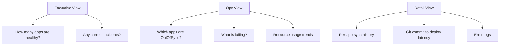

# How to Set Up ArgoCD Dashboards for Ops Teams

Author: [nawazdhandala](https://github.com/nawazdhandala)

Tags: ArgoCD, GitOps, Kubernetes, Grafana, Observability

Description: Learn how to build Grafana dashboards for ArgoCD that give operations teams clear visibility into application sync status, deployment velocity, and GitOps health.

---

The ArgoCD web UI is great for developers managing individual applications, but ops teams need a different view - a high-level dashboard showing the health of all applications, deployment velocity, error rates, and resource usage across the entire platform. This guide covers how to build Grafana dashboards that give ops teams the visibility they need.

## Dashboard Architecture

Ops teams need several layers of visibility:



## Prerequisites

You need Prometheus scraping ArgoCD metrics and Grafana connected to Prometheus. If you do not have this set up yet, see [monitoring ArgoCD health as part of cluster health](https://oneuptime.com/blog/post/2026-02-26-argocd-monitor-cluster-health/view).

## Dashboard 1: Executive Overview

This dashboard answers "is everything okay?" at a glance.

### Panel 1: Application Status Summary

A stat panel showing total applications by health status.

```promql
# Total healthy applications
count(argocd_app_info{health_status="Healthy"})

# Total degraded applications
count(argocd_app_info{health_status="Degraded"})

# Total missing applications
count(argocd_app_info{health_status="Missing"})

# Total progressing applications
count(argocd_app_info{health_status="Progressing"})
```

### Panel 2: Sync Status Pie Chart

```promql
# Applications by sync status
count by (sync_status) (argocd_app_info)
```

Configure this as a pie chart with colors:
- Synced = green
- OutOfSync = orange
- Unknown = gray

### Panel 3: Deployment Velocity (Deploys Per Hour)

```promql
# Successful syncs per hour
sum(increase(argocd_app_sync_total{phase="Succeeded"}[1h]))

# Failed syncs per hour
sum(increase(argocd_app_sync_total{phase="Error"}[1h]))
```

### Panel 4: Overall GitOps Health Score

Create a calculated health score from 0 to 100.

```promql
# Percentage of healthy and synced applications
(
  count(argocd_app_info{health_status="Healthy", sync_status="Synced"})
  /
  count(argocd_app_info)
) * 100
```

Display this as a gauge panel with thresholds at 90 (green), 70 (yellow), and below 70 (red).

## Dashboard 2: Ops Detail View

This dashboard helps ops engineers investigate issues.

### Panel 1: OutOfSync Applications Table

```promql
# List all OutOfSync applications with details
argocd_app_info{sync_status="OutOfSync"}
```

Configure as a table with columns: application name, namespace, project, health status.

### Panel 2: Recent Sync Failures

```promql
# Applications with sync failures in the last hour
increase(argocd_app_sync_total{phase=~"Error|Failed"}[1h]) > 0
```

### Panel 3: Application Controller Queue Depth

```promql
# Reconciliation queue depth over time
workqueue_depth{name="app_reconciliation_queue"}

# Queue processing rate
rate(workqueue_adds_total{name="app_reconciliation_queue"}[5m])
```

If the queue depth is consistently high, the application controller is overloaded.

### Panel 4: Reconciliation Duration

```promql
# P50, P95, P99 reconciliation times
histogram_quantile(0.50, sum(rate(argocd_app_reconcile_bucket[5m])) by (le))
histogram_quantile(0.95, sum(rate(argocd_app_reconcile_bucket[5m])) by (le))
histogram_quantile(0.99, sum(rate(argocd_app_reconcile_bucket[5m])) by (le))
```

### Panel 5: Git Operations Performance

```promql
# Git fetch duration (P95)
histogram_quantile(0.95, sum(rate(argocd_git_request_duration_seconds_bucket[5m])) by (le, request_type))

# Git fetch error rate
rate(argocd_git_request_total{grpc_code!="OK"}[5m])
```

### Panel 6: Repo Server Load

```promql
# Pending manifest generation requests
argocd_repo_pending_request_total

# Concurrent manifest generation
sum(argocd_repo_pending_request_total)
```

## Dashboard 3: Resource Usage

Track ArgoCD's own footprint.

### Panel 1: CPU Usage by Component

```promql
# CPU usage per ArgoCD component
sum by (container) (rate(container_cpu_usage_seconds_total{namespace="argocd"}[5m]))
```

### Panel 2: Memory Usage by Component

```promql
# Memory usage per component
sum by (container) (container_memory_working_set_bytes{namespace="argocd"})
```

### Panel 3: Redis Memory

```promql
# Redis memory usage
redis_memory_used_bytes{namespace="argocd"}

# Redis connected clients
redis_connected_clients{namespace="argocd"}

# Redis commands per second
rate(redis_commands_processed_total{namespace="argocd"}[5m])
```

### Panel 4: Pod Restarts

```promql
# ArgoCD pod restarts (indicates crashes or OOM)
sum by (pod) (kube_pod_container_status_restarts_total{namespace="argocd"})
```

## Dashboard 4: Multi-Cluster View

For teams managing multiple clusters through ArgoCD.

### Panel 1: Applications by Cluster

```promql
# Count of applications per destination cluster
count by (dest_server) (argocd_app_info)
```

### Panel 2: Health by Cluster

```promql
# Unhealthy applications per cluster
count by (dest_server) (argocd_app_info{health_status!="Healthy"})
```

### Panel 3: Sync Status by Cluster

```promql
# OutOfSync applications per cluster
count by (dest_server) (argocd_app_info{sync_status="OutOfSync"})
```

## Using the ArgoCD Community Grafana Dashboard

The ArgoCD community maintains a pre-built Grafana dashboard. Import it as a starting point and customize from there.

```bash
# Import the official ArgoCD Grafana dashboard
# Dashboard ID: 14584
# In Grafana: Dashboards > Import > Enter ID: 14584
```

Customize it by:

1. Adding your organization's application name labels
2. Filtering by ArgoCD projects relevant to each team
3. Adding deployment velocity panels specific to your release cadence
4. Including links to ArgoCD UI for drill-down

## Setting Up Dashboard Variables

Make dashboards flexible with Grafana template variables.

```promql
# Variable: project
# Query: label_values(argocd_app_info, project)

# Variable: dest_server
# Query: label_values(argocd_app_info, dest_server)

# Variable: health_status
# Query: label_values(argocd_app_info, health_status)
```

Then use these variables in panel queries.

```promql
# Filtered application count
count(argocd_app_info{project=~"$project", dest_server=~"$dest_server"})
```

## Dashboard Access Control

Set up Grafana organizations or folders to control who sees what.

```yaml
# Grafana dashboard provisioning for different teams
apiVersion: 1
providers:
  - name: argocd-ops
    folder: ArgoCD Operations
    type: file
    disableDeletion: false
    updateIntervalSeconds: 30
    options:
      path: /var/lib/grafana/dashboards/argocd-ops
      foldersFromFilesStructure: true
```

Map Grafana roles to your team structure:

- **Platform/SRE team**: Full access to all dashboards
- **Development teams**: Read-only access to their project's dashboards
- **Management**: Access to the executive overview only

## Real-Time Alerting from Dashboards

Configure Grafana alerting directly from dashboard panels for quick issue detection.

```yaml
# Grafana alert rule for unhealthy applications
apiVersion: 1
groups:
  - name: argocd-dashboard-alerts
    folder: ArgoCD Operations
    interval: 1m
    rules:
      - title: Applications Unhealthy
        condition: B
        data:
          - refId: A
            queryType: ""
            model:
              expr: count(argocd_app_info{health_status!="Healthy"}) or vector(0)
          - refId: B
            queryType: ""
            model:
              type: threshold
              conditions:
                - evaluator:
                    type: gt
                    params: [0]
```

## Summary

Building effective ArgoCD dashboards for ops teams requires layered visibility - an executive overview for quick status checks, an operational detail view for investigation, resource usage tracking, and multi-cluster views for scale. Start with the community Grafana dashboard (ID 14584) and customize it with your organization's specific needs. The most important panels are application health status, sync status distribution, deployment velocity, and component resource usage. Use template variables to let operators filter by project, cluster, and status, and set up alerts directly from dashboard panels for real-time notification.
