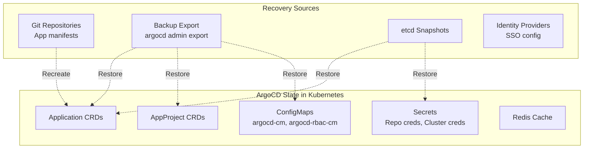

# How to Handle ArgoCD Data Loss Recovery

Author: [nawazdhandala](https://github.com/nawazdhandala)

Tags: ArgoCD, GitOps, Kubernetes, Disaster Recovery, Backups

Description: Learn how to recover ArgoCD from data loss scenarios including lost applications, deleted ConfigMaps, corrupted secrets, and complete namespace deletion with step-by-step recovery procedures.

---

ArgoCD stores all its state as Kubernetes resources - Applications, AppProjects, ConfigMaps, and Secrets. When these are accidentally deleted or lost, your entire GitOps setup can break. The good news is that GitOps itself provides a natural recovery path: your Git repositories still contain the desired state. This guide covers recovery from every data loss scenario.

## What Can Be Lost



## Prevention: Setting Up Backups

Before disaster strikes, set up automated backups:

```bash
#!/bin/bash
# argocd-backup.sh - Run daily via cron

BACKUP_DIR="/backups/argocd"
DATE=$(date +%Y%m%d-%H%M%S)
NAMESPACE="argocd"

mkdir -p "$BACKUP_DIR"

# Export all ArgoCD data
argocd admin export --namespace $NAMESPACE > "$BACKUP_DIR/argocd-export-${DATE}.yaml"

# Backup ConfigMaps separately
kubectl get configmap argocd-cm -n $NAMESPACE -o yaml > "$BACKUP_DIR/argocd-cm-${DATE}.yaml"
kubectl get configmap argocd-rbac-cm -n $NAMESPACE -o yaml > "$BACKUP_DIR/argocd-rbac-cm-${DATE}.yaml"
kubectl get configmap argocd-cmd-params-cm -n $NAMESPACE -o yaml > "$BACKUP_DIR/argocd-cmd-params-cm-${DATE}.yaml"

# Backup secrets (encrypted)
kubectl get secrets -n $NAMESPACE -o yaml | \
  gpg --encrypt --recipient your-key-id > "$BACKUP_DIR/secrets-${DATE}.yaml.gpg"

# Backup Application CRDs
kubectl get applications -n $NAMESPACE -o yaml > "$BACKUP_DIR/applications-${DATE}.yaml"

# Backup AppProjects
kubectl get appprojects -n $NAMESPACE -o yaml > "$BACKUP_DIR/projects-${DATE}.yaml"

# Keep last 30 days of backups
find "$BACKUP_DIR" -name "*.yaml" -mtime +30 -delete
find "$BACKUP_DIR" -name "*.gpg" -mtime +30 -delete

echo "Backup completed: $BACKUP_DIR/argocd-export-${DATE}.yaml"
```

## Scenario 1: Application CRDs Accidentally Deleted

Someone ran `kubectl delete applications --all -n argocd` or deleted individual applications.

### Recovery from Backup

```bash
# Restore from argocd admin export
argocd admin import --namespace argocd < argocd-export-latest.yaml

# Or restore specific applications from backup
kubectl apply -f applications-backup.yaml
```

### Recovery from Git (Declarative Setup)

If your applications are managed declaratively in Git (the recommended approach), simply re-apply them:

```bash
# If you use app-of-apps pattern
kubectl apply -f https://raw.githubusercontent.com/your-org/argocd-config/main/apps/root-app.yaml

# If applications are in a directory
kubectl apply -f argocd-applications/
```

### Recovery by Recreating Applications

If you have no backup but know the application specs:

```yaml
# Recreate an application
apiVersion: argoproj.io/v1alpha1
kind: Application
metadata:
  name: my-app
  namespace: argocd
spec:
  project: default
  source:
    repoURL: https://github.com/your-org/your-repo.git
    path: k8s/manifests
    targetRevision: HEAD
  destination:
    server: https://kubernetes.default.svc
    namespace: my-app
  syncPolicy:
    automated:
      prune: true
      selfHeal: true
```

The deployed resources in your cluster are unaffected by Application CRD deletion (unless cascade delete was used). You just need to recreate the Application resources to re-establish ArgoCD management.

## Scenario 2: ArgoCD ConfigMaps Deleted

The `argocd-cm`, `argocd-rbac-cm`, or `argocd-cmd-params-cm` ConfigMaps are deleted.

### Restore argocd-cm

```yaml
# Minimal argocd-cm to get ArgoCD running
apiVersion: v1
kind: ConfigMap
metadata:
  name: argocd-cm
  namespace: argocd
  labels:
    app.kubernetes.io/name: argocd-cm
    app.kubernetes.io/part-of: argocd
data:
  url: "https://argocd.example.com"
```

### Restore argocd-rbac-cm

```yaml
# Minimal RBAC ConfigMap
apiVersion: v1
kind: ConfigMap
metadata:
  name: argocd-rbac-cm
  namespace: argocd
  labels:
    app.kubernetes.io/name: argocd-rbac-cm
    app.kubernetes.io/part-of: argocd
data:
  policy.default: role:readonly
```

### Restore argocd-cmd-params-cm

```yaml
# This ConfigMap can be empty - ArgoCD uses defaults
apiVersion: v1
kind: ConfigMap
metadata:
  name: argocd-cmd-params-cm
  namespace: argocd
  labels:
    app.kubernetes.io/name: argocd-cmd-params-cm
    app.kubernetes.io/part-of: argocd
```

After restoring ConfigMaps, restart all ArgoCD components:

```bash
kubectl rollout restart deployment -n argocd \
  argocd-server argocd-application-controller argocd-repo-server argocd-dex-server
```

## Scenario 3: ArgoCD Secrets Deleted

The `argocd-secret` contains encryption keys, admin password, webhook secrets, and Dex credentials. Losing this requires regeneration.

```bash
# ArgoCD will regenerate the secret on restart if it is missing
# But you will lose:
# - The admin password (a new one will be generated)
# - Dex client secrets (need to re-add)
# - Webhook secrets (need to re-configure)
# - Repository credentials (need to re-add)

# Restart ArgoCD to regenerate the base secret
kubectl rollout restart deployment argocd-server -n argocd

# Get the new admin password
argocd admin initial-password -n argocd

# Re-add repository credentials
argocd repo add https://github.com/your-org/your-repo.git \
  --username your-username \
  --password your-token

# Re-add cluster credentials
argocd cluster add your-context-name
```

## Scenario 4: Repository Credential Secrets Deleted

```bash
# List what repository secrets still exist
kubectl get secrets -n argocd -l argocd.argoproj.io/secret-type=repository

# Re-add missing repositories
argocd repo add https://github.com/your-org/repo1.git \
  --username your-username --password your-token

argocd repo add git@github.com:your-org/repo2.git \
  --ssh-private-key-path ~/.ssh/id_rsa

# Verify repositories are accessible
argocd repo list
```

## Scenario 5: Complete ArgoCD Namespace Deleted

The worst case - someone deleted the entire argocd namespace.

```bash
# Step 1: Recreate the namespace
kubectl create namespace argocd

# Step 2: Reinstall ArgoCD
kubectl apply -n argocd -f https://raw.githubusercontent.com/argoproj/argo-cd/stable/manifests/install.yaml

# Step 3: Wait for pods to be ready
kubectl wait --for=condition=ready pod -l app.kubernetes.io/part-of=argocd -n argocd --timeout=300s

# Step 4: Restore configuration from backup
kubectl apply -f argocd-cm-backup.yaml
kubectl apply -f argocd-rbac-cm-backup.yaml

# Step 5: Restore from export if available
argocd admin import --namespace argocd < argocd-export-backup.yaml

# Step 6: If no export backup, re-add repositories
argocd repo add https://github.com/your-org/your-repo.git \
  --username your-username --password your-token

# Step 7: Re-apply applications (from Git or backup)
kubectl apply -f applications-backup.yaml
# Or re-apply app-of-apps
kubectl apply -f root-application.yaml

# Step 8: Restart to pick up all configuration
kubectl rollout restart deployment -n argocd --all
```

## Scenario 6: Redis Data Lost

Redis data loss causes temporary performance degradation but is not catastrophic:

```bash
# Redis data will be rebuilt automatically
# Just restart Redis if it is stuck
kubectl rollout restart deployment argocd-redis -n argocd

# Applications will re-cache on next reconciliation
# User sessions will be invalidated (users need to re-login)
```

## Verifying Recovery

After any recovery, verify that ArgoCD is working correctly:

```bash
#!/bin/bash
# verify-recovery.sh

NS="argocd"
echo "=== ArgoCD Recovery Verification ==="

# Check all pods are running
echo -e "\n--- Pod Status ---"
kubectl get pods -n $NS

# Check applications
echo -e "\n--- Application Count ---"
kubectl get applications -n $NS --no-headers | wc -l

# Check for applications in error state
echo -e "\n--- Applications with Errors ---"
kubectl get applications -n $NS -o json | \
  jq -r '.items[] | select(.status.conditions != null) | .metadata.name' 2>/dev/null

# Check repositories
echo -e "\n--- Repository Count ---"
argocd repo list 2>/dev/null | tail -n +2 | wc -l

# Check clusters
echo -e "\n--- Cluster Count ---"
argocd cluster list 2>/dev/null | tail -n +2 | wc -l

# Check sync status
echo -e "\n--- Sync Status Distribution ---"
kubectl get applications -n $NS -o json | \
  jq -r '[.items[].status.sync.status] | group_by(.) | map("\(.[0]): \(length)")[]' 2>/dev/null

echo -e "\n=== Verification Complete ==="
```

## Summary

ArgoCD data loss recovery depends on what was lost and what backups are available. The best defense is regular backups using `argocd admin export` and keeping your Application definitions in Git (declarative setup). Even without backups, ArgoCD can be recovered because the actual deployed resources remain in the cluster - you just need to re-establish ArgoCD's management by recreating Application resources. Set up automated daily backups and test your recovery procedure periodically to ensure you can recover quickly when needed.
