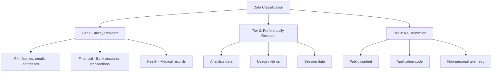
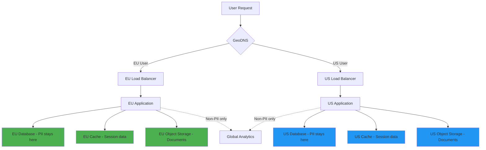

# How to Handle Data Residency Requirements with ArgoCD

Author: [nawazdhandala](https://github.com/nawazdhandala)

Tags: ArgoCD, GitOps, Kubernetes, Data Residency, Compliance

Description: Learn how to enforce data residency requirements using ArgoCD with GitOps-managed network policies, storage controls, and compliance validation for regulated deployments.

---

Data residency requirements mandate that certain data must be stored, processed, and sometimes even accessed only within specific geographic boundaries. These requirements come from regulations like GDPR (EU), LGPD (Brazil), PDPA (Singapore), PIPEDA (Canada), and industry-specific mandates. When you manage multi-region Kubernetes deployments with ArgoCD, you need to encode these requirements into your deployment manifests and validate them continuously.

This guide covers implementing data residency controls through ArgoCD, including storage policies, network restrictions, deployment guardrails, and compliance auditing.

## Understanding Data Residency Tiers

Not all data has the same residency requirements. Classify your data into tiers:



## Step 1: Label Clusters with Data Jurisdictions

Register your clusters with jurisdiction metadata:

```yaml
# argocd/clusters/eu-west-1.yaml
apiVersion: v1
kind: Secret
metadata:
  name: eu-west-1-cluster
  namespace: argocd
  labels:
    argocd.argoproj.io/secret-type: cluster
    region: eu-west-1
    data-jurisdiction: eu
    gdpr-compliant: "true"
    data-residency-zone: european-economic-area
type: Opaque
stringData:
  name: eu-west-1
  server: https://api.eu-west-1.k8s.company.com
  config: |
    {
      "bearerToken": "<token>",
      "tlsClientConfig": {"insecure": false}
    }
---
# argocd/clusters/ap-southeast-1.yaml
apiVersion: v1
kind: Secret
metadata:
  name: ap-southeast-1-cluster
  namespace: argocd
  labels:
    argocd.argoproj.io/secret-type: cluster
    region: ap-southeast-1
    data-jurisdiction: singapore
    pdpa-compliant: "true"
    data-residency-zone: asean
type: Opaque
stringData:
  name: ap-southeast-1
  server: https://api.ap-southeast-1.k8s.company.com
  config: |
    {
      "bearerToken": "<token>",
      "tlsClientConfig": {"insecure": false}
    }
```

## Step 2: Restrict Application Deployment Targets

Use ArgoCD AppProjects to enforce that applications handling resident data can only deploy to approved jurisdictions:

```yaml
# argocd/projects/eu-data-project.yaml
apiVersion: argoproj.io/v1alpha1
kind: AppProject
metadata:
  name: eu-resident-data
  namespace: argocd
spec:
  description: "Applications processing EU-resident personal data"

  sourceRepos:
    - https://github.com/company/eu-services-*

  # ONLY allow EU cluster destinations
  destinations:
    - namespace: "*"
      server: https://api.eu-west-1.k8s.company.com
    - namespace: "*"
      server: https://api.eu-central-1.k8s.company.com

  # Explicit deny for non-EU clusters
  # (destinations list is a whitelist, so this is implicit)

  namespaceResourceWhitelist:
    - group: ""
      kind: "*"
    - group: apps
      kind: "*"
    - group: networking.k8s.io
      kind: NetworkPolicy

  roles:
    - name: developer
      policies:
        - p, proj:eu-resident-data:developer, applications, *, eu-resident-data/*, allow
      groups:
        - eu-data-developers
```

```yaml
# argocd/projects/global-data-project.yaml
apiVersion: argoproj.io/v1alpha1
kind: AppProject
metadata:
  name: global-services
  namespace: argocd
spec:
  description: "Applications with no data residency restrictions"

  sourceRepos:
    - https://github.com/company/global-services-*

  # Can deploy anywhere
  destinations:
    - namespace: "*"
      server: "*"
```

## Step 3: Enforce Storage Residency

Ensure persistent data stays in the correct region through storage class configuration:

```yaml
# deploy/overlays/eu-west-1/storage-class.yaml
apiVersion: storage.k8s.io/v1
kind: StorageClass
metadata:
  name: eu-resident-storage
  annotations:
    compliance.company.com/data-residency: "eu"
    compliance.company.com/encryption: "aes-256"
parameters:
  type: gp3
  encrypted: "true"
  kmsKeyId: "arn:aws:kms:eu-west-1:123456789:key/eu-only-key"
provisioner: ebs.csi.aws.com
reclaimPolicy: Retain  # Never auto-delete resident data
volumeBindingMode: WaitForFirstConsumer
allowedTopologies:
  - matchLabelExpressions:
      - key: topology.kubernetes.io/zone
        values:
          - eu-west-1a
          - eu-west-1b
          - eu-west-1c
```

Reference this storage class in your application manifests:

```yaml
# deploy/overlays/eu-west-1/pvc.yaml
apiVersion: v1
kind: PersistentVolumeClaim
metadata:
  name: user-data-storage
  annotations:
    compliance.company.com/data-residency: "eu"
    compliance.company.com/data-classification: "tier-1-strictly-resident"
spec:
  accessModes:
    - ReadWriteOnce
  storageClassName: eu-resident-storage
  resources:
    requests:
      storage: 100Gi
```

## Step 4: Network Policies for Data Boundaries

Prevent data from leaving its jurisdiction through network policies:

```yaml
# deploy/overlays/eu-west-1/network-policies/data-boundary.yaml
apiVersion: networking.k8s.io/v1
kind: NetworkPolicy
metadata:
  name: eu-data-boundary
  namespace: user-service
  annotations:
    compliance.company.com/purpose: "Prevent EU data egress"
spec:
  podSelector:
    matchLabels:
      data-residency: eu
  policyTypes:
    - Egress
  egress:
    # Allow traffic within the EU cluster
    - to:
        - namespaceSelector:
            matchLabels:
              data-jurisdiction: eu

    # Allow EU-region AWS services
    - to:
        - ipBlock:
            cidr: 10.0.0.0/8  # Internal EU VPC
    - to:
        - ipBlock:
            cidr: 52.94.0.0/16  # AWS EU endpoints
            except:
              - 52.94.0.0/24  # Exclude US AWS endpoints

    # Allow DNS resolution
    - ports:
        - port: 53
          protocol: UDP
        - port: 53
          protocol: TCP

    # Block everything else by default
```

For cross-region services that need to communicate without transferring resident data:

```yaml
# deploy/overlays/eu-west-1/network-policies/api-gateway.yaml
apiVersion: networking.k8s.io/v1
kind: NetworkPolicy
metadata:
  name: eu-api-gateway
  namespace: user-service
spec:
  podSelector:
    matchLabels:
      app: api-gateway
      data-residency: none  # Gateway does not process PII
  policyTypes:
    - Egress
  egress:
    # API gateway can talk to any region
    # (it only passes non-resident metadata)
    - {}
```

## Step 5: Admission Control for Data Residency

Use OPA Gatekeeper or Kyverno to prevent deployments that violate residency requirements:

```yaml
# policies/require-data-residency-label.yaml
apiVersion: kyverno.io/v1
kind: ClusterPolicy
metadata:
  name: require-data-residency-label
spec:
  validationFailureAction: enforce
  rules:
    - name: check-data-residency
      match:
        any:
          - resources:
              kinds:
                - Deployment
                - StatefulSet
              namespaces:
                - "*-pii-*"
                - "*-personal-*"
      validate:
        message: >-
          Deployments in PII namespaces must have a data-residency
          label matching the cluster's data jurisdiction.
        pattern:
          metadata:
            labels:
              data-residency: "?*"
          spec:
            template:
              metadata:
                labels:
                  data-residency: "?*"
```

```yaml
# policies/prevent-cross-region-storage.yaml
apiVersion: kyverno.io/v1
kind: ClusterPolicy
metadata:
  name: enforce-regional-storage
spec:
  validationFailureAction: enforce
  rules:
    - name: check-storage-class
      match:
        any:
          - resources:
              kinds:
                - PersistentVolumeClaim
              annotations:
                compliance.company.com/data-classification: "tier-1-*"
      validate:
        message: >-
          Tier 1 data must use region-specific encrypted storage.
          Use the appropriate regional storage class.
        pattern:
          spec:
            storageClassName: "*-resident-storage"
```

## Step 6: Compliance Auditing Through ArgoCD

Create a compliance auditor that verifies data residency controls:

```yaml
# platform/compliance-auditor/cronjob.yaml
apiVersion: batch/v1
kind: CronJob
metadata:
  name: data-residency-audit
  namespace: compliance
spec:
  schedule: "0 */6 * * *"  # Every 6 hours
  jobTemplate:
    spec:
      template:
        spec:
          containers:
            - name: auditor
              image: your-org/compliance-auditor:latest
              command:
                - python3
                - audit.py
              env:
                - name: ARGOCD_SERVER
                  value: argocd-server.argocd.svc
                - name: ARGOCD_TOKEN
                  valueFrom:
                    secretKeyRef:
                      name: auditor-token
                      key: token
          restartPolicy: OnFailure
```

```python
# platform/compliance-auditor/audit.py
import json
import requests
from datetime import datetime

class DataResidencyAuditor:
    """Audit ArgoCD applications for data residency compliance."""

    JURISDICTION_MAP = {
        'eu-west-1': 'eu',
        'eu-central-1': 'eu',
        'us-east-1': 'us',
        'us-west-2': 'us',
        'ap-southeast-1': 'singapore',
    }

    def audit_all_applications(self):
        """Check all applications for residency compliance."""
        apps = self.get_all_applications()
        violations = []

        for app in apps:
            app_violations = self.check_application(app)
            violations.extend(app_violations)

        # Generate report
        report = {
            'timestamp': datetime.utcnow().isoformat(),
            'total_applications': len(apps),
            'violations': violations,
            'compliant': len(violations) == 0
        }

        # Send report
        self.send_report(report)
        return report

    def check_application(self, app):
        """Check a single application for residency violations."""
        violations = []
        labels = app.get('metadata', {}).get('labels', {})
        spec = app.get('spec', {})
        dest_server = spec.get('destination', {}).get('server', '')

        data_residency = labels.get('data-residency')
        if not data_residency:
            return []  # No residency requirement

        # Check if deployed to correct jurisdiction
        region = self.get_region_from_server(dest_server)
        jurisdiction = self.JURISDICTION_MAP.get(region, 'unknown')

        if data_residency != jurisdiction:
            violations.append({
                'type': 'wrong_jurisdiction',
                'application': app['metadata']['name'],
                'required': data_residency,
                'actual': jurisdiction,
                'severity': 'critical'
            })

        # Check for cross-region references in config
        resources = app.get('status', {}).get('resources', [])
        for resource in resources:
            if resource.get('kind') == 'ConfigMap':
                cm_violations = self.check_configmap_references(
                    resource, data_residency
                )
                violations.extend(cm_violations)

        return violations

    def send_report(self, report):
        """Send audit report to compliance system."""
        if report['violations']:
            # Alert on violations
            requests.post(
                'https://oneuptime.com/api/incident',
                json={
                    'title': 'Data Residency Violation Detected',
                    'severity': 'critical',
                    'description': json.dumps(report['violations'], indent=2)
                }
            )
```

## Step 7: ArgoCD Configuration for Compliance

Add resource tracking annotations that help with auditing:

```yaml
# argocd-cm ConfigMap
apiVersion: v1
kind: ConfigMap
metadata:
  name: argocd-cm
  namespace: argocd
data:
  # Track which ArgoCD Application manages each resource
  application.resourceTrackingMethod: annotation+label

  # Custom resource actions for compliance
  resource.customizations.actions.apps_Deployment: |
    discovery.lua: |
      actions = {}
      actions["compliance-check"] = {}
      return actions
    definitions:
      - name: compliance-check
        action.lua: |
          -- Verify data residency labels
          local labels = obj.metadata.labels or {}
          if labels["data-residency"] then
            -- Resource has residency requirement
            -- Verify it matches cluster jurisdiction
          end
          return obj
```

## Data Flow Diagram



## Monitoring Data Residency with OneUptime

Set up [OneUptime](https://oneuptime.com) monitors for:

- Network policy violations (attempted cross-region data transfers)
- Storage class compliance (tier-1 data using correct storage)
- Application deployment jurisdiction (apps in correct clusters)
- Compliance audit job success/failure

```yaml
# monitoring/residency-alerts.yaml
apiVersion: monitoring.coreos.com/v1
kind: PrometheusRule
metadata:
  name: data-residency-alerts
spec:
  groups:
    - name: data-residency
      rules:
        - alert: CrossRegionDataTransfer
          expr: |
            increase(
              network_policy_denied_total{
                policy="eu-data-boundary"
              }[5m]
            ) > 0
          labels:
            severity: critical
            compliance: data-residency
          annotations:
            summary: "Cross-region data transfer attempt blocked"
```

## Conclusion

Data residency with ArgoCD is enforced through multiple layers: AppProjects restrict which clusters applications can target, network policies prevent data from leaving its jurisdiction, storage classes ensure persistent data stays in the correct region, admission controllers validate compliance at deployment time, and automated auditors continuously verify the controls are working. The GitOps approach is particularly valuable here because every compliance control is version-controlled and auditable. When a regulator asks how you ensure data stays in their jurisdiction, you can point to the Git history showing exactly when each control was implemented and who approved it.
