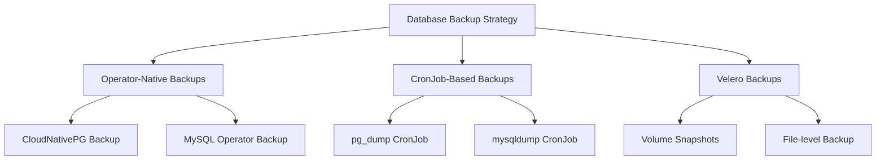

# How to Handle Database Backup Schedules with ArgoCD

Author: [nawazdhandala](https://github.com/nawazdhandala)

Tags: ArgoCD, GitOps, Kubernetes, Database, Backup

Description: Learn how to manage database backup schedules through ArgoCD using operator-native backups, CronJobs, and Velero schedules for reliable, version-controlled backup policies.

---

Database backup schedules are critical infrastructure that should be managed with the same rigor as your application deployments. When you manage backup schedules through ArgoCD, you get version-controlled policies, consistent configurations across environments, and automatic drift detection if someone modifies a backup schedule manually. This guide covers practical approaches to managing database backups in ArgoCD workflows.

## Backup Strategy Overview

There are three main approaches to database backups in an ArgoCD environment:



Each approach has trade-offs. Operator-native backups are the most integrated. CronJob-based backups are the most flexible. Velero backups capture everything including volumes.

## Operator-Native Backups: CloudNativePG

CloudNativePG has built-in continuous backup using Barman:

```yaml
# databases/postgres-cluster.yaml
apiVersion: postgresql.cnpg.io/v1
kind: Cluster
metadata:
  name: production-db
  namespace: database
spec:
  instances: 3

  # Continuous WAL archiving
  backup:
    barmanObjectStore:
      destinationPath: s3://database-backups/production/postgres
      s3Credentials:
        accessKeyId:
          name: backup-credentials
          key: access-key
        secretAccessKey:
          name: backup-credentials
          key: secret-key
      wal:
        compression: gzip
        maxParallel: 4
        encryption: AES256
      data:
        compression: gzip
        encryption: AES256
        jobs: 2
    retentionPolicy: "30d"

  # ... rest of cluster spec
```

### Schedule Regular Base Backups

Create ScheduledBackup resources managed by ArgoCD:

```yaml
# backups/postgres-daily-backup.yaml
apiVersion: postgresql.cnpg.io/v1
kind: ScheduledBackup
metadata:
  name: daily-backup
  namespace: database
spec:
  schedule: "0 2 * * *"  # Daily at 2 AM
  backupOwnerReference: self
  cluster:
    name: production-db
  target: prefer-standby  # Backup from replica to reduce primary load
  method: barmanObjectStore
```

```yaml
# backups/postgres-hourly-backup.yaml
apiVersion: postgresql.cnpg.io/v1
kind: ScheduledBackup
metadata:
  name: hourly-backup
  namespace: database
spec:
  schedule: "0 * * * *"  # Every hour
  backupOwnerReference: self
  cluster:
    name: production-db
  target: prefer-standby
  method: barmanObjectStore
```

### ArgoCD Application for Backup Schedules

```yaml
apiVersion: argoproj.io/v1alpha1
kind: Application
metadata:
  name: database-backups
  namespace: argocd
spec:
  project: databases
  source:
    repoURL: https://github.com/your-org/k8s-configs.git
    targetRevision: main
    path: backups
  destination:
    server: https://kubernetes.default.svc
    namespace: database
  syncPolicy:
    automated:
      selfHeal: true
      prune: true
  ignoreDifferences:
    - group: postgresql.cnpg.io
      kind: ScheduledBackup
      jsonPointers:
        - /status
```

## CronJob-Based Backups

For databases not using operators, or for additional backup layers, use CronJobs:

### PostgreSQL pg_dump Backup

```yaml
# backups/postgres-dump-cronjob.yaml
apiVersion: batch/v1
kind: CronJob
metadata:
  name: postgres-backup
  namespace: database
spec:
  schedule: "0 3 * * *"  # Daily at 3 AM
  concurrencyPolicy: Forbid
  successfulJobsHistoryLimit: 3
  failedJobsHistoryLimit: 5
  jobTemplate:
    spec:
      activeDeadlineSeconds: 1800  # 30 minute timeout
      template:
        spec:
          containers:
            - name: backup
              image: postgres:16
              command:
                - /bin/sh
                - -c
                - |
                  set -e
                  TIMESTAMP=$(date +%Y%m%d_%H%M%S)
                  BACKUP_FILE="/backups/postgres-${TIMESTAMP}.sql.gz"

                  echo "Starting backup at $(date)"

                  # Full database dump with compression
                  PGPASSWORD=$DB_PASSWORD pg_dump \
                    -h $DB_HOST \
                    -U $DB_USER \
                    -d $DB_NAME \
                    --format=custom \
                    --compress=9 \
                    --verbose \
                    --file="$BACKUP_FILE"

                  # Get backup size
                  SIZE=$(ls -lh "$BACKUP_FILE" | awk '{print $5}')
                  echo "Backup complete: $BACKUP_FILE ($SIZE)"

                  # Upload to S3
                  aws s3 cp "$BACKUP_FILE" \
                    "s3://database-backups/postgres/daily/${TIMESTAMP}.sql.gz" \
                    --storage-class STANDARD_IA

                  echo "Uploaded to S3"

                  # Clean up local file
                  rm -f "$BACKUP_FILE"

                  # Verify backup count in S3
                  COUNT=$(aws s3 ls s3://database-backups/postgres/daily/ | wc -l)
                  echo "Total backups in S3: $COUNT"
              env:
                - name: DB_HOST
                  value: production-db-rw.database.svc
                - name: DB_USER
                  valueFrom:
                    secretKeyRef:
                      name: db-credentials
                      key: username
                - name: DB_PASSWORD
                  valueFrom:
                    secretKeyRef:
                      name: db-credentials
                      key: password
                - name: DB_NAME
                  value: mydb
                - name: AWS_DEFAULT_REGION
                  value: us-east-1
              volumeMounts:
                - name: backup-temp
                  mountPath: /backups
              resources:
                requests:
                  cpu: 500m
                  memory: 1Gi
                limits:
                  cpu: 2
                  memory: 4Gi
          volumes:
            - name: backup-temp
              emptyDir:
                sizeLimit: 20Gi
          restartPolicy: OnFailure
          serviceAccountName: backup-runner
```

### MySQL Backup CronJob

```yaml
# backups/mysql-dump-cronjob.yaml
apiVersion: batch/v1
kind: CronJob
metadata:
  name: mysql-backup
  namespace: database
spec:
  schedule: "0 3 * * *"
  concurrencyPolicy: Forbid
  jobTemplate:
    spec:
      template:
        spec:
          containers:
            - name: backup
              image: mysql:8.0
              command:
                - /bin/sh
                - -c
                - |
                  TIMESTAMP=$(date +%Y%m%d_%H%M%S)

                  mysqldump \
                    -h $DB_HOST \
                    -u $DB_USER \
                    -p"$DB_PASSWORD" \
                    --all-databases \
                    --single-transaction \
                    --routines \
                    --triggers \
                    --events \
                    --set-gtid-purged=OFF | \
                    gzip > /backups/mysql-${TIMESTAMP}.sql.gz

                  echo "MySQL backup complete"
              env:
                - name: DB_HOST
                  value: production-mysql.database.svc
                - name: DB_USER
                  valueFrom:
                    secretKeyRef:
                      name: mysql-credentials
                      key: username
                - name: DB_PASSWORD
                  valueFrom:
                    secretKeyRef:
                      name: mysql-credentials
                      key: password
          restartPolicy: OnFailure
```

### MongoDB Backup CronJob

```yaml
# backups/mongo-dump-cronjob.yaml
apiVersion: batch/v1
kind: CronJob
metadata:
  name: mongodb-backup
  namespace: database
spec:
  schedule: "0 3 * * *"
  jobTemplate:
    spec:
      template:
        spec:
          containers:
            - name: backup
              image: mongo:7.0
              command:
                - /bin/sh
                - -c
                - |
                  TIMESTAMP=$(date +%Y%m%d_%H%M%S)

                  mongodump \
                    --uri="$MONGO_URI" \
                    --gzip \
                    --archive="/backups/mongo-${TIMESTAMP}.gz"

                  echo "MongoDB backup complete"
              env:
                - name: MONGO_URI
                  valueFrom:
                    secretKeyRef:
                      name: mongo-credentials
                      key: uri
          restartPolicy: OnFailure
```

## Backup Verification

Never trust a backup you have not tested restoring. Create a verification CronJob:

```yaml
# backups/verify-backup.yaml
apiVersion: batch/v1
kind: CronJob
metadata:
  name: backup-verification
  namespace: database
spec:
  schedule: "0 6 * * 0"  # Weekly on Sunday at 6 AM
  jobTemplate:
    spec:
      template:
        spec:
          containers:
            - name: verify
              image: postgres:16
              command:
                - /bin/sh
                - -c
                - |
                  echo "=== Backup Verification ==="

                  # Get latest backup from S3
                  LATEST=$(aws s3 ls s3://database-backups/postgres/daily/ | \
                    sort | tail -1 | awk '{print $4}')
                  echo "Testing backup: $LATEST"

                  aws s3 cp "s3://database-backups/postgres/daily/$LATEST" /tmp/backup.sql.gz

                  # Create a test database
                  PGPASSWORD=$DB_PASSWORD createdb -h $DB_HOST -U $DB_USER backup_test

                  # Restore backup
                  PGPASSWORD=$DB_PASSWORD pg_restore \
                    -h $DB_HOST \
                    -U $DB_USER \
                    -d backup_test \
                    --no-owner \
                    /tmp/backup.sql.gz

                  # Verify table counts
                  TABLES=$(PGPASSWORD=$DB_PASSWORD psql \
                    -h $DB_HOST -U $DB_USER -d backup_test -t \
                    -c "SELECT count(*) FROM information_schema.tables WHERE table_schema='public';")

                  echo "Tables restored: $TABLES"

                  # Run basic data integrity checks
                  PGPASSWORD=$DB_PASSWORD psql \
                    -h $DB_HOST -U $DB_USER -d backup_test \
                    -c "SELECT tablename, n_live_tup FROM pg_stat_user_tables ORDER BY n_live_tup DESC LIMIT 10;"

                  # Cleanup
                  PGPASSWORD=$DB_PASSWORD dropdb -h $DB_HOST -U $DB_USER backup_test

                  echo "Backup verification PASSED"
          restartPolicy: OnFailure
```

## Backup Retention Management

```yaml
# backups/retention-cleanup.yaml
apiVersion: batch/v1
kind: CronJob
metadata:
  name: backup-retention
  namespace: database
spec:
  schedule: "0 4 * * 1"  # Weekly on Monday at 4 AM
  jobTemplate:
    spec:
      template:
        spec:
          containers:
            - name: cleanup
              image: amazon/aws-cli:latest
              command:
                - /bin/sh
                - -c
                - |
                  echo "Cleaning up old backups..."

                  # Keep daily backups for 30 days
                  CUTOFF=$(date -d '30 days ago' +%Y%m%d)
                  aws s3 ls s3://database-backups/postgres/daily/ | while read LINE; do
                    FILE=$(echo $LINE | awk '{print $4}')
                    FILE_DATE=$(echo $FILE | grep -oP '\d{8}')
                    if [ "$FILE_DATE" -lt "$CUTOFF" ]; then
                      echo "Deleting: $FILE (older than 30 days)"
                      aws s3 rm "s3://database-backups/postgres/daily/$FILE"
                    fi
                  done

                  echo "Retention cleanup complete"
          restartPolicy: OnFailure
```

## Monitoring Backup Health

Track backup success and failure rates. Use [OneUptime](https://oneuptime.com) to alert when backups fail, when backup sizes change dramatically (indicating potential data loss), or when the latest backup is older than expected.

## Summary

Managing database backup schedules through ArgoCD ensures your backup policies are version-controlled and consistently applied. Use operator-native backups for the deepest integration, CronJob-based backups for flexibility across database types, and always include backup verification jobs. Store backup configurations alongside your database definitions in Git, use separate ArgoCD Applications for backups to allow independent management, and configure monitoring to catch backup failures before they become disasters.
