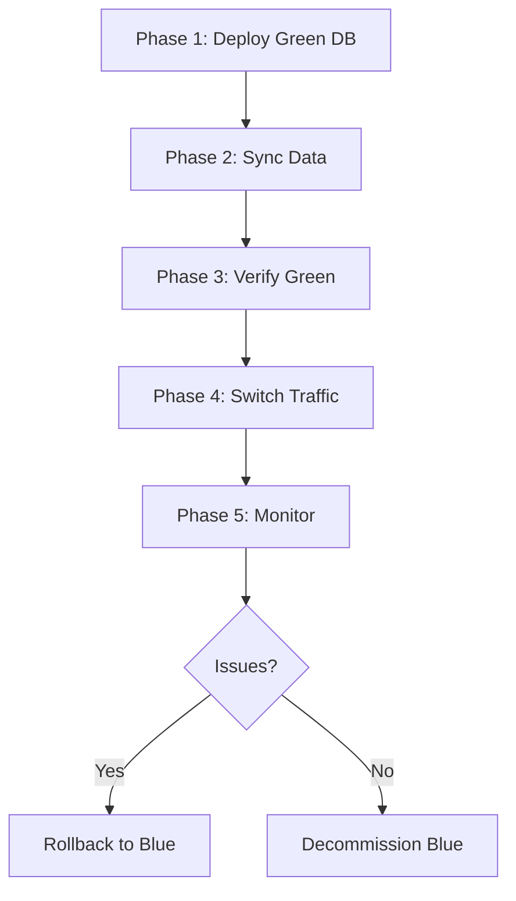
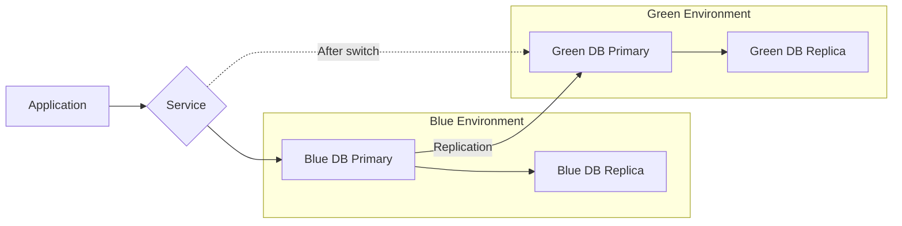

# How to Implement Database Blue-Green with ArgoCD

Author: [nawazdhandala](https://github.com/nawazdhandala)

Tags: ArgoCD, GitOps, Kubernetes, Database, Blue-Green Deployment

Description: Learn how to implement blue-green database deployments with ArgoCD, including parallel database instances, data synchronization, traffic switching, and rollback strategies for zero-downtime schema changes.

---

Blue-green database deployments create two parallel database environments - blue (current production) and green (new version) - and switch traffic between them. This approach enables zero-downtime schema changes for situations where the expand-contract migration pattern is too complex or too slow. This guide covers implementing database blue-green deployments using ArgoCD.

## When to Use Database Blue-Green

Blue-green database deployments are appropriate when:

- Schema changes are too complex for online migration
- You need to test the new schema with production data before switching
- Downtime for migration is unacceptable
- You want instant rollback capability



## Architecture



## Phase 1: Deploy the Green Database

Create the green database alongside the existing blue one. Both are managed by ArgoCD:

```yaml
# databases/green-postgres.yaml
apiVersion: postgresql.cnpg.io/v1
kind: Cluster
metadata:
  name: production-db-green
  namespace: database
  labels:
    deployment-color: green
    deployment-phase: staging
spec:
  instances: 3
  imageName: ghcr.io/cloudnative-pg/postgresql:16.2

  storage:
    size: 50Gi
    storageClassName: gp3

  # Bootstrap from the blue database backup
  bootstrap:
    recovery:
      source: production-db-blue
      recoveryTarget:
        targetTime: "2026-02-26T02:00:00Z"  # Recover to latest consistent point

  # External cluster reference for recovery
  externalClusters:
    - name: production-db-blue
      barmanObjectStore:
        destinationPath: s3://database-backups/production/blue
        s3Credentials:
          accessKeyId:
            name: backup-credentials
            key: access-key
          secretAccessKey:
            name: backup-credentials
            key: secret-key
        wal:
          maxParallel: 4

  postgresql:
    parameters:
      max_connections: "200"
      shared_buffers: "1GB"

  resources:
    requests:
      cpu: 500m
      memory: 1Gi
    limits:
      cpu: 2
      memory: 4Gi

  monitoring:
    enablePodMonitor: true

  affinity:
    enablePodAntiAffinity: true
    topologyKey: kubernetes.io/hostname
```

Commit this to Git and let ArgoCD create the green database. The bootstrap section tells CloudNativePG to restore from the blue database's backup.

## Phase 2: Apply Schema Changes to Green

Run migrations on the green database using a PreSync hook:

```yaml
# hooks/green-migration.yaml
apiVersion: batch/v1
kind: Job
metadata:
  name: green-db-migration
  namespace: database
  annotations:
    argocd.argoproj.io/hook: PostSync
    argocd.argoproj.io/hook-delete-policy: BeforeHookCreation
spec:
  template:
    spec:
      containers:
        - name: migrate
          image: registry.example.com/myapp:v3.0.0
          command:
            - /bin/sh
            - -c
            - |
              echo "Applying schema changes to green database..."

              # Connect to the green database
              export DATABASE_URL="$GREEN_DATABASE_URL"

              # Run migrations
              ./migrate up

              echo "Green database migration complete"

              # Verify schema version
              ./migrate version
          env:
            - name: GREEN_DATABASE_URL
              valueFrom:
                secretKeyRef:
                  name: green-db-credentials
                  key: url
      restartPolicy: Never
  backoffLimit: 3
```

## Phase 3: Data Synchronization

Set up continuous replication from blue to green to keep data in sync:

```yaml
# For PostgreSQL, use logical replication
# sync/logical-replication-setup.yaml
apiVersion: batch/v1
kind: Job
metadata:
  name: setup-replication
  namespace: database
  annotations:
    argocd.argoproj.io/hook: PostSync
    argocd.argoproj.io/hook-delete-policy: BeforeHookCreation
spec:
  template:
    spec:
      containers:
        - name: setup
          image: postgres:16
          command:
            - /bin/sh
            - -c
            - |
              echo "Setting up logical replication from blue to green..."

              # On blue database: create publication
              PGPASSWORD=$BLUE_PASSWORD psql -h $BLUE_HOST -U $BLUE_USER -d $DB_NAME \
                -c "CREATE PUBLICATION blue_to_green FOR ALL TABLES;"

              # On green database: create subscription
              PGPASSWORD=$GREEN_PASSWORD psql -h $GREEN_HOST -U $GREEN_USER -d $DB_NAME \
                -c "CREATE SUBSCRIPTION green_sub
                    CONNECTION 'host=$BLUE_HOST dbname=$DB_NAME user=$BLUE_USER password=$BLUE_PASSWORD'
                    PUBLICATION blue_to_green
                    WITH (copy_data = false);"

              echo "Logical replication configured"

              # Wait and verify replication is working
              sleep 10
              PGPASSWORD=$GREEN_PASSWORD psql -h $GREEN_HOST -U $GREEN_USER -d $DB_NAME \
                -c "SELECT * FROM pg_stat_subscription;"
          env:
            - name: BLUE_HOST
              value: production-db-blue-rw.database.svc
            - name: GREEN_HOST
              value: production-db-green-rw.database.svc
            - name: BLUE_USER
              valueFrom:
                secretKeyRef:
                  name: blue-db-credentials
                  key: username
            - name: BLUE_PASSWORD
              valueFrom:
                secretKeyRef:
                  name: blue-db-credentials
                  key: password
            - name: GREEN_USER
              valueFrom:
                secretKeyRef:
                  name: green-db-credentials
                  key: username
            - name: GREEN_PASSWORD
              valueFrom:
                secretKeyRef:
                  name: green-db-credentials
                  key: password
            - name: DB_NAME
              value: mydb
      restartPolicy: Never
```

## Phase 4: Verification

Verify the green database has correct data before switching:

```yaml
# hooks/verify-green.yaml
apiVersion: batch/v1
kind: Job
metadata:
  name: verify-green-db
  namespace: database
spec:
  template:
    spec:
      containers:
        - name: verify
          image: postgres:16
          command:
            - /bin/sh
            - -c
            - |
              echo "=== Green Database Verification ==="

              # Compare row counts between blue and green
              BLUE_COUNTS=$(PGPASSWORD=$BLUE_PASSWORD psql \
                -h $BLUE_HOST -U $BLUE_USER -d mydb -t \
                -c "SELECT tablename, n_live_tup FROM pg_stat_user_tables ORDER BY tablename;")

              GREEN_COUNTS=$(PGPASSWORD=$GREEN_PASSWORD psql \
                -h $GREEN_HOST -U $GREEN_USER -d mydb -t \
                -c "SELECT tablename, n_live_tup FROM pg_stat_user_tables ORDER BY tablename;")

              echo "Blue table counts:"
              echo "$BLUE_COUNTS"
              echo ""
              echo "Green table counts:"
              echo "$GREEN_COUNTS"

              # Verify new schema exists on green
              NEW_COLUMN=$(PGPASSWORD=$GREEN_PASSWORD psql \
                -h $GREEN_HOST -U $GREEN_USER -d mydb -t \
                -c "SELECT column_name FROM information_schema.columns WHERE table_name='users' AND column_name='display_name';")

              if [ -z "$NEW_COLUMN" ]; then
                echo "ERROR: New schema not applied to green database"
                exit 1
              fi

              echo "Schema verification: PASSED"
              echo "Green database is ready for traffic"
      restartPolicy: Never
```

## Phase 5: Switch Traffic

Switch the application to the green database by updating the service endpoints:

```yaml
# services/db-service.yaml
apiVersion: v1
kind: Service
metadata:
  name: database
  namespace: database
  labels:
    active-color: green  # Changed from blue to green
spec:
  type: ExternalName
  # Point to the green database service
  externalName: production-db-green-rw.database.svc.cluster.local
```

Alternatively, update the application's database connection configuration:

```yaml
# config/database-config.yaml
apiVersion: v1
kind: ConfigMap
metadata:
  name: database-config
  namespace: production
data:
  # Switch from blue to green
  DB_HOST: "production-db-green-rw.database.svc"
  DB_COLOR: "green"
```

Commit this change to Git. ArgoCD syncs the updated configuration, and the application pods restart with the new database connection.

## Phase 6: Rollback (If Needed)

If issues are detected after the switch, revert immediately:

```bash
# Revert the service switch in Git
git revert HEAD
git push

# ArgoCD automatically syncs back to blue
```

The blue database is still running with the original schema and data, so the rollback is instant.

## Phase 7: Decommission Blue

After the green database has been running successfully for your confidence period (typically 24 to 72 hours):

```yaml
# Remove the blue database from Git
# databases/blue-postgres.yaml -> deleted

# Remove the replication subscription on green
apiVersion: batch/v1
kind: Job
metadata:
  name: cleanup-replication
  annotations:
    argocd.argoproj.io/hook: PreSync
    argocd.argoproj.io/hook-delete-policy: HookSucceeded
spec:
  template:
    spec:
      containers:
        - name: cleanup
          image: postgres:16
          command:
            - /bin/sh
            - -c
            - |
              # Drop the subscription (it's no longer needed)
              PGPASSWORD=$GREEN_PASSWORD psql \
                -h production-db-green-rw -U $GREEN_USER -d mydb \
                -c "DROP SUBSCRIPTION IF EXISTS green_sub;"

              echo "Replication cleanup complete"
      restartPolicy: Never
```

## Monitoring During Blue-Green Switch

Monitor both databases during the transition:

```yaml
# monitoring/blue-green-dashboard.yaml
apiVersion: monitoring.coreos.com/v1
kind: PrometheusRule
metadata:
  name: blue-green-alerts
  namespace: database
spec:
  groups:
    - name: blue-green-database
      rules:
        - alert: ReplicationLag
          expr: pg_replication_lag > 10
          for: 5m
          labels:
            severity: warning
          annotations:
            summary: "Replication lag between blue and green exceeds 10 seconds"
        - alert: GreenDatabaseUnhealthy
          expr: cnpg_collector_up{cluster="production-db-green"} == 0
          for: 2m
          labels:
            severity: critical
```

Use [OneUptime](https://oneuptime.com) for comprehensive monitoring during the blue-green transition, including latency tracking, error rates, and automatic rollback triggers.

## Summary

Database blue-green deployments with ArgoCD follow a phased approach: deploy the green database from a blue backup, apply schema migrations to green, set up data synchronization, verify data integrity, switch traffic through a Git commit, and decommission blue after a confidence period. Every phase is a Git commit, giving you a complete audit trail and instant rollback capability. This pattern is best suited for complex schema changes that cannot use the simpler expand-contract approach, and the cost is running two database instances during the transition period.
