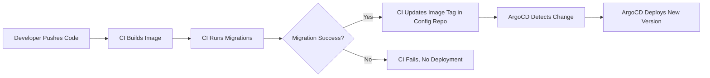

# How to Handle Database Changes with ArgoCD GitOps

Author: [nawazdhandala](https://github.com/nawazdhandala)

Tags: ArgoCD, GitOps, Kubernetes, Database, Migrations

Description: Practical strategies for managing database schema changes, migrations, and data operations within an ArgoCD GitOps workflow using hooks and job resources.

---

Database changes are the trickiest part of any GitOps workflow. Your application code and Kubernetes manifests live in Git and can be rolled back easily, but database schema changes are inherently stateful and often irreversible. How do you fit database migrations into a GitOps workflow managed by ArgoCD?

This is a question that comes up constantly, and there is no single perfect answer. But there are proven patterns that work well in practice.

## The Fundamental Challenge

GitOps works beautifully for stateless resources. You declare the desired state in Git, ArgoCD applies it, and if something goes wrong, you revert the Git commit and ArgoCD rolls back. But database migrations do not work that way:

1. Migrations are additive - you cannot "unapply" a column rename
2. Migrations must happen in order - you cannot skip or reorder them
3. Migrations must happen before the new application code runs
4. Rolling back application code does not roll back the database
5. Migrations should only run once, not every time ArgoCD syncs

## Pattern 1: PreSync Hooks for Migrations

ArgoCD resource hooks let you run Kubernetes Jobs at specific points in the sync lifecycle. A PreSync hook runs before the main resources are applied, making it perfect for database migrations.

```yaml
apiVersion: batch/v1
kind: Job
metadata:
  name: db-migrate
  namespace: myapp
  annotations:
    # Run before the main sync
    argocd.argoproj.io/hook: PreSync
    # Delete the job after it succeeds
    argocd.argoproj.io/hook-delete-policy: HookSucceeded
spec:
  template:
    spec:
      containers:
        - name: migrate
          # Use the same image as your app, with migration command
          image: myregistry.com/myapp:v1.2.0
          command: ["python", "manage.py", "migrate"]
          env:
            - name: DATABASE_URL
              valueFrom:
                secretKeyRef:
                  name: db-credentials
                  key: url
      restartPolicy: Never
  backoffLimit: 3
```

When ArgoCD syncs, it runs this job first. If the migration fails, the sync fails and the new application code is not deployed.

### Important Considerations

The hook-delete-policy matters. Use `HookSucceeded` to clean up successful jobs, but keep failed jobs for debugging:

```yaml
annotations:
  argocd.argoproj.io/hook: PreSync
  # Only delete on success - keep failed jobs for investigation
  argocd.argoproj.io/hook-delete-policy: HookSucceeded
```

Available delete policies:
- `HookSucceeded` - delete after success
- `HookFailed` - delete after failure (rarely what you want)
- `BeforeHookCreation` - delete old job before creating new one (useful for reruns)

For most migration workflows, use both:

```yaml
argocd.argoproj.io/hook-delete-policy: HookSucceeded,BeforeHookCreation
```

## Pattern 2: Init Container Migrations

Instead of using ArgoCD hooks, run migrations as init containers in your main deployment:

```yaml
apiVersion: apps/v1
kind: Deployment
metadata:
  name: myapp
spec:
  replicas: 3
  template:
    spec:
      initContainers:
        - name: db-migrate
          image: myregistry.com/myapp:v1.2.0
          command: ["python", "manage.py", "migrate"]
          env:
            - name: DATABASE_URL
              valueFrom:
                secretKeyRef:
                  name: db-credentials
                  key: url
      containers:
        - name: myapp
          image: myregistry.com/myapp:v1.2.0
```

**Problem:** With multiple replicas, all of them try to run migrations simultaneously. Most migration frameworks handle this with locking, but it can cause issues:

```yaml
initContainers:
  - name: db-migrate
    image: myregistry.com/myapp:v1.2.0
    command:
      - sh
      - -c
      - |
        # Use advisory lock to ensure only one pod runs migrations
        python manage.py migrate --noinput 2>&1
        echo "Migration complete"
```

This pattern is simpler than hooks but has the replica issue. It works well for applications with a single replica or migration frameworks that handle concurrent execution.

## Pattern 3: Separate Migration Application

Create a dedicated ArgoCD Application for database migrations that syncs before the main application using sync waves:

```yaml
# Migration Application - runs first (wave -1)
apiVersion: argoproj.io/v1alpha1
kind: Application
metadata:
  name: myapp-migrations
  namespace: argocd
  annotations:
    argocd.argoproj.io/sync-wave: "-1"
spec:
  source:
    repoURL: https://github.com/org/repo.git
    path: migrations/myapp
  destination:
    server: https://kubernetes.default.svc
    namespace: myapp
  syncPolicy:
    automated:
      selfHeal: false  # Don't auto-heal - migrations should only run once
---
# Main Application - runs after migrations (wave 0)
apiVersion: argoproj.io/v1alpha1
kind: Application
metadata:
  name: myapp
  namespace: argocd
  annotations:
    argocd.argoproj.io/sync-wave: "0"
spec:
  source:
    repoURL: https://github.com/org/repo.git
    path: manifests/myapp
  destination:
    server: https://kubernetes.default.svc
    namespace: myapp
```

## Pattern 4: External Migration Pipeline

Some teams run migrations outside of ArgoCD entirely, using their CI/CD pipeline:



```yaml
# GitHub Actions example
jobs:
  migrate-and-deploy:
    runs-on: ubuntu-latest
    steps:
      - name: Build Image
        run: docker build -t myapp:${{ github.sha }} .

      - name: Run Migrations
        run: |
          # Run migrations against the target database
          docker run --rm \
            -e DATABASE_URL=${{ secrets.DATABASE_URL }} \
            myapp:${{ github.sha }} \
            python manage.py migrate

      - name: Update GitOps Config
        if: success()
        run: |
          # Only update the image tag if migrations succeeded
          cd config-repo
          kustomize edit set image myapp=myapp:${{ github.sha }}
          git commit -am "Deploy myapp ${{ github.sha }}"
          git push
```

This approach keeps migrations out of ArgoCD and ensures they only run once. The downside is that it breaks the pure GitOps model - the migration happens outside of the Git-to-cluster flow.

## Making Migrations Backward Compatible

Regardless of which pattern you use, the key to safe database migrations with GitOps is making migrations backward compatible. This means the old version of your application should still work with the new database schema.

### Expand and Contract Pattern

Instead of renaming a column in one migration:

```sql
-- DON'T DO THIS - breaks old code
ALTER TABLE users RENAME COLUMN name TO full_name;
```

Use the expand and contract pattern across multiple deployments:

```sql
-- Migration 1: Add new column (deployed with code v1.1)
ALTER TABLE users ADD COLUMN full_name VARCHAR(255);
UPDATE users SET full_name = name;

-- Code v1.1 writes to BOTH name and full_name, reads from full_name

-- Migration 2: Drop old column (deployed with code v1.2)
ALTER TABLE users DROP COLUMN name;
```

This way, if ArgoCD needs to roll back from v1.1 to v1.0, the old code still works because the `name` column is still there.

## Handling Migration Failures

When a migration fails during an ArgoCD sync:

1. The PreSync hook job fails
2. ArgoCD marks the sync as failed
3. The new application code is NOT deployed
4. The old application code continues running

To investigate and fix:

```bash
# Check the migration job logs
kubectl logs job/db-migrate -n myapp

# The job is kept because of HookSucceeded delete policy
# (it only deletes on success)

# After fixing the migration, trigger a new sync
argocd app sync myapp
```

## Migration Rollback Strategy

If a migration needs to be rolled back:

1. Write a new migration that undoes the change
2. Commit it to Git
3. ArgoCD will sync the new migration
4. Deploy the old application code alongside the rollback migration

```yaml
# Rollback migration job
apiVersion: batch/v1
kind: Job
metadata:
  name: db-rollback-v120
  annotations:
    argocd.argoproj.io/hook: PreSync
    argocd.argoproj.io/hook-delete-policy: HookSucceeded,BeforeHookCreation
spec:
  template:
    spec:
      containers:
        - name: rollback
          image: myregistry.com/myapp:v1.1.0
          command: ["python", "manage.py", "migrate", "myapp", "0024"]
      restartPolicy: Never
```

## My Recommendation

For most teams, **Pattern 1 (PreSync Hooks)** is the best balance of simplicity and reliability:

- It keeps migrations in the GitOps flow
- It ensures migrations run before new code deploys
- It fails the sync if migrations fail
- It is easy to understand and debug

Start with PreSync hooks and only move to more complex patterns if you hit specific issues with that approach. The key principles remain the same regardless of pattern: make migrations backward compatible, test them in staging first, and always have a rollback plan.
