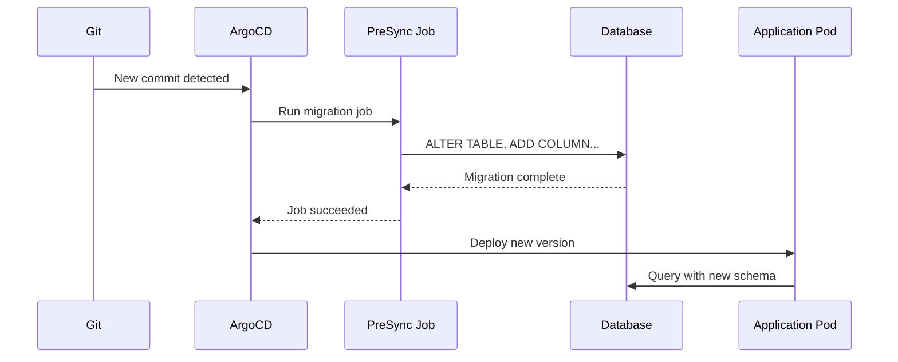

# How to Handle Database Migrations with ArgoCD Sync Hooks

Author: [nawazdhandala](https://github.com/nawazdhandala)

Tags: ArgoCD, GitOps, Kubernetes, Database, Migration

Description: Learn how to run database migrations during ArgoCD sync operations using PreSync and PostSync hooks, sync waves, and Job-based migration runners for safe schema changes.

---

Database migrations are one of the trickiest parts of deploying applications with ArgoCD. You need schema changes to happen before the new application code starts, but rolling back a failed migration is far harder than rolling back a deployment. This guide covers practical patterns for handling database migrations safely in ArgoCD workflows.

## The Migration Timing Problem

When deploying a new version of your application that includes database schema changes, the order matters:

1. Run the migration (alter tables, add columns)
2. Deploy the new application code (which expects the new schema)

If you reverse this order, the new code crashes because the expected columns do not exist yet. ArgoCD sync hooks solve this problem.



## Basic PreSync Migration Hook

Here is a straightforward migration hook that runs before the application is updated:

```yaml
# hooks/db-migration.yaml
apiVersion: batch/v1
kind: Job
metadata:
  name: db-migrate
  namespace: production
  annotations:
    argocd.argoproj.io/hook: PreSync
    argocd.argoproj.io/hook-delete-policy: BeforeHookCreation
spec:
  template:
    metadata:
      labels:
        app: db-migration
    spec:
      containers:
        - name: migrate
          image: registry.example.com/myapp:v2.1.0
          command:
            - /bin/sh
            - -c
            - |
              echo "Running database migrations..."
              # Using your application's migration tool
              python manage.py migrate --noinput

              echo "Migration complete"
          env:
            - name: DATABASE_URL
              valueFrom:
                secretKeyRef:
                  name: database-credentials
                  key: url
          resources:
            requests:
              cpu: 100m
              memory: 256Mi
            limits:
              cpu: 500m
              memory: 512Mi
      restartPolicy: Never
  backoffLimit: 3
  activeDeadlineSeconds: 300
```

Key settings:
- `argocd.argoproj.io/hook: PreSync` - Runs before the main sync
- `argocd.argoproj.io/hook-delete-policy: BeforeHookCreation` - Deletes the old Job before creating a new one
- `backoffLimit: 3` - Retries up to 3 times on failure
- `activeDeadlineSeconds: 300` - Times out after 5 minutes

## Using the Same Image Version

A common mistake is using a fixed image tag for the migration job while the application image changes. Always use the same image version for both:

```yaml
# Option 1: Hardcode the version (update in same commit as deployment)
image: registry.example.com/myapp:v2.1.0

# Option 2: Use Kustomize to ensure consistency
# kustomization.yaml
images:
  - name: registry.example.com/myapp
    newTag: v2.1.0
```

## Migration with Sync Waves

For complex deployments involving multiple services with their own databases, use sync waves to order migrations:

```yaml
# Wave -3: Database migration for service A
apiVersion: batch/v1
kind: Job
metadata:
  name: service-a-migrate
  annotations:
    argocd.argoproj.io/hook: PreSync
    argocd.argoproj.io/hook-delete-policy: BeforeHookCreation
    argocd.argoproj.io/sync-wave: "-3"
spec:
  template:
    spec:
      containers:
        - name: migrate
          image: registry.example.com/service-a:v1.5.0
          command: ["./migrate", "up"]
          env:
            - name: DB_HOST
              value: postgres-service-a
      restartPolicy: Never
---
# Wave -2: Database migration for service B (depends on service A schema)
apiVersion: batch/v1
kind: Job
metadata:
  name: service-b-migrate
  annotations:
    argocd.argoproj.io/hook: PreSync
    argocd.argoproj.io/hook-delete-policy: BeforeHookCreation
    argocd.argoproj.io/sync-wave: "-2"
spec:
  template:
    spec:
      containers:
        - name: migrate
          image: registry.example.com/service-b:v2.0.0
          command: ["./migrate", "up"]
          env:
            - name: DB_HOST
              value: postgres-service-b
      restartPolicy: Never
---
# Wave -1: Verify all migrations completed
apiVersion: batch/v1
kind: Job
metadata:
  name: verify-migrations
  annotations:
    argocd.argoproj.io/hook: PreSync
    argocd.argoproj.io/hook-delete-policy: BeforeHookCreation
    argocd.argoproj.io/sync-wave: "-1"
spec:
  template:
    spec:
      containers:
        - name: verify
          image: postgres:16
          command:
            - /bin/sh
            - -c
            - |
              # Verify service A schema version
              PGPASSWORD=$DB_PASSWORD psql -h postgres-service-a -U app -d service_a \
                -c "SELECT version FROM schema_migrations ORDER BY version DESC LIMIT 1;"

              # Verify service B schema version
              PGPASSWORD=$DB_PASSWORD psql -h postgres-service-b -U app -d service_b \
                -c "SELECT version FROM schema_migrations ORDER BY version DESC LIMIT 1;"

              echo "All migrations verified"
      restartPolicy: Never
```

## Framework-Specific Migration Examples

### Rails Migration

```yaml
containers:
  - name: migrate
    image: registry.example.com/rails-app:v3.0.0
    command:
      - /bin/sh
      - -c
      - |
        bundle exec rails db:migrate
        echo "Rails migration complete"
    env:
      - name: RAILS_ENV
        value: production
      - name: DATABASE_URL
        valueFrom:
          secretKeyRef:
            name: rails-db-credentials
            key: url
```

### Django Migration

```yaml
containers:
  - name: migrate
    image: registry.example.com/django-app:v2.5.0
    command:
      - /bin/sh
      - -c
      - |
        python manage.py migrate --noinput
        python manage.py collectstatic --noinput
    env:
      - name: DJANGO_SETTINGS_MODULE
        value: myapp.settings.production
```

### Flyway Migration

```yaml
containers:
  - name: migrate
    image: flyway/flyway:latest
    command:
      - flyway
      - migrate
    volumeMounts:
      - name: migrations
        mountPath: /flyway/sql
volumes:
  - name: migrations
    configMap:
      name: flyway-migrations
```

### Liquibase Migration

```yaml
containers:
  - name: migrate
    image: liquibase/liquibase:latest
    command:
      - liquibase
      - --changeLogFile=changelog.xml
      - --url=jdbc:postgresql://postgres:5432/mydb
      - --username=$(DB_USER)
      - --password=$(DB_PASSWORD)
      - update
```

## Handling Migration Failures

When a migration job fails, ArgoCD stops the sync. The application continues running the old version. You need to:

1. Check the migration Job logs
2. Fix the migration script
3. Push the fix to Git
4. ArgoCD will retry the sync

```bash
# Check migration job logs
kubectl logs -n production job/db-migrate

# If the migration partially applied, you may need a compensating migration
# Add a new migration file and push to Git
```

## PostSync Hooks for Data Backfill

Sometimes you need to backfill data after the application is deployed:

```yaml
apiVersion: batch/v1
kind: Job
metadata:
  name: data-backfill
  annotations:
    argocd.argoproj.io/hook: PostSync
    argocd.argoproj.io/hook-delete-policy: HookSucceeded
spec:
  template:
    spec:
      containers:
        - name: backfill
          image: registry.example.com/myapp:v2.1.0
          command:
            - /bin/sh
            - -c
            - |
              # Backfill the new column with computed values
              python manage.py backfill_user_display_names

              echo "Data backfill complete"
      restartPolicy: Never
  backoffLimit: 3
```

## Migration Locking

Prevent concurrent migration runs when multiple ArgoCD syncs trigger simultaneously:

```yaml
containers:
  - name: migrate
    image: registry.example.com/myapp:v2.1.0
    command:
      - /bin/sh
      - -c
      - |
        # Acquire advisory lock before migrating
        PGPASSWORD=$DB_PASSWORD psql -h postgres -U app -d mydb \
          -c "SELECT pg_advisory_lock(12345);"

        python manage.py migrate --noinput
        RESULT=$?

        # Release lock
        PGPASSWORD=$DB_PASSWORD psql -h postgres -U app -d mydb \
          -c "SELECT pg_advisory_unlock(12345);"

        exit $RESULT
```

## Monitoring Migrations

Track migration execution time and success rate using [OneUptime](https://oneuptime.com) to detect when migrations are taking longer than expected or failing frequently.

## Summary

Database migrations with ArgoCD sync hooks follow a clear pattern: use PreSync hooks to run migrations before the application updates, sync waves to order multiple migrations, and PostSync hooks for data backfill operations. Always use the same image version for the migration job and the application deployment. Set appropriate timeouts and retry limits. When migrations fail, ArgoCD stops the sync, keeping the old application running safely while you fix the migration script in Git.
