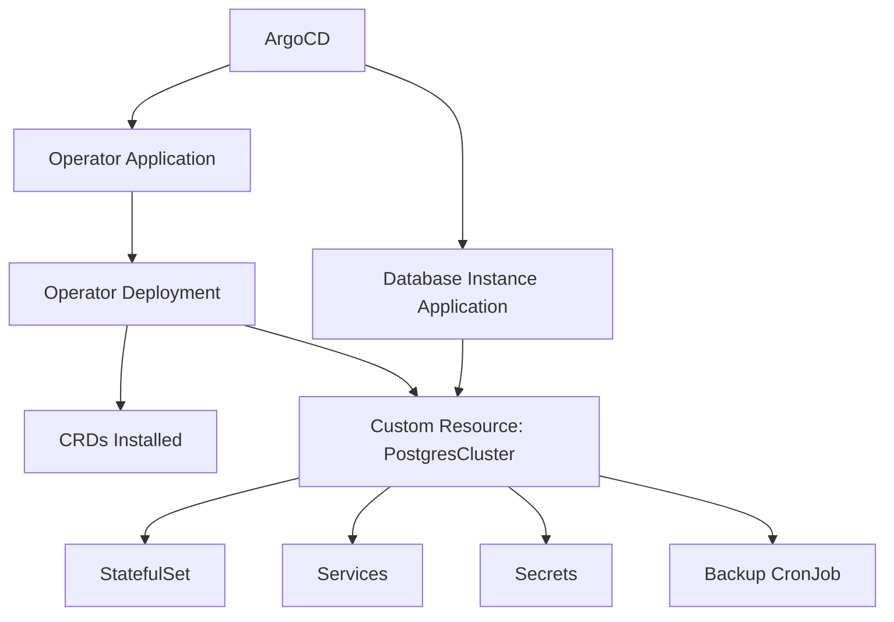

# How to Deploy Database Operators with ArgoCD

Author: [nawazdhandala](https://github.com/nawazdhandala)

Tags: ArgoCD, GitOps, Kubernetes, Database Operators, PostgreSQL

Description: Learn how to deploy and manage Kubernetes database operators with ArgoCD, including CloudNativePG, MySQL Operator, MongoDB Community Operator, and Redis Operator through GitOps.

---

Database operators automate the management of databases on Kubernetes, handling tasks like provisioning, scaling, backups, and failover. Deploying these operators through ArgoCD gives you a fully declarative, Git-driven approach to database infrastructure. This guide covers deploying popular database operators and managing database instances through ArgoCD.

## Why Operators with ArgoCD

Database operators extend the Kubernetes API with custom resources like `PostgresCluster`, `MySQLCluster`, or `MongoDBCommunity`. When managed through ArgoCD:

- Operator upgrades go through code review
- Database instance definitions are version-controlled
- Backup schedules and configurations are tracked in Git
- Multi-cluster database deployments use the same patterns



## Deploying CloudNativePG (PostgreSQL)

CloudNativePG is one of the most mature PostgreSQL operators for Kubernetes:

```yaml
# applications/cnpg-operator.yaml
apiVersion: argoproj.io/v1alpha1
kind: Application
metadata:
  name: cnpg-operator
  namespace: argocd
spec:
  project: infrastructure
  source:
    repoURL: https://cloudnative-pg.github.io/charts
    chart: cloudnative-pg
    targetRevision: 0.20.0
    helm:
      values: |
        replicaCount: 1
        resources:
          requests:
            cpu: 100m
            memory: 256Mi
          limits:
            cpu: 500m
            memory: 512Mi
  destination:
    server: https://kubernetes.default.svc
    namespace: cnpg-system
  syncPolicy:
    automated:
      selfHeal: true
      prune: true
    syncOptions:
      - CreateNamespace=true
      - ServerSideApply=true
```

### Create a PostgreSQL Cluster

```yaml
# databases/postgres-cluster.yaml
apiVersion: postgresql.cnpg.io/v1
kind: Cluster
metadata:
  name: production-db
  namespace: database
spec:
  instances: 3  # Primary + 2 replicas
  imageName: ghcr.io/cloudnative-pg/postgresql:16.2

  # Storage configuration
  storage:
    size: 50Gi
    storageClass: gp3

  # Resource limits
  resources:
    requests:
      cpu: 500m
      memory: 1Gi
    limits:
      cpu: 2
      memory: 4Gi

  # PostgreSQL configuration
  postgresql:
    parameters:
      max_connections: "200"
      shared_buffers: "1GB"
      effective_cache_size: "3GB"
      maintenance_work_mem: "256MB"
      wal_buffers: "16MB"
      work_mem: "4MB"
      max_wal_size: "2GB"
      min_wal_size: "80MB"

  # Backup configuration
  backup:
    barmanObjectStore:
      destinationPath: s3://database-backups/production
      s3Credentials:
        accessKeyId:
          name: backup-s3-credentials
          key: access-key-id
        secretAccessKey:
          name: backup-s3-credentials
          key: secret-access-key
      wal:
        compression: gzip
        maxParallel: 4
    retentionPolicy: "30d"

  # Monitoring
  monitoring:
    enablePodMonitor: true

  # Anti-affinity for HA
  affinity:
    enablePodAntiAffinity: true
    topologyKey: kubernetes.io/hostname

  # Superuser secret
  superuserSecret:
    name: postgres-superuser

  # Bootstrap from existing backup (for disaster recovery)
  # bootstrap:
  #   recovery:
  #     source: production-db-backup
```

### ArgoCD Application for the Database

```yaml
apiVersion: argoproj.io/v1alpha1
kind: Application
metadata:
  name: production-database
  namespace: argocd
spec:
  project: databases
  source:
    repoURL: https://github.com/your-org/k8s-configs.git
    targetRevision: main
    path: databases
  destination:
    server: https://kubernetes.default.svc
    namespace: database
  syncPolicy:
    automated:
      selfHeal: true
      prune: false  # Never auto-delete database resources
    syncOptions:
      - CreateNamespace=true
      - RespectIgnoreDifferences=true
  ignoreDifferences:
    - group: postgresql.cnpg.io
      kind: Cluster
      jsonPointers:
        - /status
        - /spec/instances  # Ignore if manually scaled
```

## Deploying MySQL Operator

```yaml
# applications/mysql-operator.yaml
apiVersion: argoproj.io/v1alpha1
kind: Application
metadata:
  name: mysql-operator
  namespace: argocd
spec:
  project: infrastructure
  source:
    repoURL: https://mysql.github.io/mysql-operator/
    chart: mysql-operator
    targetRevision: 2.1.2
  destination:
    server: https://kubernetes.default.svc
    namespace: mysql-operator
  syncPolicy:
    automated:
      selfHeal: true
    syncOptions:
      - CreateNamespace=true
      - ServerSideApply=true
```

### Create a MySQL InnoDB Cluster

```yaml
# databases/mysql-cluster.yaml
apiVersion: mysql.oracle.com/v2
kind: InnoDBCluster
metadata:
  name: production-mysql
  namespace: database
spec:
  instances: 3
  router:
    instances: 2
  secretName: mysql-root-credentials
  tlsUseSelfSigned: true
  datadirVolumeClaimTemplate:
    accessModes:
      - ReadWriteOnce
    resources:
      requests:
        storage: 50Gi
    storageClassName: gp3
  mycnf: |
    [mysqld]
    max_connections=200
    innodb_buffer_pool_size=2G
    innodb_log_file_size=256M
    slow_query_log=ON
    long_query_time=1
```

## Deploying MongoDB Community Operator

```yaml
# applications/mongodb-operator.yaml
apiVersion: argoproj.io/v1alpha1
kind: Application
metadata:
  name: mongodb-operator
  namespace: argocd
spec:
  project: infrastructure
  source:
    repoURL: https://mongodb.github.io/helm-charts
    chart: community-operator
    targetRevision: 0.9.0
  destination:
    server: https://kubernetes.default.svc
    namespace: mongodb-operator
  syncPolicy:
    automated:
      selfHeal: true
    syncOptions:
      - CreateNamespace=true
```

### Create a MongoDB Replica Set

```yaml
# databases/mongodb-replicaset.yaml
apiVersion: mongodbcommunity.mongodb.com/v1
kind: MongoDBCommunity
metadata:
  name: production-mongo
  namespace: database
spec:
  members: 3
  type: ReplicaSet
  version: "7.0.5"
  security:
    authentication:
      modes: ["SCRAM"]
  users:
    - name: app-user
      db: mydb
      passwordSecretRef:
        name: mongo-app-password
      roles:
        - name: readWrite
          db: mydb
      scramCredentialsSecretName: mongo-app-scram
  statefulSet:
    spec:
      volumeClaimTemplates:
        - metadata:
            name: data-volume
          spec:
            accessModes: ["ReadWriteOnce"]
            storageClassName: gp3
            resources:
              requests:
                storage: 50Gi
```

## Deploying Redis Operator

```yaml
# applications/redis-operator.yaml
apiVersion: argoproj.io/v1alpha1
kind: Application
metadata:
  name: redis-operator
  namespace: argocd
spec:
  project: infrastructure
  source:
    repoURL: https://ot-container-kit.github.io/helm-charts/
    chart: redis-operator
    targetRevision: 0.15.9
  destination:
    server: https://kubernetes.default.svc
    namespace: redis-operator
  syncPolicy:
    automated:
      selfHeal: true
    syncOptions:
      - CreateNamespace=true
```

### Create a Redis Cluster

```yaml
# databases/redis-cluster.yaml
apiVersion: redis.redis.opstreelabs.in/v1beta2
kind: RedisCluster
metadata:
  name: production-redis
  namespace: database
spec:
  clusterSize: 3
  clusterVersion: v7
  persistenceEnabled: true
  kubernetesConfig:
    image: redis:7.2
    imagePullPolicy: IfNotPresent
    resources:
      requests:
        cpu: 100m
        memory: 256Mi
      limits:
        cpu: 500m
        memory: 1Gi
  redisExporter:
    enabled: true
    image: oliver006/redis_exporter:latest
  storage:
    volumeClaimTemplate:
      spec:
        accessModes: ["ReadWriteOnce"]
        storageClassName: gp3
        resources:
          requests:
            storage: 10Gi
```

## Managing Operator Upgrades

Upgrading database operators requires care since they manage running databases:

```yaml
# Use a controlled upgrade strategy
spec:
  source:
    targetRevision: 0.21.0  # New version
    helm:
      values: |
        # Ensure rolling upgrade strategy
        upgradeStrategy: "rolling"
```

Before upgrading, check the operator's upgrade notes and test in staging first.

## Operator Health Checks in ArgoCD

Configure custom health checks for database CRDs:

```yaml
# In argocd-cm ConfigMap
data:
  resource.customizations.health.postgresql.cnpg.io_Cluster: |
    hs = {}
    if obj.status ~= nil then
      if obj.status.phase == "Cluster in healthy state" then
        hs.status = "Healthy"
        hs.message = obj.status.phase
      elseif obj.status.phase == "Setting up primary" or obj.status.phase == "Creating a new replica" then
        hs.status = "Progressing"
        hs.message = obj.status.phase
      else
        hs.status = "Degraded"
        hs.message = obj.status.phase
      end
    end
    return hs
```

## Monitoring Database Operators

Use [OneUptime](https://oneuptime.com) to monitor database health, replication lag, backup success, and operator status across all your clusters.

## Summary

Deploying database operators with ArgoCD creates a fully GitOps-driven database platform. The pattern is consistent across all operators: deploy the operator with one ArgoCD Application, manage database instances with another. Keep operator and instance Applications separate to allow independent lifecycle management. Disable pruning for database instance resources, configure custom health checks for database CRDs, and use ignore differences for status fields. This approach works for PostgreSQL (CloudNativePG), MySQL (MySQL Operator), MongoDB (Community Operator), Redis, and any other operator-based database.
