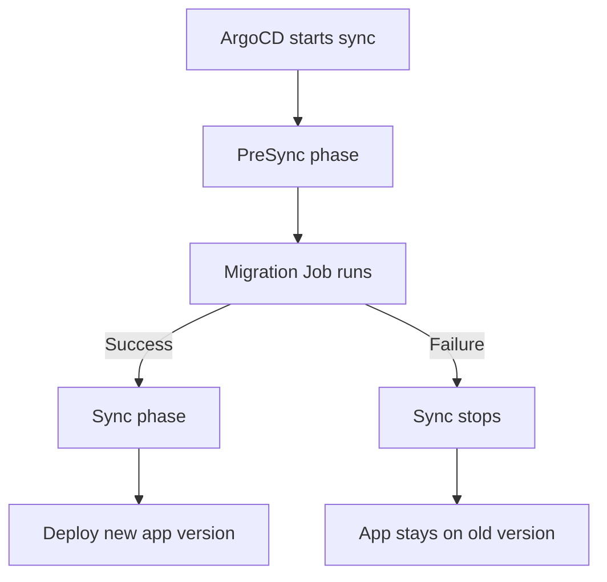

# How to Handle Database Schema Changes with GitOps

Author: [nawazdhandala](https://github.com/nawazdhandala)

Tags: ArgoCD, GitOps, Kubernetes, Database Migrations, DevOps

Description: Learn practical approaches to handling database schema migrations in GitOps workflows with ArgoCD, including PreSync hooks, init containers, and migration job patterns.

---

Database schema changes are one of the trickiest parts of GitOps adoption. Application deployments are stateless and easily reversible. Database migrations are not. You cannot just roll back a column drop or a data transformation. This makes integrating schema changes into an ArgoCD-driven workflow something that requires careful planning.

This guide covers the practical patterns for handling database migrations with ArgoCD, from simple approaches to production-grade solutions.

## The Challenge

In a traditional CI/CD pipeline, database migrations typically run as part of the deployment script - right before or right after the new application version starts. With GitOps, ArgoCD manages the deployment by syncing Kubernetes manifests from Git. There is no built-in concept of "run this script before deploying."

The questions you need to answer are:

- When does the migration run relative to the application deployment?
- What happens if the migration fails?
- How do you ensure the migration runs exactly once?
- How do you handle rollbacks when the database has already been modified?

## Pattern 1: PreSync Hook Jobs

ArgoCD sync hooks let you run Kubernetes Jobs at specific phases of the sync operation. A PreSync hook runs before ArgoCD applies the main application resources.

```yaml
apiVersion: batch/v1
kind: Job
metadata:
  name: db-migrate
  annotations:
    argocd.argoproj.io/hook: PreSync
    argocd.argoproj.io/hook-delete-policy: BeforeHookCreation
spec:
  template:
    spec:
      containers:
        - name: migrate
          image: myorg/backend-api:v1.5.0
          command: ["python", "manage.py", "migrate", "--no-input"]
          env:
            - name: DATABASE_URL
              valueFrom:
                secretKeyRef:
                  name: db-credentials
                  key: url
      restartPolicy: Never
  backoffLimit: 1
```

The flow works like this:



### Key Annotations Explained

- `argocd.argoproj.io/hook: PreSync` tells ArgoCD to run this Job before deploying the main resources.
- `argocd.argoproj.io/hook-delete-policy: BeforeHookCreation` deletes the previous Job before creating a new one on the next sync. This avoids "already exists" errors.

### Handling the Image Tag

A common challenge is keeping the migration Job's image tag in sync with the deployment image tag. If you use Kustomize, reference the same image in both:

```yaml
# kustomization.yaml
apiVersion: kustomize.config.k8s.io/v1beta1
kind: Kustomization
resources:
  - deployment.yaml
  - migration-job.yaml
images:
  - name: myorg/backend-api
    newTag: v1.5.0   # This updates both the Job and Deployment
```

## Pattern 2: Init Containers

For simpler setups, run migrations as an init container in your Deployment:

```yaml
apiVersion: apps/v1
kind: Deployment
metadata:
  name: backend-api
spec:
  replicas: 3
  template:
    spec:
      initContainers:
        - name: db-migrate
          image: myorg/backend-api:v1.5.0
          command: ["python", "manage.py", "migrate", "--no-input"]
          env:
            - name: DATABASE_URL
              valueFrom:
                secretKeyRef:
                  name: db-credentials
                  key: url
      containers:
        - name: app
          image: myorg/backend-api:v1.5.0
          ports:
            - containerPort: 8080
```

### Init Container Trade-offs

**Pros:**
- Simple, everything is in one manifest
- Migrations run before the app starts
- No separate Job to manage

**Cons:**
- Migrations run on every pod restart, not just deployments (your migration tool must be idempotent)
- During rolling updates, multiple pods may try to run migrations simultaneously
- Slower pod startup because migrations must complete first

To handle the concurrency issue, use a migration tool that supports locking. For example, with Django:

```python
# Django migrations use database-level locks automatically
python manage.py migrate --no-input
```

Or with Flyway, enable locking:

```text
flyway.lockRetryCount=10
```

## Pattern 3: Dedicated Migration Application

For complex migration workflows, create a separate ArgoCD Application that handles only database migrations:

```yaml
# Migration Application - syncs first
apiVersion: argoproj.io/v1alpha1
kind: Application
metadata:
  name: backend-db-migrations
  namespace: argocd
  annotations:
    argocd.argoproj.io/sync-wave: "-1"
spec:
  project: default
  source:
    repoURL: https://github.com/myorg/config-repo.git
    targetRevision: main
    path: apps/backend-api/migrations
  destination:
    server: https://kubernetes.default.svc
    namespace: backend-api
  syncPolicy:
    automated: {}

---
# Application deployment - syncs second
apiVersion: argoproj.io/v1alpha1
kind: Application
metadata:
  name: backend-api
  namespace: argocd
  annotations:
    argocd.argoproj.io/sync-wave: "0"
spec:
  project: default
  source:
    repoURL: https://github.com/myorg/config-repo.git
    targetRevision: main
    path: apps/backend-api/overlays/production
  destination:
    server: https://kubernetes.default.svc
    namespace: backend-api
```

This pattern works well when migrations are complex and need their own monitoring, logging, and retry logic.

## Writing GitOps-Friendly Migrations

Regardless of which pattern you use, your migrations must follow certain rules to work safely with GitOps:

### Rule 1: Migrations Must Be Idempotent

Migrations may run multiple times (pod restarts, sync retries). They must handle this gracefully:

```sql
-- Good: idempotent
CREATE TABLE IF NOT EXISTS users (
  id SERIAL PRIMARY KEY,
  email VARCHAR(255) NOT NULL
);

ALTER TABLE users ADD COLUMN IF NOT EXISTS phone VARCHAR(20);

-- Bad: will fail on second run
CREATE TABLE users (
  id SERIAL PRIMARY KEY,
  email VARCHAR(255) NOT NULL
);
```

### Rule 2: Migrations Must Be Backward Compatible

When ArgoCD deploys a new version, old pods may still be running during the rolling update. The old code must work with the new schema:

```sql
-- Step 1 (deploy first): Add the new column as nullable
ALTER TABLE users ADD COLUMN IF NOT EXISTS display_name VARCHAR(255);

-- Step 2 (next deployment): Backfill data
UPDATE users SET display_name = email WHERE display_name IS NULL;

-- Step 3 (later deployment): Make it not null
ALTER TABLE users ALTER COLUMN display_name SET NOT NULL;
```

### Rule 3: Never Drop Columns in the Same Release

Split destructive changes into multiple releases:

1. First release: Deploy code that no longer reads the column
2. Second release: Drop the column

This ensures old pods still running during rollout do not break.

## Handling Migration Failures

When a PreSync migration Job fails, ArgoCD stops the sync and the application stays on the current version. This is the correct behavior - you do not want to deploy code that expects a schema that does not exist.

To recover:

```bash
# Check migration Job logs
kubectl logs job/db-migrate -n backend-api

# Fix the migration in your config repo

# Retry the sync
argocd app sync backend-api
```

## Monitoring Migrations

Track migration status with ArgoCD health checks and monitoring. For critical production deployments, consider adding a PostSync hook that verifies the database schema:

```yaml
apiVersion: batch/v1
kind: Job
metadata:
  name: db-verify
  annotations:
    argocd.argoproj.io/hook: PostSync
    argocd.argoproj.io/hook-delete-policy: BeforeHookCreation
spec:
  template:
    spec:
      containers:
        - name: verify
          image: myorg/backend-api:v1.5.0
          command: ["python", "manage.py", "check", "--database", "default"]
      restartPolicy: Never
  backoffLimit: 1
```

## Summary

Database schema changes require special care in GitOps workflows. Use PreSync hooks for reliable migration ordering, make migrations idempotent and backward compatible, and never combine destructive schema changes with the code that removes their usage. With these patterns, ArgoCD can safely manage both your application deployments and database migrations in a single, auditable workflow.
