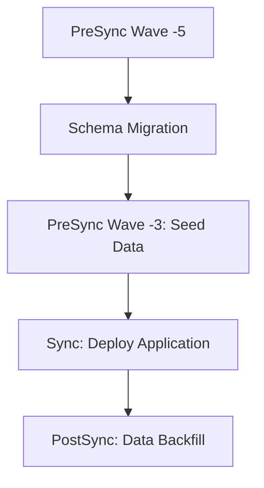

# How to Handle Database Seed Data with ArgoCD

Author: [nawazdhandala](https://github.com/nawazdhandala)

Tags: ArgoCD, GitOps, Kubernetes, Database, Data Seeding

Description: Learn how to manage database seed data in ArgoCD deployments using PostSync hooks, init containers, and ConfigMaps for consistent initial data across environments.

---

Database seed data includes reference tables, default configurations, lookup values, and initial admin accounts that your application needs to function. Managing this data through ArgoCD ensures consistent initialization across environments and makes it easy to add new seed data through Git commits. This guide covers practical patterns for seeding databases in ArgoCD workflows.

## When to Seed vs When to Migrate

Migrations change the database schema. Seeding populates the database with initial data. They are related but should be handled differently:



- Schema migrations run first (they change table structure)
- Seed data runs after migrations (it inserts rows into existing tables)
- Data backfill runs after the app is deployed (it processes data using app logic)

## Basic Seed Data Hook

Here is a simple PostSync hook that seeds the database after the application is deployed:

```yaml
# hooks/seed-data.yaml
apiVersion: batch/v1
kind: Job
metadata:
  name: seed-database
  namespace: production
  annotations:
    argocd.argoproj.io/hook: PostSync
    argocd.argoproj.io/hook-delete-policy: HookSucceeded
spec:
  template:
    spec:
      containers:
        - name: seed
          image: registry.example.com/myapp:v2.1.0
          command:
            - /bin/sh
            - -c
            - |
              echo "Running database seeder..."
              python manage.py seed --check-existing

              echo "Seeding complete"
          env:
            - name: DATABASE_URL
              valueFrom:
                secretKeyRef:
                  name: db-credentials
                  key: url
      restartPolicy: Never
  backoffLimit: 3
```

The `--check-existing` flag is important - it makes the seeder idempotent by skipping records that already exist.

## Idempotent Seeding with SQL

Write seed SQL that uses `INSERT ... ON CONFLICT` for idempotency:

```yaml
# seed-data/reference-data.yaml
apiVersion: v1
kind: ConfigMap
metadata:
  name: seed-data
  namespace: production
data:
  seed.sql: |
    -- Roles
    INSERT INTO roles (id, name, description) VALUES
      (1, 'admin', 'System administrator'),
      (2, 'editor', 'Content editor'),
      (3, 'viewer', 'Read-only viewer')
    ON CONFLICT (id) DO UPDATE SET
      name = EXCLUDED.name,
      description = EXCLUDED.description;

    -- Default settings
    INSERT INTO app_settings (key, value, description) VALUES
      ('site_name', 'My Application', 'The application name'),
      ('max_upload_size', '10485760', 'Maximum file upload size in bytes'),
      ('session_timeout', '3600', 'Session timeout in seconds'),
      ('maintenance_mode', 'false', 'Enable maintenance mode'),
      ('default_language', 'en', 'Default language code')
    ON CONFLICT (key) DO NOTHING;  -- Don't overwrite custom settings

    -- Countries reference table
    INSERT INTO countries (code, name) VALUES
      ('US', 'United States'),
      ('GB', 'United Kingdom'),
      ('CA', 'Canada'),
      ('DE', 'Germany'),
      ('FR', 'France'),
      ('JP', 'Japan'),
      ('AU', 'Australia')
    ON CONFLICT (code) DO UPDATE SET
      name = EXCLUDED.name;

    -- Status types
    INSERT INTO status_types (id, name, color) VALUES
      (1, 'Active', '#22c55e'),
      (2, 'Inactive', '#94a3b8'),
      (3, 'Pending', '#f59e0b'),
      (4, 'Suspended', '#ef4444')
    ON CONFLICT (id) DO UPDATE SET
      name = EXCLUDED.name,
      color = EXCLUDED.color;
```

Use this ConfigMap in the seed job:

```yaml
apiVersion: batch/v1
kind: Job
metadata:
  name: seed-reference-data
  annotations:
    argocd.argoproj.io/hook: PostSync
    argocd.argoproj.io/hook-delete-policy: HookSucceeded
    argocd.argoproj.io/sync-wave: "1"
spec:
  template:
    spec:
      containers:
        - name: seed
          image: postgres:16
          command:
            - /bin/sh
            - -c
            - |
              echo "Applying seed data..."
              PGPASSWORD=$DB_PASSWORD psql \
                -h $DB_HOST \
                -U $DB_USER \
                -d $DB_NAME \
                -f /seed/seed.sql

              # Verify
              echo "Verification:"
              PGPASSWORD=$DB_PASSWORD psql \
                -h $DB_HOST \
                -U $DB_USER \
                -d $DB_NAME \
                -c "SELECT 'roles' as table_name, count(*) FROM roles
                    UNION ALL
                    SELECT 'app_settings', count(*) FROM app_settings
                    UNION ALL
                    SELECT 'countries', count(*) FROM countries
                    UNION ALL
                    SELECT 'status_types', count(*) FROM status_types;"
          env:
            - name: DB_HOST
              value: postgres
            - name: DB_USER
              valueFrom:
                secretKeyRef:
                  name: db-credentials
                  key: username
            - name: DB_PASSWORD
              valueFrom:
                secretKeyRef:
                  name: db-credentials
                  key: password
            - name: DB_NAME
              value: mydb
          volumeMounts:
            - name: seed-data
              mountPath: /seed
      volumes:
        - name: seed-data
          configMap:
            name: seed-data
      restartPolicy: Never
```

## Environment-Specific Seed Data

Different environments need different seed data. Use Kustomize overlays:

```yaml
# base/kustomization.yaml
resources:
  - seed-job.yaml
configMapGenerator:
  - name: seed-data
    files:
      - seed.sql=seed-data/common.sql
```

```yaml
# overlays/development/kustomization.yaml
resources:
  - ../../base
configMapGenerator:
  - name: seed-data
    behavior: merge
    files:
      - seed.sql=seed-data/development.sql
```

```sql
-- seed-data/development.sql
-- Includes common data plus test accounts

-- Common seed data
\i /seed/common.sql

-- Development-only test accounts
INSERT INTO users (email, name, role_id, password_hash) VALUES
  ('admin@test.local', 'Test Admin', 1, '$2b$10$test_hash_admin'),
  ('editor@test.local', 'Test Editor', 2, '$2b$10$test_hash_editor'),
  ('viewer@test.local', 'Test Viewer', 3, '$2b$10$test_hash_viewer')
ON CONFLICT (email) DO NOTHING;

-- Sample data for development
INSERT INTO products (name, price, category) VALUES
  ('Test Widget', 9.99, 'widgets'),
  ('Test Gadget', 19.99, 'gadgets'),
  ('Test Doohickey', 29.99, 'accessories')
ON CONFLICT DO NOTHING;
```

## PreSync Seed Data (For Initial Setup)

For first-time deployments where the application needs seed data to start, use PreSync instead of PostSync:

```yaml
apiVersion: batch/v1
kind: Job
metadata:
  name: initial-seed
  annotations:
    argocd.argoproj.io/hook: PreSync
    argocd.argoproj.io/hook-delete-policy: BeforeHookCreation
    argocd.argoproj.io/sync-wave: "-3"  # After migrations (-5) but before app
spec:
  template:
    spec:
      containers:
        - name: seed
          image: postgres:16
          command:
            - /bin/sh
            - -c
            - |
              # Check if this is a fresh database
              COUNT=$(PGPASSWORD=$DB_PASSWORD psql \
                -h postgres -U app -d mydb -t \
                -c "SELECT count(*) FROM roles;" 2>/dev/null || echo "0")

              COUNT=$(echo $COUNT | tr -d ' ')

              if [ "$COUNT" = "0" ] || [ "$COUNT" = "" ]; then
                echo "Fresh database detected - running initial seed..."
                PGPASSWORD=$DB_PASSWORD psql -h postgres -U app -d mydb \
                  -f /seed/seed.sql
                echo "Initial seed complete"
              else
                echo "Database already has data ($COUNT roles) - skipping seed"
              fi
      restartPolicy: Never
```

## Seed Data for Multi-Tenant Applications

For multi-tenant applications, seed per-tenant data:

```yaml
containers:
  - name: seed
    image: registry.example.com/myapp:v2.1.0
    command:
      - /bin/sh
      - -c
      - |
        # Seed each tenant's default data
        TENANTS=$(PGPASSWORD=$DB_PASSWORD psql \
          -h postgres -U app -d mydb -t \
          -c "SELECT id FROM tenants;")

        for TENANT_ID in $TENANTS; do
          TENANT_ID=$(echo $TENANT_ID | tr -d ' ')
          echo "Seeding tenant: $TENANT_ID"

          PGPASSWORD=$DB_PASSWORD psql -h postgres -U app -d mydb <<EOF
          INSERT INTO tenant_settings (tenant_id, key, value) VALUES
            ($TENANT_ID, 'timezone', 'UTC'),
            ($TENANT_ID, 'date_format', 'YYYY-MM-DD'),
            ($TENANT_ID, 'currency', 'USD')
          ON CONFLICT (tenant_id, key) DO NOTHING;
        EOF
        done

        echo "Multi-tenant seeding complete"
```

## Large Dataset Seeding

For large reference datasets, use a compressed SQL dump instead of inline SQL:

```yaml
initContainers:
  - name: download-seed
    image: curlimages/curl:latest
    command:
      - /bin/sh
      - -c
      - |
        # Download large seed file from S3
        curl -o /data/seed.sql.gz \
          "https://seed-data-bucket.s3.amazonaws.com/reference-data-v42.sql.gz"
        gunzip /data/seed.sql.gz
    volumeMounts:
      - name: seed-data
        mountPath: /data
containers:
  - name: seed
    image: postgres:16
    command:
      - /bin/sh
      - -c
      - |
        PGPASSWORD=$DB_PASSWORD psql \
          -h postgres -U app -d mydb \
          -f /data/seed.sql
    volumeMounts:
      - name: seed-data
        mountPath: /data
volumes:
  - name: seed-data
    emptyDir: {}
```

## Verifying Seed Data

Add a verification step after seeding:

```yaml
apiVersion: batch/v1
kind: Job
metadata:
  name: verify-seed-data
  annotations:
    argocd.argoproj.io/hook: PostSync
    argocd.argoproj.io/hook-delete-policy: HookSucceeded
    argocd.argoproj.io/sync-wave: "2"
spec:
  template:
    spec:
      containers:
        - name: verify
          image: postgres:16
          command:
            - /bin/sh
            - -c
            - |
              echo "Verifying seed data..."

              ERRORS=0

              # Check required reference tables
              for TABLE in roles countries status_types app_settings; do
                COUNT=$(PGPASSWORD=$DB_PASSWORD psql \
                  -h postgres -U app -d mydb -t \
                  -c "SELECT count(*) FROM $TABLE;")
                COUNT=$(echo $COUNT | tr -d ' ')

                if [ "$COUNT" = "0" ]; then
                  echo "ERROR: Table $TABLE is empty!"
                  ERRORS=$((ERRORS + 1))
                else
                  echo "OK: $TABLE has $COUNT rows"
                fi
              done

              if [ "$ERRORS" -gt "0" ]; then
                echo "Seed verification FAILED: $ERRORS tables missing data"
                exit 1
              fi

              echo "Seed verification passed"
      restartPolicy: Never
```

## Monitoring Seed Operations

Use [OneUptime](https://oneuptime.com) to monitor seed job execution times and detect when seed operations fail across environments.

## Summary

Handling database seed data with ArgoCD uses PostSync hooks for data that can be loaded after the app deploys, and PreSync hooks for data the app needs at startup. Always write idempotent seed SQL using `ON CONFLICT` clauses. Use Kustomize overlays for environment-specific data, ConfigMaps for manageable datasets, and external storage for large reference datasets. Verify seed data after loading to catch issues early. The GitOps approach means every change to your seed data goes through code review and creates an audit trail.
