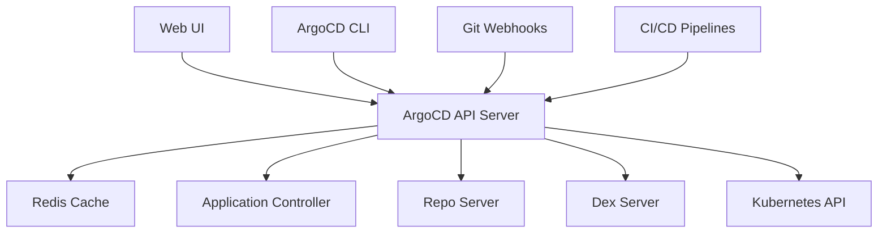

# How to Debug ArgoCD API Server Issues

Author: [nawazdhandala](https://github.com/nawazdhandala)

Tags: ArgoCD, GitOps, Kubernetes, API Server, Troubleshooting

Description: Learn how to debug ArgoCD API server issues including high latency, connection errors, authentication failures, and resource exhaustion with practical commands and solutions.

---

The ArgoCD API server is the front door to your entire GitOps setup. It handles UI requests, CLI commands, webhook events, and RBAC enforcement. When it breaks or slows down, everything feels broken. This guide walks you through diagnosing and fixing the most common API server issues.

## What the API Server Does



The API server:
- Serves the web UI static assets
- Handles gRPC and REST API requests
- Processes webhook events from Git providers
- Enforces RBAC policies
- Manages user sessions and authentication
- Proxies requests to Dex for SSO

## Step 1: Check Pod Health

```bash
# Get API server pod status
kubectl get pods -n argocd -l app.kubernetes.io/name=argocd-server -o wide

# Check for restarts
kubectl get pods -n argocd -l app.kubernetes.io/name=argocd-server \
  -o jsonpath='{range .items[*]}{.metadata.name}{" restarts: "}{.status.containerStatuses[0].restartCount}{"\n"}{end}'

# Check resource usage
kubectl top pods -n argocd -l app.kubernetes.io/name=argocd-server

# Describe the pod for events
kubectl describe pods -n argocd -l app.kubernetes.io/name=argocd-server
```

## Step 2: Check Logs for Errors

```bash
# Recent errors
kubectl logs -n argocd deploy/argocd-server --tail=200 | grep -E 'level=(error|fatal|warning)'

# Authentication-related errors
kubectl logs -n argocd deploy/argocd-server --tail=200 | grep -i 'auth\|login\|token\|session'

# gRPC errors
kubectl logs -n argocd deploy/argocd-server --tail=200 | grep -i 'grpc\|rpc'

# If the pod crashed, check previous logs
kubectl logs -n argocd deploy/argocd-server --previous --tail=100
```

## Issue: API Server Is Slow or Unresponsive

### Check Connection Counts

High connection counts can overwhelm the API server:

```bash
# Check how many connections the server is handling
kubectl exec -n argocd deploy/argocd-server -- \
  sh -c 'ss -tnp | wc -l' 2>/dev/null || \
  kubectl exec -n argocd deploy/argocd-server -- \
  sh -c 'netstat -tn | wc -l'
```

### Check Redis Connectivity

The API server depends on Redis for caching. If Redis is slow or down, the API server suffers:

```bash
# Test Redis connectivity from the API server
kubectl exec -n argocd deploy/argocd-server -- \
  sh -c 'redis-cli -h argocd-redis -p 6379 ping' 2>/dev/null

# Check Redis pod status
kubectl get pods -n argocd -l app.kubernetes.io/name=argocd-redis
```

### Check Kubernetes API Latency

The API server queries the Kubernetes API frequently:

```bash
# Check if the K8s API is responsive
kubectl exec -n argocd deploy/argocd-server -- \
  curl -sk https://kubernetes.default.svc/version

# Check API server metrics for latency
kubectl get --raw /metrics | grep apiserver_request_duration
```

### Scale Up the API Server

If the server is overloaded with legitimate traffic:

```bash
# Scale to multiple replicas
kubectl scale deployment argocd-server -n argocd --replicas=3

# Set resource limits
kubectl patch deployment argocd-server -n argocd --type json -p '[
  {
    "op": "replace",
    "path": "/spec/template/spec/containers/0/resources",
    "value": {
      "requests": {
        "cpu": "500m",
        "memory": "512Mi"
      },
      "limits": {
        "cpu": "2",
        "memory": "2Gi"
      }
    }
  }
]'
```

## Issue: API Server Returns 403/Permission Denied

```bash
# Check the RBAC configuration
kubectl get configmap argocd-rbac-cm -n argocd -o yaml

# Test a specific permission
argocd admin settings rbac can role:developer get applications '*' --namespace argocd

# Check if the default policy is too restrictive
kubectl get configmap argocd-rbac-cm -n argocd \
  -o jsonpath='{.data.policy\.default}'
```

Common fix - set a reasonable default policy:

```yaml
apiVersion: v1
kind: ConfigMap
metadata:
  name: argocd-rbac-cm
  namespace: argocd
data:
  policy.default: role:readonly
  policy.csv: |
    p, role:developer, applications, *, */*, allow
    p, role:developer, projects, get, *, allow
    g, developers-group, role:developer
```

## Issue: API Server Crashes with OOMKilled

```bash
# Check if OOMKilled is the reason
kubectl get pods -n argocd -l app.kubernetes.io/name=argocd-server -o json | \
  jq '.items[].status.containerStatuses[] | {name: .name, restartCount: .restartCount, lastTermination: .lastState.terminated}'

# Increase memory limits
kubectl patch deployment argocd-server -n argocd --type json -p '[
  {
    "op": "replace",
    "path": "/spec/template/spec/containers/0/resources/limits/memory",
    "value": "2Gi"
  },
  {
    "op": "replace",
    "path": "/spec/template/spec/containers/0/resources/requests/memory",
    "value": "1Gi"
  }
]'
```

## Issue: TLS/Certificate Errors

```bash
# Check the server's TLS certificate
kubectl get secret argocd-server-tls -n argocd -o jsonpath='{.data.tls\.crt}' | \
  base64 -d | openssl x509 -noout -text | head -20

# Check certificate expiry
kubectl get secret argocd-server-tls -n argocd -o jsonpath='{.data.tls\.crt}' | \
  base64 -d | openssl x509 -noout -enddate

# Check if the server is running in insecure mode
kubectl get deploy argocd-server -n argocd \
  -o jsonpath='{.spec.template.spec.containers[0].command}' | tr ',' '\n' | grep insecure
```

## Issue: Webhook Processing Not Working

```bash
# Check webhook configuration
kubectl get configmap argocd-cm -n argocd -o jsonpath='{.data}' | \
  python3 -c "import sys,json; d=json.load(sys.stdin); [print(f'{k}: {v}') for k,v in d.items() if 'webhook' in k.lower()]"

# Check webhook secret
kubectl get secret argocd-secret -n argocd -o jsonpath='{.data}' | \
  python3 -c "import sys,json,base64; d=json.load(sys.stdin); [print(f'{k}') for k in d if 'webhook' in k.lower()]"

# Watch for webhook events in logs
kubectl logs -n argocd deploy/argocd-server -f --tail=0 | grep -i webhook
```

## Monitoring API Server Metrics

The API server exposes Prometheus metrics:

```bash
# Port-forward to the metrics endpoint
kubectl port-forward -n argocd deploy/argocd-server 8083:8083 &

# Query key metrics
curl -s localhost:8083/metrics | grep -E "argocd_server|grpc_server"

# Key metrics to watch:
# grpc_server_handled_total - Total gRPC requests
# grpc_server_handling_seconds - Request latency
# argocd_redis_request_total - Redis operations
# argocd_redis_request_duration - Redis latency
```

## API Server Health Check Endpoint

```bash
# Check the health endpoint
kubectl exec -n argocd deploy/argocd-server -- \
  curl -sk https://localhost:8080/healthz

# Check readiness
kubectl exec -n argocd deploy/argocd-server -- \
  curl -sk https://localhost:8080/healthz?full=true
```

## Complete Debug Checklist

```bash
#!/bin/bash
# api-server-debug.sh

NS="argocd"
echo "=== ArgoCD API Server Debug ==="

echo -e "\n--- Pod Status ---"
kubectl get pods -n $NS -l app.kubernetes.io/name=argocd-server -o wide

echo -e "\n--- Resource Usage ---"
kubectl top pods -n $NS -l app.kubernetes.io/name=argocd-server 2>/dev/null

echo -e "\n--- Restart History ---"
kubectl get pods -n $NS -l app.kubernetes.io/name=argocd-server -o json | \
  jq '.items[].status.containerStatuses[] | {restartCount, lastTerminationReason: .lastState.terminated.reason}'

echo -e "\n--- Recent Errors ---"
kubectl logs -n $NS deploy/argocd-server --tail=50 | grep -E 'level=(error|fatal)' | tail -10

echo -e "\n--- Service Status ---"
kubectl get svc argocd-server -n $NS

echo -e "\n--- Ingress Status ---"
kubectl get ingress -n $NS 2>/dev/null || echo "No ingress found"

echo -e "\n--- Redis Connectivity ---"
kubectl exec -n $NS deploy/argocd-server -- \
  sh -c 'timeout 5 redis-cli -h argocd-redis ping' 2>/dev/null || echo "Cannot test Redis"

echo -e "\n--- ArgoCD URL ---"
kubectl get configmap argocd-cm -n $NS -o jsonpath='{.data.url}'
echo ""
```

## Summary

Debugging the ArgoCD API server starts with checking pod health, then moves to logs for specific error patterns, and finally examines dependencies like Redis, Kubernetes API, and Dex. Most API server issues fall into categories of resource exhaustion (scale up or increase limits), authentication problems (check Dex and RBAC), or networking issues (check ingress, TLS, and service configuration). Monitor the API server metrics endpoint with [OneUptime](https://oneuptime.com) to catch problems before they impact users.
