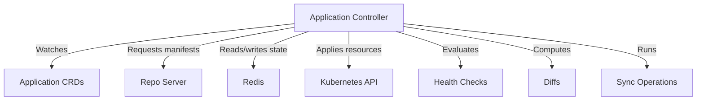

# How to Debug ArgoCD Application Controller Issues

Author: [nawazdhandala](https://github.com/nawazdhandala)

Tags: ArgoCD, GitOps, Kubernetes, Controller, Troubleshooting

Description: Learn how to debug ArgoCD application controller issues including high memory usage, slow reconciliation, stuck syncs, leader election problems, and OOMKilled crashes.

---

The application controller is the heart of ArgoCD. It reconciles applications, performs sync operations, evaluates health checks, and manages the entire lifecycle of your deployed applications. When the controller has problems, applications stop syncing, health checks stop working, and your entire GitOps workflow stalls. Here is how to debug it.

## What the Controller Does



## Step 1: Check Controller Pod Status

```bash
# Get controller pod status
kubectl get pods -n argocd -l app.kubernetes.io/name=argocd-application-controller -o wide

# Check for OOMKilled or CrashLoopBackOff
kubectl describe pods -n argocd -l app.kubernetes.io/name=argocd-application-controller | \
  grep -A5 "State:\|Last State:\|Restart Count:"

# Check resource usage
kubectl top pods -n argocd -l app.kubernetes.io/name=argocd-application-controller
```

## Step 2: Check Controller Logs

```bash
# Recent errors
kubectl logs -n argocd deploy/argocd-application-controller --tail=200 | \
  grep -E 'level=(error|fatal|warning)'

# Reconciliation errors for a specific app
kubectl logs -n argocd deploy/argocd-application-controller --tail=500 | \
  grep "my-app-name"

# Sync operation logs
kubectl logs -n argocd deploy/argocd-application-controller --tail=500 | \
  grep -i "sync\|operation"
```

## Issue: Controller OOMKilled

This is the most common controller issue, especially with many applications or large manifests.

```bash
# Confirm OOMKilled
kubectl get pods -n argocd -l app.kubernetes.io/name=argocd-application-controller -o json | \
  jq '.items[].status.containerStatuses[] | {
    restartCount: .restartCount,
    terminated: .lastState.terminated.reason,
    exitCode: .lastState.terminated.exitCode
  }'
```

Fix by increasing memory limits:

```bash
# Increase memory limits for the controller
kubectl patch deployment argocd-application-controller -n argocd --type json -p '[
  {
    "op": "replace",
    "path": "/spec/template/spec/containers/0/resources",
    "value": {
      "requests": {
        "cpu": "1",
        "memory": "2Gi"
      },
      "limits": {
        "cpu": "4",
        "memory": "4Gi"
      }
    }
  }
]'
```

For environments with 500+ applications, you may need 4-8Gi of memory.

Additional memory optimization:

```bash
# Reduce the number of status processors
kubectl patch configmap argocd-cmd-params-cm -n argocd --type merge -p '{
  "data": {
    "controller.status.processors": "10",
    "controller.operation.processors": "5"
  }
}'

# Restart controller
kubectl rollout restart deployment argocd-application-controller -n argocd
```

## Issue: Slow Reconciliation

Applications take too long to detect changes or update their status.

```bash
# Check the current reconciliation timeout
kubectl get configmap argocd-cm -n argocd -o jsonpath='{.data.timeout\.reconciliation}'

# Check controller queue depth (via metrics)
kubectl port-forward -n argocd deploy/argocd-application-controller 8082:8082 &
curl -s localhost:8082/metrics | grep workqueue
```

Fix slow reconciliation:

```bash
# Reduce reconciliation timeout (default is 180 seconds)
kubectl patch configmap argocd-cm -n argocd --type merge -p '{
  "data": {
    "timeout.reconciliation": "120s"
  }
}'

# Increase controller parallelism
kubectl patch configmap argocd-cmd-params-cm -n argocd --type merge -p '{
  "data": {
    "controller.status.processors": "20",
    "controller.operation.processors": "10"
  }
}'

kubectl rollout restart deployment argocd-application-controller -n argocd
```

## Issue: Controller Leader Election Problems

In HA setups, multiple controller replicas use leader election. If leader election breaks, no controller processes applications.

```bash
# Check the leader election lease
kubectl get lease -n argocd argocd-application-controller

# See who holds the lease
kubectl get lease -n argocd argocd-application-controller \
  -o jsonpath='{.spec.holderIdentity}'

# Check the lease renewal time
kubectl get lease -n argocd argocd-application-controller \
  -o jsonpath='{.spec.renewTime}'
```

If the leader election is stuck:

```bash
# Delete the lease to force re-election
kubectl delete lease argocd-application-controller -n argocd

# The controller pods will re-elect a leader automatically
# Watch the logs to confirm
kubectl logs -n argocd deploy/argocd-application-controller --tail=20 | grep -i "leader\|elect"
```

## Issue: Sync Operations Stuck

Applications show "Syncing" indefinitely:

```bash
# Check for stuck operations
kubectl get applications -n argocd -o json | \
  jq '.items[] | select(.status.operationState.phase == "Running") | {name: .metadata.name, startedAt: .status.operationState.startedAt}'

# Check how long the sync has been running
kubectl get application my-app -n argocd -o json | \
  jq '{
    phase: .status.operationState.phase,
    startedAt: .status.operationState.startedAt,
    message: .status.operationState.message
  }'

# Terminate a stuck sync
kubectl patch application my-app -n argocd --type json \
  -p '[{"op": "remove", "path": "/operation"}]'
```

## Issue: Controller Cannot Reach Target Cluster

```bash
# Check cluster connectivity
kubectl get applications -n argocd -o json | \
  jq '.items[] | select(.status.conditions[]?.type == "ComparisonError") | {name: .metadata.name, message: .status.conditions[0].message}' 2>/dev/null

# Test cluster access from the controller pod
kubectl exec -n argocd deploy/argocd-application-controller -- \
  curl -sk https://kubernetes.default.svc/version

# For remote clusters, check the cluster secret
kubectl get secrets -n argocd -l argocd.argoproj.io/secret-type=cluster
```

## Issue: High CPU Usage

```bash
# Check CPU usage
kubectl top pods -n argocd -l app.kubernetes.io/name=argocd-application-controller

# Check which applications are causing high reconciliation
kubectl logs -n argocd deploy/argocd-application-controller --tail=1000 | \
  grep "Reconciliation completed" | \
  awk '{print $NF}' | sort | uniq -c | sort -rn | head -20
```

Reduce CPU usage:

```bash
# Increase reconciliation interval to reduce frequency
kubectl patch configmap argocd-cm -n argocd --type merge -p '{
  "data": {
    "timeout.reconciliation": "300s"
  }
}'

# Enable resource exclusions to skip resources the controller does not need to track
kubectl patch configmap argocd-cm -n argocd --type merge -p '{
  "data": {
    "resource.exclusions": "- apiGroups:\n  - \"events.k8s.io\"\n  kinds:\n  - \"Event\"\n  clusters:\n  - \"*\"\n"
  }
}'
```

## Controller Metrics

The controller exposes detailed metrics:

```bash
# Port-forward to metrics port
kubectl port-forward -n argocd deploy/argocd-application-controller 8082:8082 &

# Key metrics to check
curl -s localhost:8082/metrics | grep -E "^argocd_app_reconcile|^argocd_app_sync|^workqueue"

# Important metrics:
# argocd_app_reconcile_count - How many reconciliations happened
# argocd_app_reconcile_bucket - Reconciliation duration distribution
# argocd_app_sync_total - Sync operation counts
# workqueue_depth - How many items are waiting to be processed
# workqueue_adds_total - Rate of items being added to the queue
```

## Controller Sharding for Scale

For very large installations (1000+ applications), shard the controller:

```bash
# Set the number of controller shards
kubectl patch configmap argocd-cmd-params-cm -n argocd --type merge -p '{
  "data": {
    "controller.sharding.algorithm": "round-robin"
  }
}'

# Scale controller to match shard count
kubectl scale statefulset argocd-application-controller -n argocd --replicas=3
```

## Complete Debug Script

```bash
#!/bin/bash
# controller-debug.sh

NS="argocd"
echo "=== ArgoCD Application Controller Debug ==="

echo -e "\n--- Pod Status ---"
kubectl get pods -n $NS -l app.kubernetes.io/name=argocd-application-controller -o wide

echo -e "\n--- Resource Usage ---"
kubectl top pods -n $NS -l app.kubernetes.io/name=argocd-application-controller 2>/dev/null

echo -e "\n--- Restart Info ---"
kubectl get pods -n $NS -l app.kubernetes.io/name=argocd-application-controller -o json | \
  jq '.items[].status.containerStatuses[] | {restartCount, lastTermination: .lastState.terminated.reason}'

echo -e "\n--- Leader Election ---"
kubectl get lease -n $NS argocd-application-controller \
  -o jsonpath='Holder: {.spec.holderIdentity}, Renewed: {.spec.renewTime}' 2>/dev/null
echo ""

echo -e "\n--- Stuck Operations ---"
kubectl get applications -n $NS -o json | \
  jq '.items[] | select(.status.operationState.phase == "Running") | .metadata.name' 2>/dev/null || echo "None"

echo -e "\n--- Applications with Errors ---"
kubectl get applications -n $NS -o json | \
  jq -r '.items[] | select(.status.conditions != null) | "\(.metadata.name): \(.status.conditions[0].type)"' 2>/dev/null | head -10

echo -e "\n--- Recent Controller Errors ---"
kubectl logs -n $NS deploy/argocd-application-controller --tail=30 | \
  grep -E 'level=(error|fatal)' | tail -10
```

## Summary

The ArgoCD application controller is the most resource-intensive component and the most common source of performance issues. OOMKilled crashes need more memory, slow reconciliation needs tuning of processor counts and reconciliation intervals, and leader election issues need lease inspection. Monitor controller metrics and set up alerts on reconciliation duration and queue depth to catch problems early. For comprehensive ArgoCD monitoring, consider using [OneUptime](https://oneuptime.com) to track controller performance over time.
